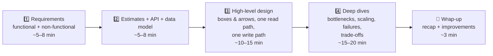

# 073 · The 4-Step System Design Framework

> ⏱ 10 min · 📈 73% · 🅰️ Part A (core) · Phase 09: Core Case Studies
>
> `██████████████░░░░░░` 73% of the whole guide

---

## 📖 Story

Leo announces a year of big features: short share links, a recipe feed, chat, notifications, cooking videos, and shared recipe folders. Maya will lead the designs, and each one will be reviewed by senior engineers, much like an interview. Before the first review, she learns a framework that works every time.

## 🎯 One-sentence idea

**Every design, whether in an interview or at work, follows the same four steps: pin down requirements, estimate scale and define the API, sketch a simple high-level design, then deep-dive on the hardest parts while explaining the trade-offs out loud.**

## 🧸 Analogy

Building a **custom house** with a client:

1. 🗣️ **Requirements:** "How many people live here? Budget? Earthquake zone? Do you work from home?" (Don't pour concrete before asking!)
2. 📐 **Estimates & plan:** "3 bedrooms, 200 m², 2 bathrooms". Rough numbers and a floor plan.
3. ✏️ **High-level sketch:** rooms and how they connect. The client nods: "yes, that's the shape."
4. 🔧 **Deep dives:** "Let's detail the foundation for earthquakes, and the kitchen plumbing." Focus on the risky, interesting parts.

## 🖼️ Visual

## 🔬 How it works

**Step 1: Requirements (never skip!)**
- **Functional:** the top 3 features, and state what's out of scope.
- **Non-functional:** scale (DAU, QPS, data), latency, availability vs consistency, durability, and special constraints (global, compliance, cost).
- **Ask, then assume out loud:** "I'll assume 100M DAU and read-heavy. Does that sound right?"

**Step 2: Estimates, API, data model**
- **Back-of-envelope** (lesson 005): QPS (average and peak), storage (per day and total), bandwidth. **Round aggressively, and state the implication** ("so we need caching").
- **API:** 3–5 endpoints (lesson 014) with inputs and outputs.
- **Data model:** the main entities, keys, and relationships. Name the store and **why** (lesson 045).

**Step 3: High-level design**
- Start **simple**: client → LB → service(s) → DB / cache / object storage / queue.
- Walk through **one write path** and **one read path** end to end.
- Get a nod before going deeper: "Does this capture it, before I dive in?"

**Step 4: Deep dives (senior signal lives here)**
- **Scale:** what breaks first at 10×? Caching, sharding (and the key), replication, async.
- **Hot spots:** celebrities, viral items, hot partitions.
- **Consistency:** where strong vs eventual is used, and why.
- **Failures:** what if X dies? Retries, idempotency, failover, degradation.
- **Special algorithms:** ID generation, ranking, geo-indexing, rate limiting.
- **Always frame trade-offs:** "Option A gives X but costs Y. Given requirement Z, I pick A."

**Wrap-up:** a 30-second recap, then name the improvements (monitoring, security, multi-region, cost).

## 🧩 Worked example

**Mini-run: "Design Pastebin" in 60 seconds per step.**

1. **Requirements:** create a paste (text ≤ 1 MB), read by short URL, optional expiry. Out: editing, accounts. Read-heavy (10:1), 99.9% availability, pastes must not be lost.
2. **Estimates:** 1M new pastes/day → ~12 writes/s. 10M reads/day → ~120 reads/s (peak ~400). Avg 10 KB → 10 GB/day → ~18 TB over 5 years. **API:** `POST /pastes {content, ttl}` → `{id}`. `GET /p/{id}`. **Data:** metadata (id, created, expires, size, blob_key) in a KV/SQL DB. Content in **object storage**.
3. **High-level:** client → LB → paste service → (metadata DB + S3). Reads: CDN/cache → service → metadata → S3.
4. **Deep dives:** ID generation (base62 of a range-allocated counter, 7 chars), caching hot pastes (CDN + Redis), expiry (TTL index + lifecycle rules), abuse (rate limits, size limits), and durability (S3 11 nines).

**Time budget for a 45-minute interview:**

| Minutes | Step |
|---|---|
| 0–7 | Requirements |
| 7–13 | Estimates + API + data model |
| 13–25 | High-level design |
| 25–42 | Deep dives (2–3 topics) |
| 42–45 | Wrap-up + questions |

## ⚖️ Trade-offs

| Habit | Gain | Risk if overdone |
|---|---|---|
| Asking many questions | Correct problem | Running out of time (cap it at ~7 min) |
| Detailed estimates | Credibility | Arithmetic rabbit hole (keep it to 2–3 min) |
| Starting simple | Clarity, shows evolution | Seeming shallow if you never go deeper |
| Going deep early | Shows expertise | Missing the big picture |

## 🌍 Real world

- Real **design docs** follow the same arc: context & goals → requirements → proposal → alternatives → risks.
- Interviewers at big tech companies typically score **problem navigation, solution design, technical depth, trade-off reasoning, and communication**.

## 📌 Cheat card

> - **R → E → H → D → W:** Requirements, Estimates/API/data, High-level, Deep dives, Wrap-up.
> - **Say assumptions out loud.** Check in with the interviewer.
> - **One write path + one read path** end to end.
> - Deep dives: **scale, hot spots, consistency, failures, special algorithms**.
> - Magic phrase: **"The trade-off here is…"**
> - Full template: [INTERVIEW-FRAMEWORK.md](../../cheatsheets/INTERVIEW-FRAMEWORK.md)

## 🧪 Feynman check

Explain the custom-house analogy for the four steps, and why jumping straight to "the kitchen plumbing" (a deep dive) before agreeing on the house size is a mistake.

⚠️ **Common confusion:** "There's a correct answer the interviewer wants." There are **many acceptable designs**. What's evaluated is **your reasoning**: clarifying, justifying with numbers, weighing options, and adapting to new constraints.

## ⚡ Quick recall

1. What are the four steps (plus the wrap-up)?

Answer

Requirements → estimates/API/data model → high-level design → deep dives → wrap-up.

2. Roughly how long should requirements take in a 45-minute interview?

Answer

About 5–8 minutes.

3. What should you walk through in the high-level design?

Answer

At least one end-to-end write path and one read path through the components.

## 🎤 Interview practice

**Q1. "Design Pastebin." Practice the full framework out loud in 20 minutes.**

What a strong answer covers

- Clear scope (create, read, expiry). Read-heavy numbers. Metadata vs blob split.
- ID strategy (base62, counter/range allocation or hash + collision check).
- Caching + CDN for hot pastes. Object storage for content. TTL cleanup.
- Abuse prevention (rate limit, size limit, scanning). Private pastes (unguessable IDs).
- **Likely follow-up:** "How do you delete expired pastes efficiently?" → lazy deletion on read + a background sweeper on an `expires_at` index + object storage lifecycle rules.

**Q2. "The interviewer interrupts your high-level design: 'What if traffic is 100× more?'" How do you respond?**

What a strong answer covers

- Recompute quickly: which component saturates first (usually the DB or bandwidth)?
- Scale in order: more caching or CDN → horizontal app servers → read replicas → sharding by the key → async processing.
- Name the new trade-offs introduced (consistency, complexity, cost).
- **Tip:** treat interruptions as hints about what they want to explore, and go there.

> 📖 *Next time: The first feature: tiny links for sharing dishes on social media.*

---

⬅️ [072 · Unique ID Generation](../08-reliability-ops/072-unique-id-generation.md) · 🗺️ [Phase map](README.md) · ➡️ [074 · Design a URL Shortener](074-design-url-shortener.md)

✅ **Safe stopping point.** Tick lesson 073 in [PROGRESS.md](../../PROGRESS.md).
