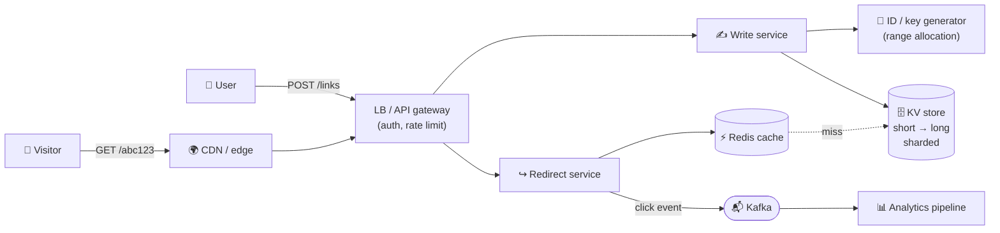

# 074 · Design a URL Shortener (TinyURL / bit.ly)

> ⏱ 15 min · 📈 74% · 🅰️ Part A (core) · Phase 09: Core Case Studies
>
> `██████████████░░░░░░` 74% of the whole guide
>
> 🧬 **Atoms used:** estimation [005] · REST API [014] · caching [027–032] · CDN [023] · KV/NoSQL [038] · sharding [049] · unique IDs [072] · rate limiting [024] · async analytics [057, 059]

---

## 🎯 One-sentence idea

**A URL shortener maps a short code to a long URL. It's a read-heavy key-value lookup, so the interesting parts are generating short, unique codes, and serving billions of redirects fast with caching.**

## 🧸 Analogy

A **coat check** at a giant theater: you hand over a long coat (the long URL), and you get a **tiny ticket number** (the short code). Anyone with the ticket gets pointed to the coat instantly. The hard parts: **never give two coats the same ticket**, and handle the rush when a **famous coat** is requested a million times.

## 🖼️ Visual



## 🔬 How it works

### 1️⃣ Requirements
- **Functional:** create a short link for a long URL (optional custom alias, optional expiry). Redirect a short → long URL. (Stretch: click analytics.)
- **Out of scope:** user accounts UI, link editing, QR codes.
- **Non-functional:** redirects must be **very fast** (p99 < 50 ms) and **highly available** (99.99%). Links must **never be lost**. Short codes should be **not easily guessable** (nice to have).

### 2️⃣ Estimates
```
New links: 100M/day → ~1,200 writes/s (peak ~3k)
Redirects: 100:1 read:write → 10B/day → ~115k reads/s (peak ~350k)
Record ≈ 500 B (code, long URL averaging a few hundred bytes, created, expiry, owner)
Storage: 100M × 500 B = 50 GB/day → ~90 TB over 5 years (+ replication)
Code length: base62, 7 chars → 62^7 ≈ 3.5 trillion codes → 100M/day lasts ~95 years ✅
```
**So this means:** extremely read-heavy → a **cache + CDN** is essential. The storage is large, but it's simple key-value → **a sharded KV store**.

### 3️⃣ API
```http
POST /v1/links         {"long_url": "...", "custom_alias": "opt", "expires_at": "opt"}
  → 201 {"short_url": "https://sho.rt/abc123x", "code": "abc123x"}
GET  /{code}           → 301 or 302, Location: <long_url>   (404 if unknown or expired)
GET  /v1/links/{code}/stats → {"clicks": 1234, ...}
DELETE /v1/links/{code}     → 204
```

### 4️⃣ Data model
```
links: code (PK, partition key) | long_url | owner_id | created_at | expires_at
```
Access is 99% `get by code`, so use a **KV / wide-column store** (DynamoDB, Cassandra) or **sharded Postgres keyed by code**.

### 5️⃣ Generating short codes (the core deep dive)

| Approach | How | 👍 | 👎 |
|---|---|---|---|
| **Hash the URL** (MD5 → take 7 base62 chars) | `base62(md5(url))[:7]` | Same URL → same code (dedupe) | **Collisions** → check the DB and re-hash with a salt. Extra read per write. |
| **Global counter + base62** | Counter 125 → "21" | No collisions, short | A single counter is a bottleneck/SPOF, and codes are **guessable/sequential** |
| **Range allocation (recommended)** | A coordinator (ZooKeeper/DB) gives each write server a block (e.g., 1M IDs). The server increments locally → base62 | No collisions, no hot path to the coordinator, fast | Unused ranges are lost if a server dies (fine). Codes are sequential (shuffle or encode them to hide order). |
| **Pre-generated key service (KGS)** | Generate random unique codes offline and store them in an "unused" table. Hand out batches. | Random, unguessable, no collisions | An extra service and storage for the keys |
| **Snowflake + base62** | 64-bit ID → ~11 chars | Uncoordinated | Longer codes |

To avoid guessable sequential codes: apply a **reversible permutation** (e.g., a Feistel cipher or multiply by a large prime mod 62⁷) to the counter before base62 encoding.

### 6️⃣ Redirect path & caching
- **CDN/edge** can cache redirects for popular links (the edge returns the 301 directly).
- **Redis** cache-aside: `code → long_url`, LRU, with a hot set of ~20% of daily active links → tens of GB → a small cluster. Expect a **> 95% hit ratio**.
- **301 vs 302:** **301 (permanent)** → browsers cache it, less load, **but you lose click analytics** after the first visit. **302 (temporary)** → every click hits you (analytics). Choose based on the product.

### 7️⃣ Analytics without slowing redirects
- The redirect service **emits a click event asynchronously** (Kafka), and never writes to a DB in the redirect path.
- Stream processing aggregates counts per code, per hour, per country → an OLAP store (lesson 041).

### 8️⃣ Other deep dives
- **Custom aliases:** check availability with a conditional write (`PUT if not exists`).
- **Expiry:** store `expires_at`. Check on read (lazy), plus a background cleanup job or DB TTL.
- **Abuse:** rate limits per user and IP, scanning URLs against malware/phishing lists, blocking known bad domains.
- **Same long URL twice?** Either return the existing code (needs a `long_url → code` index) or create a new one (simpler, and allows per-user analytics).

## 🧩 Worked example

**Base62 encoding:**

```python
ALPHABET = "0123456789abcdefghijklmnopqrstuvwxyzABCDEFGHIJKLMNOPQRSTUVWXYZ"

def base62(n):
    s = ""
    while n:
        n, r = divmod(n, 62)
        s = ALPHABET[r] + s
    return s or "0"

base62(125)            # "21"   (2×62 + 1)
base62(3_500_000_000_000)   # 7 characters
```

**Range allocation flow:**

```
Write server W3 starts → asks the coordinator → gets range [5,000,000,000 – 5,000,999,999]
Each create: id = next++ → code = base62(permute(id)) → PUT code → long_url
Range exhausted → ask for the next block (one coordinator call per 1M links)
```

## ⚖️ Trade-offs

| Decision | Option A | Option B | Pick |
|---|---|---|---|
| Code generation | Hash + collision check | Range allocation / KGS | **Range/KGS**: no collisions, no extra read |
| Redirect code | 301 (cached, cheap) | 302 (analytics) | **302** if analytics matters, **301** otherwise |
| Store | Sharded SQL | KV (DynamoDB/Cassandra) | **KV**: pure key lookup at huge scale |
| Analytics | Sync DB increment | Async events | **Async**: keeps redirects fast |

## 🌍 Real world

- **bit.ly** handles billions of clicks per month, and analytics is its main product.
- **t.co (Twitter)** wraps every link for safety scanning and analytics.
- Many link shorteners got abused for phishing, so safety scanning is a real requirement.

## 📌 Cheat card

> - **Read-heavy KV lookup → cache + CDN are king.**
> - **7 base62 chars ≈ 3.5 trillion codes.**
> - Codes via **range allocation or a pre-generated key service** (no collisions, no hot coordinator). Permute them to hide order.
> - **301 = cached, loses analytics · 302 = every click counted.**
> - **Analytics async** (Kafka), never in the redirect path.

## 🧪 Feynman check

Explain the coat-check analogy, how the theater makes sure no two coats get the same ticket even with 50 coat-check desks, and why the famous coat needs a copy at the front door (cache).

⚠️ **Common confusion:** "Hashing the URL is simplest." Truncated hashes **collide**, and resolving collisions needs a DB check on every write. Counters with range allocation avoid collisions entirely.

## ⚡ Quick recall

1. How many unique 7-character base62 codes are there?
<details><summary>Answer</summary>

62⁷ ≈ 3.5 trillion.
</details>

2. Why might you choose 302 over 301?
<details><summary>Answer</summary>

302 isn't cached permanently by browsers, so every click reaches your service and can be counted for analytics.
</details>

3. How does range allocation avoid a bottleneck?
<details><summary>Answer</summary>

Each server gets a large block of IDs and assigns them locally. The coordinator is contacted only once per block.
</details>

## 🎤 Interview practice

**Q1. "Your shortener's DB is getting 350k reads/s at peak. What's your plan?"**
<details><summary>Model answer</summary>

- The traffic follows a **power law**: cache the hot codes in **Redis** (cache-aside, LRU), aiming for a > 95–99% hit ratio → the DB sees < 20k reads/s.
- **CDN/edge caching** of redirects for viral links (short TTL if using 302).
- Shard the KV store by code, with replicas for reads.
- Local in-process LRU for the very hottest codes.
- **Likely follow-up:** "A link goes viral: 1M clicks/s on one code?" → edge caching + local caches. Never hit the DB for it.
</details>

**Q2. "How do you prevent people from enumerating all short links?"**
<details><summary>Model answer</summary>

- Don't expose sequential codes: **permute** the counter with a reversible mixing function, or use **random codes** from a KGS.
- Use longer codes for private links (e.g., 10+ chars).
- **Rate limit** redirect lookups per IP, and detect scanning patterns (lots of 404s).
- **Likely follow-up:** "Does that break uniqueness?" → no, a bijective permutation maps unique inputs to unique outputs.
</details>

---

⬅️ [073 · The Design Framework](073-design-framework.md) · 🗺️ [Phase map](README.md) · ➡️ [075 · Design a Rate Limiter](075-design-rate-limiter.md)

✅ **Safe stopping point.** Tick lesson 074 in [PROGRESS.md](../../PROGRESS.md).
