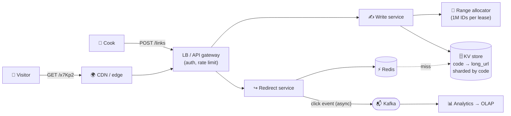

# 074 · Design a URL Shortener (TinyURL / bit.ly)

> ⏱ 15 min · 📈 74% · 🅰️ Part A (core) · Phase 09: Core Case Studies
>
> `██████████████░░░░░░` 74% of the whole guide
>
> 🧬 **Atoms used:** estimation [005] · REST API [014] · caching [027–032] · CDN [023] · KV/NoSQL [038] · sharding [049] · unique IDs [072] · rate limiting [024] · async analytics [057, 059]

---

## 📖 Story

A cook shares her lasagna on social media. The Pantry link she pastes is **142 characters** of query-string soup: `pantry.app/dish?id=88412&ref=share&utm_source=…`. It wraps three lines, looks like spam, and gets cut off.

Cooks want links like **`pan.try/x7Kp2`**: short, clean, clickable.

Maya grins. *A weekend project. A table with two columns.*

I smiled and asked her one thing: **estimate the traffic first.**

She came back an hour later, quieter. Every share, every repost, every forwarded group chat. Viral dishes. **Ten billion redirects a month**, peaking at **350,000 per second** whenever a food influencer posts.

A two-column table, standing in front of a flood.

## 🎯 One-sentence idea

**A URL shortener maps a short code to a long URL, and because it's an extremely read-heavy key-value lookup, the interesting problems are generating short unique codes without coordination and serving billions of redirects fast through caching.**

## 🧸 Analogy

A **coat check** at a giant theatre: you hand over a long coat (the URL) and get a **tiny ticket** (the code). The hard parts are **never giving two coats the same ticket** across 50 desks, and surviving the rush when **one famous coat** is requested a million times (so keep a copy by the door: a cache).

## 🖼️ Visual

*Diagram brief:* two lanes. The create lane flows through a write service and an ID range allocator into a sharded KV store. The much fatter redirect lane hits the CDN first, then Redis, and only rarely the store, while click events peel off asynchronously into Kafka.



## 🔬 How it works

- **Requirements:** create a short link (optional custom alias, optional expiry), redirect short → long, and click analytics (stretch). Non-functional: redirect **p99 < 50 ms**, **99.99%** available, links **never lost**, codes **not trivially guessable**.
- **Estimates → design:** 100M new links/day ≈ **1,200 writes/s**, 10B redirects/day ≈ **115k reads/s (peak ~350k)**, ~500 B/record → **~90 TB over 5 years**. That makes it read-dominant (cache + CDN) with simple key lookups (a sharded KV store: DynamoDB, Cassandra, or Postgres sharded by `code`).
- **Code generation, the core deep dive:** **7 base62 chars ≈ 3.5 trillion codes** (~95 years at 100M/day). Prefer **range allocation** (each writer leases a block of 1M IDs from a coordinator and increments locally) or a **pre-generated key service**. Both avoid collisions with no hot coordinator. **Permute** the IDs (Feistel or a multiplicative bijection) so codes aren't sequential. **Truncated hashes collide**, which forces a DB check on every write.
- **The redirect path:** CDN edge → **Redis** cache-aside (power-law traffic, **> 95–99% hit ratio**) → the KV store on a miss. **301** is cached by browsers (cheap, but **analytics are lost**). **302** sends every click to you.
- **Analytics stay off the hot path:** the redirect service **emits a click event to Kafka asynchronously**, and stream jobs aggregate per code, hour, and country into OLAP (lesson 041). The redirect never waits on a DB write.
- **The edges:** custom aliases via **conditional put-if-absent**, expiry via `expires_at` checked lazily plus a TTL sweep, abuse via **rate limits** and **malware/phishing URL scanning**, and enumeration defence via permuted or random codes plus rate limits on 404 storms.

## 🧩 Worked example

**API:**

```http
POST /v1/links  {"long_url":"https://pantry.app/dish?id=88412&ref=share","expires_at":null}
  → 201 {"short_url":"https://pan.try/x7Kp2Qa","code":"x7Kp2Qa"}
GET  /x7Kp2Qa   → 302 Location: https://pantry.app/dish?id=88412&ref=share
GET  /v1/links/x7Kp2Qa/stats → {"clicks": 1234, …}
```

**Base62 + range allocation:**

```python
ALPHABET = "0123456789abcdefghijklmnopqrstuvwxyzABCDEFGHIJKLMNOPQRSTUVWXYZ"

def base62(n):
    s = ""
    while n:
        n, r = divmod(n, 62)
        s = ALPHABET[r] + s
    return s or "0"

# Writer W3 leases [5,000,000,000 – 5,000,999,999] once, then per create:
code = base62(permute(next_id()))         # bijective permute → unique AND non-sequential
kv.put_if_absent(code, long_url)
```

**The influencer spike:** 350k redirects/s with a 99% Redis hit ratio = **3.5k reads/s** reach the KV store. The single viral code is cached **at the CDN edge** (short TTL with 302) and in an in-process L1 cache, so it **never touches the database at all**.

## ⚖️ Trade-offs

| Decision | Option A | Option B | Maya's pick |
|---|---|---|---|
| Code generation | Hash + collision check | Range allocation / KGS | **Range/KGS**: no collisions, no extra read |
| Redirect status | 301 (cached, cheap) | 302 (every click counted) | **302**, because analytics is the product |
| Store | Sharded SQL | KV (DynamoDB/Cassandra) | **KV**: a pure key lookup at huge scale |
| Analytics | Sync DB increment | Async events | **Async**: redirects stay fast |

## 🌍 Real world

- **bit.ly** serves billions of clicks a month, and **analytics** is its actual product.
- **t.co** wraps every link on X for **safety scanning** and analytics.
- Shorteners are a favourite phishing tool, so URL **reputation scanning** is a real requirement.

## 📌 Cheat card

> - **Read-heavy KV lookup → cache + CDN are king.**
> - **7 base62 chars ≈ 3.5 trillion codes.**
> - **Range allocation / KGS + permutation** → unique, uncoordinated, unguessable.
> - **301 = cached, analytics lost · 302 = every click counted.**
> - **Analytics async**, never in the redirect path.

## 🧪 Feynman check

Explain the coat check: how 50 desks never hand out the same ticket, and why the famous coat needs a copy at the front door.

⚠️ **Common confusion:** "Hashing the URL is simplest." A **truncated** hash (7 chars of MD5) **collides**, and detecting that requires a read-before-write on every create, plus retry logic. Range-allocated counters make collisions **impossible by construction**.

## ⚡ Quick recall

1. How many unique 7-character base62 codes are there?
<details><summary>Reveal Answer</summary>

62⁷ ≈ 3.5 trillion.
</details>

2. Why might you choose 302 over 301?
<details><summary>Reveal Answer</summary>

Browsers don't cache a 302 permanently, so every click reaches your service and can be counted.
</details>

3. How does range allocation avoid a bottleneck?
<details><summary>Reveal Answer</summary>

Each server leases a large block of IDs and assigns them locally. The coordinator is contacted only once per block.
</details>

## 🎤 Interview practice

**Q. "Your shortener's store sees 350k reads/s at peak, one link just went viral at 1M clicks/s, and someone is trying to enumerate all private links. Handle all three."**
<details><summary>Model answer</summary>

- **350k reads/s:**
  - The traffic follows a **power law**, so put **Redis** cache-aside (LRU, sized to the daily hot set, tens of GB) in front.
  - At a **> 95–99% hit ratio** the store sees < 20k reads/s.
  - Shard the KV store by `code`, with replicas, and add in-process **L1 caches** on the redirect pods.
- **1M clicks/s on one code:**
  - That's a single **hot key**, and no shard can take it, so it must **never reach the store**.
  - Cache it at the **CDN edge** (302 with a short `s-maxage`, or a 301 if analytics can be sampled), plus L1 caches.
  - Emit click events in **batches** or **sampled** to Kafka, so analytics doesn't become the new hotspot.
- **Enumeration:**
  - Never expose sequential codes: **bijectively permute** IDs before base62, or use random codes from a KGS.
  - Use longer codes (10+ chars) for **private** links.
  - **Rate-limit** redirects per IP, and alert on scanning patterns (bursts of 404s).
- **Does permutation break uniqueness?** No. A **bijection** maps unique inputs to unique outputs.
- **Likely follow-up:** "Same long URL shortened twice?" → either keep a `long_url → code` index and return the existing code (dedupe), or mint a new one (simpler, and enables per-user analytics). It's a product decision.
</details>

## 📖 Teaser

> 📖 *The short links go viral, and so do the bots: within a week, a scraper is hammering Pantry's API so hard that Maya has to design a real rate limiter, not a quick patch.*

---

⬅️ [073 · The Design Framework](073-design-framework.md) · 🗺️ [Phase map](README.md) · ➡️ [075 · Design a Rate Limiter](075-design-rate-limiter.md)

✅ **Safe stopping point.** Tick lesson 074 in [PROGRESS.md](../../PROGRESS.md).
