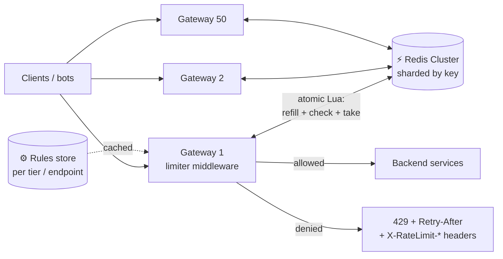

# 075 · Design a Distributed Rate Limiter

> ⏱ 12 min · 📈 75% · 🅰️ Part A (core) · Phase 09: Core Case Studies
>
> `███████████████░░░░░` 75% of the whole guide
>
> 🧬 **Atoms used:** rate-limiting algorithms [024] · API gateway [022] · Redis [033] · consistency trade-offs [053] · fail-open/fallbacks [064] · observability [067]

---

## 📖 Story

The short links work beautifully. **Too** beautifully.

Within a week, a bot farm discovers Pantry's link API and starts minting **a million short links a day**, pointing every one of them at phishing pages dressed up as food delivery receipts. Real customers' link creation slows to a crawl.

Maya's first instinct is a quick in-memory counter on each server: *100 requests per minute per API key.* She deploys it and watches the bots keep going. Pantry runs **50 gateway nodes** behind round-robin balancing. Every bot gets 100 requests per minute **per node**: **5,000 a minute**, fifty times the limit, laughing at the door.

She needs one limit, enforced **consistently across fifty doors at once**, adding barely a millisecond, and never becoming the thing that takes Pantry down.

I've built this exact system twice. Let me walk you through how Maya designed hers, and the traps I helped her avoid.

## 🎯 One-sentence idea

**A distributed rate limiter enforces "at most N requests per window per client" across many servers using a fast shared counter (usually Redis), an atomic algorithm (token bucket or sliding window), and an explicit plan for when the limiter itself is slow or down.**

## 🧸 Analogy

A **theme-park ride** with **50 entrance gates** and a rule of 10 rides per hour per visitor. With one gate, a clerk's notebook works. With 50, every clerk must **share one scoreboard**, or a visitor rides 10 times at *each* gate. If the scoreboard breaks: **let everyone ride** (fail open) or **close the ride** (fail closed)?

## 🖼️ Visual

*Diagram brief:* many gateways, each with a small limiter module, all making one atomic call to a sharded Redis scoreboard. Allowed requests pass to the backends. Denied ones bounce with a 429 sign carrying headers.



## 🔬 How it works

- **Requirements:** limit per **key** (user, API key, IP) per **rule** (e.g. 10/s with a burst of 20, plus 10k/day), with rules varying by endpoint and plan. Non-functional: **< 1–2 ms** added latency, **millions of req/s**, **highly available**, and "**approximately right**" accuracy (a few % over is fine).
- **Estimates:** 1M req/s across 100 gateways, 10M active keys × ~50 B ≈ **500 MB** of state (fits easily), ~1M Redis ops/s → a **10–20-shard Redis Cluster** in the **same AZ** (~0.3–1 ms).
- **Placement and algorithm:** enforce at the **gateway/edge** (reject before expensive work), with service-level limits for business quotas. Use a **token bucket** (bursts + an average rate, storing `{tokens, ts}`) or a **sliding window counter** (two counters, cheap and accurate). See lesson 024.
- **Atomicity is the core deep dive:** a read-modify-write from many gateways **races**, because two gateways see "1 token left" and both allow. Run **refill + check + decrement inside Redis as one Lua script** (or `INCR` + `EXPIRE` for fixed windows), keyed `rl:{key}:{rule}` and sharded by key.
- **Scaling tricks:** **local token leasing** (each gateway reserves a batch, e.g. 10% of the limit, and spends it from memory) slashes Redis traffic at a bounded accuracy cost. A **local fast path** skips Redis for clients far below their limits. Shard **hot keys** across sub-keys.
- **Failure policy:** a tight Redis timeout (~5 ms) + a circuit breaker. **Fail open** with local in-memory fallback limits for general APIs (a broken limiter must not take Pantry down), and **fail closed** for security limits (login, OTP/SMS sends). Always return **429 + `Retry-After` + `X-RateLimit-*`**.

## 🧩 Worked example

**Token bucket, atomic in Redis:**

```lua
-- KEYS[1] = bucket | ARGV: rate (tokens/s), capacity, now_ms, cost
local b = redis.call("HMGET", KEYS[1], "tokens", "ts")
local rate, cap, now, cost = tonumber(ARGV[1]), tonumber(ARGV[2]), tonumber(ARGV[3]), tonumber(ARGV[4])
local tokens = tonumber(b[1]) or cap
local ts     = tonumber(b[2]) or now
tokens = math.min(cap, tokens + (now - ts) / 1000 * rate)          -- refill
local allowed = 0
if tokens >= cost then tokens = tokens - cost; allowed = 1 end
redis.call("HSET", KEYS[1], "tokens", tokens, "ts", now)
redis.call("PEXPIRE", KEYS[1], math.ceil(cap / rate * 1000) * 2)   -- evict idle keys
return {allowed, tokens}
```

**Rules:**

```yaml
- match: { plan: free }          limit: { rate: 10/s, burst: 20, daily: 10000 }
- match: { plan: pro }           limit: { rate: 100/s, burst: 200 }
- match: { path: /v1/links }     key: api_key  limit: { rate: 2/s, daily: 500 }
- match: { path: /v1/login }     key: ip       limit: { rate: 5/min }   fail: closed
```

**The bot farm, replayed:** 5,000 req/min per key → **2/s and 500/day per key, globally enforced**. Bot link creation drops **~99%**, and real cooks never come close to the limit. The limiter adds **0.6 ms p99**.

## ⚖️ Trade-offs

| Decision | Option A | Option B | Maya's pick |
|---|---|---|---|
| Accuracy vs latency | Central Redis per request | Local leased batches | Central by default, leasing for hot, high-QPS keys |
| Failure mode | Fail open | Fail closed | **Open** for general APIs, **closed** for security limits |
| Placement | Gateway | Each service | **Gateway** for global limits, services for business quotas |
| Algorithm | Token bucket | Sliding window counter | Token bucket (bursts wanted) |

## 🌍 Real world

- **Stripe** runs several Redis-backed limiters: request rate, concurrency, and fleet-wide load shedders.
- **Envoy's global rate limiting** with Lyft's `ratelimit` service (Redis-backed).
- **Cloudflare** rate-limits at the edge across hundreds of cities with approximate distributed counting.

## 📌 Cheat card

> - **Shared counter (Redis) + atomic Lua** = correct distributed limiting.
> - **Token bucket** (burst-friendly) or **sliding window counter**.
> - **Gateway placement**, keyed by user, API key, or IP, with rules per endpoint and tier.
> - **Fail open** (with local fallback) except for **security limits**.
> - **Local token leasing** for huge QPS.
> - **429 + Retry-After + X-RateLimit-* headers.**

## 🧪 Feynman check

Explain the 50 gates sharing one scoreboard, and what the park should do when the scoreboard breaks, for the rides vs the anti-fraud check at the ticket office.

⚠️ **Common confusion:** "Each gateway can just count locally." Behind round-robin balancing, N gateways give each client **N× the limit**. You need **shared state**, or deliberately split limits (limit ÷ N), which is fair only if the traffic spreads perfectly evenly.

## ⚡ Quick recall

1. Why use a Lua script in Redis for rate limiting?
<details><summary>Reveal Answer</summary>

To make the refill-check-decrement sequence atomic, preventing races between gateways.
</details>

2. When should a rate limiter fail closed?
<details><summary>Reveal Answer</summary>

For security-sensitive limits (login attempts, OTP/SMS sends, payment abuse), where over-allowing is dangerous.
</details>

3. How does local token leasing reduce load?
<details><summary>Reveal Answer</summary>

Each gateway reserves a batch of tokens and serves requests from memory until the batch runs out, instead of calling Redis on every request.
</details>

## 🎤 Interview practice

**Q. "The Redis-based limiter adds 3 ms p99 and Redis CPU is at 90%. Improve it, and support 'per-day' and 'per-second burst' limits at the same time."**
<details><summary>Model answer</summary>

- **Cut the latency and the load:**
  - **Scale out** the Redis Cluster (more shards, so the keys spread) and **co-locate** it in the gateways' AZ.
  - **Local token leasing / approximate local counting** for high-QPS keys, syncing every ~100 ms. Accuracy loss ≤ lease size × gateways, and it's tunable.
  - **Local fast path:** clients far below their limit skip Redis. Consult Redis only near the threshold.
  - **One script per request** that evaluates **all** applicable rules, instead of several round trips.
  - Shard **hot keys** (one giant client) across sub-buckets.
- **Two limits at once:**
  - Per key: a **token bucket** (rate + burst) **and** a **daily counter** (`INCR rl:{user}:{yyyymmdd}` with a ~25 h TTL).
  - Evaluate both **atomically in one Lua script**. Deny if either fails, and return the **most restrictive** `Retry-After`.
  - **Midnight-reset spikes:** use a **rolling 24 h sliding window**, or stagger resets per user.
- **Resilience:** a 5 ms timeout + a breaker. On a Redis outage, fail open to local limits for most routes and fail closed for login/OTP. Alert either way.
- **Likely follow-up:** "How do you test it?" → load tests with skewed keys, and chaos tests that kill a Redis shard while you verify the fail-open behaviour and that the accuracy stays within bounds.
</details>

## 📖 Teaser

> 📖 *The bots are tamed, and now the product team wants a home feed showing fresh dishes from every cook you follow, and one of those cooks has twelve million followers.*

---

⬅️ [074 · URL Shortener](074-design-url-shortener.md) · 🗺️ [Phase map](README.md) · ➡️ [✅ Checkpoint 75%](checkpoint-75.md)

✅ **Safe stopping point.** Tick lesson 075 in [PROGRESS.md](../../PROGRESS.md), then do the checkpoint!
