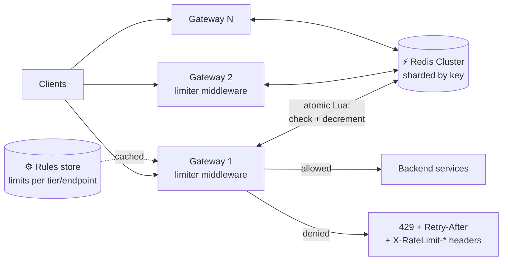

# 075 · Design a Distributed Rate Limiter

> ⏱ 12 min · 📈 75% · 🅰️ Part A (core) · Phase 09: Core Case Studies
>
> `███████████████░░░░░` 75% of the whole guide
>
> 🧬 **Atoms used:** rate-limiting algorithms [024] · API gateway [022] · Redis [033] · consistency trade-offs [053] · fail-open/fallbacks [064] · observability [067]

---

## 📖 Story

Within a week, bots are creating a million short links a day and flooding the API. Pantry needs rate limiting, and not on one server, but consistently across fifty gateways at once. Maya designs a proper distributed rate limiter.

## 🎯 One-sentence idea

**A distributed rate limiter enforces "at most N requests per time window per client" across many servers. It needs a fast shared counter (usually Redis), a good algorithm (token bucket or sliding window), and a plan for when the limiter itself is slow or down.**

## 🧸 Analogy

A **theme park ride** with **many entrance gates**. Each visitor may ride **10 times per hour**. With one gate, a clerk with a notebook is enough. With **50 gates**, all clerks need to **share one scoreboard** (Redis) so a visitor can't get 10 rides at *each* gate. And if the scoreboard breaks, the park decides: **let everyone ride** (fail open) or **close the ride** (fail closed).

## 🖼️ Visual



## 🔬 How it works

### 1️⃣ Requirements
- **Functional:** limit requests per **key** (user ID, API key, IP) per **rule** (e.g., 100/min, and 10/s burst). Rules differ per endpoint and plan tier. Return a clear 429 with headers.
- **Non-functional:** adds **< 1–2 ms** latency, handles **millions of requests/s**, and is **highly available**. It must not become the reason the API is down. Accuracy: **approximately right is OK** (a few % over is acceptable).

### 2️⃣ Estimates
```
1M requests/s across 100 gateway nodes
Active keys: 10M clients, ~50 bytes of state each (token count + timestamp) → ~500 MB → fits in Redis easily
Redis ops: ~1M/s (1 atomic script per request) → a Redis Cluster with ~10–20 shards
```

### 3️⃣ Where to put it
- **In the API gateway / edge (recommended):** reject early, before any expensive work.
- **As a sidecar or library** in services, for per-service limits.
- **As a separate rate-limit service** (e.g., Envoy's global rate limit service): centralized rules, but an extra network hop.

### 4️⃣ Algorithm choice
- **Token bucket:** allows bursts up to the capacity and enforces the average rate. Store `{tokens, last_refill_ts}` per key. ✅ The most common.
- **Sliding window counter:** `count = current_window + previous_window × overlap%`. Store 2 counters. ✅ Accurate and cheap.
- (Fixed window: simplest but bursty at the boundary. Sliding log: exact but memory-heavy. Lesson 024.)

### 5️⃣ Atomicity (the core deep dive)
- Read-modify-write from many gateways **races**, since two gateways can both see "1 token left" and both allow.
- Fix: do check-and-update **atomically inside Redis** with a **Lua script** (or `INCR` + `EXPIRE` for fixed windows).
- Key design: `rl:{api_key}:{rule_id}`, sharded across the Redis Cluster by key.

### 6️⃣ Scaling & latency tricks
- **Pipelining / co-location:** Redis in the same AZ as the gateways (~0.3–1 ms).
- **Local pre-allocation:** each gateway **leases a batch of tokens** (e.g., 10% of the limit) and serves from memory, syncing periodically. Much less Redis traffic, at a small accuracy cost.
- **Local approximate counters** synced every ~100 ms for extremely hot keys.
- **Hot keys** (one huge client): shard their counter across N sub-keys, or give them dedicated limits.

### 7️⃣ Failure handling
- **Redis slow or down → fail open** (allow the request) with **local in-memory limits** as a fallback, and alert. Blocking all traffic because the limiter broke is usually worse than a short window of over-limit traffic.
- **Fail closed** only for security-critical limits (login attempts, OTP sends).
- A circuit breaker around the Redis calls, and a tight timeout (e.g., 5 ms).

### 8️⃣ Client experience
```
HTTP/1.1 429 Too Many Requests
Retry-After: 12
X-RateLimit-Limit: 100
X-RateLimit-Remaining: 0
X-RateLimit-Reset: 1790000012
```

## 🧩 Worked example

**Token bucket as an atomic Redis Lua script:**

```lua
-- KEYS[1] = bucket key | ARGV: rate (tokens/sec), capacity, now_ms, cost
local b = redis.call("HMGET", KEYS[1], "tokens", "ts")
local rate, cap, now, cost = tonumber(ARGV[1]), tonumber(ARGV[2]), tonumber(ARGV[3]), tonumber(ARGV[4])
local tokens = tonumber(b[1]) or cap
local ts     = tonumber(b[2]) or now
tokens = math.min(cap, tokens + (now - ts) / 1000 * rate)      -- refill
local allowed = 0
if tokens >= cost then tokens = tokens - cost; allowed = 1 end
redis.call("HSET", KEYS[1], "tokens", tokens, "ts", now)
redis.call("PEXPIRE", KEYS[1], math.ceil(cap / rate * 1000) * 2) -- clean up idle keys
return {allowed, tokens}
```

**Rules config:**

```yaml
- match: { plan: free }       limit: { rate: 10/s, burst: 20, daily: 10000 }
- match: { plan: pro }        limit: { rate: 100/s, burst: 200 }
- match: { path: /v1/login }  key: ip          limit: { rate: 5/min }   fail: closed
- match: { path: /v1/search } key: api_key     limit: { rate: 30/s }
```

## ⚖️ Trade-offs

| Decision | Option A | Option B | Pick |
|---|---|---|---|
| Accuracy vs latency | Central Redis every request (accurate) | Local batches (fast, approximate) | Central by default, local leasing for hot, high-QPS keys |
| Failure mode | Fail open | Fail closed | **Open** for general APIs, **closed** for security limits |
| Placement | Gateway | Each service | **Gateway** for global limits, services for business quotas |
| Algorithm | Token bucket | Sliding window counter | Either works. Token bucket if bursts are desired. |

## 🌍 Real world

- **Stripe:** multiple limiters (request rate, concurrent requests, fleet usage load shedder) built on Redis.
- **Envoy global rate limiting** + Lyft's `ratelimit` service (Redis-backed).
- **Cloudflare** rate limits at the edge across hundreds of cities, using approximate distributed counting.
- **GitHub:** 5,000 requests/hour per token, with `X-RateLimit-*` headers.

## 📌 Cheat card

> - **Shared counter (Redis) + atomic Lua** = correct distributed limiting.
> - **Token bucket** (bursty-friendly) or **sliding window counter** (cheap, accurate).
> - **Put it at the gateway**, keyed by user, API key, or IP, with rules per endpoint and tier.
> - **Fail open** (with local fallback limits), except for security-critical limits.
> - **Local token leasing** cuts Redis load at huge QPS.
> - **429 + Retry-After + X-RateLimit headers.**

## 🧪 Feynman check

Explain the theme-park gates sharing one scoreboard, and what the park should do if the scoreboard breaks during peak hours, for the rides vs for the ticket office's anti-fraud checks.

⚠️ **Common confusion:** "Each gateway can just count locally." With 50 gateways, a client could get 50× the limit (with round-robin balancing). You need shared state, or deliberately split limits per node (limit ÷ N, which is only fair if load is evenly spread).

## ⚡ Quick recall

1. Why use a Lua script in Redis for rate limiting?
<details><summary>Answer</summary>

To make the read-refill-check-decrement sequence atomic, preventing races between gateways.
</details>

2. When should a rate limiter fail closed?
<details><summary>Answer</summary>

For security-sensitive limits (login attempts, OTP/SMS sends, payments abuse), where over-allowing is dangerous.
</details>

3. How does local token leasing reduce load?
<details><summary>Answer</summary>

Each gateway reserves a batch of tokens from Redis and serves requests from memory until the batch runs out, instead of calling Redis on every request.
</details>

## 🎤 Interview practice

**Q1. "Your Redis-based limiter adds 3 ms p99 and Redis CPU is at 90%. Improve it."**
<details><summary>Model answer</summary>

- **Scale out** the Redis Cluster (more shards), and put it in the same AZ as the gateways.
- **Local token leasing / approximate local counting** for high-QPS keys, syncing periodically.
- **Pipelining** where multiple rules are checked per request (one script evaluating all the rules).
- Skip Redis for clients that are **far below** their limits (a local fast path), and only consult Redis near the threshold.
- **Likely follow-up:** "What accuracy do you lose?" → a burst of up to about (lease size × gateways) over the limit, which is tunable.
</details>

**Q2. "How would you rate-limit by 'requests per user per day' AND 'burst per second' at the same time?"**
<details><summary>Model answer</summary>

- Two rules per key: a **token bucket** (rate/s + burst) and a **fixed daily window counter** (`INCR rl:{user}:{yyyymmdd}` with a TTL of 1 day).
- Evaluate both atomically in one Lua script, and deny if either fails. Return the most restrictive `Retry-After`.
- **Likely follow-up:** "Daily resets at midnight UTC cause spikes?" → use rolling 24 h sliding windows, or stagger resets per user.
</details>

> 📖 *Next time: Leo's next dream is a feed of recipes from the cooks you follow.*

---

⬅️ [074 · URL Shortener](074-design-url-shortener.md) · 🗺️ [Phase map](README.md) · ➡️ [✅ Checkpoint 75%](checkpoint-75.md)

✅ **Safe stopping point.** Tick lesson 075 in [PROGRESS.md](../../PROGRESS.md), then do the checkpoint!
