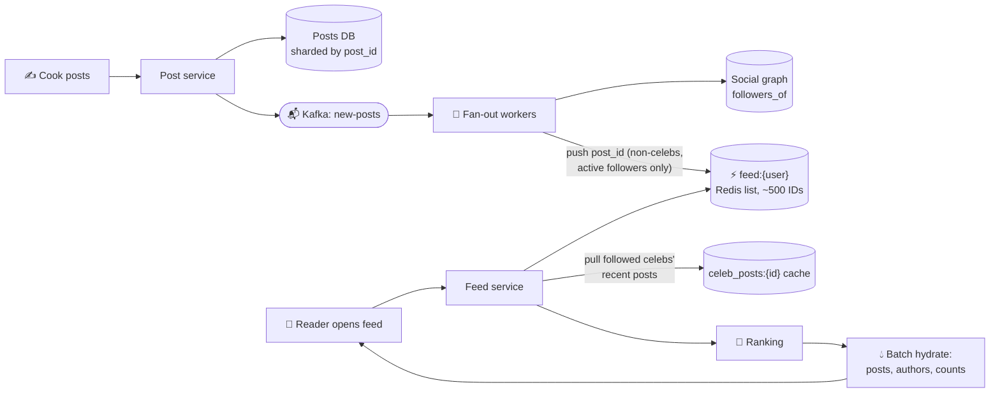

# 076 · Design a News Feed (Twitter / Instagram / Facebook)

> ⏱ 15 min · 📈 76% · 🅰️ Part A (core) · Phase 09: Core Case Studies
>
> `███████████████░░░░░` 76% of the whole guide
>
> 🧬 **Atoms used:** estimation [005] · caching [027–033] · sharding [049–050] · pub/sub & queues [057–058] · Kafka [059] · object storage + CDN [023, 042] · IDs [072] · eventual consistency [053] · denormalization [039]

---

## 📖 Story

The product brief is one sentence: **"A home feed of fresh dishes from every cook you follow."**

Maya sketches it in ten minutes. When you open the app, query the people you follow, grab their latest posts, sort by time. Elegant. Done.

Then she runs the numbers. Some customers follow **5,000 cooks**. That's 5,000 lookups on every app open, times 35,000 feed opens a second.

So she flips it: when a cook posts, **copy the post into every follower's feed** ahead of time. Reads become instant.

Then she looks up Pantry's most famous chef. **Twelve million followers.** One post becomes **twelve million writes**. She posts four times a day.

Maya leans back. Both designs collapse, from opposite ends.

This is my favourite interview question of all time, and here's why: **every choice depends on *when* you build each person's feed.**

## 🎯 One-sentence idea

**A news feed shows each user recent posts from everyone they follow, and the central decision is *when* to assemble it: at write time (push the post into followers' precomputed feeds), at read time (pull from followees), or a hybrid that pushes for normal authors and pulls for celebrities.**

## 🧸 Analogy

**Newspaper delivery**:

- 📮 **Push:** copies go into **every subscriber's mailbox** the moment a story is written. Instant reading, but a writer with **100M subscribers** means 100M deliveries per story.
- 🗞️ **Pull:** nothing is delivered, so **you visit every writer you follow** when you want to read. Cheap for writers, slow for readers.
- 🧠 **Hybrid:** normal writers are delivered, and **celebrities' stories are picked up** at read time and merged in.

## 🖼️ Visual

*Diagram brief:* the write path flows from an author into Kafka and fan-out workers that drop post IDs into per-follower Redis lists, skipping celebrities. The read path pulls the user's list, merges in cached celebrity posts, ranks, and hydrates from caches.



## 🔬 How it works

- **Requirements:** post (text + media), follow, and a paginated home feed (chronological or ranked). Feed **p99 < 300 ms**, **highly available** (AP: slightly stale is fine), new posts visible within **seconds**, and the author sees their own post **immediately**.
- **Estimates:**
  - 300M DAU × 10 opens = **~35k feed reads/s** (peak ~100k).
  - 150M posts/day ≈ **1,700/s**.
  - Avg 200 followers → **~350k feed inserts/s** of fan-out.
  - 500 IDs × 8 B × 300M users ≈ **1.2 TB** of Redis.
  - **So:** precompute, fan out asynchronously, and special-case celebrities.
- **Data:** `posts` sharded by a **time-sortable Snowflake `post_id`**. `followers_of(author)` and `following_of(user)` tables for both directions. `feed:{user}` = a **capped list of post IDs**, not bodies. Media in **S3 + CDN** via pre-signed uploads.
- **The fan-out decision:** **push** gives fast reads with huge write amplification for celebrities and wasted work for inactive users. **Pull** gives cheap writes and slow reads. **Hybrid:** push for authors under ~10k–100k followers, **pull for celebrities**, **skip inactive** users (rebuild their feeds on login).
- **Read path:**
  1. Read `feed:{user}` from the cursor.
  2. Pull the cached recent posts of followed celebrities.
  3. **Merge → rank** (chronological, or ML: affinity, engagement velocity, recency).
  4. **Batch-hydrate** bodies, authors, and counts from caches (never N+1).
  5. Return a page + cursor.
- **The edges:** **deletes filtered lazily at hydration** (never un-fan to millions). **Counters** via sharded/write-back (lesson 029). **Read-your-writes** by injecting the author's new post into their own feed instantly. **Ranking** lives in a separate candidate → score → re-rank service.

## 🧩 Worked example

```python
def on_new_post(evt):                                   # Kafka consumer
    author = evt["author_id"]
    if follower_count(author) > CELEB_THRESHOLD:         # e.g. 50k
        redis.lpush(f"celeb_posts:{author}", evt["post_id"])
        redis.ltrim(f"celeb_posts:{author}", 0, 999)
        return                                           # followers pull at read time
    for batch in followers_of(author, batch_size=1000, active_only=True):
        pipe = redis.pipeline()
        for f in batch:
            pipe.lpush(f"feed:{f}", evt["post_id"])
            pipe.ltrim(f"feed:{f}", 0, 499)              # cap the feed length
        pipe.execute()
```

**Why hybrid, in numbers:**

```
The 12M-follower chef posts → push = 12M Redis writes (minutes of worker time), ×4 posts/day
Hybrid → 1 write to celeb_posts:{chef}; each follower merges one small cached list at read time
A normal cook (300 followers) → 300 pushes, done in milliseconds
```

## ⚖️ Trade-offs

| Decision | Maya's choice | Why |
|---|---|---|
| Fan-out | **Hybrid** | Fast reads + bounded write cost |
| Feed contents | Post **IDs** in Redis | Small, and edits don't rewrite feeds |
| Consistency | Eventual (seconds) | Availability and speed matter more |
| Deletes | Lazy filter at read | Avoids un-fanning to millions |
| Ranking | Separate service | Iterate on ML without touching delivery |

## 🌍 Real world

- **Twitter/X** fanned out on write into Redis timelines, with special handling for high-follower accounts.
- **Facebook's** feed is pull-heavy, with aggregators over the **TAO** graph cache and deep ranking.
- **Instagram** moved from chronological to ranked feeds with a candidate → rank pipeline.

## 📌 Cheat card

> - **Push = precompute (fast reads, costly writes). Pull = compute on read.**
> - **Hybrid:** push normal authors, **pull celebrities**, skip inactive users.
> - Feeds hold **IDs**. **Hydrate in batches** from caches.
> - **Lazy delete filtering · S3 + CDN media · sharded counters.**
> - **Eventual** for followers, **read-your-writes** for the author.

## 🧪 Feynman check

Explain the newspaper delivery, and why a celebrity breaks "copy it into every mailbox."

⚠️ **Common confusion:** "Push always wins because reads outnumber writes." Push multiplies **every post by the follower count**. With celebrities and millions of inactive users, most of that work is wasted, or simply impossible to finish in real time.

## ⚡ Quick recall

1. What's the main downside of fan-out on write?
<details><summary>Reveal Answer</summary>

Massive write amplification for authors with many followers (celebrities), plus wasted work for inactive followers.
</details>

2. Why store post IDs rather than full posts in feed caches?
<details><summary>Reveal Answer</summary>

It's smaller, and edits or deletes don't require updating millions of feeds. Fresh data is hydrated at read time.
</details>

3. How are deleted posts handled in precomputed feeds?
<details><summary>Reveal Answer</summary>

They're filtered out during hydration (lazy deletion), not removed from every follower's feed.
</details>

## 🎤 Interview practice

**Q. "A user follows 5,000 accounts, including 50 celebrities. Walk through loading their feed, then make it ranked within 300 ms."**
<details><summary>Model answer</summary>

- **Chronological load:**
  1. `LRANGE feed:{user}` from the cursor → the pushed IDs from normal accounts. One call.
  2. **Pipelined** reads of the 50 `celeb_posts:{id}` lists (small, cached) → candidate IDs.
  3. **Merge by Snowflake ID** (time-sortable) and take the top 20.
  4. **Batch-hydrate** posts, authors, and like counts from caches (multi-get, no N+1). Drop deleted and blocked posts.
  5. Return with a cursor of `(timestamp, post_id)`.
  - If 50 celeb reads are too slow, cache the user's **merged celebrity candidates** for ~30 s, or precompute them for very active users.
- **Ranked within 300 ms:**
  - **Candidate generation:** ~500 posts (feed + celebs + a few recommendations).
  - **Feature fetch** from a low-latency feature store: author affinity, engagement velocity, content type, recency, user history.
  - **Two-stage scoring:** a light model on all 500 (~20 ms), then a heavier model on the top ~50 (~40 ms).
  - **Re-rank** for diversity, freshness, and integrity filters.
  - Cache the ranked page briefly, and **log impressions and engagement** for training.
  - Budget: ~30 ms candidates + ~40 ms features + ~60 ms scoring + ~40 ms hydration ≈ **170 ms**, leaving room for p99 variance.
- **Likely follow-up:** "How do you pick the celebrity threshold?" → where push cost (followers × posts/day) exceeds the pull cost across readers. Tune it empirically, and make it per-author adaptive.
</details>

## 📖 Teaser

> 📖 *The feed glows, and customers immediately want more: to message cooks in real time, ask questions, and get answers in under a second, even when their phones go offline.*

---

⬅️ [✅ Checkpoint 75%](checkpoint-75.md) · 🗺️ [Phase map](README.md) · ➡️ [077 · Design a Chat App](077-design-chat-app.md)

✅ **Safe stopping point.** Tick lesson 076 in [PROGRESS.md](../../PROGRESS.md).
