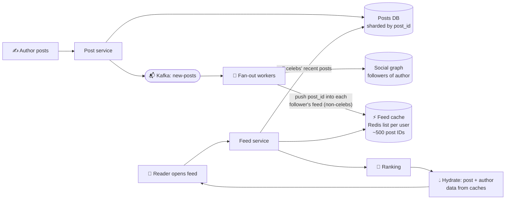

# 076 · Design a News Feed (Twitter / Instagram / Facebook)

> ⏱ 15 min · 📈 76% · 🅰️ Part A (core) · Phase 09: Core Case Studies
>
> `███████████████░░░░░` 76% of the whole guide
>
> 🧬 **Atoms used:** estimation [005] · caching [027–033] · sharding [049–050] · pub/sub & queues [057–058] · Kafka [059] · object storage + CDN [023, 042] · IDs [072] · eventual consistency [053] · denormalization [039]

---

## 📖 Story

Leo wants an Instagram-style feed: fresh recipes from the cooks you follow. Simple, until Maya learns that Pantry's most famous chef has twelve million followers. Every design choice now depends on *when* you build each person's feed.

## 🎯 One-sentence idea

**A news feed shows each user the recent posts of everyone they follow. The central decision is *when* to assemble it: at write time (push the post into followers' precomputed feeds) or at read time (pull from followees when the feed is opened), with a hybrid for celebrities.**

## 🧸 Analogy

A **newspaper delivery** service:

- 📮 **Fan-out on write (push):** when a journalist writes a story, **copies are delivered to every subscriber's mailbox** immediately. Reading is instant (just open your mailbox), but a journalist with **100 million subscribers** means 100 million deliveries per story. 😵
- 🗞️ **Fan-out on read (pull):** nothing is delivered. When you want to read, **you visit each journalist you follow** and collect their latest stories. Cheap for writers, but slow for readers who follow 2,000 people.
- 🧠 **Hybrid:** normal journalists get **delivered**. For **celebrities**, readers **pick up** their stories at read time and merge them in.

## 🖼️ Visual



## 🔬 How it works

### 1️⃣ Requirements
- **Functional:** post (text + media), follow users, see a **home feed** of followees' posts (reverse-chronological or ranked), paginated.
- **Non-functional:** feed load **p99 < 300 ms**, **highly available** (AP: a slightly stale feed is fine), eventual consistency (a new post appears in feeds within seconds). The author sees their own post immediately (read-your-writes).

### 2️⃣ Estimates
```
DAU 300M · each opens the feed 10×/day → 3B feed reads/day → ~35k/s (peak ~100k/s)
Posts: 300M × 0.5/day = 150M/day → ~1,700/s (peak ~5k)
Avg followers 200 → fan-out writes = 150M × 200 = 30B feed inserts/day → ~350k/s 😮
Feed cache: store 500 post IDs × 8 B per user = 4 KB × 300M active users ≈ 1.2 TB → a Redis cluster
```
**So this means:** reads are hot, so precompute feeds. Fan-out is heavy, so run it async with workers. Celebrities break push, so use a hybrid.

### 3️⃣ API
```http
POST /v1/posts                    {"text": "...", "media_ids": [...]}  → 201 {"post_id": ...}
GET  /v1/feed?cursor=...&limit=20 → {"items": [...], "next_cursor": "..."}
POST /v1/users/{id}/follow        → 204
```

### 4️⃣ Data model
```
posts(post_id PK [Snowflake: time-sortable], author_id, text, media_keys, created_at)  → sharded by post_id
follows(follower_id, followee_id)  → two tables for both directions: followers_of(author), following_of(user)
feed:{user_id}  → Redis list/sorted set of recent post_ids (capped ~500–1,000)
media → object storage + CDN
```

### 5️⃣ Fan-out strategies (the core deep dive)

| | Fan-out on write (push) | Fan-out on read (pull) | Hybrid ✅ |
|---|---|---|---|
| On post | Insert post_id into every follower's feed | Nothing extra | Push for normal authors, skip celebrities |
| On read | Read one precomputed list | Query N followees' recent posts, then merge | Read the list + pull recent posts from followed celebs, then merge |
| Read latency | 🚀 Fast | 🐢 Slow for users following many | 🚀 Fast |
| Write cost | 🔴 Huge for celebrities | 🟢 Tiny | 🟢 Bounded |
| Wasted work | Pushing to inactive users | — | Skip inactive users |

**Celebrity threshold:** e.g., authors with more than ~10k–100k followers are "pull" authors.
**Inactive users:** don't fan out to users who haven't logged in for 30 days. Rebuild their feed on their next login (pull).

### 6️⃣ Read path
1. Fetch `feed:{user}` post IDs from Redis (from the cursor position).
2. Fetch recent post IDs from the **celebrities the user follows** (cached per celeb: `celeb_posts:{id}`).
3. **Merge**, then **rank** (chronological, or an ML score: affinity, engagement, recency).
4. **Hydrate:** batch-get the post bodies, author info, and like counts from caches (never N+1!).
5. Return a page + cursor. Filter out deleted or blocked posts at hydration time.

### 7️⃣ Other deep dives
- **Deletes:** remove from the posts DB. Feeds still hold the ID, so **filter at hydration** (lazy) rather than un-fanning to millions.
- **Media:** uploads go directly to S3 via pre-signed URLs (lesson 042), and are served via the CDN.
- **Counters (likes/comments):** sharded counters or write-back (lesson 029).
- **Ranking:** a candidate generation → scoring → re-ranking pipeline (a separate ML service), with features cached.
- **Consistency:** the author's own new post is injected into their own feed immediately (read-your-writes), and followers see it within seconds.

## 🧩 Worked example

**Fan-out worker (push path):**

```python
def on_new_post(evt):                              # consumed from Kafka
    author = evt["author_id"]
    if follower_count(author) > CELEB_THRESHOLD:
        redis.lpush(f"celeb_posts:{author}", evt["post_id"]); redis.ltrim(f"celeb_posts:{author}", 0, 999)
        return                                     # pull at read time instead
    for batch in followers_of(author, batch_size=1000, active_only=True):
        pipe = redis.pipeline()
        for f in batch:
            pipe.lpush(f"feed:{f}", evt["post_id"])
            pipe.ltrim(f"feed:{f}", 0, 499)        # cap the feed length
        pipe.execute()
```

**Why hybrid, in numbers:**

```
Celebrity with 100M followers posts → push = 100M Redis writes (~minutes of worker time) per post
Pull instead: each of the celeb's followers reads 1 cached list when opening the feed → cheap
```

## ⚖️ Trade-offs

| Decision | Choice | Why |
|---|---|---|
| Fan-out | **Hybrid** | Fast reads + bounded write cost |
| Feed storage | Redis lists of IDs (not full posts) | Small, and post edits don't require rewriting feeds |
| Consistency | Eventual (seconds) | Availability and speed matter more |
| Deletes | Lazy filter at read | Avoid massive un-fan-out |
| Ranking | Separate service | Iterate on ML without touching delivery |

## 🌍 Real world

- **Twitter/X** famously used fan-out on write into Redis timelines, with special handling for high-follower accounts.
- **Facebook's** feed is pull-based plus heavy ranking (with the TAO graph cache and aggregators).
- **Instagram** moved from chronological to a ranked feed, using a similar candidate → rank pipeline.

## 📌 Cheat card

> - **Push = precompute (fast reads, costly writes). Pull = compute on read (cheap writes, slow reads).**
> - **Hybrid:** push for normal users, **pull for celebrities**, skip inactive users.
> - Store **post IDs** in feeds, and **hydrate** in batches from caches.
> - **Deletes: filter lazily.** Media: **S3 + CDN**. Counters: **sharded/write-back**.
> - Feed consistency: **eventual**, except **read-your-writes** for the author.

## 🧪 Feynman check

Explain the newspaper delivery analogy, and why a celebrity breaks the "deliver to every mailbox" approach.

⚠️ **Common confusion:** "Push is always better because reads are more frequent." Push multiplies each post by the follower count. With celebrities and inactive users, most of that work is wasted or impossible in real time.

## ⚡ Quick recall

1. What's the main downside of fan-out on write?
<details><summary>Answer</summary>

Huge write amplification for authors with many followers (celebrities), plus wasted work for inactive followers.
</details>

2. Why store post IDs rather than full posts in feed caches?
<details><summary>Answer</summary>

It's smaller, and edits or deletes don't require updating millions of feed entries. Hydrate fresh data at read time.
</details>

3. How are deleted posts handled in precomputed feeds?
<details><summary>Answer</summary>

They're filtered out during hydration (lazy deletion), instead of being removed from every follower's feed.
</details>

## 🎤 Interview practice

**Q1. "A user follows 5,000 accounts, including 50 celebrities. Walk through loading their feed."**
<details><summary>Model answer</summary>

- Read their precomputed `feed:{user}` list (from pushed normal accounts): 1 Redis call.
- For the 50 celebrities: read each celebrity's cached recent-posts list (batched/pipelined, ~50 small reads).
- Merge by time (or candidate-generate → rank), take the top 20, and batch-hydrate the posts, authors, and counters from caches.
- Return with a cursor (a timestamp + post ID) for the next page.
- **Likely follow-up:** "What if 50 celeb reads are too slow?" → cache each user's merged celebrity candidates for a short time, or precompute them for very active users.
</details>

**Q2. "How do you make the feed ranked instead of chronological?"**
<details><summary>Model answer</summary>

- **Candidate generation:** recent posts from followees (the feed cache + celeb pull), plus maybe recommended posts.
- **Feature fetch:** author affinity, engagement velocity, content type, recency, the user's history (from a feature store).
- **Scoring:** an ML model predicts engagement probability, then **re-rank** for diversity, freshness, and integrity filters.
- Cache ranked pages briefly, and log impressions and engagement for training.
- **Likely follow-up:** "How do you keep latency < 300 ms?" → limit candidates (~500), precompute features, use a lightweight first-stage ranker and a heavier second stage on the top-K.
</details>

> 📖 *Next time: Customers want to message cooks in real time.*

---

⬅️ [✅ Checkpoint 75%](checkpoint-75.md) · 🗺️ [Phase map](README.md) · ➡️ [077 · Design a Chat App](077-design-chat-app.md)

✅ **Safe stopping point.** Tick lesson 076 in [PROGRESS.md](../../PROGRESS.md).
