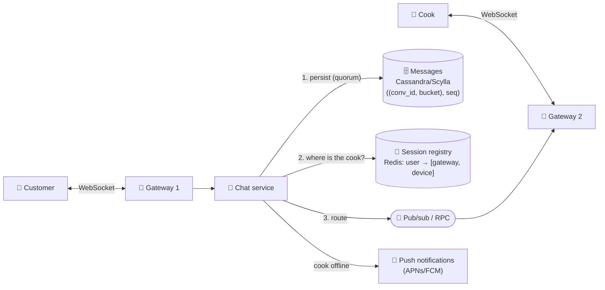

# 077 · Design a Chat App (WhatsApp / Messenger / Slack)

> ⏱ 15 min · 📈 77% · 🅰️ Part A (core) · Phase 09: Core Case Studies
>
> `███████████████░░░░░` 77% of the whole guide
>
> 🧬 **Atoms used:** WebSockets [016] · L4/L7 LB [021] · wide-column storage [038] · sharding [049–050] · pub/sub [058] · Kafka [059] · delivery semantics & idempotency [055, 060] · IDs [072] · notifications [078]

---

## 📖 Story

*"Can I get it without onions?"*

Customers want to ask cooks questions **before** ordering, and cooks want to reply from a phone balanced on a flour-dusted counter. The feature brief reads like a promise carved in stone:

- Messages must **never be lost**.
- They must arrive **in order**. ("No onions" *then* "actually, extra onions" means something very different in reverse.)
- They must reach phones that have been **offline for hours**: in a tunnel, a basement kitchen, a dead battery.
- And when both people are online, it should feel **instant**: under 200 ms.

Maya pictures **100 million** phones each holding an open line to Pantry at the same time, like a switchboard the size of a city.

I watched Maya design Pantry Chat, and I'll take you through every decision she made.

## 🎯 One-sentence idea

**A chat system keeps a persistent WebSocket from each online device to a gateway, stores every message durably partitioned by conversation, routes messages to whichever gateways hold the recipients' connections, and falls back to push notifications for offline users, while guaranteeing per-conversation order with no lost or visibly duplicated messages.**

## 🧸 Analogy

**Walkie-talkies and radio towers**:

- Every online person holds a **walkie-talkie** tuned to a nearby **tower** (gateway).
- A sent message is **filed in the archive first** (the database), then **dispatch** asks "which tower is the cook near?" (the session registry) and radios it there.
- Walkie-talkie off? The message **waits in the archive**, and a **postcard** says "new messages" (a push notification).
- Messages are **numbered per conversation**, so they're always read in order.

## 🖼️ Visual

*Diagram brief:* two phones on two different gateways. The chat service persists first, looks up the recipient's gateway in the registry, then routes through pub/sub. A side branch to push notifications lights up when the recipient is offline.



## 🔬 How it works

- **Requirements:** 1:1 and group chat (≤ ~500 members), text + media, **sent / delivered / read** receipts, presence, multi-device sync, and push when offline. **< 200 ms** delivery online, **no loss**, **per-conversation order**, huge scale.
- **Estimates:** 500M DAU × 40 msgs = **20B msgs/day ≈ 230k/s** (peak ~700k). ~200 B each ≈ **4 TB/day**. **100M+** concurrent sockets at ~100k per gateway ≈ **1,000+ gateways**. That means **wide-column** time-ordered storage, a **gateway fleet**, and a **session registry**.
- **Send flow:**
  1. The client sends with a **`client_msg_id`**.
  2. The service assigns a **per-conversation `seq`** (from the conversation's owning shard or counter) + a Snowflake ID.
  3. **Persist first**, then **ack the sender** (✓ sent).
  4. Look up the recipients' sessions → route to their gateways → push down the sockets.
  5. The device acks → **delivered** (✓✓). Opening the chat → **read**.
- **Reliability:** **persist before ack**. Client retries are **idempotent via `client_msg_id`**. Clients **order by `seq`**, never by device timestamps. On reconnect (with jittered backoff), a device **syncs by cursor**: "everything after seq N" per conversation. Multi-device = one cursor per device.
- **Groups:** small groups **fan out on write** to members' inboxes and online sessions. Huge channels (Slack/Discord-scale) are **pulled** from the channel log, with pushes only to online viewers, a hybrid like the news feed.
- **Presence:** heartbeats refresh `presence:{user}` (TTL ~30 s), and "last seen" = the last heartbeat. Push presence changes **only to people currently viewing that contact**, because full presence fan-out is expensive.

## 🧩 Worked example

**Protocol:**

```
→ send     {client_msg_id:"c-777", conversation_id:"conv_7", body:"No onions please"}
← ack      {client_msg_id:"c-777", server_msg_id:"m_9f…", seq:1042}      ✓ sent
← message  {conversation_id:"conv_7", seq:1042, sender:"u_42", body:"No onions please"}
→ receipt  {conversation_id:"conv_7", delivered_up_to:1042}               ✓✓ delivered
REST: GET /v1/conversations/conv_7/messages?before_seq=1000&limit=50       (history)
```

**Storage:**

```
messages: PRIMARY KEY ((conversation_id, bucket), seq) WITH CLUSTERING ORDER BY (seq DESC)
user_inbox: (user_id) → conversation_id, last_read_seq, unread_count       (chat list)
```

**Retry without duplicates:** the tunnel eats the ack for `c-777` → the client resends `c-777` → the server finds it already stored → returns the **same** ack (`seq 1042`). One message. ✅

**The basement kitchen:** the cook's phone has been offline 2 h, with local cursors `{conv_7: 1041, conv_9: 88}` → on reconnect `GET /sync?cursors=conv_7:1041,conv_9:88` → the server returns every message with `seq > cursor`, paginated → rendered in `seq` order → delivered receipts flow back.

## ⚖️ Trade-offs

| Decision | Maya's choice | Why |
|---|---|---|
| Transport | WebSocket (push when backgrounded) | Real-time, two-way |
| Storage | Wide-column, `(conv_id, bucket) → seq` | Write-heavy, "latest N" reads |
| Ordering | Per-conversation server `seq` | Global order is unnecessary and expensive |
| Delivery | At-least-once + dedup | No loss, no visible duplicates |
| Huge groups | Pull from the channel log | Avoids fan-out explosion |

## 🌍 Real world

- **WhatsApp** handled enormous numbers of connections per server on Erlang with a famously tiny team.
- **Discord** stores trillions of messages in **ScyllaDB**, partitioned by channel and time bucket.
- **Slack** runs WebSocket gateways plus channel-based message services, with edge caches for giant workspaces.

## 📌 Cheat card

> - **WebSocket gateways + session registry + pub/sub routing.**
> - **Persist before ack.** **`client_msg_id`** makes retries idempotent.
> - **Order by per-conversation `seq`.** Sync by **cursor**.
> - **Wide-column `(conv_id, bucket) → seq`.**
> - Offline → **push**. Huge groups → **pull**.
> - Receipts: **sent → delivered → read**.

## 🧪 Feynman check

Explain the towers and walkie-talkies: how a message finds the right tower, what happens when a walkie-talkie is off, and how messages stay in order.

⚠️ **Common confusion:** "Order by timestamp." Device clocks disagree by seconds, and near-simultaneous sends arrive in different orders on different paths. Only a **server-assigned sequence per conversation** gives everyone the same order, and makes gaps detectable.

## ⚡ Quick recall

1. Why persist a message before acknowledging the sender?
<details><summary>Reveal Answer</summary>

So an acknowledged ("sent") message is never lost, even if the server crashes a moment later.
</details>

2. How does the system know which gateway to route to?
<details><summary>Reveal Answer</summary>

A session registry (e.g. Redis) maps each user's devices to the gateways holding their WebSocket connections.
</details>

3. How does a device catch up after being offline?
<details><summary>Reveal Answer</summary>

It sends its last-seen sequence per conversation, and the server returns everything after those cursors.
</details>

## 🎤 Interview practice

**Q. "Guarantee each message is shown exactly once, then add end-to-end encryption. What server features break?"**
<details><summary>Model answer</summary>

- **Effectively-once display:**
  - **Server side:** dedupe sends by **`client_msg_id`** (a unique constraint or idempotency store), so client retries never create duplicates.
  - **Persist before ack**, and assign **gap-free per-conversation `seq`**. A client that sees seq 1040 then 1043 knows to **fetch 1041–1042**.
  - **Delivery to devices is at-least-once:** the gateway retries until the device acks, and **devices dedupe by `seq`/`server_msg_id`**.
  - Gateway crash after pushing but before the device's ack → the message is resent on reconnect or sync → deduped on the device.
- **End-to-end encryption (Signal protocol):**
  - Each **device** has identity keys + signed prekeys + one-time prekeys. The server stores only **public bundles**.
  - **X3DH** establishes sessions, and the **Double Ratchet** gives forward secrecy and break-in recovery.
  - **Groups:** **sender keys** (encrypt once per message, with keys distributed pairwise).
  - **Multi-device:** every device is its own endpoint, so messages are encrypted per device.
- **What breaks on the server:** content **search**, **spam/abuse scanning of content** (it moves client-side or uses metadata), server-side **link previews**, and plaintext **cloud backups** (they need user-held keys).
- **Likely follow-up:** "How do you keep `seq` assignment from being a bottleneck?" → each conversation is owned by one shard or actor, so the sequence is a cheap local increment, and conversations spread across shards.
</details>

## 📖 Teaser

> 📖 *Chat hums along, but now every team is sending notifications, and one customer receives fourteen pings in an hour while a password-reset code arrives eleven minutes late.*

---

⬅️ [076 · News Feed](076-design-news-feed.md) · 🗺️ [Phase map](README.md) · ➡️ [078 · Design a Notification System](078-design-notification-system.md)

✅ **Safe stopping point.** Tick lesson 077 in [PROGRESS.md](../../PROGRESS.md).
