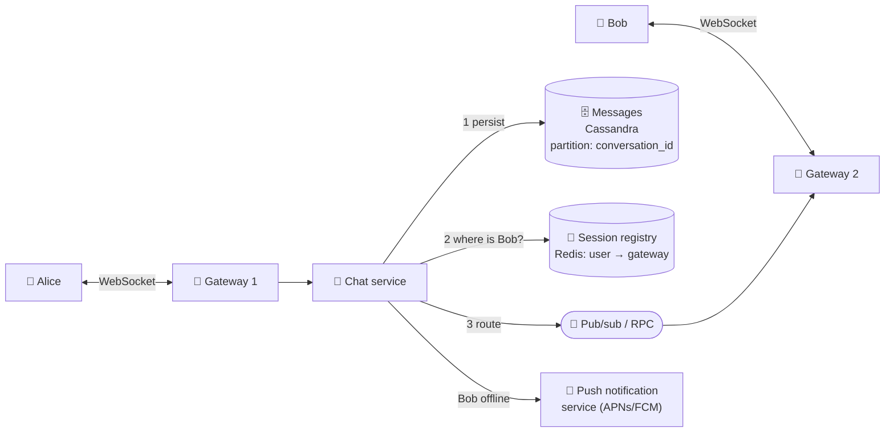

# 077 · Design a Chat App (WhatsApp / Messenger / Slack)

> ⏱ 15 min · 📈 77% · 🅰️ Part A (core) · Phase 09: Core Case Studies
>
> `███████████████░░░░░` 77% of the whole guide
>
> 🧬 **Atoms used:** WebSockets [016] · L4/L7 LB [021] · wide-column storage [038] · sharding [049–050] · pub/sub [058] · Kafka [059] · delivery semantics & idempotency [055, 060] · IDs [072] · notifications [078]

---

## 📖 Story

"Can I get it without onions?" Customers want to chat with cooks, instantly. Messages must never be lost, must arrive in order, and must reach phones that have been offline for hours. Maya designs Pantry Chat.

## 🎯 One-sentence idea

**A chat system keeps a persistent connection (WebSocket) from each online device to a gateway, stores every message durably (partitioned by conversation), routes messages to the gateways holding the recipients' connections, and falls back to push notifications for offline users, while guaranteeing per-conversation ordering and no lost or duplicated messages.**

## 🧸 Analogy

A **postal system with walkie-talkies**:

- Everyone who's "online" holds a **walkie-talkie** tuned to their local **radio tower** (the gateway).
- When you send a message, the tower **files a copy in the archive** (the database) first, then asks the **dispatch desk** "which tower is Bob near?" (the presence/session registry), and radios it there.
- If Bob's walkie-talkie is off, the message **waits in the archive**, and Bob gets a **postcard** saying "you have new messages" (a push notification).
- Messages are **numbered per conversation** so they're read in the right order.

## 🖼️ Visual



## 🔬 How it works

### 1️⃣ Requirements
- **Functional:** 1:1 and group chats (up to ~500 members), text + media, **sent/delivered/read receipts**, online/last-seen presence, history sync across multiple devices, and push notifications when offline.
- **Non-functional:** **low latency** (< 200 ms delivery when both are online), **no lost messages**, **ordering within a conversation**, high availability, and huge scale. (End-to-end encryption is a stretch topic.)

### 2️⃣ Estimates
```
DAU 500M · 40 messages/user/day → 20B messages/day → ~230k msgs/s (peak ~700k)
Avg 100 B text + metadata ~200 B → ~4 TB/day → ~1.5 PB/year (before replication)
Concurrent connections: ~100M+ → at ~100k per gateway → ~1,000+ gateway servers
```
**So this means:** write-heavy, time-ordered storage (**wide-column**). Massive numbers of persistent connections (a **gateway fleet**). Routing needs a **session registry**.

### 3️⃣ API / protocol
```
WebSocket frames (JSON or protobuf):
  → send     {client_msg_id, conversation_id, body, ts}
  ← ack      {client_msg_id, server_msg_id, seq}          (the server stored it: ✓ sent)
  ← message  {conversation_id, server_msg_id, seq, sender, body}
  → delivered/read receipts {conversation_id, up_to_seq}
REST: GET /v1/conversations/{id}/messages?before_seq=...&limit=50   (history)
```

### 4️⃣ Data model
```
messages: PRIMARY KEY ((conversation_id, bucket), seq)  -- clustered by seq DESC
          sender_id, body/media_key, created_at, client_msg_id
conversations: conversation_id, type, members, last_seq
user_inbox: (user_id) → conversation_id, last_read_seq, unread_count   (for the chat list)
```

### 5️⃣ Message send flow (the core deep dive)
1. Alice's app sends `{client_msg_id: uuid, ...}` over the WebSocket.
2. The chat service assigns a **per-conversation sequence number** (`seq`) (from a per-conversation counter, e.g., Redis `INCR` or the conversation's owning shard) and a server message ID (Snowflake).
3. **Persist first** (Cassandra, quorum write). Then **ack** to Alice (✓ sent).
4. Look up each recipient's **active sessions** (user → [gateway, device]) in the registry.
5. **Route** to those gateways (pub/sub channel per gateway, or direct RPC) → pushed down Bob's socket.
6. Bob's app acks → **delivered** receipt flows back to Alice (✓✓). The read receipt comes when Bob opens it (blue ✓✓).
7. Bob offline → enqueue a **push notification** (lesson 078). When he reconnects, the app **syncs** by asking for messages after its last seen `seq` per conversation.

### 6️⃣ Reliability details
- **No loss:** persist before acking. The client **retries** unacked sends (**idempotent** via `client_msg_id` dedup).
- **Ordering:** order by the server-assigned `seq` per conversation. The client displays by `seq`, not by arrival time.
- **Multi-device:** each device tracks its own sync cursor, and the registry holds all of a user's active sessions.
- **Gateway failure:** clients reconnect (with jitter) to another gateway, re-register, and sync missed messages via cursor.

### 7️⃣ Group chats
- Small groups (≤ a few hundred): **fan-out on write** to each member's inbox and their online sessions.
- Huge channels (Slack/Discord servers, broadcast channels): members **pull** from the channel's message log, and only online viewers get pushes (a hybrid, like the news feed).

### 8️⃣ Presence
- The gateway updates `presence:{user}` with a TTL on each heartbeat (~30 s). Last seen = the last heartbeat time.
- Presence fan-out to contacts is expensive, so only push presence to users **currently viewing** that contact, or fetch it lazily.

## 🧩 Worked example

**Reconnect & sync:**

```
Bob's phone was offline for 2 hours. Local state: {conv_7: last_seq=1041, conv_9: last_seq=88}
On reconnect → GET /sync?cursors=conv_7:1041,conv_9:88
Server returns messages with seq > cursor per conversation (paginated)
The app renders them in seq order, then sends delivered receipts up_to_seq
```

**Idempotent send (client retry after a network blip):**

```
send {client_msg_id: "c-777", body: "hi"} → timeout, no ack
retry send {client_msg_id: "c-777"} → the server finds c-777 already stored → returns the same ack (seq 1042)
→ no duplicate message ✅
```

## ⚖️ Trade-offs

| Decision | Choice | Why |
|---|---|---|
| Transport | WebSocket (mobile push when backgrounded) | Real-time, two-way |
| Storage | Wide-column, partitioned by conversation + time bucket | Write-heavy, "latest N" reads |
| Ordering | Per-conversation server sequence | Global order is unnecessary and expensive |
| Delivery | At-least-once + dedup by client_msg_id | No loss, no visible duplicates |
| Big groups | Pull-based channel log | Avoid fan-out explosion |

## 🌍 Real world

- **WhatsApp** famously served huge numbers of connections per server with Erlang, and a very small engineering team.
- **Discord** stores trillions of messages in ScyllaDB, partitioned by channel and time bucket.
- **Slack** uses WebSocket gateways plus a channel-based message service, and later added edge caching for large enterprises.

## 📌 Cheat card

> - **WebSocket gateways + session registry (user → gateway) + pub/sub routing.**
> - **Persist before ack.** Retries are idempotent via **client_msg_id**.
> - **Order by per-conversation seq.** Clients sync by **cursor** after reconnecting.
> - Storage: **wide-column (conversation_id, bucket) → seq**.
> - Offline → **push notification**. Huge groups → **pull**.
> - Receipts: sent (stored) → delivered (device acked) → read.

## 🧪 Feynman check

Explain the walkie-talkie and radio-tower analogy: how a message finds Bob's tower, what happens if Bob's walkie-talkie is off, and how messages stay in order.

⚠️ **Common confusion:** "Ordering by timestamp is enough." Device clocks disagree, and messages sent at nearly the same moment can arrive in different orders. Use a **server-assigned sequence per conversation**.

## ⚡ Quick recall

1. Why persist a message before acknowledging the sender?
<details><summary>Answer</summary>

So an acknowledged ("sent") message is never lost, even if the server crashes right after.
</details>

2. How does the system know which gateway to route to?
<details><summary>Answer</summary>

A session/connection registry (e.g., Redis) maps each user's devices to the gateway servers holding their WebSocket connections.
</details>

3. How does a device catch up after being offline?
<details><summary>Answer</summary>

It sends its last seen sequence number per conversation, and the server returns all messages after those cursors.
</details>

## 🎤 Interview practice

**Q1. "How do you guarantee messages are delivered exactly once to the user?"**
<details><summary>Model answer</summary>

- Deliver **at-least-once** (retry until the device acks), and **dedupe on the device** by `server_msg_id`/`seq` (and on the server by `client_msg_id` for sends).
- Persist before acking the sender, and use per-conversation sequences so gaps are detectable (the client requests the missing ranges).
- The user sees each message once. That's effectively-once (lesson 060).
- **Likely follow-up:** "What if the gateway crashes after pushing but before the device acks?" → the message is unacked, so it's resent on reconnect or sync, and the device dedupes.
</details>

**Q2. "How would you add end-to-end encryption?"**
<details><summary>Model answer</summary>

- Use the **Signal protocol** (X3DH key agreement + Double Ratchet): each device has identity and prekeys, and the server stores only public prekey bundles.
- The server routes and stores **ciphertext only**, so it can't read messages. Search and moderation must happen client-side.
- Group chats: sender keys (encrypt once per group, with keys distributed pairwise).
- Multi-device: each device is a separate cryptographic endpoint (messages are encrypted per device).
- **Likely follow-up:** "What server features break?" → server-side search, spam scanning of content, and cloud backups (unless those are encrypted with user keys).
</details>

> 📖 *Next time: Now every feature wants to send notifications, and customers are getting spammed.*

---

⬅️ [076 · News Feed](076-design-news-feed.md) · 🗺️ [Phase map](README.md) · ➡️ [078 · Design a Notification System](078-design-notification-system.md)

✅ **Safe stopping point.** Tick lesson 077 in [PROGRESS.md](../../PROGRESS.md).
