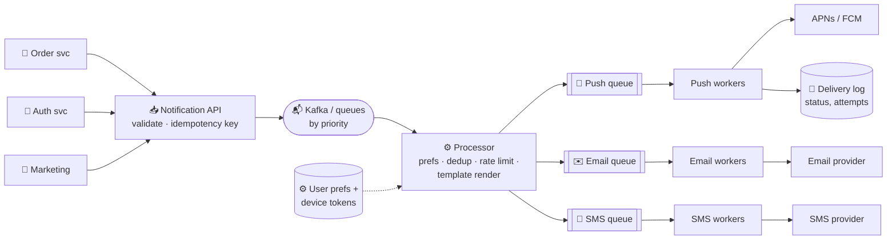

# 078 · Design a Notification System

> ⏱ 12 min · 📈 78% · 🅰️ Part A (core) · Phase 09: Core Case Studies
>
> `███████████████░░░░░` 78% of the whole guide
>
> 🧬 **Atoms used:** queues & pub/sub [057–058] · Kafka [059] · delivery semantics & idempotency [055, 060] · rate limiting [024] · retries/backoff [063] · circuit breakers [064] · bulkheads [064] · caching [027]

---

## 🎯 One-sentence idea

**A notification system accepts "notify user X about Y" events from many services, applies user preferences and rate limits, renders the message per channel (push, SMS, email, in-app), and reliably delivers it through third-party providers, without spamming, duplicating, or losing important messages.**

## 🧸 Analogy

A **mail-room for a big company**:

- Departments drop off requests: "tell Alice her order shipped."
- The mail-room checks **Alice's preferences** ("no texts after 10 pm; email is fine").
- It uses the right **template** and chooses the **courier** (APNs for iPhones, FCM for Android, an SMS gateway, an email service).
- **Urgent** mail (password resets) skips the queue. **Marketing** flyers wait.
- If a courier is down, it **retries later**, and it never sends Alice the same letter twice.

## 🖼️ Visual



## 🔬 How it works

### 1️⃣ Requirements
- **Functional:** send notifications via **push (iOS/Android), SMS, email, in-app**. Support **templates**, **user preferences and opt-outs**, **scheduling**, and both **transactional** (OTP, receipts) and **bulk marketing** notifications. Track delivery status.
- **Non-functional:** transactional notifications arrive in **seconds**. **No duplicates**, and **no loss** for important ones. Handle **spikes** (campaigns to 50M users). Respect provider limits. Highly available.

### 2️⃣ Estimates
```
Transactional: 50M/day (~600/s, peaks ~5k/s)
Marketing campaign: 50M users in ~1 hour → ~14k/s burst
Delivery log: 100M/day × 300 B = 30 GB/day (keep 30–90 days)
```

### 3️⃣ API
```http
POST /v1/notifications
Idempotency-Key: order-123-shipped
{"user_id": "u_42", "type": "ORDER_SHIPPED", "priority": "high",
 "data": {"order_id": "o_123", "eta": "Tue"}, "channels": ["push", "email"]}
→ 202 Accepted {"notification_id": "n_9"}
```

### 4️⃣ Pipeline steps (the core deep dive)
1. **Ingest:** validate, dedupe by **idempotency key** (e.g., `order-123-shipped`), and enqueue by **priority** (separate topics or queues: critical, transactional, marketing = **bulkheads**).
2. **Process:**
   - Load **preferences** (opt-outs per type and channel, quiet hours, locale) and **device tokens** (cached).
   - **Rate limit / frequency cap** per user ("max 3 marketing pushes per day"), and **aggregate** similar ones ("5 people liked your post").
   - **Render** the templates (localization, personalization).
3. **Deliver:** per-channel queues and workers call the providers with **retries + backoff + jitter**, **circuit breakers** per provider, and a **failover provider** (e.g., a second SMS vendor).
4. **Track:** write the status (queued → sent → delivered → opened/failed) to a delivery log. Handle **provider callbacks** (bounces, invalid tokens → remove them).

### 5️⃣ Reliability details
- **At-least-once** internally, with **dedup** at send time: `sent:{notification_id}:{channel}` set atomically before or with the send. Pass idempotency keys to providers where supported.
- **Dead-letter queue** for permanent failures, with alerts for spikes.
- **Ordering** rarely matters, except within a flow (e.g., "shipped" before "delivered"), so use a key by user or entity if needed.

### 6️⃣ Bulk campaigns
- A **campaign service** segments users and enqueues **batches** (1k users per message), with throttled release to respect provider quotas and to **avoid a thundering herd** of app opens hitting your backend.
- Lower priority than transactional traffic, using separate workers so OTPs never wait behind 50M marketing pushes.

## 🧩 Worked example

**Preference + frequency check:**

```python
def should_send(user, notif, channel):
    prefs = cache.get_prefs(user.id)                     # cached from the prefs DB
    if not prefs.allows(notif.type, channel):     return False    # opted out
    if notif.priority != "critical" and prefs.in_quiet_hours(now(), user.tz):
        schedule_later(notif, prefs.quiet_hours_end); return False
    if notif.category == "marketing":
        if redis.incr(f"cap:{user.id}:{today()}") > 3: return False   # daily cap
    return True
```

**Dedup at send time:**

```python
if redis.set(f"sent:{notif.id}:{channel}", 1, nx=True, ex=7*86400):
    provider.send(...)          # first time → send
# else: already sent (a retry or duplicate event) → skip
```

## ⚖️ Trade-offs

| Decision | Choice | Why |
|---|---|---|
| Sync vs async | Async (202) | Providers are slow and flaky, so callers shouldn't wait |
| Priority handling | Separate queues/workers (bulkheads) | OTPs must never wait behind campaigns |
| Semantics | At-least-once + dedup | Don't lose, and don't double-send |
| Providers | Primary + fallback per channel | Provider outages are common |
| Aggregation | Batch similar notifications | Less spam, better UX |

## 🌍 Real world

- **APNs** (Apple) and **FCM** (Google) are the gateways for mobile push. Your system can't push to phones directly.
- **Uber, Airbnb, LinkedIn** built notification platforms with preference centers, frequency capping, and ML-based send-time optimization.
- **Twilio, SendGrid, Amazon SES/SNS** are common providers.

## 📌 Cheat card

> - Pipeline: **ingest (idempotency) → prefs + caps + render → per-channel queues → providers → delivery log**.
> - **Priority bulkheads:** critical/transactional/marketing on separate queues and workers.
> - **At-least-once + dedup** (`sent:{id}:{channel}`).
> - **Retries + backoff, circuit breaker, and a fallback provider** per channel.
> - **Throttle campaigns.** Respect quiet hours and opt-outs. Remove invalid tokens.

## 🧪 Feynman check

Explain the company mail-room analogy, and why a password-reset code must never be stuck behind a 50-million-person marketing campaign.

⚠️ **Common confusion:** "Push notifications are guaranteed." APNs/FCM are **best effort**. Devices may be off, tokens can expire, and the OS may throttle. For critical messages, use multiple channels (push + SMS/email) and an **in-app inbox** as the source of truth.

## ⚡ Quick recall

1. Why use separate queues for different priorities?
<details><summary>Answer</summary>

So high-priority transactional notifications aren't delayed by large, low-priority batches (a bulkhead pattern).
</details>

2. How do you prevent duplicate notifications when events are retried?
<details><summary>Answer</summary>

Idempotency keys at ingestion, plus an atomic "sent" marker per notification and channel before sending (and provider idempotency where available).
</details>

3. Why throttle large campaigns?
<details><summary>Answer</summary>

To respect provider rate limits and to avoid a thundering herd of users opening the app at once and overloading your backend.
</details>

## 🎤 Interview practice

**Q1. "The SMS provider is down. What happens to OTP codes?"**
<details><summary>Model answer</summary>

- The **circuit breaker** trips on the primary SMS provider → route to a **fallback provider**.
- If all are down: offer alternative channels (email, authenticator app, voice call), and show the user a clear message.
- OTPs have a short validity (e.g., 5 min), so **don't retry them for hours**. Expire the queued OTP messages.
- Alert on-call, and track the delivery success rate as an SLO.
- **Likely follow-up:** "How do you choose between providers normally?" → cost, delivery rate per country, and latency. Route by country with weighted traffic.
</details>

**Q2. "How would you implement 'digest' notifications (e.g., '12 new likes') instead of 12 separate ones?"**
<details><summary>Model answer</summary>

- Buffer eligible events per user and type in a **time window** (e.g., in Redis with a TTL, or a windowed stream aggregation).
- When the window closes (or a count threshold is hit), send one aggregated notification ("Ana and 11 others liked your photo").
- Make it idempotent per window, and let preferences control the digest frequency.
- **Likely follow-up:** "Real-time vs digest?" → high-signal events (a direct message) go immediately, and low-signal ones (likes) get digested.
</details>

---

⬅️ [077 · Chat App](077-design-chat-app.md) · 🗺️ [Phase map](README.md) · ➡️ [079 · Design Video Streaming](079-design-video-streaming.md)

✅ **Safe stopping point.** Tick lesson 078 in [PROGRESS.md](../../PROGRESS.md).
