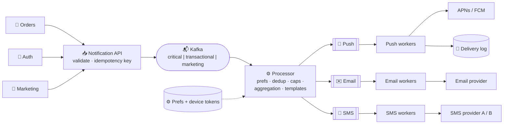

# 078 · Design a Notification System

> ⏱ 12 min · 📈 78% · 🅰️ Part A (core) · Phase 09: Core Case Studies
>
> `███████████████░░░░░` 78% of the whole guide
>
> 🧬 **Atoms used:** queues & pub/sub [057–058] · Kafka [059] · delivery semantics & idempotency [055, 060] · rate limiting [024] · retries/backoff [063] · circuit breakers [064] · bulkheads [064] · caching [027]

---

## 📖 Story

Saturday, 6 p.m. A customer's phone buzzes. Then buzzes. Then buzzes again.

**Fourteen notifications in one hour.** Three for the same order shipping (the order service retried). Two marketing pushes for a dessert sale. One "your cook is typing…" (from chat). Two duplicate "rate your meal" emails. A text message at 11:47 p.m. about a coupon.

She turns notifications off for Pantry, **forever**.

Meanwhile, across town, another customer is trying to log in. Her **password-reset code** arrives **eleven minutes late**, stuck in the same pipe as a 2-million-person marketing blast. By then the code has expired.

Every team built its own little notification cannon, and they're all firing at the same people.

I told Maya I'd seen this mess at every company I've worked at. She designed **one notification system to rule them all**, and I'll show you how.

## 🎯 One-sentence idea

**A notification system accepts "notify user X about Y" events from every service, applies preferences, deduplication, and frequency caps, renders the message per channel (push, SMS, email, in-app), and reliably delivers it through third-party providers, never spamming, duplicating, or losing what matters.**

## 🧸 Analogy

A **company mail-room**:

- Departments drop off requests ("tell her the order shipped").
- The mail-room checks **her preferences** ("no texts after 10 p.m.").
- It uses the right **template** and **courier** (APNs, FCM, the SMS gateway, the email service).
- **Urgent** mail skips the line. **Flyers** wait.
- A courier is down? **Retry later**, and never send the same letter twice.

## 🖼️ Visual

*Diagram brief:* many services drop requests into one front door. A processor applies preferences, caps, and templates, then splits traffic into separate priority lanes and per-channel queues, each with its own workers, feeding external providers, with a delivery log at the end.



## 🔬 How it works

- **Requirements:** push (iOS/Android), SMS, email, and in-app. Templates, **preferences/opt-outs**, quiet hours, scheduling, **transactional and marketing** traffic, delivery tracking. Transactional delivery within **seconds**, **no duplicates**, **no loss** for critical messages, and campaign **spikes** absorbed.
- **Estimates:** transactional **50M/day** (~600/s, peaks ~5k/s). A campaign to **50M users in an hour ≈ 14k/s**. Delivery log ~**30 GB/day** (kept 30–90 days).
- **Ingest:** `POST /v1/notifications` → **202**. Dedupe on an **idempotency key** (`order-123-shipped`). Route to **priority topics** (critical, transactional, marketing), which are **bulkheads**, so an OTP never waits behind a campaign.
- **Process:**
  - Load **preferences** and **device tokens** (cached).
  - Apply **quiet hours** (reschedule non-critical messages).
  - Apply **frequency caps** ("≤ 3 marketing pushes/day").
  - **Aggregate** low-signal events ("12 people liked your dish").
  - Render localized templates.
- **Deliver:**
  - Per-channel queues and workers call providers with **retries + backoff + jitter**, a **circuit breaker per provider**, and a **fallback provider** (a second SMS vendor).
  - **At-least-once** internally, with an atomic **`sent:{id}:{channel}`** marker before sending (and provider idempotency where offered).
  - A DLQ for permanent failures.
- **Track and campaign hygiene:**
  - The status flows queued → sent → delivered → opened/failed. **Provider callbacks** remove bounced emails and invalid tokens.
  - Campaigns go out in **throttled batches** (1k users per message), so they respect provider quotas and don't cause a thundering herd of app opens.

## 🧩 Worked example

```http
POST /v1/notifications
Idempotency-Key: order-123-shipped
{"user_id":"u_42","type":"ORDER_SHIPPED","priority":"transactional",
 "data":{"order_id":"o_123","eta":"19:40"},"channels":["push","email"]}
→ 202 Accepted {"notification_id":"n_9"}
```

```python
def should_send(user, notif, channel):
    prefs = cache.get_prefs(user.id)
    if not prefs.allows(notif.type, channel):            return False      # opted out
    if notif.priority != "critical" and prefs.in_quiet_hours(now(), user.tz):
        schedule_later(notif, prefs.quiet_hours_end);     return False
    if notif.category == "marketing" and redis.incr(f"cap:{user.id}:{today()}") > 3:
        return False                                                       # daily cap
    return True

if should_send(user, notif, ch) and redis.set(f"sent:{notif.id}:{ch}", 1, nx=True, ex=7*86400):
    provider.send(…)          # first time only → retries and duplicate events are no-ops
```

**Saturday, replayed:** 14 pings → **4** (the three shipping retries deduped to one, the likes aggregated, marketing capped, the 11:47 p.m. coupon deferred to morning). The password reset rides the **critical lane** and arrives in **2 seconds**, while 2M marketing pushes trickle out at their throttled pace on a separate worker pool.

## ⚖️ Trade-offs

| Decision | Maya's choice | Why |
|---|---|---|
| Sync vs async | Async (202) | Providers are slow and flaky, so callers shouldn't wait |
| Priorities | Separate queues + workers | OTPs never wait behind campaigns |
| Semantics | At-least-once + dedup | No loss, no double-sends |
| Providers | Primary + fallback per channel | Provider outages are routine |
| Low-signal events | Aggregate into digests | Less spam, more trust |

## 🌍 Real world

- **APNs** and **FCM** are the only doors to phones. Your system hands notifications to them, and they deliver on a **best-effort** basis.
- **Uber, Airbnb, and LinkedIn** built notification platforms with preference centres, frequency caps, and send-time optimization.
- **Twilio, SendGrid, and Amazon SES/SNS** are common providers.

## 📌 Cheat card

> - **Ingest (idempotency) → prefs + caps + aggregation + render → per-channel queues → providers → delivery log.**
> - **Priority bulkheads:** critical / transactional / marketing.
> - **At-least-once + `sent:{id}:{channel}` dedup.**
> - **Retries, breakers, and a fallback provider** per channel.
> - **Throttle campaigns. Honour quiet hours and opt-outs. Prune dead tokens.**

## 🧪 Feynman check

Explain the mail-room, and why a password-reset code must never sit behind a 50-million-person marketing campaign.

⚠️ **Common confusion:** "Push notifications are guaranteed." APNs and FCM are **best effort**: devices are off, tokens expire, and operating systems throttle apps. Critical messages need **multiple channels** (push + SMS/email) and an **in-app inbox** as the durable source of truth.

## ⚡ Quick recall

1. Why use separate queues for different priorities?
<details><summary>Reveal Answer</summary>

So high-priority transactional notifications are never delayed by huge low-priority batches (the bulkhead pattern).
</details>

2. How do you prevent duplicate notifications when events are retried?
<details><summary>Reveal Answer</summary>

Idempotency keys at ingestion, plus an atomic "sent" marker per notification and channel before sending (and provider idempotency where available).
</details>

3. Why throttle large campaigns?
<details><summary>Reveal Answer</summary>

To respect provider rate limits and avoid a thundering herd of app opens overwhelming your backend.
</details>

## 🎤 Interview practice

**Q. "The primary SMS provider is down. What happens to OTP codes? And how would you build '12 people liked your dish' digests?"**
<details><summary>Model answer</summary>

- **SMS outage:**
  - The **circuit breaker** on provider A trips on its error rate → **route to provider B** (a pre-integrated fallback, weighted by country).
  - All providers down → offer **alternative channels** (email, authenticator app, voice call), and tell the user clearly.
  - **OTPs expire (~5 min), so don't retry them for hours.** Drop or expire stale OTP jobs rather than delivering useless codes later.
  - Page on-call, and track **OTP delivery success rate** as an SLO.
  - **Normal routing** chooses providers per country by cost, delivery rate, and latency, with weighted traffic for continuous comparison.
- **Digests:**
  - Buffer eligible events per `(user, type)` in a **time window**: Redis with a TTL, or a **windowed stream aggregation** (lesson 091).
  - When the window closes (or a threshold is hit), emit **one** notification ("Ana and 11 others liked your lasagna").
  - **Idempotent per window** (`digest:{user}:{type}:{window_id}`), and preferences control the digest frequency.
  - **High-signal** events (direct messages, order updates) go immediately. **Low-signal** ones (likes, follows) get digested.
- **Likely follow-up:** "Where's the source of truth if push fails?" → an **in-app notification inbox** stored durably. Push is just a doorbell pointing to it.
</details>

## 📖 Teaser

> 📖 *Notifications finally behave, and Pantry's hottest new feature, cooking videos, is buffering on every phone with a weak signal.*

---

⬅️ [077 · Chat App](077-design-chat-app.md) · 🗺️ [Phase map](README.md) · ➡️ [079 · Design Video Streaming](079-design-video-streaming.md)

✅ **Safe stopping point.** Tick lesson 078 in [PROGRESS.md](../../PROGRESS.md).
