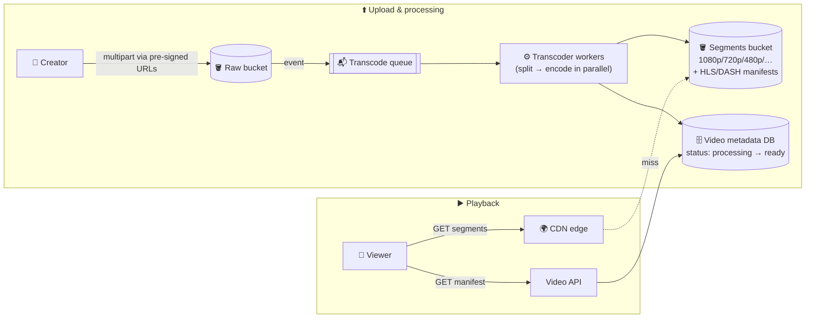

# 079 · Design a Video Streaming Platform (YouTube / Netflix)

> ⏱ 15 min · 📈 79% · 🅰️ Part A (core) · Phase 09: Core Case Studies
>
> `███████████████░░░░░` 79% of the whole guide
>
> 🧬 **Atoms used:** object storage + pre-signed/multipart uploads [042] · queues & workers [057] · pub/sub [058] · CDN [023] · caching [027] · metadata DB [034, 045] · search [043] · counters/write-back [029] · autoscaling [025]

---

## 🎯 One-sentence idea

**A video platform is two systems: an upload pipeline that stores the original and transcodes it into many resolutions and small segments, and a playback system that streams those segments from CDN edges using adaptive bitrate, so the quality adjusts to each viewer's connection.**

## 🧸 Analogy

A **bakery chain**:

- 🎂 The baker receives one **giant cake** (the raw upload).
- 🔪 The kitchen **cuts it into slices** (segments of 2–6 seconds) and makes **several sizes of each slice** (1080p, 720p, 480p…): that's transcoding.
- 🏪 Slices are shipped to **local shops everywhere** (the CDN).
- 🍰 A customer eats **slice by slice**. If they're in a hurry (slow internet), the shop hands them **smaller slices**, and when they have time (fast internet), **bigger ones**. That's adaptive bitrate.

## 🖼️ Visual



## 🔬 How it works

### 1️⃣ Requirements
- **Functional:** upload videos, process them into streamable formats, watch with smooth playback on any device and network, see video metadata (title, views, likes), and search.
- **Non-functional:** **playback starts fast** (< 2 s), **minimal buffering**, global scale, **highly available** playback (AP), durable storage of the originals. Uploads can take minutes to process.

### 2️⃣ Estimates
```
Uploads: 500 hours of video per minute (YouTube-scale) ≈ 720k hours/day
Raw storage: ~1 GB per hour of HD → ~720 TB/day raw; renditions add ~2–3×
Views: 1B hours watched/day → at ~3 Mbps avg ≈ 1.35 GB/hour → ~1.35 EB/day egress 🤯
```
**So this means:** **egress is everything**, so a **CDN (even ISP-embedded caches) is mandatory**. Storage is huge, so use **tiering** for rarely watched videos. Transcoding is **massively parallel batch compute**.

### 3️⃣ Upload flow
1. `POST /videos` → create metadata (`status=uploading`), and return **pre-signed multipart upload URLs**.
2. The client uploads chunks **directly to object storage** (resumable, parallel).
3. "Upload complete" event → **transcode queue**.

### 4️⃣ Transcoding pipeline (the core deep dive)
- **Split** the video into chunks (e.g., per GOP or per few seconds) → **encode the chunks in parallel** across many workers (a DAG: split → encode renditions → assemble → package).
- **Renditions (a bitrate ladder):** 2160p, 1080p, 720p, 480p, 360p, 240p, audio tracks. Codecs: H.264 (compatible), VP9/AV1 (smaller, but costlier to encode).
- **Package** into **HLS/DASH**: small segments (2–6 s) + **manifest files** listing the renditions and segment URLs.
- Also: thumbnails, captions (speech-to-text), content moderation, and copyright matching (fingerprinting).
- Workers are **autoscaled on queue depth** and use spot/preemptible instances (they're retryable, idempotent jobs).
- Metadata status → `ready` when the essential renditions exist (publish 480p/720p first, then the higher ones).

### 5️⃣ Playback & adaptive bitrate (ABR)
- The player fetches the **manifest**, then requests segments one by one from the **CDN**.
- The player measures throughput and buffer level, and **switches renditions per segment** (drops to 480p on a slow network, climbs to 1080p when it recovers).
- A **fast start:** begin with a low bitrate, prefetch the first segments, and keep the CDN edges warm for popular videos.

### 6️⃣ CDN strategy
- **Popular videos** (a power law) stay hot in edge caches. The long tail is served from regional or origin caches.
- **Netflix Open Connect-style:** appliances inside ISPs, pre-filled overnight with predicted popular content.
- Signed URLs/tokens protect premium content. **DRM** (Widevine, FairPlay) for studios.

### 7️⃣ Metadata, views, and search
- Video metadata in a sharded SQL/NoSQL store, cached heavily.
- **View counts:** write-back / stream aggregation (lesson 029), never a DB update per view.
- Search via an inverted index (lesson 043), and recommendations via an ML pipeline.

## 🧩 Worked example

**An HLS master manifest (simplified):**

```
#EXTM3U
#EXT-X-STREAM-INF:BANDWIDTH=800000,RESOLUTION=640x360
360p/index.m3u8
#EXT-X-STREAM-INF:BANDWIDTH=2500000,RESOLUTION=1280x720
720p/index.m3u8
#EXT-X-STREAM-INF:BANDWIDTH=5000000,RESOLUTION=1920x1080
1080p/index.m3u8
```

Each `index.m3u8` lists segments like `seg_00001.ts` (4 s each). The player picks the variant per segment based on the measured bandwidth.

**Parallel transcoding speed-up:**

```
A 60-minute video, encoding at ~1× real time per worker = 60 min per rendition
Split into 360 × 10 s chunks → 360 workers in parallel → ~10–20 s per rendition (+ overhead)
→ minutes instead of hours ✅
```

## ⚖️ Trade-offs

| Decision | Choice | Why |
|---|---|---|
| Delivery protocol | HLS/DASH over HTTP (TCP) | CDN-friendly, adaptive, universal |
| Segment length | 2–6 s | Short = faster adaptation and start, more requests. Long = efficient, slower to adapt |
| Codec | H.264 + AV1/VP9 for popular videos | Compatibility vs bandwidth savings (encode the expensive codecs only where views justify it) |
| Storage | Hot for popular, cold tier for the long tail | Cost |
| Live streaming | Low-latency HLS / WebRTC | Different trade-offs: seconds vs sub-second latency |

## 🌍 Real world

- **Netflix** encodes each title with **per-title/per-shot optimized** bitrate ladders, and serves most of its traffic from Open Connect boxes inside ISPs.
- **YouTube** uses custom transcoding hardware (Argos VCUs) and serves huge volumes via Google's edge network.
- Video streaming is **a large share of all internet downstream traffic**.

## 📌 Cheat card

> - **Upload:** pre-signed multipart → raw bucket → **queue → parallel transcoding** → segments + manifests.
> - **Playback:** manifest → **segments from the CDN** → **adaptive bitrate** per segment.
> - **Egress dominates cost**, so use a CDN (even ISP caches) and efficient codecs for popular content.
> - **Segments 2–6 s. Renditions ladder 240p–4K.**
> - Views via **stream aggregation**, never DB writes per view.

## 🧪 Feynman check

Explain the cake-slicing bakery analogy, and why a viewer on a train sees the picture get blurrier for a moment instead of the video stopping.

⚠️ **Common confusion:** "Video streaming should use UDP because it's real-time." **On-demand** video uses HTTP (TCP) segments via CDNs. Buffering hides retransmissions, and CDNs scale HTTP extremely well. UDP/WebRTC is for **ultra-low-latency live** or calls.

## ⚡ Quick recall

1. What is adaptive bitrate streaming?
<details><summary>Answer</summary>

The player switches between different quality renditions for each segment, based on measured bandwidth and buffer health.
</details>

2. Why split videos into chunks for transcoding?
<details><summary>Answer</summary>

To encode the chunks in parallel across many workers, cutting processing time from hours to minutes.
</details>

3. What dominates the cost of a video platform?
<details><summary>Answer</summary>

Bandwidth (egress) for delivering video, which is why CDNs and efficient codecs are essential.
</details>

## 🎤 Interview practice

**Q1. "A creator uploads a 2-hour 4K video. Walk me through until it's playable."**
<details><summary>Model answer</summary>

- Pre-signed **multipart resumable** upload directly to object storage (parallel parts, resumable after failures).
- The completion event → **transcode DAG**: split into chunks → parallel encodes for each rendition → assemble or package HLS/DASH → thumbnails, captions, and moderation in parallel.
- **Publish progressively:** 360p/720p ready first → status `ready` → higher renditions added later.
- Metadata is updated. The CDN is lazily filled on the first views (or pre-warmed for big creators).
- **Likely follow-up:** "What if a worker dies mid-chunk?" → chunk jobs are idempotent, the queue redelivers, and outputs are written to deterministic paths.
</details>

**Q2. "How would you reduce buffering for users in regions with poor connectivity?"**
<details><summary>Model answer</summary>

- **Lower bitrate renditions** (144p/240p) and efficient codecs (AV1) where devices support them.
- **CDN presence close to users** (regional PoPs, ISP caches), and prefetching of the popular content.
- **Shorter segments** + a conservative ABR algorithm, and a start at low quality.
- **Offline downloads** for mobile.
- Measure **rebuffer ratio** and **startup time** as SLIs, per region and ISP.
- **Likely follow-up:** "How does the player choose bitrate?" → throughput-based, buffer-based (BOLA), or hybrid algorithms.
</details>

---

⬅️ [078 · Notification System](078-design-notification-system.md) · 🗺️ [Phase map](README.md) · ➡️ [080 · Design File Storage & Sync](080-design-file-sync.md)

✅ **Safe stopping point.** Tick lesson 079 in [PROGRESS.md](../../PROGRESS.md).
