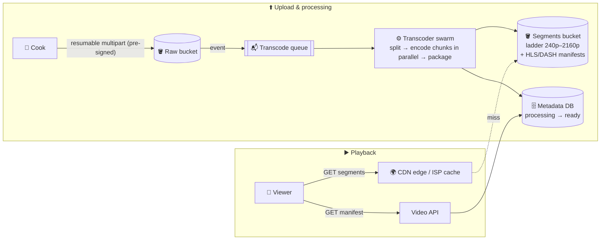

# 079 · Design a Video Streaming Platform (YouTube / Netflix)

> ⏱ 15 min · 📈 79% · 🅰️ Part A (core) · Phase 09: Core Case Studies
>
> `███████████████░░░░░` 79% of the whole guide
>
> 🧬 **Atoms used:** object storage + pre-signed/multipart uploads [042] · queues & workers [057] · pub/sub [058] · CDN [023] · caching [027] · metadata DB [034, 045] · search [043] · counters/write-back [029] · autoscaling [025]

---

## 📖 Story

Pantry's cooking videos are a sensation, and a disaster.

A cook uploads a 40-minute 4K lasagna masterclass at noon. It's still **"Processing…"** at 4 p.m., crawling through a single server that encodes one video at a time, at roughly real-time speed.

Customers on trains see the dreaded spinning circle every 20 seconds, because Pantry serves **one 4K file to everyone**, whether they're on fibre or one bar of 4G.

And the bandwidth bill arrives like a punch: Pantry is now spending **more on video egress than on engineers' salaries**.

Maya stares at the whiteboard. *Where do I even begin?*

Let me show you what I showed her: **a video pipeline**, all the way from the cook's upload to your screen, slice by slice.

## 🎯 One-sentence idea

**A video platform is two systems: an upload pipeline that stores the original and transcodes it, in parallel, into many resolutions of small segments, and a playback system that streams those segments from CDN edges with adaptive bitrate, so the quality bends to each viewer's connection instead of breaking.**

## 🧸 Analogy

A **bakery chain**:

- 🎂 One **giant cake** arrives (the raw upload).
- 🔪 The kitchen **slices it** (2–6 s segments) and makes **several sizes of every slice** (1080p, 720p, 480p…).
- 🏪 Slices ship to **local shops everywhere** (the CDN).
- 🍰 A hurried customer (slow internet) gets **smaller slices**, and a relaxed one gets **bigger slices**, switching slice by slice (adaptive bitrate).

## 🖼️ Visual

*Diagram brief:* the upload half (creator → raw bucket → queue → a swarm of parallel transcoders → segment bucket + manifests + metadata) above the playback half (viewer → manifest from the API → segments from the nearest CDN edge, falling back to origin on a miss).



## 🔬 How it works

- **Requirements:** upload, process, watch on any device and network, metadata, and search. Playback starts **< 2 s** with **minimal rebuffering**, it's globally available (AP), and originals are durable. Processing may take minutes.
- **Estimates:** YouTube-scale **500 h uploaded per minute** ≈ **720 TB/day raw** (+2–3× for renditions). **1B hours watched/day** at ~3 Mbps ≈ **1.35 EB/day of egress**. **So:** egress dominates the cost → **CDN, even ISP-embedded caches**. Storage is huge → **tiering**. Transcoding = **massively parallel batch compute**.
- **Upload:** `POST /videos` → metadata (`uploading`) + **pre-signed multipart URLs**. The client uploads chunks **directly to object storage** (parallel, resumable) → the "complete" event lands on the **transcode queue**.
- **Transcoding DAG, the core deep dive:**
  - **Split** the source into chunks (by GOP / a few seconds) and **encode the chunks in parallel** across a fleet: a **bitrate ladder** (240p → 2160p) in H.264 for compatibility, plus **AV1/VP9** for popular titles.
  - **Package** into **HLS/DASH** segments + manifests. Run thumbnails, captions, moderation, and fingerprinting alongside.
  - Workers are **idempotent and preemptible**, and **autoscaled on queue depth**.
  - **Publish progressively** (480p/720p first).
- **Playback with ABR:** the player fetches the **manifest**, then requests segments one by one from the **CDN**, measuring throughput and buffer health and **switching renditions per segment**. Start at a low bitrate for a fast first frame, and climb once the buffer is healthy.
- **Delivery and the long tail:** popular videos (a power law) stay hot at the edges, and Netflix-style **Open Connect** boxes inside ISPs are pre-filled overnight. Signed URLs and **DRM** for premium content. View counts via **stream aggregation**, never a DB write per view. Search via an inverted index.

## 🧩 Worked example

```
#EXTM3U
#EXT-X-STREAM-INF:BANDWIDTH=800000,RESOLUTION=640x360
360p/index.m3u8
#EXT-X-STREAM-INF:BANDWIDTH=2500000,RESOLUTION=1280x720
720p/index.m3u8
#EXT-X-STREAM-INF:BANDWIDTH=5000000,RESOLUTION=1920x1080
1080p/index.m3u8
```

Each variant playlist lists `seg_00001.ts`, `seg_00002.ts`, … (4 s each), and the player picks the variant **per segment**.

**Maya's masterclass, replayed:**

```
40-min 4K source, ~1× real-time encode per worker → 40 min PER rendition on one box (×7 renditions = hours)
Split into 240 × 10 s chunks → 240 workers in parallel → ~30–60 s per rendition + packaging
720p playable in ~3 minutes; full ladder in ~10 ✅
```

**The train passenger:** throughput drops from 6 Mbps to 0.9 Mbps → the player steps down from 1080p to 360p on the **next segment** → a brief blur instead of a spinner → it climbs back to 720p after the tunnel.

## ⚖️ Trade-offs

| Decision | Maya's choice | Why |
|---|---|---|
| Protocol | HLS/DASH over HTTP (TCP) | CDN-friendly, adaptive, universal |
| Segment length | 2–6 s | Short = fast start and adaptation, more requests. Long = efficient, slower to adapt |
| Codec | H.264 everywhere, AV1/VP9 for popular titles | Spend expensive encodes only where views repay them |
| Storage | Hot for popular, cold tier for the tail | Cost |
| Live | LL-HLS or WebRTC | Seconds vs sub-second latency trade-off |

## 🌍 Real world

- **Netflix** builds **per-title / per-shot** bitrate ladders, and serves the large majority of its traffic from **Open Connect** appliances inside ISPs.
- **YouTube** transcodes on custom silicon (**Argos VCUs**) and serves through Google's edge network.
- Video is a **large share of all internet downstream traffic**.

## 📌 Cheat card

> - **Upload:** pre-signed multipart → raw → **queue → parallel transcode DAG** → segments + manifests.
> - **Playback:** manifest → **CDN segments** → **ABR per segment**.
> - **Egress dominates cost** → CDN/ISP caches + efficient codecs for popular content.
> - **2–6 s segments · a ladder from 240p to 4K · progressive publishing.**
> - Views via **stream aggregation**.

## 🧪 Feynman check

Explain the bakery slicing the cake, and why a viewer in a tunnel sees the picture blur for a moment instead of the video stopping.

⚠️ **Common confusion:** "Video should use UDP because it's real-time." **On-demand** video rides HTTP/TCP segments through CDNs. The player's buffer hides retransmissions, and CDNs scale HTTP superbly. UDP/WebRTC is for **ultra-low-latency live** and calls.

## ⚡ Quick recall

1. What is adaptive bitrate streaming?
<details><summary>Reveal Answer</summary>

The player switches between quality renditions per segment, based on measured bandwidth and buffer health.
</details>

2. Why split videos into chunks for transcoding?
<details><summary>Reveal Answer</summary>

To encode chunks in parallel across many workers, cutting processing from hours to minutes.
</details>

3. What dominates the cost of a video platform?
<details><summary>Reveal Answer</summary>

Bandwidth (egress) for delivering video, which is why CDNs and efficient codecs are essential.
</details>

## 🎤 Interview practice

**Q. "A creator uploads a 2-hour 4K video. Walk me to 'playable', then reduce buffering for viewers on poor networks."**
<details><summary>Model answer</summary>

- **To playable:**
  1. **Resumable multipart upload** via pre-signed URLs straight to object storage (parallel parts, retry only failed ones).
  2. The "complete" event → a **transcode DAG** on the queue: **split** into chunks → **parallel encodes** per rendition → **assemble/package** HLS/DASH, with thumbnails, captions (speech-to-text), moderation, and fingerprinting in parallel.
  3. **Progressive publish:** 360p/720p first → `status = ready`, with higher rungs and AV1 added later.
  4. **Idempotent chunk jobs** write to deterministic paths, so a dead worker's job is simply redelivered.
  5. **CDN** fills lazily on first views, or is **pre-warmed** for big creators.
- **Less buffering on poor networks:**
  - **Low rungs** (144p/240p) and **efficient codecs** (AV1) where devices support them.
  - **CDN presence near users:** regional PoPs and ISP caches pre-filled with likely-popular content.
  - **Shorter segments + a conservative ABR** (buffer-based, e.g. BOLA), and **start low**.
  - **Offline downloads** on mobile.
  - **SLIs per region and ISP:** **startup time**, **rebuffer ratio**, and average bitrate.
- **Likely follow-up:** "How does the player choose a bitrate?" → throughput-based (recent download speed), buffer-based (buffer level), or hybrid/model-predictive algorithms.
</details>

## 📖 Teaser

> 📖 *Videos stream smoothly at last, and Maya's final design of the year awaits: shared recipe folders that must sync perfectly across a laptop, a phone, and a flour-dusted kitchen tablet.*

---

⬅️ [078 · Notification System](078-design-notification-system.md) · 🗺️ [Phase map](README.md) · ➡️ [080 · Design File Storage & Sync](080-design-file-sync.md)

✅ **Safe stopping point.** Tick lesson 079 in [PROGRESS.md](../../PROGRESS.md).
