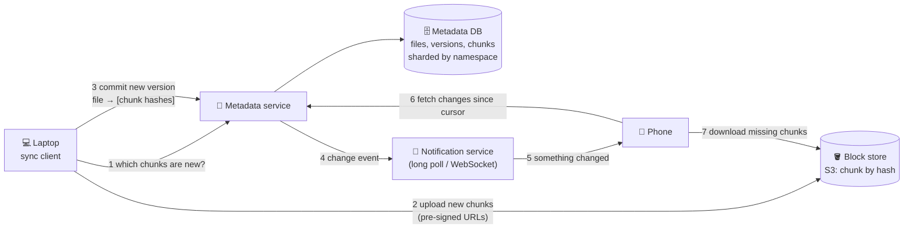

# 080 · Design File Storage & Sync (Dropbox / Google Drive)

> ⏱ 15 min · 📈 80% · 🅰️ Part A (core) · Phase 09: Core Case Studies
>
> `████████████████░░░░` 80% of the whole guide 🏁
>
> 🧬 **Atoms used:** object storage [042] · metadata DB + transactions [034–036] · sharding [049] · pub/sub / notifications [058, 016] · conflict resolution [048] · idempotency [055] · hashing / dedup [090 preview] · CDN [023] · authZ/sharing [069]

---

## 📖 Story

Cooks wanted recipe folders that stayed in sync between their laptop, phone, and kitchen tablet, including 2 GB video drafts. Editing one line shouldn't re-upload the whole thing. This was Maya's final design of the year. I told her: nail it, and she'd no longer be "junior." Let's nail it together.

## 🎯 One-sentence idea

**A file-sync service splits files into content-addressed chunks stored in object storage, keeps a metadata database of which chunks make up which file version, and syncs devices by uploading only changed chunks and notifying other devices to pull the changes, handling conflicts when two devices edit the same file offline.**

## 🧸 Analogy

**LEGO models shared between friends' houses**:

- Every model (file) is built from **numbered bricks** (chunks). Each brick's number is its **fingerprint** (a hash of its contents).
- A central **instruction booklet** (metadata) says "Model v3 = bricks #A, #B, #F, #K".
- Change one part of your model? You send only the **new bricks** plus the **updated instructions**, not the whole model.
- Your friend's house gets a **"new instructions available!" call** (a notification), and fetches only the bricks they don't already have.
- Two friends change the same model while offline? You end up with **two versions**, and someone decides (a conflicted copy).

## 🖼️ Visual



## 🔬 How it works

### 1️⃣ Requirements
- **Functional:** upload/download files, **sync across devices** automatically, file **versions/history**, **sharing** with permissions, and offline edits.
- **Non-functional:** **never lose data** (durability ≫ everything), sync latency of seconds, efficient bandwidth (big files, small edits), and scale to billions of files. **Strong consistency for metadata** (you mustn't see a file version whose chunks don't exist).

### 2️⃣ Estimates
```
500M users, 100M DAU · avg 2,000 files × 500 KB = 1 GB/user → 500 PB total (before dedup)
Changes: 10 file edits/DAU/day → 1B commits/day → ~12k metadata writes/s (peak ~40k)
Chunk size 4 MB · dedup across users (common files) saves a significant %
```
**So this means:** object storage for the blocks (exabyte-capable). A **sharded, strongly consistent metadata DB**. Bandwidth optimization via **chunk-level delta sync**.

### 3️⃣ Chunking & dedup (the core deep dive)
- Split files into chunks (fixed 4 MB, or **content-defined chunking** with rolling hashes so an insert in the middle doesn't shift every later chunk).
- The chunk ID = **SHA-256(content)** (content-addressed). Identical chunks are stored **once** (dedup across versions and even across users).
- On edit: the client re-chunks the file, asks the metadata service "which of these hashes are missing?", and uploads **only the missing chunks**.
- Compression is optional before upload. Encryption at rest is always on (per-chunk keys wrapped by KMS, lesson 070).

### 4️⃣ Metadata model
```
namespaces (user root / shared folder)  → shard key
files(file_id, namespace_id, path, latest_version, deleted)
file_versions(file_id, version, chunk_hashes[], size, modified_by, created_at)
chunks(hash PK, size, storage_location, refcount)
journal(namespace_id, seq, change)  → an ordered change log per namespace for sync cursors
```
- **Commit = a transaction:** verify all the chunks exist → insert the new version → append to the namespace journal (`seq`++).
- Each device keeps a **cursor** (the last seen `seq` per namespace), and syncs with "give me changes after my cursor."

### 5️⃣ Notifications
- Clients hold a **long-poll / WebSocket** connection to the notification service: "namespace X changed" → the client pulls from its cursor.
- It doesn't push file content, only a signal to sync (cheap and simple).

### 6️⃣ Conflicts
- Each commit includes the **base version** the client edited from. If the server's latest ≠ base → **conflict**.
- Strategy: keep both → save the second as `"report (Bob's conflicted copy).docx"`. The user resolves it.
- Real-time collaborative docs (Google Docs) are different: they use **OT/CRDTs** for character-level merges (lesson 048).

### 7️⃣ Other deep dives
- **Large uploads:** resumable, chunk-level retries, parallel uploads (idempotent by hash).
- **Sharing & permissions:** ACLs or ReBAC on namespaces and folders (lesson 069). Shared-folder changes append to the shared namespace journal.
- **Garbage collection:** chunk **refcounts**. Delete chunks when no version references them (after a retention period for version history and undelete).
- **Hot files:** popular shared downloads are served via a CDN with signed URLs.

## 🧩 Worked example

**Editing 1 page of a 100 MB presentation:**

```
Before: 25 chunks × 4 MB, hashes [h1 … h25]
Edit on slide 12 → the client re-chunks → only chunk 12 changed → new hash h12'
Client: POST /check_chunks [h1..h11, h12', h13..h25] → server: missing = [h12']
Upload 4 MB (not 100 MB!) → commit version 8 = [h1..h11, h12', h13..h25]
Other devices: notified → fetch the journal after their cursor → download only h12' ✅
Bandwidth saved: 96%
```

**Commit with conflict detection:**

```sql
BEGIN;
  SELECT latest_version FROM files WHERE file_id = :f FOR UPDATE;   -- = 7?
  -- if latest_version != :base_version (7) → ROLLBACK → client creates a conflicted copy
  INSERT INTO file_versions(file_id, version, chunk_hashes, ...) VALUES (:f, 8, :hashes, ...);
  UPDATE files SET latest_version = 8 WHERE file_id = :f;
  INSERT INTO journal(namespace_id, seq, change) VALUES (:ns, nextval(...), 'update f v8');
COMMIT;
```

## ⚖️ Trade-offs

| Decision | Choice | Why |
|---|---|---|
| Chunking | Content-defined, ~4 MB | Small edits change few chunks, and dedup works |
| Metadata consistency | Strong (SQL, sharded by namespace) | Never reference missing chunks |
| Block storage | Object storage, content-addressed | Cheap, durable, dedup |
| Sync trigger | Notify + pull by cursor | Simple, reliable, resumable |
| Conflicts | Conflicted copies | Safe (no silent data loss), with the user deciding |

## 🌍 Real world

- **Dropbox** separates the block store (moved from S3 to its own **Magic Pocket**, exabyte scale) from metadata (sharded MySQL → **Edgestore**), with a notification service for sync.
- **Google Drive** uses Colossus/Spanner-backed storage, and Docs uses OT for real-time collaboration.
- **rsync** pioneered rolling-checksum delta transfers.

## 📌 Cheat card

> - **Files = lists of content-addressed chunks (SHA-256).** Upload only the **missing chunks**.
> - **Metadata DB (strongly consistent, sharded by namespace) + block store (S3).**
> - **Journal + per-device cursor** → "give me changes since X".
> - **Notify, then pull.** Conflicts → **conflicted copy** (or CRDT/OT for live co-editing).
> - **Refcount GC** for chunks. Retain versions for history.

## 🧪 Feynman check

Explain the LEGO-bricks analogy, and why changing one slide in a huge presentation only sends a tiny bit of data.

⚠️ **Common confusion:** "Just upload the whole file on every change." For a 1 GB file edited often, that wastes enormous bandwidth and time. **Chunk-level delta sync** is the key idea.

## ⚡ Quick recall

1. What does content-addressed storage mean?
<details><summary>Answer</summary>

Each chunk is identified by the hash of its contents, so identical chunks share one ID and are stored once.
</details>

2. How does a device know what changed since it was last online?
<details><summary>Answer</summary>

It sends its cursor (the last seen journal sequence per namespace), and the server returns all later changes.
</details>

3. How are edit conflicts detected?
<details><summary>Answer</summary>

The commit includes the base version it was edited from. If the server's latest version is different, it's a conflict.
</details>

## 🎤 Interview practice

**Q1. "Why is content-defined chunking better than fixed-size chunking?"**
<details><summary>Model answer</summary>

- With fixed-size chunks, **inserting a byte near the start shifts every later chunk boundary**, so every chunk hash changes and the whole file is re-uploaded.
- Content-defined chunking (rolling hash, e.g., Rabin fingerprints) picks boundaries based on the content, so an insert only changes the chunks around it.
- The trade-off is variable chunk sizes and more CPU.
- **Likely follow-up:** "What's the dedup risk?" → confirmation-of-file attacks (probing whether someone has a file), so some services dedup only per user or use convergent encryption carefully.
</details>

**Q2. "How do you guarantee a device never sees a file version whose chunks aren't uploaded yet?"**
<details><summary>Model answer</summary>

- **Two-phase commit order:** upload the chunks first → the commit transaction verifies that every referenced chunk exists (in the chunks table/block store) → only then create the version and journal entry.
- The metadata DB is strongly consistent (SQL transactions), so readers only see committed versions.
- Chunk uploads are idempotent by hash, so retries are safe.
- **Likely follow-up:** "What about orphaned chunks from abandoned uploads?" → GC chunks with refcount 0 older than a grace period.
</details>

> 📖 *Next is Maya's big design review. And, if you're ready, yours.*

---

⬅️ [079 · Video Streaming](079-design-video-streaming.md) · 🗺️ [Phase map](README.md) · ➡️ [🏁 Checkpoint 80%: Practical Mastery](checkpoint-80.md)

✅ **Safe stopping point.** Tick lesson 080 in [PROGRESS.md](../../PROGRESS.md), then take the 🏁 **Practical Mastery gate**!
