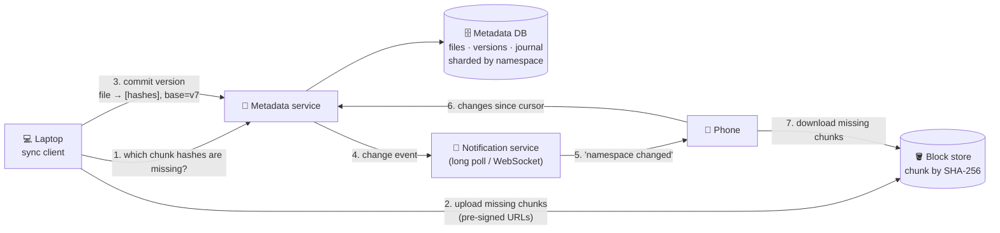

# 080 · Design File Storage & Sync (Dropbox / Google Drive)

> ⏱ 15 min · 📈 80% · 🅰️ Part A (core) · Phase 09: Core Case Studies
>
> `████████████████░░░░` 80% of the whole guide 🏁
>
> 🧬 **Atoms used:** object storage [042] · metadata DB + transactions [034–036] · sharding [049] · pub/sub / notifications [058, 016] · conflict resolution [048] · idempotency [055] · hashing / dedup [090 preview] · CDN [023] · authZ/sharing [069]

---

## 📖 Story

It's the last design of Maya's year, and the stakes feel physical.

Cooks want **shared recipe folders**: notes, photos, and **2 GB video drafts**, kept in sync between a laptop at home, a phone on the bus, and a tablet propped against a flour jar in the kitchen.

The first prototype re-uploads the **entire 2 GB file** every time a cook trims three seconds off the end. On café Wi-Fi, a single edit takes **forty minutes**. Worse, when the cook edits the same recipe on the tablet *and* the laptop while both are offline, the prototype silently keeps whichever saved last, and **deletes an evening's work without a word**.

*Never lose data.* *Never re-send what hasn't changed.* *Never let two edits quietly erase each other.*

I told Maya: nail this one, and she'd no longer be "junior." Let's nail it together.

## 🎯 One-sentence idea

**A file-sync service splits files into content-addressed chunks stored in object storage, keeps a strongly consistent metadata database of which chunks make each file version, syncs devices by uploading only missing chunks and notifying other devices to pull, and preserves both sides when edits conflict.**

## 🧸 Analogy

**LEGO models shared between houses**:

- Every model is built from **numbered bricks**, and each brick's number is its **fingerprint** (a hash).
- A central **instruction booklet** says "Model v3 = bricks #A, #B, #F, #K."
- Change one part? Send **only the new bricks** plus the **new instructions**.
- Other houses get a **"new instructions!" call** and fetch only the bricks they lack.
- Two houses changed the same model offline? Keep **both versions**, and a human decides.

## 🖼️ Visual

*Diagram brief:* a laptop asks "which bricks are new?", uploads only those to the block store, and commits a new version to the metadata service. A notification ripples to the phone, which pulls changes since its cursor and downloads only the missing bricks.



## 🔬 How it works

- **Requirements:** upload/download, **automatic multi-device sync**, **version history**, **sharing with permissions**, and offline edits. **Durability above everything**, sync within seconds, bandwidth-efficient for big files with small edits, billions of files, and **strongly consistent metadata** (never reference a missing chunk).
- **Estimates:** 500M users × ~1 GB ≈ **500 PB** before dedup. 1B commits/day ≈ **12k metadata writes/s** (peak ~40k). **So:** object storage for blocks, a **sharded SQL metadata store** (by namespace), and **chunk-level delta sync**.
- **Chunking and dedup, the core deep dive:** split files with **content-defined chunking** (a rolling hash, ~4 MB average), so an insertion only changes nearby chunks. The **chunk ID = SHA-256(content)**, so identical chunks are stored **once** across versions (and users). The client asks "which hashes are missing?" and uploads **only those**, encrypted at rest with KMS-wrapped keys.
- **Metadata + journal:** `files`, `file_versions(file_id, version, chunk_hashes[])`, `chunks(hash, refcount, location)`, and a per-namespace **`journal(seq, change)`**. **Commit = one transaction:** verify every chunk exists → insert the version → append to the journal. Each device keeps a **cursor** (`last seq`) and pulls "changes after X."
- **Notify, then pull:** clients hold a **long-poll/WebSocket**. The server sends only *"namespace X changed"*, and the client pulls from its cursor. Content never rides the notification channel.
- **Conflicts and the rest:**
  - Each commit carries its **base version**. If the server's latest ≠ base → **conflict** → keep both (`recipe (tablet's conflicted copy).md`). Live co-editing uses OT/CRDTs instead (lesson 048).
  - **Sharing** via ACLs/ReBAC on namespaces (lesson 069).
  - **Refcount GC** after a retention window.
  - Hot shared downloads go through a CDN with signed URLs.

## 🧩 Worked example

**Trimming 3 seconds off a 2 GB video:**

```
Before: ~500 chunks (avg 4 MB), hashes [h1 … h500]
Edit near the end → content-defined re-chunking → only the last ~3 chunks change → h498', h499', h500'
POST /check_chunks [h1..h497, h498', h499', h500'] → missing = [h498', h499', h500']
Upload ≈ 12 MB (not 2 GB) → commit v8 = [h1..h497, h498', h499', h500']
Tablet & phone: notified → journal after cursor → download only 3 chunks
Bandwidth saved: ~99.4%  ·  Café Wi-Fi time: 40 min → ~10 s ✅
```

**Commit with conflict detection:**

```sql
BEGIN;
  SELECT latest_version FROM files WHERE file_id = :f FOR UPDATE;      -- expect 7
  -- if latest_version != :base_version → ROLLBACK → client saves a conflicted copy
  INSERT INTO file_versions(file_id, version, chunk_hashes) VALUES (:f, 8, :hashes);
  UPDATE files SET latest_version = 8 WHERE file_id = :f;
  INSERT INTO journal(namespace_id, seq, change) VALUES (:ns, nextval('ns_seq'), 'update f v8');
COMMIT;
```

**The offline double-edit, replayed:** the laptop commits v8 on base v7 ✅. The tablet commits on base v7 → the server's latest is 8 → **conflict** → saved as *"Lasagna (tablet's conflicted copy)"*. **Nothing is silently lost.**

## ⚖️ Trade-offs

| Decision | Maya's choice | Why |
|---|---|---|
| Chunking | Content-defined, ~4 MB | Small edits touch few chunks, and dedup works |
| Metadata | Strong consistency, sharded by namespace | Never reference missing chunks |
| Blocks | Object storage, content-addressed | Cheap, durable, deduplicated |
| Sync trigger | Notify + pull by cursor | Simple, resumable, reliable |
| Conflicts | Conflicted copies | No silent data loss, a human decides |

## 🌍 Real world

- **Dropbox** split block storage (moving from S3 to its own **Magic Pocket**, exabyte scale) from metadata (sharded MySQL, then **Edgestore**), with a dedicated notification service.
- **Google Drive** sits on Colossus/Spanner-backed storage, and **Docs** uses OT for real-time collaboration.
- **rsync** pioneered rolling-checksum delta transfer.

## 📌 Cheat card

> - **Files = lists of content-addressed chunks.** Upload **only missing** chunks.
> - **Strong metadata DB (by namespace) + object block store.**
> - **Journal + per-device cursor** → "changes since X."
> - **Notify → pull.** Conflicts → **conflicted copy** (CRDT/OT for live editing).
> - **Refcount GC**, plus version retention.

## 🧪 Feynman check

Explain the LEGO bricks, and why trimming three seconds off a huge video sends only a sliver of data.

⚠️ **Common confusion:** "Fixed 4 MB chunks are fine." Insert one byte near the **start** of a file and every later chunk boundary shifts, **every hash changes**, and you re-upload the whole file. **Content-defined chunking** anchors boundaries to the content itself, so changes stay local.

## ⚡ Quick recall

1. What does content-addressed storage mean?
<details><summary>Reveal Answer</summary>

Each chunk is identified by the hash of its contents, so identical chunks share one ID and are stored once.
</details>

2. How does a device learn what changed while it was offline?
<details><summary>Reveal Answer</summary>

It sends its cursor (the last journal sequence per namespace), and the server returns every change after it.
</details>

3. How are edit conflicts detected?
<details><summary>Reveal Answer</summary>

Each commit includes the base version it edited. If the server's latest version differs, it's a conflict.
</details>

## 🎤 Interview practice

**Q. "Guarantee a device never sees a file version whose chunks aren't uploaded yet, and explain the privacy risk of cross-user deduplication."**
<details><summary>Model answer</summary>

- **Ordering guarantee:**
  1. **Upload chunks first.** Uploads are **idempotent by hash**, so retries are safe.
  2. The **commit transaction verifies** that every referenced hash exists (in the `chunks` table, confirmed by the block store) **before** inserting the version and the journal entry.
  3. Metadata lives in a **strongly consistent** SQL store, so readers only ever see **committed** versions, whose chunks already exist.
  4. **Orphaned chunks** (abandoned uploads) have refcount 0 and are garbage-collected after a grace period.
- **Cross-user dedup risk, "confirmation of file":**
  - If uploading a chunk that already exists completes instantly, an attacker can **probe whether *someone* has a specific file** (a leaked document, say) by timing or bandwidth.
  - **Mitigations:**
    - Dedup **per user/namespace only** for sensitive tiers.
    - Always require the **full upload** for first-time chunks per user (verify possession).
    - Or use **convergent encryption** carefully, which still leaks equality, so weigh it.
  - The trade-off: storage savings vs a privacy side channel.
- **Likely follow-up:** "Why content-defined over fixed-size chunks?" → insertions shift fixed boundaries and invalidate every later chunk, while rolling-hash boundaries keep changes local. The cost is variable sizes and more client CPU.
</details>

## 📖 Teaser

> 📖 *🏁 That was the final design of Maya's year, and next she defends all six in front of a review panel. If you're ready, so do you.*

---

⬅️ [079 · Video Streaming](079-design-video-streaming.md) · 🗺️ [Phase map](README.md) · ➡️ [🏁 Checkpoint 80%: Practical Mastery](checkpoint-80.md)

✅ **Safe stopping point.** Tick lesson 080 in [PROGRESS.md](../../PROGRESS.md), then take the 🏁 **Practical Mastery gate**!
