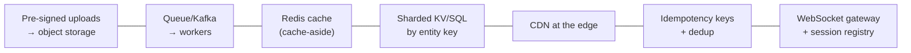

# 📌 Phase 09 Cheatsheet: Core Case Studies

## 🧭 The framework (every time)

**R → E → H → D → W**: Requirements (5–8 min) → Estimates + API + data (5–8) → High-level (10–15) → Deep dives (15–20) → Wrap-up (3).

## 🏗️ Case study one-liners

| # | System | The core insight | Key deep dives |
|---|---|---|---|
| 074 | **URL shortener** | Read-heavy KV lookup | Code generation (range allocation/KGS + base62), cache + CDN, 301 vs 302, async analytics |
| 075 | **Rate limiter** | Shared atomic counters | Token bucket / sliding window, Redis Lua, local leasing, fail-open vs fail-closed |
| 076 | **News feed** | When to assemble the feed | Push vs pull vs **hybrid** (celebs pull), IDs in Redis, hydration, lazy delete filtering, ranking |
| 077 | **Chat** | Persistent connections + durable ordered log | WebSocket gateways, session registry, persist-then-ack, per-conversation seq, cursor sync, offline push |
| 078 | **Notifications** | A reliable pipeline to flaky providers | Priority bulkheads, prefs/quiet hours/caps, dedup per channel, fallback providers, throttled campaigns |
| 079 | **Video streaming** | Transcode once, stream segments from the edge | Multipart upload, parallel transcoding DAG, HLS/DASH, ABR, CDN/egress economics |
| 080 | **File sync** | Content-addressed chunks + a metadata journal | Chunking + dedup, delta upload, strong metadata transactions, cursor sync, conflicted copies |

## 🔢 Numbers used in these designs

```
7 base62 chars ≈ 3.5 trillion codes · 62^6 ≈ 57 billion
Feed cache: ~500 post IDs × 8 B = 4 KB per user
WebSocket gateway: ~50k–100k+ connections per server
Video: ~1.35 GB/hour at 3 Mbps · segments 2–6 s
Chunks: ~4 MB, SHA-256 addressed
Notification OTP validity: ~5 min, so don't retry for hours
```

## 🧩 Reusable building blocks you saw repeatedly



## 🪄 Interview tricks

- **Always name the read:write ratio.** It decides caching, precompute, and fan-out.
- **Separate the hot path from the side effects** (analytics, emails → async).
- **Store IDs, hydrate later** (feeds, timelines).
- **Persist before ack** for anything users would be upset to lose.
- **Celebrities / viral items** are always a deep-dive candidate.
- **End with monitoring + security + "what I'd do with more time."**

---

🗺️ [Phase map](README.md) · 🎤 [Interview questions](INTERVIEW-QUESTIONS.md) · 🏁 [Checkpoint 80%](checkpoint-80.md)
