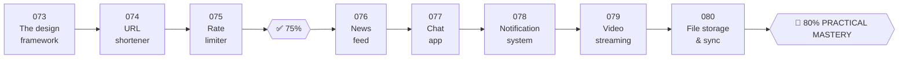

# 🏗️ Phase 09: Core Case Studies

> **Lessons 073–080 · 73% → 80% · 🅰️ Part A (core)**
> This is where the atoms combine. Each case study is a **full mock interview walkthrough**: requirements → estimates → API → data → high-level design → deep dives → interviewer follow-ups. **Finishing this phase = 🏁 80% Practical Mastery.**

## 📖 Chapter 9: Maya's Year of Big Features

Pantry's roadmap handed Maya a list of ambitious features, and she had to design each one properly and defend it in a design review. In this chapter, I'll watch with you as all the atoms combine into complete systems: short links, a rate limiter, a feed, chat, notifications, video streaming, and file sync. It ends with Maya's toughest review, and your 🏁 Practical Mastery gate.

## 🗺️ Phase map

| # | Case study | ⏱ | Key atoms it exercises |
|---|---|---|---|
| 073 | [The 4-step design framework](073-design-framework.md) | 10 min | How to run any design interview |
| 074 | [URL shortener](074-design-url-shortener.md) | 15 min | ID generation, KV store, caching, CDN, analytics |
| 075 | [Rate limiter](075-design-rate-limiter.md) | 12 min | Token bucket, Redis, distributed counters, fail-open |
| ✅ | [Checkpoint 75%](checkpoint-75.md) | 20 min | |
| 076 | [News feed](076-design-news-feed.md) | 15 min | Fan-out on write vs read, celebrities, ranking, caching |
| 077 | [Chat app](077-design-chat-app.md) | 15 min | WebSockets, message storage, ordering, presence, delivery |
| 078 | [Notification system](078-design-notification-system.md) | 12 min | Queues, providers, preferences, dedup, rate limits |
| 079 | [Video streaming](079-design-video-streaming.md) | 15 min | Object storage, transcoding pipeline, CDN, adaptive bitrate |
| 080 | [File storage & sync](080-design-file-sync.md) | 15 min | Chunking, dedup, metadata DB, sync protocol, conflicts |
| 🏁 | [Checkpoint 80%: Practical Mastery gate](checkpoint-80.md) | 30 min | Full mock interview |

**How to study a case study (ADHD-friendly):** each one is split into small numbered steps. Do **one step per sitting** if you like. Before reading each step, **try it yourself for 2 minutes**, then compare.

📌 [Phase cheatsheet](CHEATSHEET.md) · 🎤 [Phase interview questions](INTERVIEW-QUESTIONS.md) · 🎤 [Interview framework](../../cheatsheets/INTERVIEW-FRAMEWORK.md)

⬅️ Previous phase: [08 Reliability, security & ops](../08-reliability-ops/README.md) · ➡️ Next: [🅱️ Phase 10 Deep internals](../10-deep-internals/README.md)
