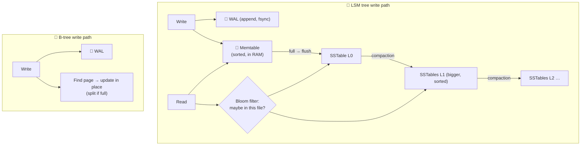

# 081 · B-Trees, LSM Trees & the Write-Ahead Log

> ⏱ 10 min · 📈 81% · 🅱️ Part B (advanced) · Phase 10: Deep Internals
>
> `████████████████░░░░` 81% of the whole guide

---

## 📖 Story

I watched Maya get promoted to senior engineer. Her first mission: figure out why the new chat database handled writes ten times faster than the orders database. To answer, she had to open up the engine itself and see how data actually reaches the disk. I'll open it up for you too.

## 🎯 One-sentence idea

**Storage engines choose between updating data in place in a sorted tree (B-tree: great for reads) or appending writes to memory and merging sorted files in the background (LSM tree: great for writes). Both use a write-ahead log so a crash never loses acknowledged data.**

## 🧸 Analogy

Keeping a **phone book** up to date:

- 📕 **B-tree:** a **well-organized binder**. Each new number is **inserted on the right page right away** (sometimes splitting a full page in two). Looking someone up is fast. Adding numbers means flipping to the right page every time (random writes).
- 📝 **LSM tree:** you **jot new numbers on a sticky-note pad** (memory) as they come in, which is super fast. When the pad is full, you **sort it and file it as a mini-booklet**. Periodically, you **merge booklets** into bigger ones (compaction). Looking someone up may mean checking the pad and several booklets (slower reads, helped by Bloom filters).
- 📜 **WAL:** before doing *anything*, you **write the change in a diary** first. If you spill coffee on the binder mid-edit, you re-apply the changes from the diary.

## 🖼️ Visual



## 🔬 How it works

- **Write-ahead log (WAL / redo log / commit log):**
  - Every change is **appended to a sequential log and fsynced** *before* it's acknowledged.
  - On a crash: **replay the log** to restore committed changes (and roll back incomplete ones). This gives **atomicity + durability** (lesson 035).
  - Sequential appends are fast, even on HDDs. It's also the basis of **replication** (ship the WAL to replicas, lesson 046) and **CDC** (lesson 031).
- **B-tree (Postgres, MySQL InnoDB, most relational DBs):**
  - Data lives in fixed-size **pages** (4–16 KB) in a balanced tree, and **updates happen in place**.
  - ✅ Predictable, fast reads (3–4 page reads), efficient range scans, and one place per key.
  - ❌ **Random writes**, page splits, and **write amplification** (a small change rewrites a whole page).
- **LSM tree (Cassandra, RocksDB, LevelDB, ScyllaDB, HBase, Bigtable):**
  - Writes go to the WAL + an in-memory sorted **memtable**. When it's full, it's **flushed** to an immutable sorted file (**SSTable**).
  - **Compaction** merges SSTables in the background, dropping overwritten and deleted (tombstoned) data.
  - **Reads:** check the memtable, then the SSTables newest → oldest. **Bloom filters** skip files that can't contain the key. Sparse indexes find the block.
  - ✅ **Very high write throughput** (sequential I/O only) and great compression. ❌ Reads may touch several files (**read amplification**), compaction uses I/O and CPU (**space/write amplification**), and deletes are tombstones until compaction.
- **Compaction strategies:** **size-tiered** (write-optimized, more space) vs **leveled** (read-optimized, more write I/O).

## 🧩 Worked example

**LSM lifecycle of a key:**

```
t1: PUT user:42 = "Ada"      → WAL append + memtable
t2: PUT user:42 = "Ada L."   → WAL append + memtable (overwrites in memory)
t3: memtable full → flush SSTable-7: {user:42 → "Ada L.", ...}
t4: DELETE user:42           → a tombstone in the memtable → later flushed to SSTable-9
t5: GET user:42              → memtable? no → SSTable-9 has a tombstone → "not found"
t6: compaction merges 7 + 9  → both entries dropped for good (after the grace period)
```

**Amplification cheat table:**

| | B-tree | LSM (leveled) |
|---|---|---|
| Write amplification | Medium–high (page rewrites) | High (rewritten across levels), but sequential |
| Read amplification | Low (1 tree path) | Higher (several levels, mitigated by Bloom filters) |
| Space amplification | Some (fragmentation, fill factor) | Low–medium (depends on compaction) |
| Best for | Read-heavy, transactional | Write-heavy, time series, logs |

## ⚖️ Trade-offs

| You gain | You pay | Use when |
|---|---|---|
| B-tree: fast point and range reads | Random write I/O | OLTP with mixed reads and writes |
| LSM: massive write throughput, compression | Compaction overhead, read amplification, tombstones | Write-heavy (events, messages, metrics) |
| WAL `fsync` every commit | Latency per commit | You can't lose acknowledged writes |
| Group commit (batch fsyncs) | Slight latency increase | High commit rates |

## 🌍 Real world

- **RocksDB** (an LSM) underpins many systems: MyRocks at Facebook, CockroachDB, TiKV, Kafka Streams state stores.
- **Cassandra/ScyllaDB** tombstone buildup is a classic production problem (reads slow down scanning over deleted data).
- **Postgres** uses heap files + B-tree indexes + a WAL. `VACUUM` cleans up old row versions (lesson 082).

## 📌 Cheat card

> - **WAL first, always:** append + fsync → ack → apply. Crash → replay.
> - **B-tree = binder** (update in place, read-optimized). **LSM = sticky notes → booklets → merge** (write-optimized).
> - LSM pieces: **memtable → SSTables → compaction**, plus **Bloom filters** for reads, and **tombstones** for deletes.
> - Amplification triangle: **read vs write vs space**. You can't minimize all three.

## 🧪 Feynman check

Explain the binder vs sticky-notes analogy, and why a system storing billions of chat messages or sensor readings might prefer the sticky-notes approach.

⚠️ **Common confusion:** "LSM trees are always faster." They're faster for **writes**. Point reads can be slower (several files), and **compaction storms** can hurt tail latency. Workload decides.

## ⚡ Quick recall

1. What does the WAL guarantee?
<details><summary>Answer</summary>

Committed changes survive crashes (durability), and incomplete ones can be rolled back (atomicity), because the log is written and fsynced before acknowledging.
</details>

2. What's compaction in an LSM tree?
<details><summary>Answer</summary>

A background merge of sorted SSTable files that discards overwritten and deleted entries and reduces the number of files to search.
</details>

3. Why do LSM reads use Bloom filters?
<details><summary>Answer</summary>

To quickly skip SSTables that definitely don't contain the key, reducing disk reads.
</details>

## 🎤 Interview practice

**Q1. "Why does Cassandra handle writes so much better than a typical relational DB?"**
<details><summary>Model answer</summary>

- The LSM design turns writes into **sequential appends** (commit log + memtable), with no read-before-write and no in-place page updates.
- It's leaderless (any replica accepts writes) with tunable consistency, so there's no single primary bottleneck.
- The costs: compaction I/O, read amplification, tombstones, and limited query flexibility.
- **Likely follow-up:** "What happens with lots of deletes?" → tombstones accumulate, reads scan through them, so tune `gc_grace_seconds` and compaction, and avoid delete-heavy patterns (use TTLs or time-bucketed partitions you can drop).
</details>

**Q2. "Your LSM-based store shows periodic latency spikes. What's likely?"**
<details><summary>Model answer</summary>

- **Compaction** competing for disk I/O and CPU (size-tiered bursts or leveled backlog), **memtable flush stalls** (write stalls when L0 has too many files), and GC pauses.
- Fixes: throttle compaction, move to leveled compaction for read-heavy workloads, faster disks (NVMe), tune memtable and L0 thresholds, and spread load.
- **Likely follow-up:** "How would you detect it?" → correlate p99 latency with compaction metrics (pending compactions, bytes compacted/s, L0 file count).
</details>

> 📖 *Next, the orders table keeps growing, even though hardly any new orders are arriving.*

---

⬅️ [🏁 Checkpoint 80%](../09-core-case-studies/checkpoint-80.md) · 🗺️ [Phase map](README.md) · ➡️ [082 · MVCC](082-mvcc.md)

✅ **Safe stopping point.** Tick lesson 081 in [PROGRESS.md](../../PROGRESS.md).
