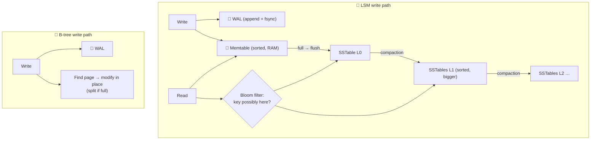

# 081 · B-Trees, LSM Trees & the Write-Ahead Log

> ⏱ 10 min · 📈 81% · 🅱️ Part B (advanced) · Phase 10: Deep Internals
>
> `████████████████░░░░` 81% of the whole guide

---

## 📖 Story

Maya's promotion to senior engineer comes with a puzzle instead of a cake.

On the same hardware, the new **chat database** (Cassandra) swallows **120,000 writes per second** without breaking a sweat. The **orders database** (Postgres) starts gasping at **12,000**. Ten times the difference. Same disks. Same RAM. Same cloud.

Reads tell the opposite story: the orders DB answers a point lookup in **0.3 ms**, while chat sometimes takes **8 ms** for a cold key.

Something deep inside these engines is making completely different bets about how bytes should reach the disk. To answer, Maya has to stop treating databases as black boxes and **open up the engine itself**.

I'll open it up for you too. It's one of the most satisfying "aha" moments in this whole guide.

## 🎯 One-sentence idea

**Storage engines either update data in place inside a sorted tree (B-tree: read-optimized) or append writes to memory and merge sorted files in the background (LSM tree: write-optimized), and both use a write-ahead log so a crash never loses an acknowledged write.**

## 🧸 Analogy

Keeping a **phone book** current:

- 📕 **B-tree:** a tidy **binder**. Every new number is **inserted on the right page immediately** (splitting full pages). Lookups are fast, and every write flips to some random page.
- 📝 **LSM tree:** scribble new numbers on a **sticky-note pad** (memory). When it's full, **sort it into a mini-booklet**, and periodically **merge booklets** at midnight (compaction). Writes are lightning-fast, and lookups may check the pad plus several booklets.
- 📜 **WAL:** before *any* change, **write it in a diary**. Spill coffee on the binder mid-edit? Replay the diary.

## 🖼️ Visual

*Diagram brief:* two write paths side by side. The LSM path flows WAL → memtable → flushed SSTables → compaction across levels, with a Bloom-filter gate on reads. The B-tree path flows WAL → "find the page and modify it in place."



## 🔬 How it works

- **Write-ahead log:** every change is **appended sequentially and `fsync`ed before the ACK**. On a crash, **replay** the committed changes and discard the incomplete ones, which gives **atomicity + durability** (lesson 035). The same log feeds **replication** (lesson 046) and **CDC** (lesson 031). **Group commit** batches fsyncs at high commit rates.
- **B-tree (Postgres, InnoDB):** fixed **pages (4–16 KB)** in a balanced tree, **updated in place**. Point and range reads are **predictable (3–4 page reads)**, but writes are **random I/O** with page splits and **write amplification** (a 100-byte change rewrites an 8 KB page).
- **LSM tree (RocksDB, Cassandra, ScyllaDB, HBase, Bigtable):** WAL + an in-memory **memtable** → flushed to immutable sorted **SSTables** → background **compaction** merges files and drops overwritten and **tombstoned** data. Writes are **purely sequential**, which means huge throughput and great compression.
- **LSM reads:** check the memtable, then SSTables newest → oldest. **Bloom filters** skip files that **definitely** lack the key, and sparse indexes find the block. The costs are **read amplification**, **compaction** I/O and CPU, and **tombstones** lingering until compaction.
- **The amplification triangle:** **read vs write vs space**. You can't minimize all three. **Size-tiered** compaction favours writes (more space), and **leveled** compaction favours reads and space (more write I/O).

## 🧩 Worked example

**A key's life in an LSM:**

```
t1: PUT user:42 = "Maya"        → WAL append + memtable
t2: PUT user:42 = "Maya R."     → WAL append + memtable (overwritten in RAM)
t3: memtable full → flush SSTable-7 {user:42 → "Maya R."}
t4: DELETE user:42              → tombstone in memtable → flushed to SSTable-9
t5: GET user:42                 → memtable miss → SSTable-9 tombstone → "not found"
t6: compaction merges 7 + 9     → both entries gone for good (after the grace period)
```

**Maya's answer to the 10× puzzle:**

| | Postgres (B-tree) | Cassandra (LSM, leveled) |
|---|---|---|
| A write does | WAL + random page writes on every index | WAL append + memtable insert (sequential) |
| Write amplification | Page rewrites, per index | Rewritten across levels, but sequential |
| Read amplification | Low: one tree path (0.3 ms) | Higher: several levels (Bloom filters help) |
| Best for | Mixed OLTP, read-heavy | Write-heavy messages, events, metrics |

## ⚖️ Trade-offs

| Maya's choice | What she gains | What she pays |
|---|---|---|
| B-tree engine | Fast point and range reads | Random write I/O |
| LSM engine | Massive write throughput, compression | Compaction, read amplification, tombstones |
| `fsync` on every commit | Zero acknowledged-write loss | Commit latency |
| Group commit | High commit throughput | Slightly higher per-commit latency |

## 🌍 Real world

- **RocksDB** powers MyRocks at Meta, CockroachDB's earlier storage, TiKV, and Kafka Streams state stores.
- **Cassandra/Scylla tombstone buildup** is a classic outage pattern: reads scan through mountains of deletes.
- **Postgres** = heap files + B-tree indexes + WAL, with `VACUUM` cleaning old versions (lesson 082).

## 📌 Cheat card

> - **WAL first, always:** append + fsync → ack → apply. Crash → replay.
> - **B-tree = binder** (in place, read-optimized). **LSM = sticky notes → booklets → merge** (write-optimized).
> - LSM: **memtable → SSTables → compaction**, **Bloom filters** for reads, **tombstones** for deletes.
> - **Read vs write vs space amplification**: pick your poison.

## 🧪 Feynman check

Explain the binder vs the sticky notes, and why a system storing billions of chat messages prefers the sticky notes.

⚠️ **Common confusion:** "LSM trees are just faster." They're faster at **writes**. Point reads can touch several files, and **compaction storms** can spike tail latency. The workload decides, not the hype.

## ⚡ Quick recall

1. What does the WAL guarantee?
<details><summary>Reveal Answer</summary>

Committed changes survive crashes (durability), and incomplete ones are rolled back (atomicity), because the log is written and fsynced before acknowledging.
</details>

2. What is compaction in an LSM tree?
<details><summary>Reveal Answer</summary>

A background merge of sorted SSTables that discards overwritten and deleted entries and reduces the number of files a read must check.
</details>

3. Why do LSM reads use Bloom filters?
<details><summary>Reveal Answer</summary>

To skip SSTables that definitely don't contain the key, avoiding unnecessary disk reads.
</details>

## 🎤 Interview practice

**Q. "Why does Cassandra handle writes so much better than a typical relational DB, and why does our LSM store show periodic latency spikes?"**
<details><summary>Model answer</summary>

- **Why writes fly:**
  - **LSM writes are sequential appends** (commit log + memtable). There's **no read-before-write** and no in-place page updates, so even hard disks stream at full bandwidth.
  - **Leaderless replication** with tunable consistency means no single-primary write bottleneck.
  - The price: compaction I/O, read amplification, tombstones, and a query model shaped around partitions.
- **Delete-heavy workloads:** tombstones accumulate and reads crawl through them. Tune `gc_grace_seconds` and compaction, and prefer **TTLs** or **time-bucketed partitions you can drop whole**.
- **The periodic spikes, usual suspects:**
  - **Compaction** stealing disk I/O and CPU (size-tiered bursts, a leveled backlog).
  - **Write stalls:** too many L0 files, or the memtable flush can't keep up.
  - **JVM GC pauses** (Cassandra).
- **Fixes:**
  - **Throttle compaction**, and move to **leveled** compaction for read-heavy tables.
  - **NVMe** disks.
  - Tune memtable size and L0 thresholds.
  - Spread the write load across partitions.
- **Diagnose by correlating** p99 with pending compactions, bytes compacted/s, L0 file count, and GC logs.
- **Likely follow-up:** "When would you still pick a B-tree engine?" → mixed OLTP with rich secondary indexes, range scans, and transactions, where read latency predictability matters more than raw write throughput.
</details>

## 📖 Teaser

> 📖 *The engine's secrets are out, and then Maya notices the orders table growing 40% in a month while its row count barely moves, as if it were filling up with ghosts.*

---

⬅️ [🏁 Checkpoint 80%](../09-core-case-studies/checkpoint-80.md) · 🗺️ [Phase map](README.md) · ➡️ [082 · MVCC](082-mvcc.md)

✅ **Safe stopping point.** Tick lesson 081 in [PROGRESS.md](../../PROGRESS.md).
