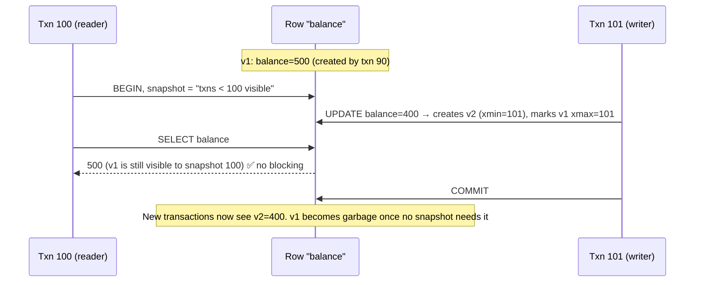

# 082 · MVCC (Multi-Version Concurrency Control)

> ⏱ 9 min · 📈 82% · 🅱️ Part B (advanced) · Phase 10: Deep Internals
>
> `████████████████░░░░` 82% of the whole guide

---

## 📖 Story

Maya notices two mysteries. The orders table grew 40% this month, though the row count barely changed. And an analyst's three-hour report somehow didn't block a single checkout. Both mysteries have the same answer: the database quietly keeps several versions of every row.

## 🎯 One-sentence idea

**MVCC keeps multiple versions of each row, stamped with transaction IDs, so readers see a consistent snapshot without locking. Readers never block writers and writers never block readers, and old versions get cleaned up later.**

## 🧸 Analogy

A **wiki page with history**:

- When you start reading, you're shown the page **as it was at that moment** (a snapshot).
- Meanwhile, others can **save new edits**. They create **new versions** without erasing yours.
- You keep reading your consistent version, undisturbed. No one waits for anyone.
- Eventually, a **janitor** deletes old versions nobody is looking at anymore (vacuum / garbage collection).

## 🖼️ Visual



## 🔬 How it works

- **Each row version** carries metadata: **created-by txn** (`xmin`) and **deleted/replaced-by txn** (`xmax`).
- **A snapshot** = "which transactions were committed when I started." A version is **visible** if its creator committed before my snapshot, and its deleter didn't.
- **UPDATE = insert a new version + mark the old one expired.** **DELETE = mark it expired.**
- **Reads never take row locks.** They just pick the visible version. **Writes** still lock the row they modify against *other writers* (two writers to the same row → one waits or fails, depending on the isolation level).
- **Isolation levels on MVCC:**
  - **Read committed:** a new snapshot **per statement**.
  - **Repeatable read / snapshot isolation:** one snapshot **per transaction**.
  - **Serializable (SSI):** snapshot + tracking of read/write dependencies, aborting transactions that would create anomalies like write skew (lesson 036).
- **Garbage collection:** old versions must be removed once no active snapshot can see them.
  - **Postgres:** dead tuples stay in the table → **VACUUM** (autovacuum) reclaims them. Long-running transactions **block cleanup** → **bloat**.
  - **MySQL InnoDB / Oracle:** old versions go in **undo logs**, and the purge threads clean them up.
- **Transaction ID wraparound** (Postgres): 32-bit txn IDs must be "frozen" by vacuum, or the DB has to stop to protect data. It's a famous operational gotcha.

## 🧩 Worked example

**Why a long transaction hurts:**

```
09:00  An analytics query starts a transaction (snapshot S) and runs for 3 hours
09:00–12:00  The app updates 50M rows → 50M old versions must be kept (S might need them)
→ Tables and indexes bloat, vacuum can't clean up, queries slow down, disk grows 😬
Fix: run long analytics on a replica/warehouse, set statement timeouts, avoid idle-in-transaction sessions
```

**Visibility rule (simplified, Postgres-style):**

```
version visible to snapshot S if:
   xmin committed AND xmin < S.xmax_boundary AND xmin not in S.in_progress
   AND (xmax is empty OR xmax aborted OR xmax not yet committed as of S)
```

**Checking bloat (Postgres):**

```sql
SELECT relname, n_live_tup, n_dead_tup, last_autovacuum
FROM pg_stat_user_tables ORDER BY n_dead_tup DESC LIMIT 5;
```

## ⚖️ Trade-offs

| You gain | You pay |
|---|---|
| Readers never block writers (and vice versa) | Extra storage for old versions |
| Consistent snapshots for reports and backups | Garbage collection work (vacuum/purge) |
| High concurrency for read-heavy workloads | Long transactions cause bloat |
| Simple snapshot isolation | Write skew is still possible below serializable |

## 🌍 Real world

- **PostgreSQL, MySQL InnoDB, Oracle, SQL Server (snapshot mode), CockroachDB, Spanner, MongoDB WiredTiger** all use MVCC variants.
- **Uber's move from Postgres to MySQL (2016)** blog post cited Postgres MVCC write amplification with many indexes as one reason. Postgres has improved since (HOT updates).
- **Spanner** uses MVCC with TrueTime timestamps for lock-free consistent snapshot reads across the globe (lesson 084).

## 📌 Cheat card

> - **MVCC = keep versions + snapshots → no read locks.**
> - Update = new version + expire the old one. Visibility is decided by **txn IDs vs your snapshot**.
> - **Readers don't block writers.** Writers still conflict with writers.
> - **Garbage collection is required:** Postgres **VACUUM**, InnoDB **undo purge**.
> - **Long-running transactions = bloat.** Keep transactions short, and put analytics elsewhere.

## 🧪 Feynman check

Explain the wiki-history analogy, and why someone leaving a very old page open for hours makes the janitor's job impossible.

⚠️ **Common confusion:** "MVCC means no locking at all." Reads are lock-free, but **concurrent writes to the same row still conflict** (one waits or aborts), and explicit `SELECT ... FOR UPDATE` still takes locks.

## ⚡ Quick recall

1. What does an UPDATE do under MVCC?
<details><summary>Answer</summary>

It creates a new row version and marks the previous version as expired (by the updating transaction).
</details>

2. Why do long-running transactions cause bloat?
<details><summary>Answer</summary>

Old row versions can't be cleaned up while any active snapshot might still need to see them.
</details>

3. How does read committed differ from repeatable read in MVCC?
<details><summary>Answer</summary>

Read committed takes a new snapshot for each statement. Repeatable read uses one snapshot for the whole transaction.
</details>

## 🎤 Interview practice

**Q1. "Our Postgres tables keep growing even though row counts are stable. What's happening?"**
<details><summary>Model answer</summary>

- **MVCC bloat:** updates and deletes leave dead tuples, and vacuum isn't keeping up.
- Causes: autovacuum is too conservative for high-churn tables, **long-running or idle-in-transaction sessions** hold back the cleanup horizon, and replication slots or hot-standby feedback retain old versions.
- Fixes: tune autovacuum per table, kill or limit long transactions, check for abandoned replication slots, use `pg_repack` for online compaction, and use fill factor / HOT-friendly schemas.
- **Likely follow-up:** "What's transaction ID wraparound?" → 32-bit XIDs must be frozen by vacuum. If they aren't, Postgres forces a shutdown to prevent data corruption, so monitor `age(datfrozenxid)`.
</details>

**Q2. "How can a consistent backup be taken of a live database without stopping writes?"**
<details><summary>Model answer</summary>

- Use an **MVCC snapshot**: the backup transaction reads a consistent point-in-time view while writes continue creating new versions (e.g., `pg_dump` uses a repeatable-read snapshot).
- Or physical backups (base backup + WAL archiving) for faster restores and PITR (lesson 066).
- **Likely follow-up:** "Any downside?" → a long snapshot holds back vacuum (bloat) while the dump runs, so prefer running it on a replica.
</details>

> 📖 *Next time: Leo asks why the "always consistent" European setup feels so slow.*

---

⬅️ [081 · B-Trees, LSM & WAL](081-btree-lsm-and-wal.md) · 🗺️ [Phase map](README.md) · ➡️ [083 · PACELC](083-pacelc.md)

✅ **Safe stopping point.** Tick lesson 082 in [PROGRESS.md](../../PROGRESS.md).
