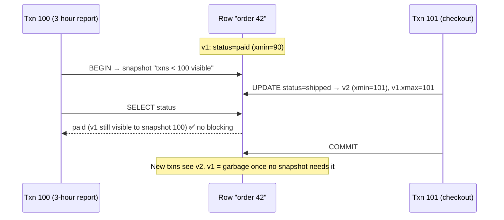

# 082 · MVCC (Multi-Version Concurrency Control)

> ⏱ 9 min · 📈 82% · 🅱️ Part B (advanced) · Phase 10: Deep Internals
>
> `████████████████░░░░` 82% of the whole guide

---

## 📖 Story

Maya brings me two mysteries on the same afternoon, like a detective with two unsolved cases pinned to her wall.

**Mystery one:** the `orders` table has grown **40% in a month**. The row count has barely changed. The disk is filling with something, but `SELECT count(*)` swears nothing new is there. **Ghost rows.**

**Mystery two:** an analyst ran a **three-hour report** over every order in the system. During those three hours, **48,000 checkouts** updated those very same tables. Not one of them blocked. Not one waited. The report saw a perfectly consistent world, while the world kept changing underneath it.

How can a database be frozen in time for one person and moving for everyone else, all at once?

I grinned, because both mysteries have the same answer: **the database quietly keeps several versions of every row.**

## 🎯 One-sentence idea

**MVCC keeps multiple versions of each row stamped with transaction IDs, so every reader sees a consistent snapshot without taking locks, readers never block writers (and vice versa), and old versions are garbage-collected later.**

## 🧸 Analogy

A **wiki page with history**:

- When you start reading, you see the page **as it was at that moment**.
- Others save edits in the meantime, creating **new versions** without erasing yours.
- You keep reading your consistent version, and nobody waits for anybody.
- Eventually a **janitor** deletes old versions that **nobody is looking at anymore**.

## 🖼️ Visual

*Diagram brief:* a single row drawn as a stack of versions, each tagged with "created by txn" and "expired by txn". A long-running reader's snapshot points at the old version while a writer stacks a new one on top.



## 🔬 How it works

- **Versions carry txn stamps:** each row version records `xmin` (created by) and `xmax` (deleted/replaced by). **UPDATE = write a new version + expire the old one**, and DELETE = expire.
- **Snapshots decide visibility:** a snapshot = "which transactions had committed when I started." A version is visible if its creator committed before the snapshot and its expirer hadn't. **Reads take no row locks**, but concurrent **writers to the same row still conflict**.
- **Isolation on MVCC:** **read committed** takes a fresh snapshot per **statement**. **Repeatable read / snapshot isolation** uses one per **transaction**. **Serializable (SSI)** adds dependency tracking and aborts transactions that would cause write skew (lesson 036).
- **Garbage collection is mandatory:** Postgres leaves dead tuples **in the table** until **(auto)VACUUM** reclaims them. InnoDB and Oracle keep old versions in **undo logs**, cleaned by purge threads. **Long-running transactions pin old versions** → **bloat**.
- **Postgres XID wraparound:** 32-bit transaction IDs must be **frozen** by vacuum, or the database must stop to protect data. Monitor `age(datfrozenxid)`.

## 🧩 Worked example

**Mystery one, solved:**

```
A BI tool opened a transaction on Monday and left it "idle in transaction" for 6 days
→ its snapshot pins every version newer than Monday
→ 9M order updates/week leave 9M dead tuples VACUUM is NOT allowed to remove
→ table + indexes bloat 40%, cache hit ratio drops, queries slow
Fix: kill the session, set idle_in_transaction_session_timeout = '5min', run BI on a replica
```

```sql
SELECT relname, n_live_tup, n_dead_tup, last_autovacuum
FROM pg_stat_user_tables ORDER BY n_dead_tup DESC LIMIT 5;
-- orders | 12,400,000 live | 9,100,000 dead | 6 days ago  ← there are the ghosts
```

**Mystery two, solved:** the report's single snapshot (repeatable read) read the old versions, while checkouts created new ones. **Zero locks were taken by the reader.**

**The visibility rule (simplified, Postgres-style):**

```
visible(version, S) =
    xmin committed AND xmin < S.xmax AND xmin ∉ S.in_progress
    AND (xmax empty OR xmax aborted OR xmax not committed as of S)
```

## ⚖️ Trade-offs

| Maya gains | Maya pays |
|---|---|
| Readers never block writers, and vice versa | Extra storage for old versions |
| Consistent snapshots for reports and backups | Garbage-collection work (vacuum/purge) |
| High concurrency under mixed load | Long transactions cause bloat |
| Simple snapshot isolation | Write skew still possible below serializable |

## 🌍 Real world

- **Postgres, InnoDB, Oracle, SQL Server (snapshot mode), CockroachDB, Spanner, and MongoDB WiredTiger** all use MVCC.
- **Uber's 2016 Postgres → MySQL post** cited Postgres MVCC write amplification across many indexes. **HOT updates** have since reduced it.
- **Spanner** pairs MVCC with **TrueTime** timestamps for lock-free, globally consistent snapshot reads (lesson 084).

## 📌 Cheat card

> - **MVCC = versions + snapshots → no read locks.**
> - **Update = new version + expire the old.** Visibility = **txn IDs vs your snapshot**.
> - **Readers don't block writers.** Writers still conflict with writers.
> - **GC is required:** Postgres **VACUUM**, InnoDB **undo purge**.
> - **Long transactions = bloat.** Keep them short, and put analytics on replicas.

## 🧪 Feynman check

Explain the wiki history, and why someone leaving a very old page open for days makes the janitor's job impossible.

⚠️ **Common confusion:** "MVCC means no locking at all." **Reads** are lock-free, but **two writers to the same row still conflict** (one waits or aborts), and `SELECT … FOR UPDATE` explicitly takes row locks.

## ⚡ Quick recall

1. What does an UPDATE do under MVCC?
<details><summary>Reveal Answer</summary>

It creates a new row version and marks the previous version as expired by the updating transaction.
</details>

2. Why do long-running transactions cause bloat?
<details><summary>Reveal Answer</summary>

Old row versions can't be cleaned up while any active snapshot might still need them.
</details>

3. How does read committed differ from repeatable read under MVCC?
<details><summary>Reveal Answer</summary>

Read committed takes a new snapshot per statement. Repeatable read uses one snapshot for the whole transaction.
</details>

## 🎤 Interview practice

**Q. "Our Postgres tables keep growing while row counts stay flat. Diagnose it, fix it, and explain how a consistent backup runs without stopping writes."**
<details><summary>Model answer</summary>

- **Diagnosis: MVCC bloat.** Updates and deletes leave dead tuples faster than vacuum reclaims them.
- **Causes:**
  - Autovacuum is too conservative for high-churn tables.
  - **Long-running or idle-in-transaction sessions** pin the cleanup horizon.
  - **Abandoned replication slots** or `hot_standby_feedback` retain old versions.
- **Fixes:**
  - **Per-table autovacuum tuning** (lower scale factors, more workers, cost limits).
  - `idle_in_transaction_session_timeout` and statement timeouts.
  - **Drop stale replication slots**, and run analytics on replicas or the warehouse.
  - `pg_repack` for online compaction of already-bloated tables.
  - **Fill factor + HOT-friendly** schemas (avoid indexing frequently updated columns).
- **XID wraparound:** watch `age(datfrozenxid)`. Neglected freezing can force an emergency shutdown.
- **Consistent live backups:**
  - **Logical:** `pg_dump` runs inside one repeatable-read **snapshot**, so it sees a frozen instant while writes continue.
  - **Physical:** a base backup + **WAL archiving** gives fast restores and **PITR** (lesson 066).
  - Run long dumps **on a replica**, because a long snapshot on the primary pins vacuum and causes bloat.
- **Likely follow-up:** "Why does InnoDB bloat differently?" → old versions live in **undo logs**, so long transactions grow the undo history (the history list length) instead of the table itself, and purge lag shows up there.
</details>

## 📖 Teaser

> 📖 *The ghost rows are gone, and Maya's next mystery is about time: why does Pantry's "always perfectly consistent" European setup feel sluggish even when nothing at all is broken?*

---

⬅️ [081 · B-Trees, LSM & WAL](081-btree-lsm-and-wal.md) · 🗺️ [Phase map](README.md) · ➡️ [083 · PACELC](083-pacelc.md)

✅ **Safe stopping point.** Tick lesson 082 in [PROGRESS.md](../../PROGRESS.md).
