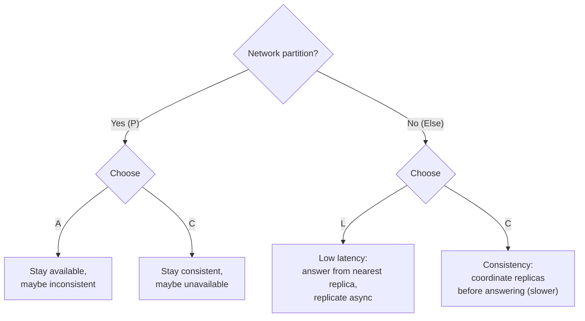

# 083 · PACELC: CAP's Missing Half

> ⏱ 7 min · 📈 83% · 🅱️ Part B (advanced) · Phase 10: Deep Internals
>
> `████████████████░░░░` 83% of the whole guide

---

## 🎯 One-sentence idea

**PACELC extends CAP: if there's a Partition, choose Availability or Consistency. Else (normal operation), choose Latency or Consistency. The second trade-off happens every single day, while partitions are rare.**

## 🧸 Analogy

A **group chat to plan dinner**:

- 🌩️ **Partition (P):** half the group loses signal. Do you **decide without them** (A) or **wait** until everyone's back (C)? That's CAP.
- ☀️ **Else (E), everyone's online:** do you **decide fast** after the first 2 replies (**L**, low latency, but some may disagree later), or **wait for everyone to confirm** (**C**, consistent, but slower)? That's the part CAP forgot, and it happens **every** time you plan dinner.

## 🖼️ Visual



## 🔬 How it works

- **Why it matters:** strong consistency requires **coordination** (quorums or consensus, often across zones or regions), and coordination costs **round trips**, even when nothing is broken.
- **Classifications (typical defaults):**

| System | If Partition | Else | Label |
|---|---|---|---|
| Cassandra, Riak, DynamoDB (default) | A | L | **PA/EL** |
| MongoDB (majority writes and reads) | C | C | **PC/EC** (roughly) |
| Spanner, CockroachDB, etcd, ZooKeeper | C | C | **PC/EC** |
| PNUTS (Yahoo) | C | L | **PC/EL** |
| Most async-replicated SQL + read replicas | (depends on failover) | L | EL for replica reads |

- **Tunable systems** let you choose per request: Cassandra `ONE` (EL) vs `QUORUM` (EC-ish). DynamoDB eventual vs strongly consistent reads.
- **Latency math:** strong consistency across regions ≈ at least one cross-region round trip per write (~60–150 ms). Within a region across AZs ≈ 1–2 ms.

## 🧩 Worked example

**The same read, three ways (3 replicas across US-East, US-West, EU):**

```
EL: read the nearest replica (US-East client) → ~1 ms   (may be slightly stale)
EC (quorum): read 2 of 3 replicas → wait for the 2nd-closest (US-West) → ~70 ms
EC (leader read in the EU): → ~90 ms, always the latest
```

**Picking per feature (PACELC thinking):**

| Feature | Choice | Why |
|---|---|---|
| Product page views | PA/EL | Fast and available, and stale is OK |
| Shopping cart | PA/EL with merges | Always writable |
| Inventory decrement at checkout | PC/EC | Correctness > latency |
| User settings (read-your-writes) | EL + session guarantee | Fast, and the user sees their own change |

## ⚖️ Trade-offs

| Choice | Gain | Cost |
|---|---|---|
| EL | Low, predictable latency | Stale reads, conflicts |
| EC | Always-fresh reads, simpler app logic | Latency ∝ distance to the quorum or leader |
| PA | Uptime during splits | Divergence to reconcile |
| PC | No divergence | Downtime on the minority side |

## 🌍 Real world

- **Daniel Abadi** proposed PACELC (2010/2012) to capture the latency trade-off CAP ignores.
- **Spanner** reduces the EC latency penalty with TrueTime, leader placement, and read-only snapshot reads at local replicas (lesson 084).
- **DynamoDB:** eventually consistent reads cost **half** as much as strongly consistent ones. Latency *and* cost are part of the trade-off.

## 📌 Cheat card

> - **PACELC:** if **P** → **A** or **C**. **E**lse → **L** or **C**.
> - Mnemonic: "**P**artition? **A** or **C**. **E**lse? **L** or **C**."
> - Partitions are rare, but **the latency vs consistency trade-off happens on every request**.
> - Dynamo-style = **PA/EL**. Spanner/etcd = **PC/EC**.
> - Tune **per operation**: fast eventual reads for browsing, strong for money.

## 🧪 Feynman check

Explain the dinner-planning chat, and why "decide after 2 replies or wait for everyone" is a choice you make even when everyone has signal.

⚠️ **Common confusion:** "CAP says we can be CA when there's no partition, so consistency is free." It's not free: **consistency always costs latency** from coordination. That's exactly what PACELC's "ELC" part points out.

## ⚡ Quick recall

1. What does the "ELC" part of PACELC say?
<details><summary>Answer</summary>

Else (no partition), there's a trade-off between latency and consistency.
</details>

2. Classify Cassandra with CL=ONE in PACELC.
<details><summary>Answer</summary>

PA/EL.
</details>

3. Why does strong consistency cost latency even without failures?
<details><summary>Answer</summary>

Replicas must coordinate (quorum or consensus round trips) before answering, and the round trips grow with distance.
</details>

## 🎤 Interview practice

**Q1. "Classify your design using PACELC."**
<details><summary>Model answer</summary>

- Break it down **per data type**: e.g., feed and profile reads are **PA/EL** (nearest replica, async replication, cache), and payments and inventory are **PC/EC** (a consensus or primary DB, synchronous quorum).
- Justify each with the business impact of staleness vs slowness.
- **Likely follow-up:** "Where would users notice the EC latency?" → only on the checkout/payment path, where a +50–100 ms delay is acceptable for correctness.
</details>

**Q2. "Why might a global app choose EL even for data that must eventually be correct?"**
<details><summary>Model answer</summary>

- A cross-continent consensus on every read and write adds ~100+ ms, which hurts UX and conversions.
- Many workflows tolerate brief staleness if they **converge** and **conflicts are resolvable** (CRDTs, merges), or if critical checks are **deferred** (validate at checkout, reconcile later).
- Hybrid: EL for reads, with **home-region writes** (low latency for most users) and async replication elsewhere.
- **Likely follow-up:** "What about a user who travels?" → route their writes to their home region (slightly slower abroad), or migrate their home region.
</details>

---

⬅️ [082 · MVCC](082-mvcc.md) · 🗺️ [Phase map](README.md) · ➡️ [084 · Time & Clocks](084-time-and-clocks.md)

✅ **Safe stopping point.** Tick lesson 083 in [PROGRESS.md](../../PROGRESS.md).
