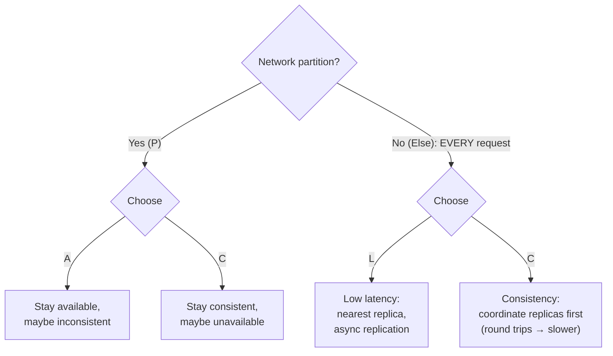

# 083 · PACELC: CAP's Missing Half

> ⏱ 7 min · 📈 83% · 🅱️ Part B (advanced) · Phase 10: Deep Internals
>
> `████████████████░░░░` 83% of the whole guide

---

## 📖 Story

After the CAP lesson, the team took no chances: **"strong consistency everywhere."** Every write waits for a majority of replicas across three regions. Every read checks with the quorum.

It works. Nothing breaks. No partitions, no conflicts, no ghosts.

And yet European customers are quietly unhappy. Every tap on Pantry feels **~100 ms slower** than it used to. The menu loads a heartbeat late. "Add to cart" hangs just long enough to feel sticky. Conversion in Lisbon drops **4%**.

No outage. No cut cable. No red on any dashboard. Just a constant, invisible tax on every request, like walking through water.

Maya asks me: *"If nothing is broken, what are we paying for?"*

I told her what I wish someone had told me earlier: **CAP only tells half the story.**

## 🎯 One-sentence idea

**PACELC extends CAP: if there's a Partition, choose Availability or Consistency, and Else (normal operation) choose Latency or Consistency, and that second trade-off is paid on every single request, while partitions are rare.**

## 🧸 Analogy

A **group chat planning dinner**:

- 🌩️ **Partition:** half the group loses signal. Decide **without them** (A) or **wait** (C)? That's CAP.
- ☀️ **Else, everyone is online:** decide after the **first two replies** (L: fast, someone may disagree later), or **wait for everyone to confirm** (C: right, but slow)? That choice happens **every time you plan dinner**, signal or not.

## 🖼️ Visual

*Diagram brief:* a two-level decision tree. The first branch asks "partition?" and splits into A/C. The "no partition" branch splits into L/C, labelled "paid on every request."



## 🔬 How it works

- **Coordination costs round trips, always:** strong consistency needs quorum or consensus acknowledgements. Within a region across AZs that's ~**1–2 ms**. Across regions it's ~**60–150 ms per round trip**, even on a perfect day.
- **Typical classifications:** **Cassandra / Riak / DynamoDB default = PA/EL** (available under partition, fast otherwise). **Spanner / CockroachDB / etcd / ZooKeeper = PC/EC**. **MongoDB with majority reads and writes ≈ PC/EC**. **Yahoo PNUTS = PC/EL**. **Async replicas = EL** for replica reads.
- **Choose per operation, not per database:** Cassandra `ONE` (EL) vs `QUORUM`/`LOCAL_QUORUM` (EC-ish). DynamoDB eventually consistent (half the price) vs strongly consistent reads. Session guarantees can buy read-your-writes on top of EL.
- **Shrink the EC penalty:** place leaders and quorums **near the users who write**, use **home regions** per user, serve **read-only snapshot reads** from local replicas at a safe timestamp (Spanner), and use **`LOCAL_QUORUM`** with async cross-region replication.
- **Cost is part of it too:** stronger reads often cost more money (capacity units), not just milliseconds.

## 🧩 Worked example

**One read, three ways (replicas in US-East, US-West, EU; a client in Lisbon):**

```
EL:  nearest replica (EU)                        → ~2 ms     (may be a second stale)
EC:  quorum read 2 of 3 → wait for US-East       → ~75 ms
EC:  leader read, leader in US-West              → ~140 ms   (always the latest)
```

**Maya's fix, per feature:**

| Pantry feature | Choice | Why |
|---|---|---|
| Menu and dish pages | **PA/EL** | Fast and available, and seconds of staleness are harmless |
| Cart | **PA/EL** + CRDT merge | Always writable |
| Stock decrement at checkout | **PC/EC** | Correctness > 75 ms |
| User settings | **EL + read-your-writes session** | Fast, and the user still sees their own change |

**Result:** Lisbon p50 back to **~40 ms** for browsing. Only checkout pays the consensus tax, where customers expect a short pause and correctness matters.

## ⚖️ Trade-offs

| Choice | What Maya gains | What she pays |
|---|---|---|
| EL | Low, predictable latency | Stale reads, conflict handling |
| EC | Always-fresh reads, simpler logic | Latency ∝ distance to the quorum or leader |
| PA | Uptime during splits | Divergence to reconcile |
| PC | No divergence | The minority side goes down |

## 🌍 Real world

- **Daniel Abadi** proposed PACELC (2010/2012) to capture the latency trade-off CAP leaves out.
- **Spanner** softens the EC penalty with TrueTime, careful leader placement, and local snapshot reads (lesson 084).
- **DynamoDB** prices eventually consistent reads at **half** the cost of strong ones.

## 📌 Cheat card

> - **PACELC:** if **P** → **A** or **C**. **E**lse → **L** or **C**.
> - "**P**artition? **A** or **C**. **E**lse? **L** or **C**."
> - Partitions are rare, but **the ELC trade-off is paid on every request**.
> - Dynamo-style = **PA/EL**. Spanner/etcd = **PC/EC**.
> - **Tune per operation.**

## 🧪 Feynman check

Explain the dinner-planning chat, and why "decide after two replies or wait for everyone" is a choice you make even when everyone has perfect signal.

⚠️ **Common confusion:** "With no partition we're 'CA', so consistency is free." It isn't free: **consistency always costs coordination latency** (and often money). PACELC exists precisely to name that everyday price.

## ⚡ Quick recall

1. What does the "ELC" part of PACELC say?
<details><summary>Reveal Answer</summary>

Else (no partition), there's a trade-off between latency and consistency.
</details>

2. Classify Cassandra at CL=ONE in PACELC.
<details><summary>Reveal Answer</summary>

PA/EL.
</details>

3. Why does strong consistency cost latency even without failures?
<details><summary>Reveal Answer</summary>

Replicas must coordinate (quorum or consensus round trips) before answering, and those round trips grow with distance.
</details>

## 🎤 Interview practice

**Q. "Classify your design with PACELC, and explain why a global app might choose EL even for data that must eventually be correct."**
<details><summary>Model answer</summary>

- **Classify per data type, not per system:**
  - Browsing, feeds, profiles: **PA/EL**. Nearest replica, async replication, caches. Staleness costs little, and slowness costs conversions.
  - Carts and likes: **PA/EL with mergeable types** (CRDTs).
  - Payments, inventory, uniqueness: **PC/EC**. A consensus or primary DB with synchronous quorums. A +50–100 ms delay on checkout is acceptable for correctness.
- **Why EL for eventually-correct data:**
  - Cross-continent consensus on every read and write adds **~100+ ms**, measurably hurting UX and revenue.
  - Many workflows tolerate brief staleness as long as data **converges** and **conflicts resolve** (CRDTs, merges), with critical checks **deferred** to the moment that matters (validate stock at checkout, reconcile later).
  - **Home-region writes** give most users local-latency writes, with async replication elsewhere.
  - **Session guarantees** (read-your-writes, monotonic reads) hide most anomalies from the user.
- **Likely follow-up:** "A user travels from Lisbon to New York?" → keep routing their writes to their home region (slightly slower abroad), or migrate the home region after a sustained move.
</details>

## 📖 Teaser

> 📖 *The latency tax is under control, and then two data centres disagree about which menu edit came first, because one server's clock has been quietly running 200 milliseconds fast.*

---

⬅️ [082 · MVCC](082-mvcc.md) · 🗺️ [Phase map](README.md) · ➡️ [084 · Time & Clocks](084-time-and-clocks.md)

✅ **Safe stopping point.** Tick lesson 083 in [PROGRESS.md](../../PROGRESS.md).
