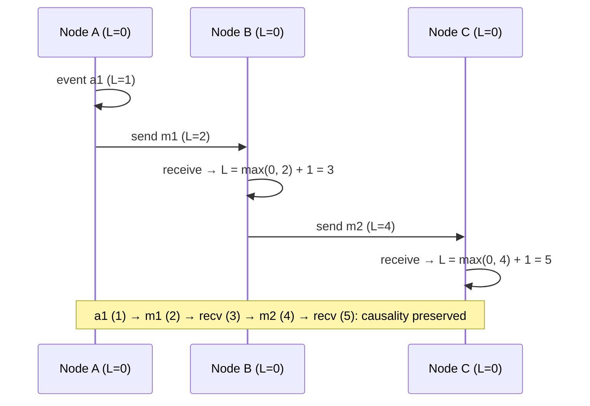

# 084 · Time & Clocks in Distributed Systems

> ⏱ 10 min · 📈 84% · 🅱️ Part B (advanced) · Phase 10: Deep Internals
>
> `████████████████░░░░` 84% of the whole guide

---

## 🎯 One-sentence idea

**Machine clocks drift and jump, so you can't reliably order events across machines by wall-clock time. Logical clocks (Lamport, vector) capture "happened-before" order, and systems like Spanner use bounded-uncertainty clocks (TrueTime) to get global ordering safely.**

## 🧸 Analogy

**Pen pals in different countries** whose watches are all slightly wrong:

- If Alice's letter says "sent 3:00" and Bob's says "sent 2:59", you **can't be sure** Bob's was really first. Their watches might be minutes apart.
- **Lamport clock:** each letter carries a **counter**. When you receive a letter numbered 7, your next letter is numbered at least 8. Now "reply comes after question" is always true in the numbers.
- **Vector clock:** each letter carries **everyone's counters** `[Alice:3, Bob:5]`, so you can even tell when two letters were written **without knowing about each other** (concurrently).
- **TrueTime:** everyone's watch says "it's **between** 2:59:58 and 3:00:02." Before declaring an event done, you **wait out the uncertainty**, so the order is guaranteed.

## 🖼️ Visual



## 🔬 How it works

- **Physical clocks:** quartz drifts (~10–100 ppm → up to seconds per day). **NTP** syncs to within ~ms on a LAN, and tens of ms over the internet. Clocks can **jump backwards** after a sync. **Leap seconds** cause chaos.
  - ⚠️ So never rely on timestamps alone for **ordering across machines** (e.g., last-write-wins can discard the truly newer write, lesson 048).
  - Use **monotonic clocks** for measuring durations and timeouts on one machine (they never go backwards).
- **Lamport clocks** (a scalar counter):
  - Increment on each local event. Send it with messages. On receive: `L = max(local, received) + 1`.
  - Guarantees: if A → B (happened-before), then L(A) < L(B). **But** L(A) < L(B) does **not** imply A → B (it can't detect concurrency).
  - A total order via (L, node_id) is useful for tie-breaking.
- **Vector clocks** (one counter per node):
  - Compare element-wise: V(A) ≤ V(B) for all entries → A happened before B. Neither ≤ the other → **concurrent** (a conflict!).
  - Used for **conflict detection** in Dynamo/Riak (siblings). The size grows with the number of nodes (version vectors per replica limit this).
- **Hybrid logical clocks (HLC):** physical time + a logical counter. They stay close to wall time **and** preserve causality (CockroachDB, YugabyteDB, MongoDB).
- **TrueTime (Google Spanner):** GPS + atomic clocks give `now() = [earliest, latest]` with a small uncertainty ε (a few ms). A commit **waits out ε** ("commit wait") before becoming visible, which guarantees that commit timestamps respect real-time order → **external consistency** (linearizable transactions globally).

## 🧩 Worked example

**Vector clocks detecting a conflict (a cart on 2 replicas):**

```
Start:             cart = {}                     V = [R1:0, R2:0]
User adds book at R1 → {book}                    V = [R1:1, R2:0]
Replicated to R2.
Phone (via R2) adds pen → {book, pen}            V = [R1:1, R2:1]
Laptop (via R1, stale) removes book → {}         V = [R1:2, R2:0]

Compare [1,1] vs [2,0]: neither ≤ the other → CONCURRENT → keep both siblings → the app merges them
LWW with timestamps would silently drop one of the edits.
```

**Why you shouldn't compare wall clocks across servers:**

```
Server A clock is 150 ms fast. Server B is accurate.
t_real=0 ms:   A writes x=1, stamped 150
t_real=100 ms: B writes x=2, stamped 100   ← truly later, but a smaller timestamp
LWW keeps x=1 ❌ (the newer write is lost)
```

## ⚖️ Trade-offs

| Clock | Captures | Cost | Used for |
|---|---|---|---|
| Wall clock (NTP) | Approximate real time | Skew, jumps | Logs, TTLs, human display |
| Monotonic clock | Durations on one host | Not comparable across hosts | Timeouts, latency measurement |
| Lamport | Causal order (one direction) | One integer | Total ordering, tie-breaks |
| Vector clock | Causality + concurrency detection | O(nodes) metadata | Conflict detection |
| HLC | Causality + near real time | Small | Distributed SQL timestamps |
| TrueTime | Bounded real time | Special hardware + commit wait | Global external consistency |

## 🌍 Real world

- **Leslie Lamport's 1978 paper** "Time, Clocks, and the Ordering of Events" is one of the most cited in computer science.
- **Spanner** (TrueTime) keeps uncertainty to a few ms. **AWS Time Sync / precision clocks** now offer microsecond-level accuracy with bounded error.
- **Leap-second bugs** have crashed systems (2012: Linux kernel issues at several big sites). Many now "smear" the leap second over hours.

## 📌 Cheat card

> - **Wall clocks drift and jump** → don't order cross-machine events by timestamp alone.
> - **Durations → a monotonic clock.**
> - **Lamport:** `L = max(mine, theirs) + 1`. A→B ⇒ L(A) < L(B).
> - **Vector clocks:** detect **concurrent** updates (conflicts).
> - **HLC** = physical + logical. **TrueTime** = an uncertainty interval + commit wait → global order.

## 🧪 Feynman check

Explain the pen pals with wrong watches, and how numbering letters (Lamport) guarantees a reply is always "after" the question, even when the watches disagree.

⚠️ **Common confusion:** "NTP keeps clocks accurate enough for ordering." NTP errors of milliseconds (or seconds during problems) are plenty to reorder concurrent writes. Correctness can't depend on clock sync unless the uncertainty is **bounded and accounted for** (like TrueTime's commit wait).

## ⚡ Quick recall

1. What's the Lamport clock update rule on receiving a message?
<details><summary>Answer</summary>

Set local = max(local, received) + 1.
</details>

2. What can vector clocks detect that Lamport clocks can't?
<details><summary>Answer</summary>

Whether two events are concurrent (neither happened before the other).
</details>

3. What is Spanner's "commit wait"?
<details><summary>Answer</summary>

Waiting out the clock uncertainty interval before making a commit visible, so timestamp order matches real-time order.
</details>

## 🎤 Interview practice

**Q1. "Two replicas accept writes to the same key. How do you decide which is newer?"**
<details><summary>Model answer</summary>

- **Timestamps (LWW):** simple, but clock skew can lose the newer write. It's only OK where losing a concurrent update is acceptable.
- **Version vectors:** detect true ordering vs concurrency. For concurrent writes, keep siblings and merge them (app logic or CRDTs).
- **Avoid it entirely:** a single leader per key (a home region), or consensus.
- **Likely follow-up:** "What about HLC?" → better than wall-clock LWW (preserves causality), but truly concurrent writes still need a resolution policy.
</details>

**Q2. "Why can't you use `System.currentTimeMillis()` to measure request timeouts?"**
<details><summary>Model answer</summary>

- The wall clock can **jump** (NTP corrections, manual changes, leap seconds), causing negative durations or spurious timeouts.
- Use a **monotonic clock** (`System.nanoTime()`, `time.monotonic()`, `CLOCK_MONOTONIC`), which only moves forward.
- **Likely follow-up:** "And for leases across machines?" → leases depend on bounded clock drift. Use conservative lease durations, and **fencing tokens** for safety (lesson 086).
</details>

---

⬅️ [083 · PACELC](083-pacelc.md) · 🗺️ [Phase map](README.md) · ➡️ [085 · Consensus (Raft)](085-consensus-raft.md)

✅ **Safe stopping point.** Tick lesson 084 in [PROGRESS.md](../../PROGRESS.md).
