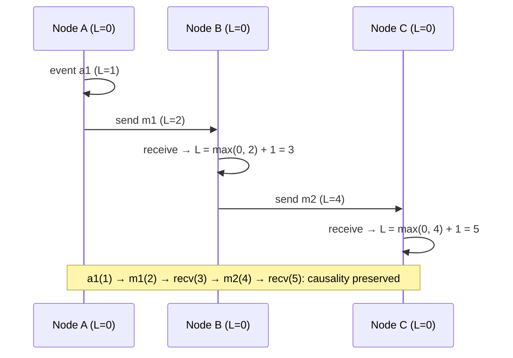

# 084 · Time & Clocks in Distributed Systems

> ⏱ 10 min · 📈 84% · 🅱️ Part B (advanced) · Phase 10: Deep Internals
>
> `████████████████░░░░` 84% of the whole guide

---

## 📖 Story

Two edits to the same dish, seconds apart, in two data centres:

- **EU server:** a cook marks her curry **"Sold out"**, stamped **19:00:00.120**.
- **US server:** a colleague restocks it as **"Available"**, stamped **19:00:00.080**.

Last-write-wins keeps the **later timestamp**, so the curry stays **sold out**. Customers can't order it all evening.

Except the restock happened **after** the sold-out edit. In real time, "Available" was the newer truth. The EU server's clock had been drifting **200 ms fast** for weeks, its NTP sync quietly broken. Its timestamps were small lies, and last-write-wins believed every one of them.

When I learned this lesson myself, it rearranged how I think about computers.

In distributed systems, even **time** can't be trusted.

## 🎯 One-sentence idea

**Machine clocks drift and jump, so you can't reliably order events across machines by wall-clock time: logical clocks (Lamport, vector, hybrid) capture "happened-before," and systems like Spanner use bounded-uncertainty clocks (TrueTime) to get safe global ordering.**

## 🧸 Analogy

**Pen pals whose watches are all slightly wrong**:

- "Sent 3:00" vs "sent 2:59"? You **can't be sure** which came first.
- **Lamport:** number every letter. Receive #7, and your next letter is at least #8, so a reply is always numbered after its question.
- **Vector clock:** every letter carries **everyone's** counters, so you can spot letters written **without knowing about each other**.
- **TrueTime:** each watch says "it's **between** 2:59:58 and 3:00:02." **Wait out the uncertainty** before declaring anything done.

## 🖼️ Visual

*Diagram brief:* three nodes exchanging messages, each carrying a counter. Every receive jumps to max+1, so the numbers always increase along every arrow of cause and effect.



## 🔬 How it works

- **Physical clocks lie:** quartz drifts **10–100 ppm** (up to seconds a day). **NTP** gets you ~ms on a LAN and tens of ms over the internet, clocks can **jump backwards** after a sync, and **leap seconds** cause chaos. Never order cross-machine events by wall time alone, and use **monotonic clocks** for durations and timeouts.
- **Lamport clocks:** increment on every event, and on receive `L = max(local, received) + 1`. If A → B then L(A) < L(B), but **not the reverse**, so they can't detect concurrency. `(L, node_id)` gives a total order for tie-breaks.
- **Vector clocks:** one counter per node. If V(A) ≤ V(B) element-wise, A happened before B. If **neither ≤ the other, they're concurrent**: a real conflict. Used by Dynamo/Riak to keep siblings. The metadata grows with the number of nodes.
- **Hybrid logical clocks (HLC):** physical time + a logical counter. They stay close to wall time **and** preserve causality. CockroachDB, YugabyteDB, and MongoDB use them for transaction timestamps.
- **TrueTime (Spanner):** GPS + atomic clocks give `now() = [earliest, latest]` with ε ≈ a few ms. Each commit **waits out ε** ("commit wait") before becoming visible, so timestamp order matches real-time order → **external consistency** worldwide.

## 🧩 Worked example

**The curry, replayed with vector clocks:**

```
Start:                       status=available   V = [EU:3, US:5]
EU marks sold out            status=sold_out    V = [EU:4, US:5]   (not yet seen by US)
US restocks (stale view)     status=available   V = [EU:3, US:6]
Compare [4,5] vs [3,6]: neither ≤ the other → CONCURRENT → conflict surfaced, not silently decided
Policy: stock edits go to the dish's HOME region (single writer) → no concurrency at all
```

**Why wall clocks betray LWW:**

```
EU clock +200 ms fast.  Real time t=0: EU writes "sold_out" stamped 120
Real time t=60 ms: US writes "available" stamped 80   ← truly later, smaller stamp
LWW keeps "sold_out" ❌   HLC/vector clocks would preserve the real causal order or flag the conflict
```

**Measuring a timeout correctly:**

```python
start = time.monotonic()          # never jumps backwards
...
if time.monotonic() - start > 2.0: raise Timeout()
# NOT time.time(): an NTP correction mid-request can make durations negative or huge
```

## ⚖️ Trade-offs

| Clock | Captures | Cost | Used for |
|---|---|---|---|
| Wall clock (NTP) | Approximate real time | Skew, jumps | Logs, TTLs, display |
| Monotonic | Durations on one host | Not comparable across hosts | Timeouts, latency |
| Lamport | Causal order (one direction) | One integer | Total order, tie-breaks |
| Vector | Causality + concurrency detection | O(nodes) metadata | Conflict detection |
| HLC | Causality + near real time | Small | Distributed SQL timestamps |
| TrueTime | Bounded real time | Special hardware + commit wait | Global external consistency |

## 🌍 Real world

- **Lamport's 1978 paper**, "Time, Clocks, and the Ordering of Events in a Distributed System", is among the most cited in computing.
- **Spanner's TrueTime** keeps uncertainty to a few ms. **AWS Time Sync** and precision clocks now offer microsecond-level bounded error.
- The **2012 leap second** triggered Linux kernel bugs at major sites, and many providers now **smear** leap seconds over hours.

## 📌 Cheat card

> - **Wall clocks drift and jump** → never order cross-machine events by timestamp alone.
> - **Durations → monotonic clock.**
> - **Lamport:** `max(mine, theirs) + 1`. A→B ⇒ L(A) < L(B).
> - **Vector clocks** detect **concurrency**.
> - **HLC** = physical + logical. **TrueTime** = an uncertainty interval + commit wait.

## 🧪 Feynman check

Explain the pen pals with wrong watches, and how numbering the letters guarantees a reply is always "after" its question, whatever the watches say.

⚠️ **Common confusion:** "NTP keeps clocks accurate enough for ordering." NTP error of a few ms, and **seconds** when sync silently breaks, is more than enough to reorder concurrent writes. Correctness may depend on clocks **only** when the uncertainty is **bounded and explicitly waited out** (TrueTime's commit wait).

## ⚡ Quick recall

1. What's the Lamport clock update rule on receiving a message?
<details><summary>Reveal Answer</summary>

Set local = max(local, received) + 1.
</details>

2. What can vector clocks detect that Lamport clocks can't?
<details><summary>Reveal Answer</summary>

Whether two events are concurrent (neither happened before the other).
</details>

3. What is Spanner's "commit wait"?
<details><summary>Reveal Answer</summary>

Waiting out the clock-uncertainty interval before making a commit visible, so timestamp order matches real-time order.
</details>

## 🎤 Interview practice

**Q. "Two replicas accept writes to the same key. How do you decide which is newer, and why shouldn't leases rely on wall clocks?"**
<details><summary>Model answer</summary>

- **Option 1: LWW by timestamp.** It's simple, but **clock skew can drop the genuinely newer write**. Acceptable only where losing a concurrent update is harmless (last-known sensor value).
- **Option 2: version vectors.** Distinguish "happened-before" from **concurrent**. Concurrent writes become **siblings**, merged by app logic or **CRDTs**.
- **Option 3: avoid concurrency.** A **single writer per key** (a home region or owning shard), or **consensus** (Raft/Paxos), so there's one ordered log.
- **HLC** improves on wall-clock LWW by preserving causality, but truly concurrent writes **still** need a resolution policy.
- **Leases and wall clocks:**
  - A lease assumes "my 10 s is your 10 s". A **GC pause, VM freeze, or clock jump** can let the old holder keep acting after its lease expired, while a new holder starts.
  - Measure lease durations with **monotonic clocks**, keep **conservative margins**, and, crucially, make storage reject stale holders with **fencing tokens** (lesson 086).
- **Likely follow-up:** "How does Spanner avoid all this?" → TrueTime bounds the uncertainty, and commit wait makes timestamp order equal real-time order, at the cost of a few ms per commit and special hardware.
</details>

## 📖 Teaser

> 📖 *If machines can't even agree on the time, how can a cluster of them ever agree on anything at all? Maya is about to meet the algorithm that makes it possible.*

---

⬅️ [083 · PACELC](083-pacelc.md) · 🗺️ [Phase map](README.md) · ➡️ [085 · Consensus (Raft)](085-consensus-raft.md)

✅ **Safe stopping point.** Tick lesson 084 in [PROGRESS.md](../../PROGRESS.md).
