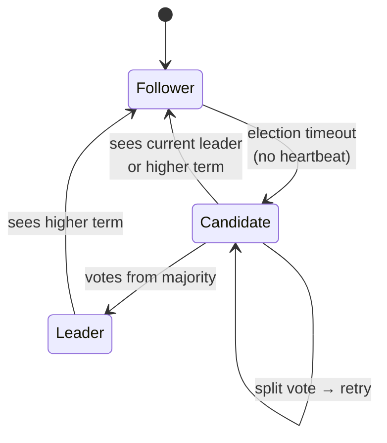
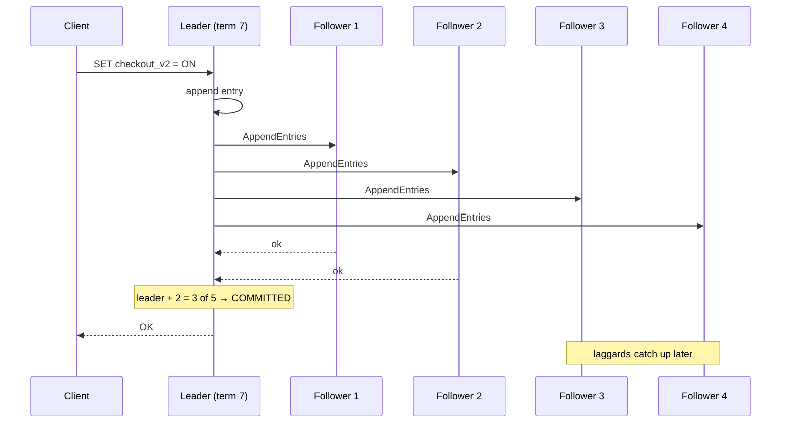

# 085 · Consensus with Raft

> ⏱ 11 min · 📈 85% · 🅱️ Part B (advanced) · Phase 10: Deep Internals
>
> `█████████████████░░░` 85% of the whole guide

---

## 📖 Story

Pantry's **configuration service** holds the truth that 800 servers live by: feature flags, payout schedules, kill switches. It must **never disagree with itself**.

Maya imagines the nightmare in vivid detail. Server A believes the "new checkout" flag is **ON**. Server B, which missed one update during a network blip, believes it's **OFF**. Half the customers see one checkout and half see another, and the payment data gets written in two incompatible formats.

Now multiply that by machines crashing mid-update, messages arriving late, out of order, or never, and clocks that can't be trusted (lesson 084).

*How can a handful of unreliable computers agree on one single, ordered truth, and keep agreeing while some of them are dying?*

I'll show you what I showed Maya. It's one of the most beautiful algorithms in computing.

## 🎯 One-sentence idea

**Consensus lets a group of servers agree on one ordered log of decisions despite crashes and delays, and Raft does it by electing a single leader per term that replicates log entries and commits each one once a majority has stored it.**

## 🧸 Analogy

A **five-person committee** keeping **official minutes**:

- They **elect a chair** for a **term**. Only the chair proposes new minutes.
- An item becomes **official** once **at least 3 of 5** have written it down (a majority).
- If the chair goes quiet too long, someone announces "**I'm standing for term 8!**" and collects votes.
- Any two majorities **share at least one member**, so a new chair always inherits every official item. **Nothing committed is ever lost**, and there are **never two chairs** in one term.

## 🖼️ Visual

*Diagram brief:* a three-state machine (follower → candidate → leader) above a replication timeline where the leader's entry glows "committed" the moment the third of five nodes stores it, while two slow followers lag behind.





## 🔬 How it works

- **Replicated state machine:** if every node applies the **same commands in the same order**, every node reaches the same state. Consensus agrees on that **order** (the log).
- **Terms and elections:** terms are increasing epochs with **at most one leader each**. A follower that misses heartbeats for a **randomized timeout (~150–300 ms)** becomes a candidate, bumps the term, and requests votes. Nodes vote **once per term**, and **only for candidates whose log is at least as up-to-date**, so a winner already holds every committed entry.
- **Log replication:** the leader appends, sends `AppendEntries` (with the previous index and term for consistency checks), and **commits once a majority stores the entry**, then applies it and answers the client. Divergent follower suffixes are **overwritten** by the leader.
- **Safety and liveness:** committed entries survive while a **majority lives** (**2f + 1 nodes tolerate f failures**). A **minority partition cannot commit**, so Raft is **CP**. Linearizable reads need **ReadIndex** (confirm leadership with a quorum) or **leader leases** (which assume bounded drift).
- **Operations:** **snapshots** compact the log, and membership changes go **one node at a time** (or joint consensus). Write latency ≈ the leader's RTT to the **fastest majority** + an fsync. Scale out with **many Raft groups** (one per data range).

## 🧩 Worked example

**The chair vanishes (5 nodes, A leads term 3):**

```
1. A replicates #10 to B and C (with A = 3 of 5) → COMMITTED ✅; D and E don't have it yet
2. A crashes 💥
3. D times out first → candidate for term 4 → B and C refuse (D's log ends at #9 < #10) → D loses
4. B times out → candidate for term 4 → C, D, E vote (B's log is the most up to date) → LEADER ✅
5. B replicates #10 to D and E → the committed flag change is never lost
6. A recovers → sees term 4 > 3 → steps down to follower → catches up
```

| Nodes | Majority | Tolerated failures |
|---|---|---|
| 3 | 2 | 1 |
| 5 | 3 | 2 |
| 7 | 4 | 3 (rarely worth the extra write latency) |

**Maya's config service:** a 5-node etcd cluster across 3 AZs (2-2-1). It survives any single AZ outage, and every server reads flags at the **same committed revision**, so the half-ON/half-OFF nightmare is now impossible.

## ⚖️ Trade-offs

| Maya gains | Maya pays |
|---|---|
| A linearizable, totally ordered log | Majority round trips on every write |
| Automatic failover with no split brain | Unavailable without a majority |
| A simple single-leader model | The leader is a throughput bottleneck (so shard into many groups) |
| Proven safety | Tricky operational details (snapshots, membership changes) |

## 🌍 Real world

- **etcd** (Kubernetes' brain), **Consul**, **CockroachDB** and **TiKV** (thousands of Raft groups), **Kafka KRaft**, and MongoDB's Raft-like replication.
- **Paxos** is the older family behind **Chubby** and **Spanner**. **ZooKeeper** uses **ZAB**.
- **Raft** (Ongaro & Ousterhout, 2014) was explicitly designed to be **understandable**. See raft.github.io for a live visualization.

## 📌 Cheat card

> - **Consensus = agree on one ordered log → identical state machines.**
> - Raft: **one leader per term**, **randomized timeouts**, **commit on majority**.
> - Votes only go to **up-to-date logs**, so committed entries survive.
> - **2f + 1 tolerate f.** Use 3 or 5.
> - The minority **can't commit** (CP). Scale with **many Raft groups**.

## 🧪 Feynman check

Explain the committee minutes, and why "3 of 5 wrote it down" makes losing an official decision impossible, even if the chair walks out mid-meeting.

⚠️ **Common confusion:** "Consensus makes the system always available." It makes it **consistent**, and available only while a **majority** is alive and connected. Lose three of five nodes, or land on the minority side of a 2 | 3 split, and writes **stop**, by design.

## ⚡ Quick recall

1. When is a Raft log entry committed?
<details><summary>Reveal Answer</summary>

When the leader has replicated it to a majority of the nodes (including itself).
</details>

2. Why are election timeouts randomized?
<details><summary>Reveal Answer</summary>

So several followers rarely become candidates at the same moment and split the vote.
</details>

3. How many failures can a 5-node Raft cluster tolerate?
<details><summary>Reveal Answer</summary>

Two (a majority of three must remain).
</details>

## 🎤 Interview practice

**Q. "Explain how Raft prevents two leaders from committing conflicting entries, and why CockroachDB runs thousands of Raft groups instead of one."**
<details><summary>Model answer</summary>

- **One leader per term:** each node votes **at most once per term**, and winning needs a **majority**, so two candidates can't both win the same term.
- **Commit needs a majority**, and **any two majorities intersect**, so every future electorate contains a node that holds each committed entry.
- **The vote restriction:** nodes only vote for candidates whose log is **at least as up-to-date**, so the winner **already has** every committed entry and can't overwrite it.
- **Stale leaders are neutralized:** a deposed leader from an older term can't commit, because followers reject its lower term, and it steps down on seeing the higher term.
- **Stale reads:** a deposed leader could still answer reads, so linearizable reads use **ReadIndex** (a quorum confirmation) or **leader leases** with conservative timing.
- **Why thousands of groups:**
  - One group funnels **every write through one leader**, a CPU, network, and disk bottleneck, and one giant log.
  - Splitting data into **ranges**, each its own 3–5-replica Raft group, **spreads the leaders and load** across the cluster.
  - The costs: **cross-range transactions** need an atomic-commit protocol on top (parallel commits / 2PC-style), heartbeat overhead (coalesced), and complex rebalancing and leader placement.
- **Likely follow-up:** "Why not 7 nodes for safety?" → each write waits for 4 ACKs, so latency rises for a third tolerated failure that's rarely needed. 5 is the common sweet spot.
</details>

## 📖 Teaser

> 📖 *The config service never disagrees with itself now, but one night a payout leader freezes for twenty seconds, wakes up still certain it's in charge, and starts paying cooks a second time.*

---

⬅️ [084 · Time & Clocks](084-time-and-clocks.md) · 🗺️ [Phase map](README.md) · ➡️ [✅ Checkpoint 85%](checkpoint-85.md)

✅ **Safe stopping point.** Tick lesson 085 in [PROGRESS.md](../../PROGRESS.md), then do the checkpoint!
