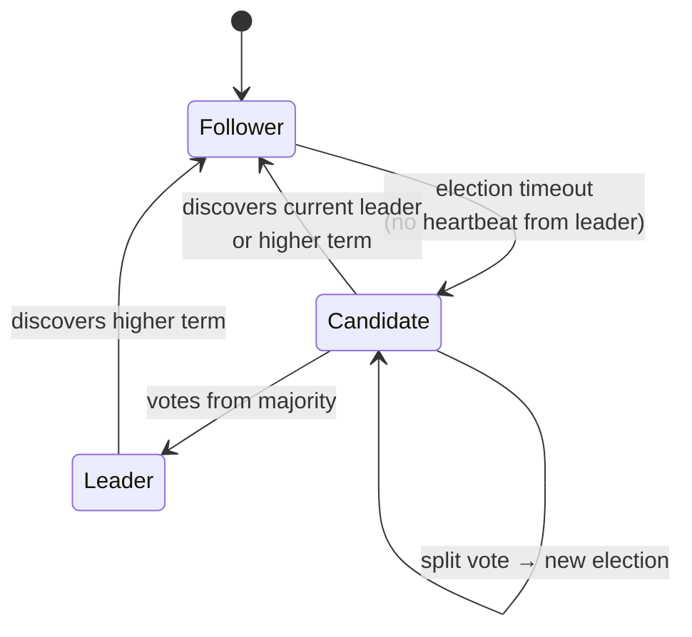
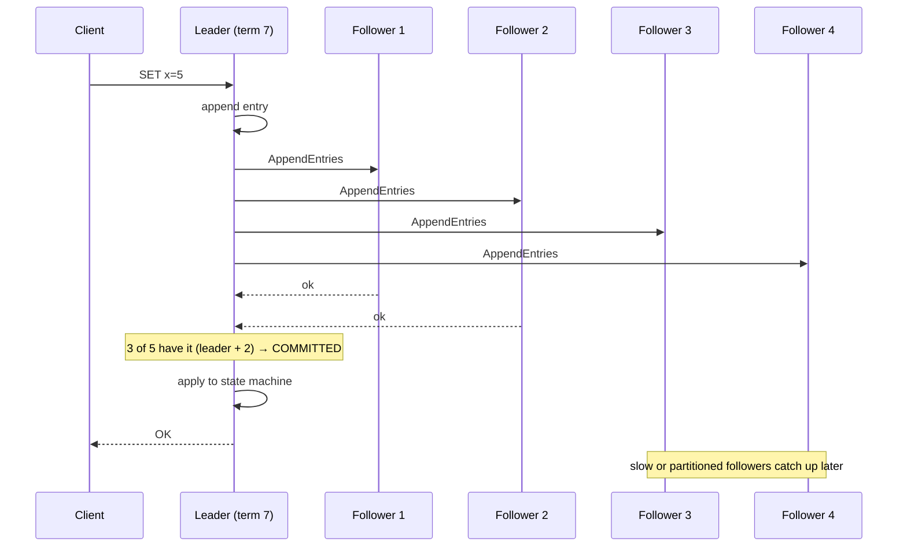

# 085 · Consensus with Raft

> ⏱ 11 min · 📈 85% · 🅱️ Part B (advanced) · Phase 10: Deep Internals
>
> `█████████████████░░░` 85% of the whole guide

---

## 📖 Story

Pantry's configuration service must never disagree with itself. Every server must see the same feature flags, in the same order, even while machines crash. Maya asked me how that's even possible. I'll show you the same thing I showed her: how a small group of computers can agree on a single truth, reliably.

## 🎯 One-sentence idea

**Consensus lets a group of servers agree on a single, ordered log of decisions, even if some crash or messages are delayed. Raft does it by electing one leader per term, which replicates log entries and commits each once a majority has stored it.**

## 🧸 Analogy

A **club committee with 5 members** keeping the **official minutes**:

- They **elect a chairperson** (leader) for a **term**. Only the chair proposes new minutes.
- The chair reads out each new item. When **at least 3 of 5** (a majority) have written it down, it's **official** (committed).
- If the chair goes silent for too long, someone says "**I nominate myself for term 8!**" and asks for votes. A majority vote = the new chair.
- Because any two majorities **overlap in at least one member**, the new chair always learns about every official item. **Nothing committed is ever lost**, and there can't be two chairs in the same term.

## 🖼️ Visual





## 🔬 How it works

- **Replicated state machine:** if every node applies the **same commands in the same order**, they all end up in the same state. Consensus agrees on that **order** (the log).
- **Roles:** **leader** (handles all client writes), **followers** (replicate), **candidates** (during elections).
- **Terms:** monotonically increasing election epochs. Each term has at most one leader. Stale leaders discover the higher term and step down.
- **Leader election:**
  - Followers expect **heartbeats**. On a **randomized election timeout** (e.g., 150–300 ms), a follower becomes a candidate, increments the term, and requests votes.
  - Each node votes for **at most one** candidate per term, and **only if the candidate's log is at least as up-to-date** as its own (so the new leader has all committed entries).
  - Randomized timeouts make split votes rare.
- **Log replication:**
  - The leader appends an entry and sends `AppendEntries` to the followers (with the previous index and term for consistency checks).
  - **Committed** once stored on a **majority**. The leader then applies it and replies to the client.
  - Followers with conflicting or missing entries are **repaired** by the leader (it overwrites uncommitted divergent suffixes).
- **Safety:** committed entries are never lost or reordered, as long as a **majority survives**. 5 nodes tolerate 2 failures, and 3 tolerate 1.
- **Liveness:** progress needs a majority that can communicate. The **minority side of a partition cannot commit** (it chooses C in CAP).
- **Reads:** for linearizable reads, the leader must confirm it's still the leader (a quorum heartbeat or **ReadIndex**), or use **leases** (which assume bounded clock drift).
- **Extras:** log compaction via **snapshots**, and membership changes via **joint consensus** / one-at-a-time changes.

## 🧩 Worked example

**Failure scenario (5 nodes: A is the leader in term 3):**

```
1. A replicates entry #10 to B and C (with A = 3 of 5) → committed ✅. D and E didn't get it yet.
2. A crashes 💥
3. D times out first → candidate for term 4 → asks for votes
   B and C refuse: D's log (#9) is behind theirs (#10) → D can't win
4. B times out → candidate for term 4 → votes from C, D, E (B's log is the most up to date) → leader ✅
5. B replicates #10 to D and E → nobody loses the committed entry
6. A recovers → sees term 4 > 3 → becomes a follower, catches up
```

**Cluster sizing:**

| Nodes | Majority | Tolerated failures |
|---|---|---|
| 3 | 2 | 1 |
| 5 | 3 | 2 |
| 7 | 4 | 3 (rarely worth the write latency) |

**Write latency ≈ the leader's round trip to the fastest majority**, plus an fsync. Across regions, that's ~cross-region RTT per commit.

## ⚖️ Trade-offs

| You gain | You pay |
|---|---|
| Strong consistency (linearizable log) | Every write needs majority round trips (latency) |
| Automatic failover with no split brain | Unavailable if a majority is lost |
| A simple mental model (a single leader) | Leader is a throughput bottleneck (shard into many Raft groups) |
| Proven correctness | Tricky details (snapshots, membership changes) |

## 🌍 Real world

- **etcd** (Kubernetes' brain), **Consul**, **CockroachDB** and **TiKV** (thousands of Raft groups, one per data range), **Kafka KRaft** (replacing ZooKeeper), and **MongoDB** (a Raft-like protocol).
- **Paxos** (Lamport) is the older family: Google Chubby and Spanner use Paxos variants. **ZooKeeper** uses **ZAB**.
- Raft was designed (Ongaro & Ousterhout, 2014) to be **understandable**. There's an excellent visualization at raft.github.io.

## 📌 Cheat card

> - **Consensus = agree on one ordered log → identical state machines.**
> - Raft: **leader per term**, **randomized election timeouts**, **commit on majority**.
> - Votes only go to candidates with an **up-to-date log**, so committed entries survive.
> - **2f + 1 nodes tolerate f failures.** Use 3 or 5.
> - The minority side **cannot commit** (CP). Scale by running **many Raft groups** (shards).

## 🧪 Feynman check

Explain the committee-minutes analogy, and why "at least 3 of 5 wrote it down" makes it impossible to lose an official decision when the chair suddenly leaves.

⚠️ **Common confusion:** "Consensus makes the system always available." It's **consistent**, and available only while a **majority** is up and connected. Lose 3 of 5 nodes, or get partitioned into 2 | 3 on the wrong side, and writes stop.

## ⚡ Quick recall

1. When is a Raft log entry committed?
<details><summary>Answer</summary>

When the leader has replicated it to a majority of the nodes (including itself).
</details>

2. Why are election timeouts randomized?
<details><summary>Answer</summary>

To make it unlikely that several followers become candidates at the same time and split the vote.
</details>

3. How many failures can a 5-node Raft cluster tolerate?
<details><summary>Answer</summary>

2 (a majority of 3 must remain).
</details>

## 🎤 Interview practice

**Q1. "Explain how Raft prevents two leaders from committing conflicting entries."**
<details><summary>Model answer</summary>

- There's at most **one leader per term** (each node votes once per term, and a leader needs a majority).
- Committing needs a **majority**, and any two majorities overlap, so a new leader's electorate includes a node holding every committed entry.
- The **vote restriction** (only up-to-date logs win) guarantees the new leader already has all the committed entries.
- A stale leader from an older term can't commit, because followers reject its lower term, and it steps down on seeing the higher term.
- **Likely follow-up:** "Can a stale leader still serve reads?" → yes, unless reads go through ReadIndex/quorum confirmation or leases, which prevent stale linearizable reads.
</details>

**Q2. "Why do systems like CockroachDB run thousands of Raft groups instead of one?"**
<details><summary>Model answer</summary>

- A single Raft group funnels **all writes through one leader**, which becomes a throughput and storage bottleneck.
- Splitting data into **ranges** (shards), each with its own Raft group (3–5 replicas), spreads the leaders and load across the cluster.
- Cross-range transactions then need a coordination protocol on top (e.g., parallel commits / 2PC-like protocols).
- **Likely follow-up:** "What's the cost?" → the overhead of many heartbeats (so they coalesce them), and complex rebalancing and leader placement.
</details>

> 📖 *Next, a frozen server wakes up still believing it's in charge.*

---

⬅️ [084 · Time & Clocks](084-time-and-clocks.md) · 🗺️ [Phase map](README.md) · ➡️ [✅ Checkpoint 85%](checkpoint-85.md)

✅ **Safe stopping point.** Tick lesson 085 in [PROGRESS.md](../../PROGRESS.md), then do the checkpoint!
