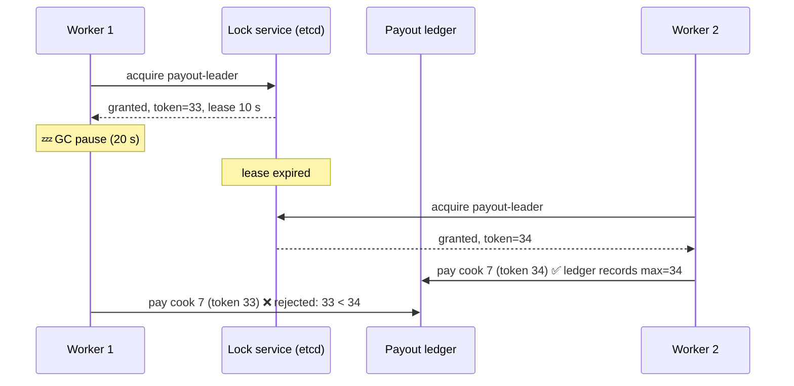

# 086 · Leader Election, Distributed Locks & Fencing Tokens

> ⏱ 10 min · 📈 86% · 🅱️ Part B (advanced) · Phase 10: Deep Internals
>
> `█████████████████░░░` 86% of the whole guide

---

## 📖 Story

2:00 a.m. Pantry's **nightly payout job** runs on whichever worker holds the "payout leader" lock: a 10-second lease, renewed every 3 seconds.

At 2:04, Worker 1 enters a **stop-the-world garbage-collection pause**. It's frozen solid for **twenty seconds**, mid-loop, halfway through paying 9,000 cooks. Its lease expires. Worker 2 grabs the lock and, correctly, starts the payout run.

At 2:04:21, Worker 1 **wakes up**. From its point of view, no time has passed. It still believes it's the leader. It picks up where it left off.

Two workers. One lock. **Both paying cooks.**

By morning, 3,100 cooks have been paid **twice**. Clawing it back takes a week and a lot of apologetic emails.

I've seen this exact bug cost real money. Let me show you why locks need **expiry dates and ticket numbers**.

## 🎯 One-sentence idea

**Leader election and distributed locks ensure only one node acts at a time, but because a paused or partitioned node can wrongly believe it still holds the lock, safe systems combine leases (locks that expire) with fencing tokens (ever-increasing numbers that the storage checks) so stale holders can't do damage.**

## 🧸 Analogy

A **single key to the supply room**:

- 🔑 **Lock:** only the key holder may enter.
- ⏳ **Lease:** the key **self-destructs after 10 minutes**, so someone who faints doesn't lock everyone out forever.
- 😴 **The trap:** Worker 1 holds the key and **falls asleep for 15 minutes**. The lease expires, and Worker 2 gets a **new** key. Worker 1 wakes up **still thinking it has access**. 💥
- 🎫 **Fencing token:** every key carries an **ever-rising ticket number** (#33, then #34). The door **remembers the highest number it has seen** and rejects #33 after #34.

## 🖼️ Visual

*Diagram brief:* a timeline where Worker 1 gets token 33, freezes (zzz), its lease expires, and Worker 2 gets token 34 and writes. Worker 1 wakes and tries to write with 33, and the storage slams the door: "33 < 34, rejected."



## 🔬 How it works

- **Why it exists:** exactly one cron scheduler, one DB primary, one consumer per partition, one certificate renewer, **one payout runner**.
- **Leader election:** **consensus-native** (Raft/Paxos inside etcd, Consul, ZooKeeper), or candidates race to create an **ephemeral node / lease key** in a coordination service while the others **watch** it. **Kubernetes Lease** objects do this for controllers.
- **Leases, not forever-locks:** the holder must **renew** before the TTL, and a crashed holder's lock expires on its own. **Correctness locks must live in a strongly consistent store**. A single Redis `SET NX PX` is fine for **efficiency** locks (avoid duplicate work), but it can be lost on failover and is **unsafe for correctness**.
- **The unfixable truth:** a holder can be **paused** (GC, VM migration, swapping) or **partitioned** past its lease **without knowing**, and clocks drift (lesson 084). No amount of client-side checking closes this gap.
- **Fencing tokens close it at the resource:** each grant carries a **monotonically increasing token**, **every protected write includes it**, and the **resource rejects any token lower than the highest it has seen**. **Raft terms, ZooKeeper zxids, and etcd revisions** make natural tokens. Release locks with **compare-and-delete** (only if you still own them).

## 🧩 Worked example

**An efficiency lock (fine for "don't build the report twice"):**

```python
token = uuid4().hex
if redis.set("lock:nightly-report", token, nx=True, px=60_000):
    try:
        build_report()          # running twice by accident only wastes CPU
    finally:
        redis.eval("if redis.call('get',KEYS[1])==ARGV[1] then return redis.call('del',KEYS[1]) end",
                   1, "lock:nightly-report", token)    # release only if still ours
```

**A correctness lock: etcd lease + fencing in the ledger:**

```python
lease = etcd.lease(ttl=10)
ok, resp = etcd.transaction(
    compare=[etcd.transactions.create("/locks/payout") == 0],
    success=[etcd.transactions.put("/locks/payout", me, lease)], failure=[])
if ok:
    fence = resp.header.revision                       # monotonically increasing
    for cook in due_payouts():
        rows = ledger.execute("""
            UPDATE payout_runs SET last_fence = %s
            WHERE run_date = %s AND last_fence < %s     -- storage enforces the fence
        """, fence, today, fence)
        if rows == 0: raise StaleLeader()              # someone newer is in charge → stop
        pay(cook, idempotency_key=f"{today}:{cook.id}")   # belt AND braces: idempotent payouts
```

**2:04 a.m., replayed:** Worker 1 wakes with fence 33 → its first ledger update matches **0 rows** (the ledger has seen 34) → it raises `StaleLeader` and stops. **Zero double payouts.**

## ⚖️ Trade-offs

| Approach | Safety | Cost | Use for |
|---|---|---|---|
| Single Redis `SET NX PX` | ⚠️ Unsafe under failover or pauses | Cheap, fast | Efficiency locks |
| Redlock (multi-Redis) | Debated (timing assumptions) | Moderate | Efficiency, not correctness |
| etcd/ZooKeeper/Consul lease | ✅ Consensus-backed | Consensus latency | Leader election, correctness locks |
| + Fencing at the resource | ✅✅ Defeats paused holders | Resource must check tokens | Anything where a double action corrupts data |
| DB row / advisory lock | ✅ Within one DB | Tied to that DB | Jobs coordinated through one DB |

## 🌍 Real world

- **Google Chubby** (Paxos-based) provides locks and leader election for Bigtable and GFS, and inspired ZooKeeper.
- **Kubernetes** controllers elect leaders with etcd-backed **Lease** objects.
- **Martin Kleppmann's "How to do distributed locking"** critique of Redlock made fencing tokens famous.

## 📌 Cheat card

> - **Lease = a lock with a timeout.** The holder renews.
> - **Paused or partitioned holders don't know they lost the lock** → **fencing tokens** checked by the resource.
> - **Correctness → a consensus store (etcd/ZooKeeper).** Redis locks → **efficiency only**.
> - **Terms / zxids / revisions** = natural fencing tokens.
> - **Compare-and-delete** to release, and make side effects **idempotent** too.

## 🧪 Feynman check

Explain the supply-room key, how Worker 1's nap causes trouble, and why the door checking ticket numbers fixes it even though Worker 1 never realizes it's late.

⚠️ **Common confusion:** "A lock with a TTL is safe because it expires." Expiry solves **crashed** holders, and it **creates** the paused-holder problem. Without fencing at the resource, the old holder writes after expiry as if nothing happened.

## ⚡ Quick recall

1. What problem do fencing tokens solve?
<details><summary>Reveal Answer</summary>

A stale lock holder (paused or partitioned past its lease) performing writes after someone else acquired the lock. The resource rejects lower tokens.
</details>

2. Why aren't single-Redis locks safe for correctness?
<details><summary>Reveal Answer</summary>

Async replication can lose the lock key on failover, so two clients both "hold" it, and there's no fencing by default.
</details>

3. How does ZooKeeper/etcd election detect a dead leader?
<details><summary>Reveal Answer</summary>

The leader's ephemeral node or lease expires when its heartbeats stop, and the watchers are notified to elect a successor.
</details>

## 🎤 Interview practice

**Q. "Exactly one instance of a job must run across 20 servers. Design it, then tell me whether Redlock is safe."**
<details><summary>Model answer</summary>

- **Election:** an etcd/ZooKeeper **lease** or a **Kubernetes Lease**. The leader runs the job, and the followers **watch** the key and take over when it expires.
- **Idempotency:** key the job's effects by **run date + entity** (`payout:2026-10-01:cook_7`), so even an accidental double run can't double-pay.
- **Fencing:**
  - Pass the lease **revision** with every protected write. The storage (a DB conditional update) **rejects stale tokens**.
  - For stores that can't check tokens (S3), use **conditional writes** (ETag/version preconditions) or route writes through a DB that validates the fence.
- **Hung-but-alive leaders:** the job **heartbeats progress**, and a watchdog makes the leader **step down** on a stall, so a renewing-but-stuck leader can't block forever.
- **Alternatives:** a K8s CronJob with `concurrencyPolicy: Forbid`, or `SELECT … FOR UPDATE SKIP LOCKED` on a jobs table.
- **Redlock:**
  - It acquires the lock on a **majority of independent Redis nodes** within a time bound, which is better than one node.
  - **Critique (Kleppmann):** it relies on **bounded clock drift and pause times**, and provides **no fencing tokens**, so a paused client can still act after expiry. Antirez argues the assumptions are reasonable in practice.
  - **Practical verdict:** fine for **efficiency**. For **correctness**, use a **consensus-backed lease plus fencing at the resource**.
- **Likely follow-up:** "Can idempotency replace fencing?" → often, for effects with natural keys. Fencing still protects **non-idempotent** or ordering-sensitive writes (config, ownership).
</details>

## 📖 Teaser

> 📖 *One leader at a time is solved, but Pantry now runs 800 servers, and nobody can reliably say which of them are alive, which are slow, and which have quietly died.*

---

⬅️ [✅ Checkpoint 85%](checkpoint-85.md) · 🗺️ [Phase map](README.md) · ➡️ [087 · Gossip & Failure Detection](087-gossip-and-failure-detection.md)

✅ **Safe stopping point.** Tick lesson 086 in [PROGRESS.md](../../PROGRESS.md).
