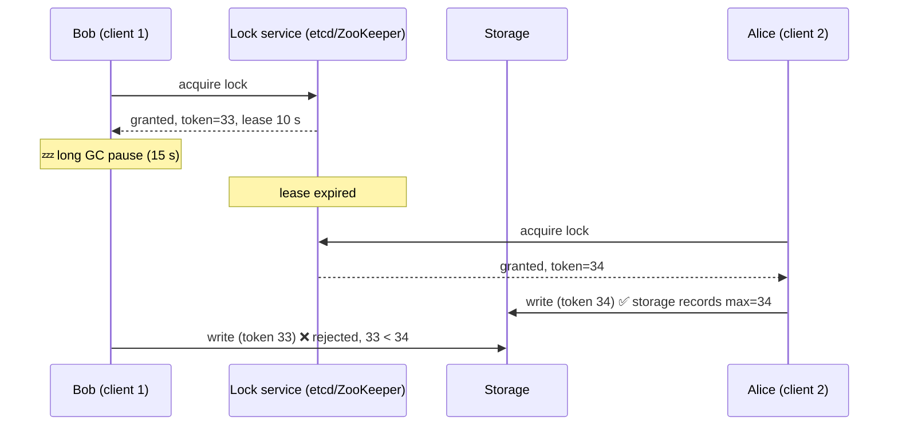

# 086 · Leader Election, Distributed Locks & Fencing Tokens

> ⏱ 10 min · 📈 86% · 🅱️ Part B (advanced) · Phase 10: Deep Internals
>
> `█████████████████░░░` 86% of the whole guide

---

## 🎯 One-sentence idea

**Leader election and distributed locks make sure only one node does something at a time. Because a paused or partitioned node can wrongly believe it still holds the lock, safe systems use leases (locks that expire) plus fencing tokens (increasing numbers the storage checks) so stale holders can't do damage.**

## 🧸 Analogy

A **single key to the supply room**:

- 🔑 **Lock:** only whoever holds the key can enter.
- ⏳ **Lease:** the key **auto-expires after 10 minutes**, so if someone faints holding it, others aren't locked out forever.
- 😴 **The problem:** Bob grabs the key, then **falls asleep for 15 minutes** (a GC pause). His lease expires, and Alice gets a **new** key. Bob wakes up, **still thinks he has access**, and walks in while Alice is inside. 💥
- 🎫 **Fencing token:** each key comes with a **ticket number** that always goes up (Bob #33, Alice #34). The supply-room door **remembers the highest number it has seen** and refuses #33 after it has seen #34. Bob is stopped at the door. ✅

## 🖼️ Visual



## 🔬 How it works

- **Why you need it:** exactly one scheduler runs cron jobs, one primary DB accepts writes, one worker processes a partition, one process renews certificates…
- **Leader election approaches:**
  - **Consensus-based:** a Raft/Paxos group elects a leader internally (etcd, Consul, ZooKeeper). This is the gold standard.
  - **Using a coordination service:** candidates create an **ephemeral node / lease key** in ZooKeeper/etcd. Whoever succeeds is leader, and others **watch** and take over when it disappears.
  - **Kubernetes Lease objects** for controller leader election.
- **Distributed locks:**
  - **Lease-based:** the lock has a TTL, and the holder must **renew** (heartbeat) before it expires.
  - Must be **mutually exclusive** under failures, which means backed by a **strongly consistent** store (a consensus system). A single Redis node with `SET NX PX` is fine for **efficiency** locks (avoid duplicate work), but it's **not safe** for **correctness** locks under failover or pauses.
- **The fundamental problem:** a holder can be **paused** (GC, VM migration, swapping) or **partitioned** past its lease **without knowing**. Clocks drift too (lesson 084).
- **Fencing tokens:** the lock service issues a **monotonically increasing token** with each grant. **Every write to the protected resource includes the token**, and the resource **rejects tokens lower than the highest it has seen**. It turns "I think I'm the leader" into "the storage agrees."
  - Raft **terms**, ZooKeeper **zxid/version**, and etcd **revision** all work as fencing tokens.
- **Leader leases for reads:** a leader can serve reads locally while its lease is valid, but this relies on bounded clock drift. Use conservative margins.

## 🧩 Worked example

**Efficiency lock with Redis (OK for "avoid duplicate work"):**

```python
token = uuid4().hex
if redis.set("lock:nightly-report", token, nx=True, px=60_000):   # 60 s lease
    try:
        build_report()                # if this runs twice by accident, it's only wasted work
    finally:
        # release only if we still own it (atomic compare-and-delete via Lua)
        redis.eval("if redis.call('get',KEYS[1])==ARGV[1] then return redis.call('del',KEYS[1]) end",
                   1, "lock:nightly-report", token)
```

**Correctness lock with etcd + fencing:**

```python
lease = etcd.lease(ttl=10)
ok, resp = etcd.transaction(
    compare=[etcd.transactions.create("/locks/ledger") == 0],        # the key doesn't exist
    success=[etcd.transactions.put("/locks/ledger", me, lease)],
    failure=[])
if ok:
    fencing_token = resp.header.revision        # monotonically increasing
    ledger_db.execute(
        "UPDATE ledger_meta SET owner=%s, token=%s WHERE token < %s",   # the storage enforces it
        me, fencing_token, fencing_token)
    # every subsequent write includes fencing_token, and the DB rejects stale ones
```

## ⚖️ Trade-offs

| Approach | Safety | Cost | Use for |
|---|---|---|---|
| Single Redis `SET NX PX` | ⚠️ Not safe under failover or pauses | Cheap, fast | Efficiency locks (dedupe work) |
| Redlock (multi-Redis) | Debated (timing assumptions) | Moderate | Efficiency. Avoid it for correctness. |
| etcd/ZooKeeper/Consul lease | ✅ Consensus-backed | Latency of consensus | Leader election, correctness locks |
| + Fencing tokens at the resource | ✅✅ Protects against paused holders | Resource must check tokens | Anything where double action corrupts data |
| DB row lock / advisory lock | ✅ Within one DB | Ties you to that DB | Jobs coordinated through one DB |

## 🌍 Real world

- **Google Chubby** (a Paxos-based lock service) inspired ZooKeeper, and is used for leader election in Bigtable/GFS.
- **Kubernetes** controllers use Lease objects (backed by etcd) for leader election.
- **Martin Kleppmann's "How to do distributed locking"** critique of Redlock popularized fencing tokens.

## 📌 Cheat card

> - **Lease = a lock with a timeout.** The holder must renew.
> - **Paused/partitioned holders don't know they lost the lock** → use **fencing tokens** checked by the resource.
> - **Correctness locks → a consensus store (etcd/ZooKeeper).** Redis locks → efficiency only.
> - Raft **terms** / etcd **revisions** = natural fencing tokens.
> - Release locks **only if you still own them** (compare-and-delete).

## 🧪 Feynman check

Explain the supply-room key story, how Bob's nap causes trouble, and why the door checking ticket numbers fixes it even though Bob doesn't know he's late.

⚠️ **Common confusion:** "A lock with a TTL is safe because it expires." Expiry handles **crashed** holders, but it *creates* the paused-holder problem. Without fencing, the old holder can still write after expiry.

## ⚡ Quick recall

1. What problem do fencing tokens solve?
<details><summary>Answer</summary>

A stale lock holder (paused or partitioned past its lease) performing writes after someone else acquired the lock. The resource rejects lower tokens.
</details>

2. Why aren't single-Redis locks safe for correctness?
<details><summary>Answer</summary>

Async replication means a failover can lose the lock key, so two clients can both "hold" the lock. Also, there's no fencing by default.
</details>

3. How does ZooKeeper/etcd leader election detect a dead leader?
<details><summary>Answer</summary>

The leader's ephemeral node / lease expires when it stops heartbeating, and watchers are notified to elect a new leader.
</details>

## 🎤 Interview practice

**Q1. "Only one instance of a job should run across 20 servers. Design it."**
<details><summary>Model answer</summary>

- **Leader election** via etcd/ZooKeeper/K8s Lease: the leader runs the scheduler, and the others stand by and watch.
- The job itself is **idempotent** (keyed by run date), so an accidental double run is harmless.
- For correctness-critical side effects, pass a **fencing token** (the lease revision) with every write, and the storage rejects stale tokens.
- Alternatives: a managed scheduler (K8s CronJob with `concurrencyPolicy: Forbid`), or a DB row lock (`SELECT ... FOR UPDATE SKIP LOCKED`).
- **Likely follow-up:** "What if the leader hangs but keeps its lease alive?" → add health checks, make the job heartbeat progress, and step down on a stall.
</details>

**Q2. "Is Redlock safe?"**
<details><summary>Model answer</summary>

- It acquires the lock on a majority of independent Redis nodes within a time bound, which is better than a single node.
- Critics (Kleppmann) point out it relies on **bounded clock drift and pause times**, and has **no fencing tokens**, so a paused client can still act after expiry. Antirez argued the assumptions are reasonable.
- Practical answer: fine for **efficiency** locks. For **correctness**, use consensus-based locks **plus fencing** at the resource.
- **Likely follow-up:** "How would you add fencing to a system writing to S3?" → it's hard, since S3 doesn't check tokens. Use conditional writes (ETag/version preconditions) or a coordinating DB that validates tokens.
</details>

---

⬅️ [✅ Checkpoint 85%](checkpoint-85.md) · 🗺️ [Phase map](README.md) · ➡️ [087 · Gossip & Failure Detection](087-gossip-and-failure-detection.md)

✅ **Safe stopping point.** Tick lesson 086 in [PROGRESS.md](../../PROGRESS.md).
