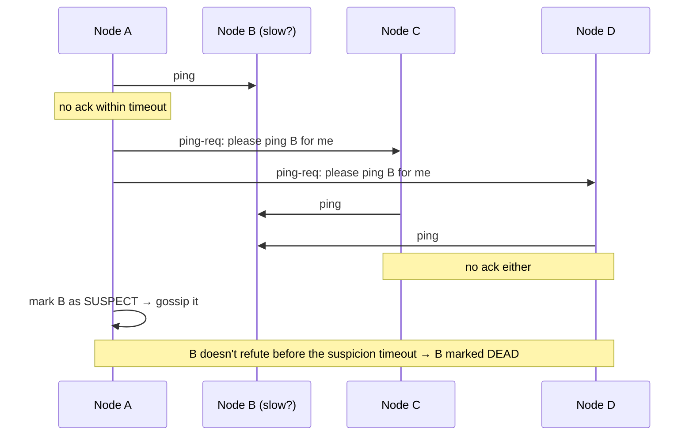

# 087 · Gossip Protocols & Failure Detection

> ⏱ 9 min · 📈 87% · 🅱️ Part B (advanced) · Phase 10: Deep Internals
>
> `█████████████████░░░` 87% of the whole guide

---

## 🎯 One-sentence idea

**In a large cluster, nodes learn about each other by gossiping: each periodically shares what it knows with a few random peers, so information spreads to everyone in about log(N) rounds. They detect failures with heartbeats and suspicion, never certainty, because a slow node looks exactly like a dead one.**

## 🧸 Analogy

**Office rumours**:

- Every minute, each person tells **2–3 random coworkers** the latest news ("Dave's on holiday").
- Within a few minutes, **the whole building knows**, with no announcement system and no single point of failure.
- **Failure detection:** if nobody has heard from Dave for a while, people start saying "**I think Dave might be out**" (suspicion). They check with others ("have *you* heard from Dave?") before declaring him gone, because maybe he's just in a long meeting (slow, not dead).

## 🖼️ Visual

```
Round 0:  ● ○ ○ ○ ○ ○ ○ ○ ○ ○ ○ ○ ○ ○ ○ ○     (1 node knows)
Round 1:  ● ● ● ○ ○ ○ ○ ○ ○ ○ ○ ○ ○ ○ ○ ○     (each tells 2 random peers)
Round 2:  ● ● ● ● ● ● ● ● ○ ○ ○ ○ ○ ○ ○ ○
Round 3:  ● ● ● ● ● ● ● ● ● ● ● ● ● ● ○ ○
Round 4:  ● ● ● ● ● ● ● ● ● ● ● ● ● ● ● ●     (~log(N) rounds)
```



## 🔬 How it works

- **Gossip (epidemic) dissemination:**
  - Every T (e.g., 1 s), each node picks **k random peers** and exchanges state (membership lists, versions, metadata).
  - Information reaches all N nodes in **O(log N)** rounds, with fixed per-node load, and it's **robust** (no central coordinator, and it tolerates message loss).
  - Uses: cluster **membership**, **failure information**, **schema/token ring metadata** (Cassandra), **anti-entropy** (syncing data differences, with Merkle trees in lesson 090).
  - Versioned state (heartbeat counters, generation numbers) resolves "which info is newer."
- **Failure detection:**
  - **Heartbeats + timeout:** simple, but choosing the timeout is hard (too short → false positives, too long → slow detection).
  - **Phi (φ) accrual detector (Cassandra, Akka):** instead of alive/dead, output a **suspicion level** based on the history of heartbeat intervals. Apps choose a threshold.
  - **SWIM protocol (Consul/Serf, memberlist):** direct pings + **indirect pings via k peers** (so one bad link doesn't condemn a node) + a **suspect** state that the node can **refute** (by incrementing its incarnation number) + dissemination piggybacked on the pings.
- **The fundamental limit:** in an asynchronous network you **can't distinguish** crashed from slow (the FLP impossibility result / partial synchrony). Failure detectors are **eventually accurate** at best, so design for false suspicions (idempotency, fencing, lesson 086).
- **Gossip vs consensus:** gossip is **eventually consistent** (great for membership and metadata at scale). Consensus is **strongly consistent** (great for small, critical decisions like leader election and config).

## 🧩 Worked example

**How fast does gossip spread?**

```
N = 1,000 nodes, fanout k = 3, interval 1 s
Rounds ≈ log_k(N) + small constant ≈ log_3(1000) ≈ 6.3 → ~7–10 s to reach everyone
Per-node traffic: 3 small messages/s regardless of cluster size ✅
```

**Phi accrual intuition:**

```
Heartbeats normally arrive every ~1.0 s (±0.1 s)
No heartbeat for 1.5 s → φ ≈ 1  (slightly unusual)
No heartbeat for 3 s   → φ ≈ 8  (very unlikely if it's alive → treat it as down)
Threshold φ = 8 → adapts automatically to networks with more jitter
```

## ⚖️ Trade-offs

| Choice | Gain | Cost |
|---|---|---|
| Gossip membership | Scales to thousands, no SPOF | Eventual (seconds) convergence, a bit of redundant traffic |
| Central registry (etcd/ZooKeeper) | Strongly consistent view | Scale limits, dependency on that cluster |
| Aggressive failure timeouts | Fast failover | False positives → flapping, unnecessary failovers |
| Conservative timeouts | Fewer false alarms | Slower detection → longer impact |
| Indirect probing (SWIM) | Fewer false positives from one bad link | Extra messages |

## 🌍 Real world

- **Cassandra and ScyllaDB** use gossip for ring membership and schema, and a phi accrual failure detector.
- **HashiCorp Serf/Consul (memberlist)** implement SWIM with Lifeguard improvements.
- **Amazon Dynamo** (2007) used gossip for membership and failure detection.
- **Redis Cluster** nodes gossip over the cluster bus to agree on failed masters.

## 📌 Cheat card

> - **Gossip = rumours to k random peers every T** → everyone knows in **O(log N)** rounds, and there's no SPOF.
> - **Failure detection = suspicion, not certainty.** Slow ≈ dead from the outside.
> - **Phi accrual** (adaptive suspicion level) · **SWIM** (indirect pings + suspect + refute).
> - **Gossip for membership and metadata (eventual). Consensus for critical decisions (strong).**
> - Design for **false suspicions**: idempotency + fencing.

## 🧪 Feynman check

Explain office rumours spreading, and why coworkers ask others "have you heard from Dave?" before deciding Dave has left.

⚠️ **Common confusion:** "A heartbeat timeout tells us a node is dead." It tells us **we haven't heard from it**. The node may be alive but slow or partitioned, and may still be acting (hence the need for fencing).

## ⚡ Quick recall

1. How many rounds does gossip take to reach N nodes?
<details><summary>Answer</summary>

About O(log N) rounds.
</details>

2. What does SWIM's indirect ping achieve?
<details><summary>Answer</summary>

It asks other nodes to probe the suspect, so a single faulty network path doesn't cause a false failure declaration.
</details>

3. Why is perfect failure detection impossible in asynchronous networks?
<details><summary>Answer</summary>

Messages can be arbitrarily delayed, so a slow node is indistinguishable from a crashed one.
</details>

## 🎤 Interview practice

**Q1. "How do nodes in a 1,000-node storage cluster know which nodes are alive and which data ranges they own?"**
<details><summary>Model answer</summary>

- **Gossip-based membership:** each node periodically exchanges membership state (node, status, heartbeat version, token ranges) with a few random peers. It converges in seconds.
- **Failure detection** with phi accrual or SWIM (indirect probes + suspicion) to limit false positives.
- The ring/ownership metadata spreads via gossip, and clients learn the topology from any node.
- Critical coordination (e.g., schema changes, lightweight transactions) can use consensus separately.
- **Likely follow-up:** "What happens during a network partition?" → each side marks the other as down, and gossip reconverges when the partition heals. Data repair via hinted handoff and anti-entropy.
</details>

**Q2. "Our failover triggers too often on healthy nodes. How do you fix it?"**
<details><summary>Model answer</summary>

- Timeouts are too aggressive for real latency variance (GC pauses, network jitter).
- Use **adaptive detectors** (phi accrual), **indirect probing** (SWIM), **multiple consecutive misses**, and a **suspect** state with refutation.
- Tune GC to avoid long pauses, and separate the heartbeat traffic onto a priority path.
- Add **hysteresis/cooldowns** on failover decisions. For DB primaries, require a consensus of observers.
- **Likely follow-up:** "What's the trade-off?" → slower detection of real failures, which means a slightly longer outage when a node really dies.
</details>

---

⬅️ [086 · Leader Election & Locks](086-leader-election-and-locks.md) · 🗺️ [Phase map](README.md) · ➡️ [088 · 2PC vs Sagas](088-2pc-vs-sagas.md)

✅ **Safe stopping point.** Tick lesson 087 in [PROGRESS.md](../../PROGRESS.md).
