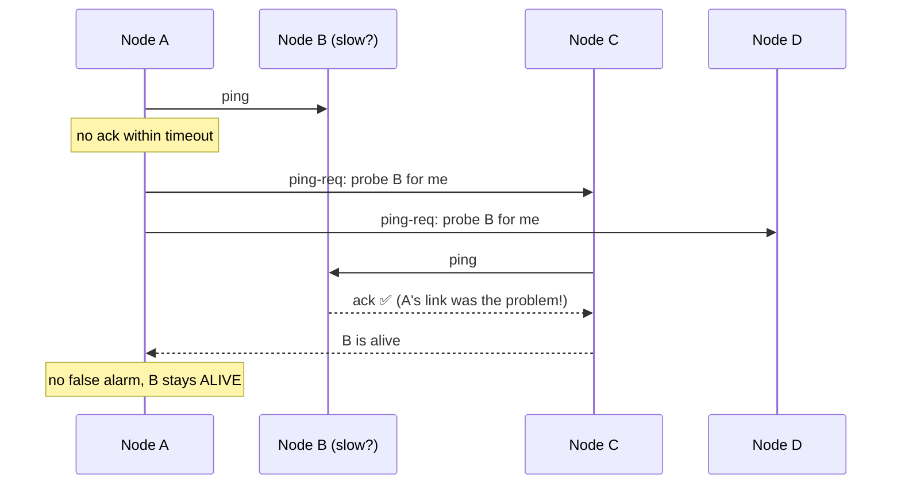

# 087 · Gossip Protocols & Failure Detection

> ⏱ 9 min · 📈 87% · 🅱️ Part B (advanced) · Phase 10: Deep Internals
>
> `█████████████████░░░` 87% of the whole guide

---

## 📖 Story

Pantry's storage cluster has grown to **800 machines**, and it has a strange illness.

Every few hours, a perfectly healthy node is declared **dead**. The cluster panics, starts copying terabytes of its data elsewhere, and then the "dead" node shows up again, confused, wondering why everyone is talking about it in the past tense.

The cause: one **flaky network cable** between a single monitoring server and one rack. The central health checker couldn't reach those nodes, so it assumed they were gone. Meanwhile, that central list of "who's alive" is itself straining under 800 machines checking in every second, and if *it* dies, nobody knows anything at all.

There's no reliable bird's-eye view of a cluster this big.

So I showed Maya how computers can spread information the same way **office gossip** spreads, and it works remarkably well.

## 🎯 One-sentence idea

**In large clusters, nodes learn about each other by gossiping, periodically sharing state with a few random peers so news reaches everyone in about log(N) rounds, and they detect failures with suspicion rather than certainty, because from the outside a slow node looks exactly like a dead one.**

## 🧸 Analogy

**Office rumours**:

- Every minute, each person tells **2–3 random coworkers** the latest news.
- Within minutes **the whole building knows**, with no PA system and no single point of failure.
- If nobody has heard from someone for a while, people say "**I think they might be out**" and **ask others** ("have *you* heard from them?") before declaring them gone. Maybe they're just in a long meeting.

## 🖼️ Visual

*Diagram brief:* a grid of dots, one lit at round 0. Each round, every lit dot lights two random others, until the whole grid glows by round 4. Below, a suspicion sequence: a direct ping fails, two peers probe indirectly, and only then is the node marked suspect.

```
Round 0:  ● ○ ○ ○ ○ ○ ○ ○ ○ ○ ○ ○ ○ ○ ○ ○
Round 1:  ● ● ● ○ ○ ○ ○ ○ ○ ○ ○ ○ ○ ○ ○ ○     (each tells 2 random peers)
Round 2:  ● ● ● ● ● ● ● ● ○ ○ ○ ○ ○ ○ ○ ○
Round 3:  ● ● ● ● ● ● ● ● ● ● ● ● ● ● ○ ○
Round 4:  ● ● ● ● ● ● ● ● ● ● ● ● ● ● ● ●     (~log(N) rounds)
```



## 🔬 How it works

- **Epidemic dissemination:** every T (e.g. 1 s), each node exchanges **versioned state** (membership, heartbeat counters, token ranges, schema versions) with **k random peers**. News reaches N nodes in **O(log N)** rounds at a **constant per-node cost**, with no coordinator, and it tolerates message loss.
- **Heartbeats + timeouts** are simple but brittle: too short gives false positives, too long gives slow detection.
- **Phi (φ) accrual detection (Cassandra, Akka):** output a **suspicion level** from the statistical history of heartbeat arrivals, and let applications pick a threshold. It **adapts to jitter** automatically.
- **SWIM (Consul/Serf, memberlist):**
  - Direct pings + **indirect pings through k peers**, so one bad link can't condemn a node.
  - A **suspect** state the node can **refute** by bumping its **incarnation number**.
  - Membership updates piggybacked on the pings.
- **The fundamental limit, and where gossip fits:** in an asynchronous network you **can't distinguish crashed from slow** (FLP / partial synchrony), so detectors are only *eventually* accurate. Design for false suspicions (idempotency, fencing, lesson 086). Use **gossip** for eventually consistent membership and metadata at scale, and **consensus** for small, critical decisions.

## 🧩 Worked example

**Spread time:**

```
N = 800 nodes, fanout k = 3, interval 1 s
Rounds ≈ log_3(800) + small constant ≈ 6.1 → everyone knows in ~7–10 s
Per-node traffic: ~3 small messages/s, no matter how big the cluster grows ✅
```

**Phi accrual intuition:**

```
Heartbeats normally every ~1.0 s (±0.1 s)
1.5 s of silence → φ ≈ 1   (slightly odd)
3.0 s of silence → φ ≈ 8   (very unlikely if alive → treat as down)
On a jittery network, the learned distribution widens, so the same silence yields a lower φ automatically
```

**Maya's illness, cured:** the flaky cable means the monitoring node's **direct** ping fails → SWIM's **indirect probes** from two other racks succeed → the node stays **ALIVE**. False "deaths" drop from **several a day to zero**, and the membership view no longer depends on any single machine.

## ⚖️ Trade-offs

| Maya's choice | What she gains | What she pays |
|---|---|---|
| Gossip membership | Scales to thousands, no SPOF | Seconds of convergence, redundant chatter |
| Central registry (etcd/ZooKeeper) | A strongly consistent view | Scale limits, a hard dependency |
| Aggressive timeouts | Fast failover | False positives, flapping |
| Conservative timeouts | Fewer false alarms | Slower detection of real deaths |
| Indirect probing (SWIM) | Bad links don't condemn nodes | A few extra messages |

## 🌍 Real world

- **Cassandra and ScyllaDB** gossip ring membership and schema, and use **phi accrual** detection.
- **HashiCorp Serf/Consul** (memberlist) implement **SWIM** with Lifeguard refinements.
- **Amazon Dynamo** used gossip for membership. **Redis Cluster** gossips over its cluster bus to agree on failed masters.

## 📌 Cheat card

> - **Gossip = rumours to k random peers every T** → **O(log N)** rounds, no SPOF.
> - **Failure detection = suspicion, not certainty.** Slow ≈ dead from outside.
> - **Phi accrual** (adaptive suspicion) · **SWIM** (indirect pings + suspect + refute).
> - **Gossip** for membership and metadata. **Consensus** for critical decisions.
> - Design for **false suspicions**: idempotency + fencing.

## 🧪 Feynman check

Explain office rumours, and why coworkers ask others "have you heard from them?" before deciding someone has left the company.

⚠️ **Common confusion:** "A heartbeat timeout tells us a node is dead." It only tells us **we haven't heard from it**. It might be alive, slow, or partitioned, and **still acting**. That's exactly why stale actors need to be fenced.

## ⚡ Quick recall

1. How many rounds does gossip take to reach N nodes?
<details><summary>Reveal Answer</summary>

About O(log N).
</details>

2. What does SWIM's indirect ping achieve?
<details><summary>Reveal Answer</summary>

Other nodes probe the suspect, so a single faulty network path doesn't trigger a false failure declaration.
</details>

3. Why is perfect failure detection impossible in asynchronous networks?
<details><summary>Reveal Answer</summary>

Messages can be arbitrarily delayed, so a slow node is indistinguishable from a crashed one.
</details>

## 🎤 Interview practice

**Q. "How do nodes in a 1,000-node storage cluster know who's alive and who owns which data, and how do you stop failover from firing on healthy nodes?"**
<details><summary>Model answer</summary>

- **Membership and ownership:**
  - **Gossip:** each node periodically exchanges versioned membership (status, heartbeat counter, incarnation, token ranges) with a few random peers, converging in seconds.
  - Ring and ownership metadata ride the same channel, so **clients can bootstrap the topology from any node**.
  - Critical coordination (schema changes, lightweight transactions) uses **consensus** separately.
  - During a **partition**, each side marks the other down. On healing, gossip reconverges, and data heals via **hinted handoff + anti-entropy** (Merkle trees).
- **Stopping false failovers:**
  - The cause is timeouts tuned tighter than real variance (GC pauses, jitter, one bad link).
  - Use **adaptive phi accrual**, **SWIM indirect probing**, require **several consecutive misses**, and add a **suspect state with refutation**.
  - Tune GC to avoid long pauses, and give heartbeat traffic **priority** (separate queues or ports).
  - Add **hysteresis/cooldowns** to failover. For DB primaries, require a **quorum of observers** to agree.
- **The trade-off:** slower detection of genuine deaths means a slightly longer impact when a node really dies, which is usually a far better deal than flapping.
- **Likely follow-up:** "Gossip or etcd for service membership?" → gossip for very large, churny fleets that tolerate eventual views. etcd when you need a single, strongly consistent registry and the fleet size allows it.
</details>

## 📖 Teaser

> 📖 *The cluster finally knows its own health, but checkout now spans four services with four databases, and a payment fails after the stock is reserved and the courier is booked. There's no single transaction to undo.*

---

⬅️ [086 · Leader Election & Locks](086-leader-election-and-locks.md) · 🗺️ [Phase map](README.md) · ➡️ [088 · 2PC vs Sagas](088-2pc-vs-sagas.md)

✅ **Safe stopping point.** Tick lesson 087 in [PROGRESS.md](../../PROGRESS.md).
