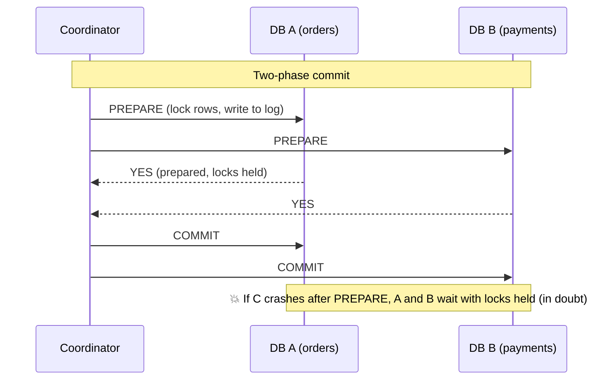
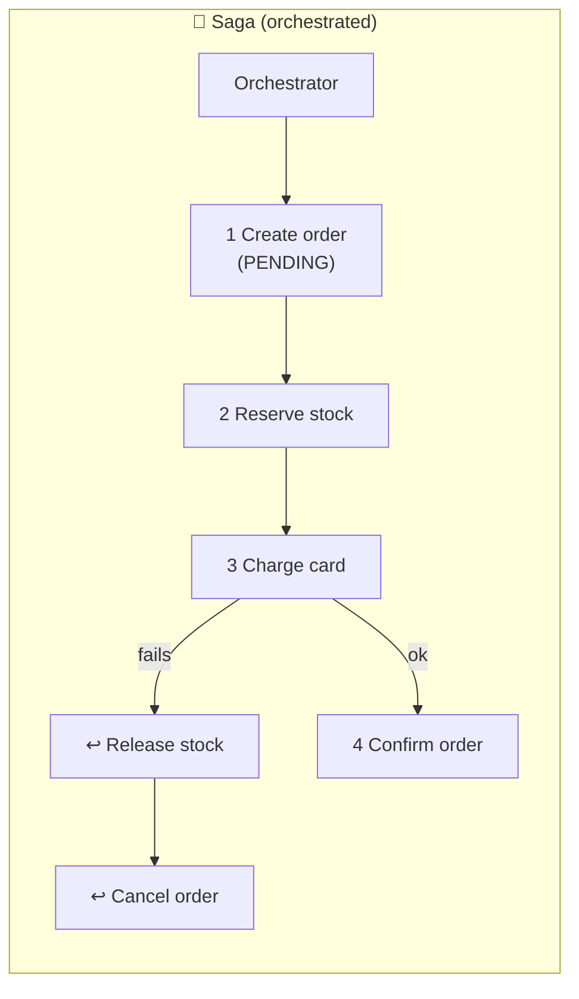

# 088 · Distributed Transactions: 2PC vs Sagas

> ⏱ 10 min · 📈 88% · 🅱️ Part B (advanced) · Phase 10: Deep Internals
>
> `█████████████████░░░` 88% of the whole guide

---

## 📖 Story

Checkout now spans the order, inventory, payment, and courier services, and each one has its own database. A payment fails *after* the stock was reserved and a courier booked. There's no single transaction to roll back. Maya must choose between locking everything and undoing things step by step.

## 🎯 One-sentence idea

**When one business operation spans several databases or services, you either lock everything and commit together (two-phase commit: atomic but blocking and fragile), or run a sequence of local transactions with an "undo" step for each (a saga: available and scalable, but only eventually consistent).**

## 🧸 Analogy

Booking a **holiday**: flight + hotel + car.

- 💍 **2PC = a wedding ceremony.** The officiant asks each party, "**Do you commit?**" (prepare). Everyone must say "I do" and then **stay frozen at the altar** (holding locks). Only when *all* agree does the officiant say "**I now pronounce…**" (commit). If the officiant faints between the questions and the pronouncement, **everyone is stuck at the altar** (blocking).
- 🔁 **Saga = booking step by step with free cancellation.** Book the flight ✅, the hotel ✅, the car ❌ (none available) → **cancel the hotel, cancel the flight** (compensations). No one waits frozen, but for a few minutes you *did* hold a flight you ended up cancelling.

## 🖼️ Visual





## 🔬 How it works

- **Two-phase commit (2PC):**
  1. **Prepare:** the coordinator asks all participants to prepare. Each durably records its intent and **holds locks**, then votes yes or no.
  2. **Commit/abort:** if all say yes → commit everywhere. If any says no → abort everywhere.
  - ✅ **Atomicity** across resources. ❌ **Blocking:** if the coordinator dies after prepare, participants stay "in doubt" with **locks held** until it recovers. It also adds latency (2 round trips + fsyncs), reduces availability (**every** participant must be up), and scales poorly.
  - Used within database systems (distributed SQL internally, XA transactions), usually over short distances and with few participants. Modern systems make the coordinator fault-tolerant (e.g., backing its state by consensus, as Spanner does).
- **Sagas:**
  - Split the business transaction into **local transactions T1…Tn**, each with a **compensating transaction C1…Cn** that semantically undoes it (refund, release, cancel).
  - If step k fails → run C(k−1)…C1.
  - **Orchestration:** a central orchestrator (a workflow engine like Temporal, AWS Step Functions, or a saga state machine) drives the steps. It's explicit, and easier to monitor.
  - **Choreography:** services react to each other's events (lesson 062). It's decoupled, but the flow is implicit.
  - ✅ No distributed locks, high availability, and it suits microservices and long-running processes. ❌ **No isolation:** others can see intermediate states (a "PENDING" order). Compensations must be **idempotent** and **always succeed eventually** (with retries). And some actions **can't be undone** (an email was sent), so order the steps carefully (put irreversible steps last).
- **Making sagas robust:** the **outbox** for reliable events (062), **idempotency keys** per step (055), **semantic locks** (status fields like `PENDING`) to handle the lack of isolation, **timeouts** plus compensation for stuck steps, and a persisted saga state.

## 🧩 Worked example

**Order saga with compensations:**

| Step | Action | Compensation |
|---|---|---|
| 1 | Create order `PENDING` | Mark order `CANCELLED` |
| 2 | Reserve inventory (hold for 15 min) | Release the reservation |
| 3 | Authorize payment | Void the authorization / refund |
| 4 | Confirm order, capture payment | (the pivot: after this, move forward only) |
| 5 | Send confirmation email | (no compensation, which is why it's last) |

**Failure run:**

```
T1 order PENDING ✅ → T2 stock reserved ✅ → T3 payment declined ❌
→ C2 release stock ✅ → C1 cancel order ✅ → user sees "payment failed"
Each step/compensation is idempotent (keyed by saga_id + step), so retries are safe.
```

**Orchestrator state (persisted):**

```json
{"saga_id": "s_77", "order_id": "o_123", "state": "COMPENSATING",
 "completed": ["CREATE_ORDER", "RESERVE_STOCK"], "failed": "CHARGE_CARD",
 "compensated": ["RESERVE_STOCK"], "updated_at": "..."}
```

## ⚖️ Trade-offs

| | 2PC | Saga |
|---|---|---|
| Atomicity | ✅ Real (all or nothing) | Eventually (via compensation) |
| Isolation | ✅ (locks) | ❌ Intermediate states are visible |
| Availability | ❌ All participants must be up | ✅ Steps retry independently |
| Latency | Higher (locks held across round trips) | Lower per step, but longer end to end |
| Coupling | Tight (shared protocol, XA) | Loose |
| Best for | Few, short, co-located participants (inside a DB) | Microservices, long-running business flows |

## 🌍 Real world

- **Spanner and CockroachDB** use 2PC internally across shards, with consensus-replicated participants (so there's no blocking on a single coordinator failure).
- **Uber (Cadence → Temporal)** and **AWS Step Functions** are used to orchestrate sagas for trips, payments, and provisioning.
- The **Saga pattern** comes from a 1987 paper by Garcia-Molina & Salem, originally for long-lived database transactions.

## 📌 Cheat card

> - **2PC = the wedding:** prepare (all vote) → commit. Atomic, but **blocking** and fragile.
> - **Saga = steps + undo buttons.** Available and scalable, but **no isolation**.
> - Saga essentials: **idempotent steps and compensations, outbox, persisted state, irreversible steps last**.
> - **Orchestration** (explicit) vs **choreography** (events).
> - Prefer **designing boundaries so most transactions stay in one service**.

## 🧪 Feynman check

Explain the wedding vs the cancellable holiday bookings, and why the confirmation email should be the very last step.

⚠️ **Common confusion:** "Compensation = rollback." A rollback erases as if nothing happened. A compensation is a **new action** that semantically reverses the effect. The customer may have *seen* the pending charge, and a refund is visible in their statement.

## ⚡ Quick recall

1. Why is 2PC called "blocking"?
<details><summary>Answer</summary>

If the coordinator fails after participants have prepared, they must hold their locks and wait (in doubt) until it recovers to learn the outcome.
</details>

2. What's a compensating transaction?
<details><summary>Answer</summary>

An action that semantically undoes a previously committed saga step (e.g., refund a charge, release a reservation).
</details>

3. What isolation problem do sagas have, and a mitigation?
<details><summary>Answer</summary>

Other transactions can see intermediate states. Mitigate with semantic locks/status fields (PENDING), reordering steps, and designing for commutative updates.
</details>

## 🎤 Interview practice

**Q1. "Design checkout across Order, Inventory, and Payment microservices."**
<details><summary>Model answer</summary>

- An **orchestrated saga** (Temporal/Step Functions or an orchestrator service with persisted state).
- Steps: create the order (PENDING) → reserve stock (with expiry) → authorize payment → confirm the order + capture → notify.
- Compensations: void the authorization, release the stock, cancel the order. Every step is idempotent (saga_id + step key).
- Communication via commands/events with the **outbox** (reliable), and retries with backoff. Timeouts trigger compensation.
- The UI shows "processing" until it's confirmed. Reservations auto-expire if the saga dies.
- **Likely follow-up:** "What if a compensation fails?" → retry until it succeeds (compensations must be retryable), and after N attempts, alert for manual intervention (a DLQ plus an operator dashboard).
</details>

**Q2. "When would you still use 2PC?"**
<details><summary>Model answer</summary>

- Inside a **distributed database** where the engine handles it with consensus-backed participants (Spanner/CockroachDB), which is transparent to the app.
- For short transactions across a **small number of reliable resources** in the same datacenter, where strict atomicity and isolation are mandatory, and blocking risk is acceptable or mitigated.
- Avoid it across independently owned microservices or third-party APIs.
- **Likely follow-up:** "What's 3PC?" → it adds a pre-commit phase to reduce blocking, but it isn't safe under network partitions, so it's rarely used. Consensus-based commit is the modern answer.
</details>

> 📖 *Next time: The finance team wants the full history of every wallet, forever.*

---

⬅️ [087 · Gossip & Failure Detection](087-gossip-and-failure-detection.md) · 🗺️ [Phase map](README.md) · ➡️ [089 · Event Sourcing & CQRS](089-event-sourcing-and-cqrs.md)

✅ **Safe stopping point.** Tick lesson 088 in [PROGRESS.md](../../PROGRESS.md).
