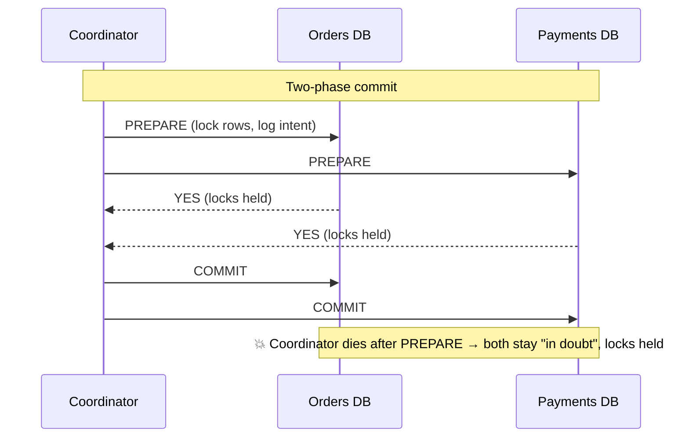
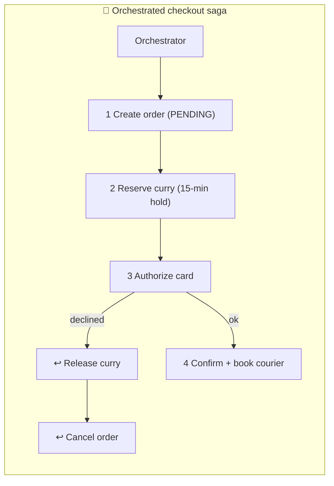

# 088 · Distributed Transactions: 2PC vs Sagas

> ⏱ 10 min · 📈 88% · 🅱️ Part B (advanced) · Phase 10: Deep Internals
>
> `█████████████████░░░` 88% of the whole guide

---

## 📖 Story

Pantry's checkout is no longer one database. It's **four services, four databases**: Order, Inventory, Payment, Courier.

At 7:31 p.m., a checkout marches through its steps. The order is created ✅. The last portion of curry is reserved ✅. A courier is booked and starts riding toward the kitchen ✅. Then the card is **declined** ❌.

In the old monolith, one `ROLLBACK` would have erased everything as if it never happened. Now there's nothing to roll back. Four separate databases have each committed their own little truth.

So the curry sits **reserved for nobody**, hidden from other hungry customers. A courier pedals toward a pickup that will never happen. An order hangs in limbo, half-alive.

I laid out Maya's two options, and I'll lay them out for you: **lock everything and commit together**, or **move forward step by step, with an undo button for each step.**

## 🎯 One-sentence idea

**When one business operation spans several databases or services, you either lock everything and commit together (two-phase commit: atomic, but blocking and fragile) or run a chain of local transactions, each with a compensating "undo" (a saga: available and scalable, but only eventually consistent).**

## 🧸 Analogy

Booking a **holiday**: flight + hotel + car.

- 💍 **2PC = a wedding.** The officiant asks every party "**Do you commit?**" (prepare). They answer "I do" and **freeze at the altar** (holding locks) until "**I now pronounce…**" (commit). If the officiant faints in between, **everyone is stuck at the altar**.
- 🔁 **Saga = booking with free cancellation.** Flight ✅, hotel ✅, car ❌ → **cancel the hotel, cancel the flight** (compensations). Nobody freezes, but for a few minutes you really *did* hold a flight.

## 🖼️ Visual

*Diagram brief:* on top, a 2PC sequence where every participant locks and waits for the coordinator's final word, with a red 💥 if the coordinator dies after prepare. Below, a saga chain of forward steps, with a failing step that triggers a backward chain of undo arrows.





## 🔬 How it works

- **2PC:**
  - **Prepare:** each participant durably logs its intent, **holds its locks**, and votes. **Commit/abort:** all yes → commit, any no → abort.
  - ✅ True atomicity and isolation.
  - ❌ **Blocking:** a coordinator crash after prepare leaves participants **in doubt with locks held**. Plus 2 round trips + fsyncs, **every** participant must be up, and it scales poorly.
- **Where 2PC lives today:** **inside distributed databases** (Spanner, CockroachDB), where the coordinator and participants are **consensus-replicated**, so a single crash doesn't block. Also XA across a few co-located resources. It's not suited to independently owned microservices or third-party APIs.
- **Sagas:** local transactions **T1…Tn**, each with a **compensation C1…Cn** (refund, release, cancel). If step k fails, run **C(k−1)…C1**. Coordinate by **orchestration** (Temporal, Step Functions, a persisted state machine: explicit and observable) or **choreography** (services react to events, lesson 062: decoupled but implicit).
- **The saga's price, no isolation:** others see intermediate states. Mitigate with **semantic locks** (`PENDING` status), **reservations with expiry**, **commutative updates**, and **ordering**: put the **pivot** (the point of no return) late and **irreversible steps last** (emails, courier dispatch).
- **Robustness kit:** the **outbox** for reliable step events (062), **idempotency keys per step** (`saga_id + step`, lesson 055), a **persisted saga state**, **timeouts** that trigger compensation, and **compensations that retry until they succeed**, escalating to a human after N failures.

## 🧩 Worked example

| Step | Action | Compensation |
|---|---|---|
| 1 | Create order `PENDING` | Mark `CANCELLED` |
| 2 | Reserve curry (15-min hold) | Release the reservation |
| 3 | **Authorize** card | Void the authorization |
| 4 | **Pivot:** confirm order + capture payment | (forward only from here) |
| 5 | Book courier | Cancel courier (only before pickup) |
| 6 | Send confirmation email | — (irreversible, so it's last) |

**7:31 p.m., replayed:**

```
T1 order PENDING ✅ → T2 curry reserved ✅ → T3 card declined ❌
→ C2 release curry ✅ (back on the menu in 40 ms) → C1 cancel order ✅
→ courier was never booked (it's now AFTER the pivot) → customer sees "Card declined, try another"
Every step and compensation is idempotent (saga_id + step), so retries are safe.
```

```json
{"saga_id":"s_77","order_id":"o_123","state":"COMPENSATING",
 "completed":["CREATE_ORDER","RESERVE_STOCK"],"failed":"AUTHORIZE_CARD",
 "compensated":["RESERVE_STOCK"],"updated_at":"2026-10-01T19:31:04Z"}
```

## ⚖️ Trade-offs

| | 2PC | Saga |
|---|---|---|
| Atomicity | ✅ Real | Eventual (via compensation) |
| Isolation | ✅ Locks | ❌ Intermediate states visible |
| Availability | ❌ Every participant must be up | ✅ Steps retry independently |
| Latency | Locks held across round trips | Short steps, longer end to end |
| Coupling | Tight (shared protocol) | Loose |
| Best for | Inside a DB, few co-located participants | Microservices, long-running flows |

## 🌍 Real world

- **Spanner and CockroachDB** run 2PC across shards with **consensus-replicated participants**, so there's no single-coordinator blocking.
- **Uber's Cadence → Temporal** and **AWS Step Functions** orchestrate sagas for trips, payments, and provisioning.
- **Sagas** come from Garcia-Molina & Salem's 1987 paper on long-lived database transactions.

## 📌 Cheat card

> - **2PC = the wedding:** everyone votes, then commits together. Atomic, **blocking**.
> - **Saga = steps + undo buttons.** Available, **no isolation**.
> - Saga kit: **idempotent steps and compensations · outbox · persisted state · pivot late · irreversible last**.
> - **Orchestration** (explicit) vs **choreography** (events).
> - Best of all: **draw service boundaries so most transactions stay local.**

## 🧪 Feynman check

Explain the wedding vs the cancellable holiday, and why the confirmation email (and the courier dispatch) must come after the point of no return.

⚠️ **Common confusion:** "Compensation = rollback." A rollback **erases** history as if nothing happened. A compensation is a **new, visible action** that semantically reverses the effect. The customer may have *seen* a pending authorization, and a void or refund shows up on their statement.

## ⚡ Quick recall

1. Why is 2PC called "blocking"?
<details><summary>Reveal Answer</summary>

If the coordinator fails after participants prepare, they must hold their locks and wait, in doubt, until it recovers and reveals the outcome.
</details>

2. What's a compensating transaction?
<details><summary>Reveal Answer</summary>

An action that semantically undoes a previously committed saga step, such as refunding a charge or releasing a reservation.
</details>

3. What isolation problem do sagas have, and how do you mitigate it?
<details><summary>Reveal Answer</summary>

Other transactions can see intermediate states. Mitigate with semantic locks (PENDING status), expiring reservations, step ordering, and commutative updates.
</details>

## 🎤 Interview practice

**Q. "Design checkout across Order, Inventory, and Payment microservices. What if a compensation fails, and when would you still use 2PC?"**
<details><summary>Model answer</summary>

- **Orchestrated saga** (Temporal/Step Functions, or an orchestrator service with persisted state):
  1. Create the order `PENDING`.
  2. **Reserve stock** with a TTL.
  3. **Authorize** payment.
  4. **Pivot:** confirm the order + **capture**.
  5. Dispatch the courier.
  6. Notify.
- **Compensations:** void the authorization, release the stock, cancel the order. **Every step and compensation is idempotent** (keyed by `saga_id + step`).
- **Messaging:** commands and events via the **transactional outbox**, retries with backoff + jitter, and **timeouts** that trigger compensation. Reservations **self-expire** if the orchestrator dies.
- **UX:** "Processing…" until the pivot completes. A declined card leaves no orphaned holds.
- **Failed compensations:**
  - Compensations must be **retryable until they succeed** (exponential backoff).
  - After N attempts → **DLQ + an operator dashboard** for manual resolution, plus **reconciliation jobs** (e.g. find holds older than 15 minutes with no live saga, and release them).
- **When 2PC is still right:**
  - **Inside a distributed database** whose engine runs it on **consensus-replicated participants** (Spanner/CockroachDB). It's transparent to you.
  - Short transactions across **a few reliable, co-located resources** where strict isolation is mandatory and the blocking risk is mitigated.
  - **Never** across independently owned services or third-party APIs.
- **Likely follow-up:** "What about 3PC?" → it adds a pre-commit phase to reduce blocking, but it's unsafe under partitions. Consensus-based commit is the modern answer.
</details>

## 📖 Teaser

> 📖 *Checkout finally undoes itself cleanly, and then the finance team arrives with a demand that sounds simple and isn't: "Show us the full history of every wallet. Every change. Forever."*

---

⬅️ [087 · Gossip & Failure Detection](087-gossip-and-failure-detection.md) · 🗺️ [Phase map](README.md) · ➡️ [089 · Event Sourcing & CQRS](089-event-sourcing-and-cqrs.md)

✅ **Safe stopping point.** Tick lesson 088 in [PROGRESS.md](../../PROGRESS.md).
