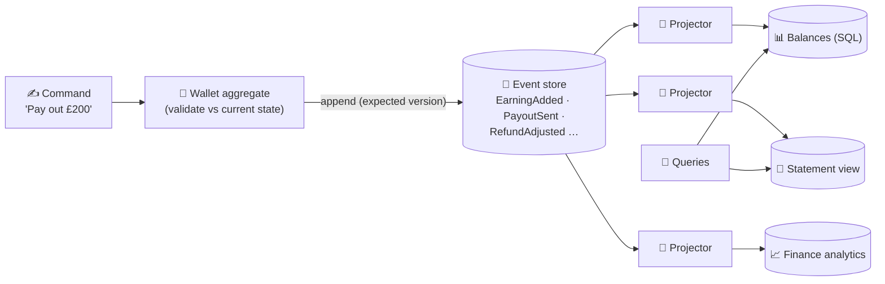

# 089 · Event Sourcing & CQRS

> ⏱ 10 min · 📈 89% · 🅱️ Part B (advanced) · Phase 10: Deep Internals
>
> `█████████████████░░░` 89% of the whole guide

---

## 📖 Story

Pantry launches **cook wallets**: earnings flow in from orders, payouts flow out to bank accounts, and adjustments trickle in from refunds.

A cook emails support: *"My balance says £412. I've counted my orders twice. It should be £437. Where did £25 go?"*

Maya opens the `wallets` table. One row. One column. **`balance = 412.00`.** That's it. No trail, no story, no memory of how it got there. Somewhere over the last three months, some update somewhere subtracted £25, and the database has **forgotten** why.

Then the finance team arrives with a demand that makes it worse: *"For the audit, show us every wallet's balance **on any day in history**, and exactly how it got there."*

A single overwritten number can't answer that. Ever.

I reminded Maya that **accountants solved this centuries ago**, and I'll show you how: store **the history itself** as the truth.

## 🎯 One-sentence idea

**Event sourcing stores every change as an immutable event and derives current state by replaying them, giving a full history for free, while CQRS separates the write model (commands, rules) from read models (queries) built from those events and shaped for each screen.**

## 🧸 Analogy

- 📒 **Event sourcing = a bank statement.** The bank doesn't just store "£420". It stores **every transaction**, and the balance is **computed**. Balance on 3 March? Replay up to that date. A mistake? **Add a correcting entry**, and never erase.
- 🍽️ **CQRS = the kitchen vs the menu board.** The **kitchen** processes orders under strict rules (writes). The **menu board and the specials screen** are **separately prepared displays** (reads), updated from what the kitchen does.

## 🖼️ Visual

*Diagram brief:* a command enters an aggregate that checks the rules against current state and appends events to an immutable log. From the log, several projectors stream into differently shaped read models, and queries read only those.



## 🔬 How it works

- **The event log is the source of truth:** an append-only stream per aggregate (`wallet-42`) of **past-tense domain events**. **State = fold(events)**, with **snapshots** every N events so replays stay fast.
- **Writing safely:** load the snapshot + recent events → validate the command against current state → **append new events with an expected version** (optimistic concurrency). If someone appended first, reload and retry.
- **The payoff and the price:** a **complete audit trail**, **time travel** (state at any instant), new read models rebuilt from history, and natural integration events. The price is **complexity**, **schema evolution forever** (versioned events + upcasters), eventual consistency for reads, and **GDPR erasure** on an immutable log (**crypto-shredding**: encrypt PII per user and delete the key).
- **CQRS:** a **command side** that enforces invariants and one or more **read models** (denormalized tables, caches, search indexes) maintained asynchronously by **projections**. Reads and writes scale independently, and each screen gets a perfectly shaped view. CQRS **doesn't require** event sourcing (CDC/outbox can feed it), but event sourcing almost always uses CQRS.
- **Projections are idempotent and replayable:** they track a **checkpoint**, so after fixing a bug you **reset the checkpoint and replay from event 0** to rebuild the view.

## 🧩 Worked example

**Wallet 42, event-sourced:**

```
v1 WalletOpened       {cook: 7}
v2 EarningAdded       {order: o_101, amount: 250.00}
v3 EarningAdded       {order: o_118, amount: 187.00}
v4 RefundAdjusted     {order: o_101, amount: -25.00, reason: "missing side dish"}
State = fold → 0 + 250 + 187 − 25 = 412.00
```

**The cook's mystery, solved in one query:** the £25 was a **refund adjustment** for a missing side dish on order o_101, with a timestamp, a reason, and the agent who approved it. **The finance audit:** fold events up to any date to get the balance on that day.

```python
def pay_out(wallet_id, amount):
    events, version = store.load(wallet_id)              # e.g. version 4
    state = replay(events)                                # balance 412.00
    if amount > state.balance:
        raise InsufficientFunds()
    store.append(wallet_id, [PayoutSent(amount=amount)],
                 expected_version=version)                # someone appended v5 meanwhile? → retry
```

```python
def on_event(e):                                          # projection: idempotent via checkpoint
    if e.position <= checkpoint(): return
    if e.type in ("EarningAdded", "RefundAdjusted"):
        db.execute("UPDATE balances SET balance = balance + %s WHERE wallet=%s", e.amount, e.wallet)
    if e.type == "PayoutSent":
        db.execute("UPDATE balances SET balance = balance - %s WHERE wallet=%s", e.amount, e.wallet)
    save_checkpoint(e.position)
```

## ⚖️ Trade-offs

| Maya gains | Maya pays | Use it when |
|---|---|---|
| Full audit history, time travel | Complexity, a learning curve | Finance, ledgers, compliance |
| Rebuildable, purpose-built read models | Eventual consistency for reads | Many different query shapes |
| Independent read/write scaling | More infrastructure | Read-heavy with complex writes |
| Natural integration events | Versioning events forever | Event-driven architectures |
| — | Overkill for simple CRUD | ❌ Profiles, settings, catalogues |

## 🌍 Real world

- **Double-entry bookkeeping** has been "event sourced" for centuries.
- **EventStoreDB, Axon, and Marten** are event-sourcing platforms. **LMAX** built a famous low-latency, event-sourced trading exchange.
- **Git** is event-sourcing-shaped: immutable commits, with the working tree derived from them.

## 📌 Cheat card

> - **Event sourcing = store the history. State = replay (+ snapshots).**
> - **CQRS = a write model + read models**, synced by projections.
> - **Append with an expected version.** Projections are **idempotent + replayable**.
> - Hard parts: **schema evolution · eventual reads · GDPR (crypto-shredding)**.
> - **Ledgers and audits: yes. Plain CRUD: no.**

## 🧪 Feynman check

Explain the bank statement, and why "never erase, only add a correcting entry" saves you when something goes wrong.

⚠️ **Common confusion:** "Event sourcing = using Kafka." Kafka is a log **transport**. Event sourcing is a **modelling approach** where per-entity event streams **are the source of truth**, which needs per-aggregate ordering, efficient load-by-entity, and **optimistic concurrency on append**. Plain Kafka topics don't directly provide those.

## ⚡ Quick recall

1. How is current state obtained in event sourcing?
<details><summary>Reveal Answer</summary>

By replaying (folding) the entity's events in order, usually starting from the latest snapshot.
</details>

2. What does CQRS separate?
<details><summary>Reveal Answer</summary>

The write model (commands, invariants) from the read models (queries, denormalized views).
</details>

3. How do you delete personal data from an immutable event log?
<details><summary>Reveal Answer</summary>

Crypto-shredding: encrypt personal data with a per-user key and delete the key on erasure, or keep PII out of the events entirely.
</details>

## 🎤 Interview practice

**Q. "Would you event-source an e-commerce order system? And in your CQRS system, users don't see their change right after a write. Why, and what do you do?"**
<details><summary>Model answer</summary>

- **Event-source the right parts:**
  - **Order lifecycle: maybe yes.** Placed → paid → shipped → returned events are gold for audit, support, and analytics, and the flows are genuinely complex.
  - **Catalogue and profiles: no.** They're simple CRUD, and event sourcing adds cost with little benefit.
  - If adopted: **per-order streams**, snapshots, projections for "my orders" and admin dashboards, outbox/Kafka for integration, and **versioned events + upcasters** from day one.
  - **A lighter alternative:** a state table + an **audit/event table written in the same transaction** (outbox-style) gets most of the benefit with far less machinery.
  - **Projection bugs:** fix the code, **reset the checkpoint, replay** to rebuild.
- **The missing read-after-write:**
  - Read models update **asynchronously**, so there's **projection lag**.
  - Fixes:
    - **Return the new state from the command** (optimistic UI).
    - Give the client the event **position** and have reads **wait until the projection passes it** (a read-your-writes token).
    - Read the user's **own** data from the write model.
    - **Shrink the lag** by scaling projectors.
  - **Monitor projection lag** = latest event position − projector checkpoint, and alert on growth.
- **Likely follow-up:** "How do you evolve an event's schema?" → only add optional fields, version event types, and **upcast** old events on read. Never rewrite history in place.
</details>

## 📖 Teaser

> 📖 *Every wallet tells its whole story now, and then marketing asks Maya to count unique visitors across a billion events a day, using almost no memory at all.*

---

⬅️ [088 · 2PC vs Sagas](088-2pc-vs-sagas.md) · 🗺️ [Phase map](README.md) · ➡️ [090 · Probabilistic Data Structures](090-probabilistic-data-structures.md)

✅ **Safe stopping point.** Tick lesson 089 in [PROGRESS.md](../../PROGRESS.md).
