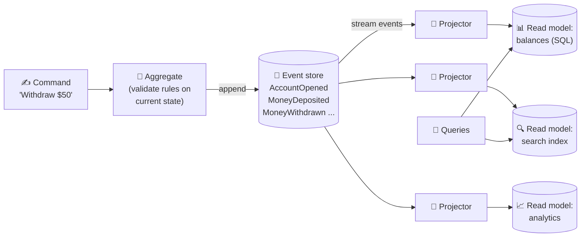

# 089 · Event Sourcing & CQRS

> ⏱ 10 min · 📈 89% · 🅱️ Part B (advanced) · Phase 10: Deep Internals
>
> `█████████████████░░░` 89% of the whole guide

---

## 📖 Story

Pantry launched wallets for cooks. The finance team asked, "Can we see exactly how every balance reached its value, on any day in history?" A single balance column couldn't answer that. I reminded Maya that accountants solved this centuries ago, and I'll show you how: store the *history itself* as the truth.

## 🎯 One-sentence idea

**Event sourcing stores every change as an immutable event and derives the current state by replaying them, so you get a full history for free. CQRS separates the write model (commands) from read models (queries) that are built from those events and shaped for each screen.**

## 🧸 Analogy

- 📒 **Event sourcing = a bank statement.** Your bank doesn't just store "balance: $420." It stores every **transaction**: +$1,000 salary, −$50 groceries, −$530 rent… The balance is **computed** from the history. Want your balance on March 3rd? Replay up to that date. Found a mistake? **Add a correcting entry**, and never erase history.
- 🍽️ **CQRS = a restaurant's kitchen vs its menu board.** The **kitchen** (write side) processes orders with strict rules. The **menu board and the "today's specials" screen** (read side) are **separately prepared displays**, optimized for customers to read quickly and updated from what the kitchen does.

## 🖼️ Visual



## 🔬 How it works

- **Event sourcing:**
  - The **source of truth = an append-only log of domain events** per entity (aggregate): `OrderPlaced`, `ItemAdded`, `OrderShipped`.
  - **Current state = fold(events)**: replay to rebuild it. **Snapshots** every N events speed this up.
  - Writes: load the aggregate (snapshot + recent events) → validate the command → **append the new events** with **optimistic concurrency** (expected version).
  - ✅ **Complete audit trail**, **time travel** (state at any point), rebuilding new read models from history, debugging ("how did we get here?"), and natural integration events.
  - ❌ **Complexity**, **event schema evolution** (old events live forever, so you need upcasters and versioning), eventual consistency for reads, "right to be forgotten" is hard on an immutable log (use crypto-shredding: encrypt personal data per user and delete the key), and querying current state needs projections.
- **CQRS (Command Query Responsibility Segregation):**
  - **Command side:** handles writes, enforces invariants, and is normalized or event-sourced.
  - **Query side:** one or more **read models** (denormalized tables, caches, search indexes) optimized for specific queries, updated asynchronously from the events (**projections**).
  - ✅ Scale reads and writes independently, and each read model fits its screen perfectly. ❌ Eventual consistency between sides, and more moving parts.
  - **CQRS doesn't require event sourcing** (you can feed read models via CDC/outbox), and event sourcing almost always pairs with CQRS.
- **Projections** must be **idempotent** and **replayable** (rebuild a read model from event 0 after fixing a bug).

## 🧩 Worked example

**A bank account, event-sourced:**

```
Event stream "account-42":
 v1 AccountOpened      {owner: "Ada"}
 v2 MoneyDeposited     {amount: 1000}
 v3 MoneyWithdrawn     {amount: 50}
 v4 MoneyWithdrawn     {amount: 530}

State = fold → balance = 0 + 1000 − 50 − 530 = 420
```

**Handling a command with optimistic concurrency:**

```python
def withdraw(account_id, amount):
    events, version = store.load(account_id)            # e.g., version 4
    state = replay(events)                               # balance 420
    if amount > state.balance:
        raise InsufficientFunds()
    store.append(account_id,
                 [MoneyWithdrawn(amount=amount)],
                 expected_version=version)               # fails if someone appended v5 meanwhile → retry
```

**Projection building a read model:**

```python
def on_event(e):                                          # idempotent: track the last applied position
    if e.position <= checkpoint(): return
    if e.type == "MoneyDeposited":  db.execute("UPDATE balances SET balance = balance + %s WHERE id=%s", ...)
    if e.type == "MoneyWithdrawn":  db.execute("UPDATE balances SET balance = balance - %s WHERE id=%s", ...)
    save_checkpoint(e.position)
```

## ⚖️ Trade-offs

| You gain | You pay | Use it when |
|---|---|---|
| A full audit history and time travel | Complexity, and a learning curve | Finance, ledgers, compliance-heavy domains |
| Rebuildable, purpose-built read models | Eventual consistency for reads | Many different query needs |
| Independent scaling of reads and writes | More infrastructure | Very read-heavy with complex writes |
| Natural event integration | Event versioning forever | Event-driven architectures |
| — | Overkill for simple CRUD | ❌ Don't use for basic CRUD apps |

## 🌍 Real world

- **Accounting ledgers** have been "event sourced" for centuries (double-entry bookkeeping).
- **EventStoreDB**, **Axon**, **Marten**, and Kafka-based implementations. **LMAX** (a trading exchange) is a famous event-sourced, high-performance system.
- **Git** is event-sourcing-like: commits are immutable changes, and the working tree is derived.

## 📌 Cheat card

> - **Event sourcing = store the history (events). State = replay (+ snapshots).**
> - **CQRS = separate write model and read models**, synced by projections.
> - Append with **expected version** (optimistic concurrency). Projections are **idempotent + replayable**.
> - Hard parts: **schema evolution, eventual consistency, GDPR deletes (crypto-shredding)**.
> - **Great for ledgers and audit-heavy domains. Overkill for CRUD.**

## 🧪 Feynman check

Explain the bank-statement analogy, and why "never erase, only add a correcting entry" is so valuable when something goes wrong.

⚠️ **Common confusion:** "Event sourcing = using Kafka." Kafka is a transport and log. Event sourcing is a **modelling approach** where the event log **is the source of truth** for entity state. That needs per-aggregate streams, ordering, and optimistic concurrency, which plain Kafka topics don't directly give you.

## ⚡ Quick recall

1. How is current state obtained in event sourcing?
<details><summary>Answer</summary>

By replaying (folding) the entity's events in order, usually starting from the latest snapshot.
</details>

2. What does CQRS separate?
<details><summary>Answer</summary>

The write model (commands, invariants) from the read models (queries, denormalized views).
</details>

3. How do you delete personal data from an immutable event log?
<details><summary>Answer</summary>

Crypto-shredding: encrypt personal data with a per-user key, and delete the key when erasure is requested (or keep PII out of events).
</details>

## 🎤 Interview practice

**Q1. "Would you use event sourcing for an e-commerce order system?"**
<details><summary>Model answer</summary>

- **Maybe for the order lifecycle:** its events (placed, paid, shipped, returned) are valuable for audit, customer support, and analytics, and the flows are complex.
- **Not for the product catalog or user profiles**, which are simple CRUD.
- If adopted: per-order streams, snapshots, projections for "my orders" and admin dashboards, and outbox/Kafka for integration. Plan event versioning.
- A lighter alternative: a state table + an **audit/event log** table written in the same transaction (the outbox), which gets most of the benefits with less complexity.
- **Likely follow-up:** "How do you handle a bug in a projection?" → fix the code, reset the checkpoint, and **replay** to rebuild the read model.
</details>

**Q2. "Reads after a write don't show the change in our CQRS system. Why, and what do you do?"**
<details><summary>Model answer</summary>

- The read models update **asynchronously** from events, so there's a lag.
- Options: return the new state directly from the command response (optimistic UI), wait for the projection to reach the write's position (a read-your-writes token), read from the write model for the user's own data, or reduce the projection lag (monitoring, scaling projectors).
- **Likely follow-up:** "How do you monitor it?" → projection lag = the latest event position minus the projector checkpoint, with alerts on growth.
</details>

> 📖 *Next, Leo wants to count unique visitors across a billion events, using almost no memory.*

---

⬅️ [088 · 2PC vs Sagas](088-2pc-vs-sagas.md) · 🗺️ [Phase map](README.md) · ➡️ [090 · Probabilistic Data Structures](090-probabilistic-data-structures.md)

✅ **Safe stopping point.** Tick lesson 089 in [PROGRESS.md](../../PROGRESS.md).
