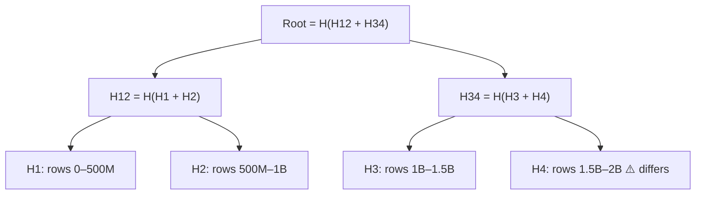

# 090 · Probabilistic Data Structures: Bloom Filters, HyperLogLog, Count-Min Sketch & Merkle Trees

> ⏱ 10 min · 📈 90% · 🅱️ Part B (advanced) · Phase 10: Deep Internals
>
> `██████████████████░░` 90% of the whole guide

---

## 📖 Story

Three requests land on Maya's desk in one morning, and each one has a terrifying memory bill attached.

**One:** *"How many **unique visitors** did each of our 10,000 cook pages get today?"* Storing every visitor ID per page, per day: **~200 GB**.

**Two:** *"Before we fetch a dish from the database, can we instantly know whether it **doesn't exist**?"* Bots are hammering fake dish IDs (lesson 032), and every miss costs a query.

**Three:** *"Two replicas of the dish store **disagree somewhere** across 2 billion rows. Find where, without shipping 2 billion rows across the network."*

Exact answers would cost hundreds of gigabytes and hours of transfer.

I showed Maya a handful of structures that still feel like **magic tricks** to me. They trade a sliver of accuracy, or a few hashes, for **enormous** savings.

## 🎯 One-sentence idea

**At web scale exact answers can be ruinously expensive, so probabilistic structures answer "have I seen this?" (Bloom filter), "how many distinct?" (HyperLogLog), and "how often?" (count-min sketch) in tiny fixed memory with small bounded errors, while hash-based Merkle trees locate differences between huge datasets cheaply.**

## 🧸 Analogy

- 🚪 **Bloom filter = a bouncer with a fuzzy memory.** "Were they here before?" A **"no" is always true**. A **"yes" is occasionally a lookalike**.
- 🎲 **HyperLogLog = guessing crowd size from the longest coin-flip streak.** If someone flipped **10 heads in a row**, there were probably ~**2¹⁰ ≈ 1,000 people** flipping. Remember the streak, not the people.
- 📊 **Count-min sketch = several shared tally sheets.** Different items may share boxes, so an item's count is the **smallest** of its boxes: maybe a bit high, **never too low**.
- 🌳 **Merkle tree = a tree of fingerprints.** Compare the **top** fingerprint, and if it differs, walk **only** down the differing branches.

## 🖼️ Visual

*Diagram brief:* a 16-bit Bloom filter row with three items' hash arrows lighting bits, and one query hitting an unlit bit ("definitely not"). Beside it, a Merkle tree whose root mismatch leads straight down one path to the single changed block.

```
Bloom filter, m = 16 bits, k = 3 hashes
add("dish:7")   → bits 2, 7, 11
add("dish:9")   → bits 4, 7, 14
bits: 0 0 1 0 1 0 0 1 0 0 0 1 0 0 1 0
check("dish:99999") → bits 2, 9, 14 → bit 9 = 0 → DEFINITELY NOT present ✅ (skip the DB)
check("dish:42")    → bits 4, 11, 2 → all 1 → "PROBABLY present" → confirm in the DB ⚠️
```



## 🔬 How it works

- **Bloom filter:** a bit array of **m** bits and **k** hashes. Add = set k bits. Query = any 0 → **definitely absent**, all 1 → **probably present**. **No false negatives**, and false positives are tunable: **~10 bits/item ≈ 1% FP** with k ≈ 7. A standard filter can't delete, so use **counting** or **cuckoo** filters for that. Uses: SSTable lookups (lesson 081), cache-penetration guards (lesson 032), "already crawled?" (lesson 094).
- **HyperLogLog:** hash each item, use the leading bits to pick one of m registers, and keep the **max run of leading zeros** in each, combined with a harmonic mean. **~12 KB** estimates billions of uniques with **~0.81% standard error**, and sketches are **mergeable** (unions across days and servers for free).
- **Count-min sketch:** a **d × w** counter grid with d hashes. Add → increment one counter per row. Estimate → the **minimum** across the rows. It **overestimates on collisions, never underestimates**. Uses: heavy hitters, **top-K trending** (lesson 099), approximate rate limits.
- **Merkle tree:** leaves = hashes of data ranges, parents = hashes of their children. **Equal roots ⇒ identical data.** On a mismatch, **descend only into the differing subtrees**, locating divergence in **O(log n)** comparisons. Uses: replica **anti-entropy** (Cassandra/Dynamo), **Git**, blockchains, certificate transparency, and file-sync integrity (lesson 080).
- **The rule:** reach for them when **exactness is expensive and approximation is acceptable**, and **always confirm a "maybe" against the source of truth** when it matters.

## 🧩 Worked example

**Request one, unique visitors, with Redis HLL:**

```bash
PFADD visitors:cook7:2026-10-01 "user:42" "user:77" "user:42"
PFCOUNT visitors:cook7:2026-10-01           # → 2 (approx)
PFMERGE visitors:cook7:week visitors:cook7:2026-09-25 … visitors:cook7:2026-10-01
# ≤ ~12 KB per key → 10,000 cooks × 12 KB ≈ 120 MB/day (vs ~200 GB exact)
```

**Request two, a Bloom filter sized for 50M valid dish IDs at 1% FP:**

```
m = −n·ln(p) / (ln 2)² ≈ 9.6 bits × 50M ≈ 480 Mbit ≈ 60 MB · k ≈ 7
Bot requests for fake IDs → rejected in microseconds, zero DB queries ✅
```

**Request three, Merkle anti-entropy over 2B rows:**

```
Roots differ → compare the 2 children → the left matches, the right differs → descend…
~20 levels later: exactly 1 of 1,048,576 leaf ranges differs → sync ~2,000 rows, not 2 billion ✅
```

## ⚖️ Trade-offs

| Structure | Answers | Error | Memory | Can't |
|---|---|---|---|---|
| Bloom filter | "Seen before?" | False positives only | ~10 bits/item @ 1% | Delete (standard), list items |
| HyperLogLog | "How many distinct?" | ±~1% | ~12 KB fixed | Say *which* items |
| Count-min sketch | "How often?" | Overestimates | Fixed grid (KB–MB) | Exact counts, list items |
| Merkle tree | "Where do datasets differ?" | Exact | O(n) hashes | — |
| Exact set/map | Everything | None | O(n × item size) | Scale cheaply |

## 🌍 Real world

- **Cassandra, RocksDB, and HBase** keep a Bloom filter per SSTable, and Cassandra repairs replicas with Merkle trees.
- **Redis** ships HyperLogLog (`PFADD/PFCOUNT`), with Bloom, Cuckoo, Count-Min, and Top-K in Redis Stack.
- **Git, Bitcoin, and IPFS** are built on Merkle trees.

## 📌 Cheat card

> - **Bloom: "definitely not" or "probably yes".** ~10 bits/item → 1% FP.
> - **HLL: distinct counts in ~12 KB at ~1% error**, mergeable.
> - **Count-min: frequencies that never under-count.** Heavy hitters.
> - **Merkle: compare roots, descend only where hashes differ.**
> - **Approximate when exact is expensive.** Confirm "maybe" in the source of truth.

## 🧪 Feynman check

Explain the fuzzy-memory bouncer and why a "no" can always be trusted, then explain how a tree of fingerprints finds one changed page in a giant library almost instantly.

⚠️ **Common confusion:** "A Bloom filter tells me an item is present." It only tells you it's **possibly** present. Its superpower is **skipping work** for items that are **definitely absent**. A "yes" must still be confirmed against the real store.

## ⚡ Quick recall

1. Can a standard Bloom filter produce false negatives?
<details><summary>Reveal Answer</summary>

No, only false positives (as long as you never try to delete from a standard filter).
</details>

2. Roughly how much memory does a Redis HyperLogLog use, and what's its error?
<details><summary>Reveal Answer</summary>

Up to about 12 KB per key, with ~0.81% standard error.
</details>

3. How does a Merkle tree speed up replica synchronization?
<details><summary>Reveal Answer</summary>

By comparing hashes top-down and descending only into subtrees whose hashes differ, finding divergent ranges with very few comparisons.
</details>

## 🎤 Interview practice

**Q. "Count unique daily visitors for 10,000 sites from 1B events/day with minimal memory, then stop a crawler from re-crawling billions of URLs."**
<details><summary>Model answer</summary>

- **Unique visitors:**
  - One **HyperLogLog per site per day** (≤ 12 KB) → 10k × 12 KB ≈ **120 MB/day**.
  - Stream events through **Kafka** → `PFADD` in Redis, or HLL sketches in Flink/Druid.
  - **Merge** dailies for weekly and monthly uniques without reprocessing raw events.
  - ~1% error is fine for analytics. Exact counts (e.g. for billing) come from a batch dedup job.
  - **Unions** via `PFMERGE` are exact in sketch terms. **Intersections** use inclusion–exclusion, and the error grows, so use them with care.
- **Crawler dedup:**
  - **Normalize** URLs (scheme, host case, trailing slashes, tracking params) → a Bloom filter of **seen URLs**: ~**1.2 GB for 1B at 1% FP**, **sharded by URL hash** across crawler nodes.
  - A false positive = occasionally skipping a genuinely new URL (acceptable). **No false negatives**, so a seen URL is never re-crawled by mistake.
  - Keep an **exact KV "seen" store** for high-value domains, and **scalable Bloom filters** (stacked layers) or periodic rebuilds as volume grows.
- **Likely follow-up:** "Why not just use a hash set?" → 1B URLs × ~100 B ≈ **100 GB** of RAM versus ~1.2 GB: roughly 80× more memory for exactness the crawler doesn't need.
</details>

## 📖 Teaser

> 📖 *Chapter 11 is next. Pantry goes global, and the hardest problems arrive all at once: payments in thirty currencies, couriers across five continents, and a celebrity cooking class that sells out in four seconds.*

---

⬅️ [089 · Event Sourcing & CQRS](089-event-sourcing-and-cqrs.md) · 🗺️ [Phase map](README.md) · ➡️ [✅ Checkpoint 90%](checkpoint-90.md)

✅ **Safe stopping point.** Tick lesson 090 in [PROGRESS.md](../../PROGRESS.md), then do the checkpoint!
