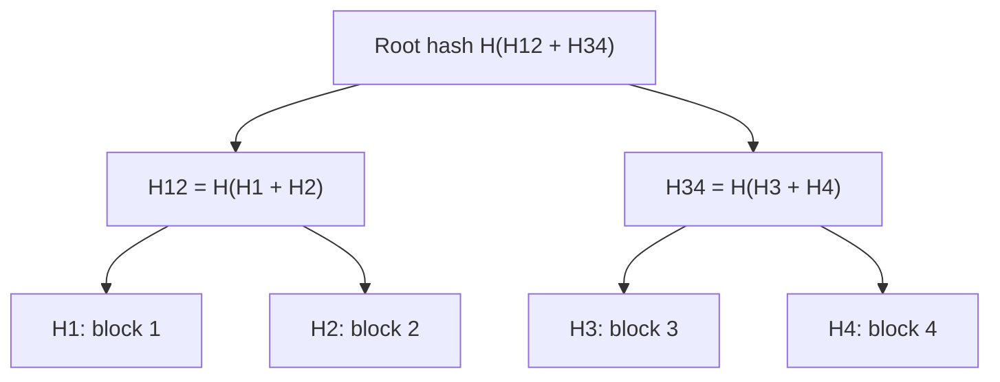

# 090 · Probabilistic Data Structures: Bloom Filters, HyperLogLog, Count-Min Sketch & Merkle Trees

> ⏱ 10 min · 📈 90% · 🅱️ Part B (advanced) · Phase 10: Deep Internals
>
> `██████████████████░░` 90% of the whole guide

---

## 📖 Story

Leo wanted daily unique visitor counts, a fast "have we seen this link before?" check, and quick comparisons between replicas. Exact answers would need hundreds of gigabytes. I showed Maya a few structures that still feel like magic tricks to me. They trade a tiny bit of accuracy for enormous savings.

## 🎯 One-sentence idea

**At web scale, exact answers can cost too much memory. Probabilistic structures answer "have I seen this?" (Bloom filter), "how many unique?" (HyperLogLog), and "how often?" (count-min sketch) using tiny, fixed memory with small, bounded errors. Merkle trees (not probabilistic, but hash-based) find differences between huge datasets cheaply.**

## 🧸 Analogy

- 🚪 **Bloom filter = a bouncer with a fuzzy memory.** Ask "was this person here before?" A **"no" is always true**. A **"yes" might occasionally be wrong** (they look like someone else). Perfect for skipping pointless work.
- 🎲 **HyperLogLog = estimating crowd size by the rarest coin-flip streak.** If someone in the crowd flipped **10 heads in a row**, there were probably around **2¹⁰ ≈ 1,000 people** flipping. Remember only the longest streak, not every person.
- 📊 **Count-min sketch = several tally sheets** where different items can share a box. An item's count is the **smallest** of its boxes. It's sometimes a bit high, **never too low**.
- 🌳 **Merkle tree = a tree of fingerprints.** To check whether two huge libraries are identical, compare the **top fingerprint**. If they differ, only walk down the branches that differ.

## 🖼️ Visual

**Bloom filter (m = 16 bits, k = 3 hash functions):**

```
add("cat")  → h1=2, h2=7, h3=11 → set bits 2, 7, 11
add("dog")  → h1=4, h2=7, h3=14 → set bits 4, 7, 14
bits:  0 0 1 0 1 0 0 1 0 0 0 1 0 0 1 0
check("cow") → bits 2, 9, 14 → bit 9 is 0 → DEFINITELY NOT present ✅
check("fox") → bits 4, 11, 2 → all 1 → "PROBABLY present" (false positive!) ⚠️
```



## 🔬 How it works

- **Bloom filter:** a bit array of m bits + k hash functions.
  - **Add:** set the k bits. **Query:** if any bit is 0 → definitely absent. If all are 1 → probably present.
  - **No false negatives. Tunable false positives.** You can't delete (a **counting Bloom filter** or **cuckoo filter** can).
  - ~**10 bits per element → ~1% false positive rate** (with optimal k ≈ 7).
  - Uses: LSM-tree SSTable lookups (lesson 081), cache penetration protection (lesson 032), "has this URL been crawled?" (lesson 094), "has the user seen this recommendation?"
- **HyperLogLog (HLL):** estimates **cardinality** (the number of distinct items).
  - Hash each item. Use the first bits to choose one of m registers, and store the **max number of leading zeros** seen in the rest. Combine the registers with a harmonic mean.
  - **~12 KB** estimates billions of uniques with **~0.8% standard error** (Redis's HLL). HLLs are **mergeable** (union across days or servers).
  - Uses: unique visitors, distinct search queries, unique IPs.
- **Count-min sketch:** a d × w grid of counters with d hash functions.
  - **Add x:** increment one counter per row. **Estimate x:** the **min** across the rows. It **overestimates** (collisions), and never underestimates.
  - Uses: heavy hitters, top-K (lesson 099), rate limiting approximations, trending detection.
- **Merkle tree:** leaves = hashes of data blocks, and parents = hashes of their children. The same root means identical data.
  - Differing roots → descend only into the differing subtrees → find the differences in **O(log n)** comparisons.
  - Uses: **anti-entropy** replica sync (Cassandra, Dynamo), **Git**, **blockchains**, **certificate transparency**, and file-sync integrity (lesson 080).

## 🧩 Worked example

**Bloom filter sizing formula:**

```
n = 1 billion URLs, target false positive p = 1%
m = −n·ln(p) / (ln 2)² ≈ 9.6 bits/element × 1e9 ≈ 9.6 Gbit ≈ 1.2 GB
k = (m/n)·ln 2 ≈ 7 hash functions
vs storing 1B URLs exactly (~100 bytes each) ≈ 100 GB → ~80× smaller
```

**Redis HyperLogLog for daily unique visitors:**

```bash
PFADD visitors:2026-10-01 "user:42" "user:77" "user:42"
PFCOUNT visitors:2026-10-01                     # → 2 (approx)
PFMERGE visitors:week visitors:2026-10-01 visitors:2026-10-02 ...   # weekly uniques
# each key ≤ ~12 KB regardless of the number of users
```

**Merkle anti-entropy between replicas:**

```
Replica A root ≠ Replica B root → compare children: left equal, right differs
→ descend right → only 1 of 1,024 leaf ranges differs → sync just that range ✅
```

## ⚖️ Trade-offs

| Structure | Answers | Error type | Memory | Can't do |
|---|---|---|---|---|
| Bloom filter | "Seen before?" | False positives only | ~10 bits/item for 1% | Delete (use counting/cuckoo), list items |
| HyperLogLog | "How many distinct?" | ±~1% | ~12 KB fixed | Tell *which* items |
| Count-min sketch | "How many times?" | Overestimates | Fixed grid (KBs–MBs) | Exact counts, list items |
| Merkle tree | "Where do datasets differ?" | Exact | O(n) hashes | — |
| Exact set/map | Everything | None | O(n) × item size | Scale cheaply |

## 🌍 Real world

- **Cassandra/RocksDB/HBase** use Bloom filters per SSTable, and Cassandra uses Merkle trees for repair.
- **Redis** has built-in HyperLogLog (`PFADD/PFCOUNT`) and Bloom/Cuckoo/Count-Min/Top-K via Redis Stack.
- **Google, Chrome (Safe Browsing, historically)**, **Medium** (recommendation dedup) have used Bloom filters.
- **Git, Bitcoin, IPFS** are built on Merkle trees.

## 📌 Cheat card

> - **Bloom: "definitely not" or "probably yes."** ~10 bits/item → 1% false positives.
> - **HLL: distinct counts in ~12 KB with ~1% error**, and mergeable.
> - **Count-min: frequency estimates, never under-counts.** Great for heavy hitters.
> - **Merkle tree: compare roots → descend only where hashes differ.**
> - Use them when **exactness is expensive and approximation is acceptable**.

## 🧪 Feynman check

Explain the fuzzy-memory bouncer and why a "no" answer can always be trusted, then explain how a tree of fingerprints finds one changed page in a huge library quickly.

⚠️ **Common confusion:** "A Bloom filter can tell me an item is present." It can only tell you it's **possibly present**. Confirm with the real store. Its value is in **skipping** the work for items that are definitely absent.

## ⚡ Quick recall

1. Can a Bloom filter produce false negatives?
<details><summary>Answer</summary>

No. Only false positives (unless items are deleted in a standard Bloom filter, which isn't supported).
</details>

2. Roughly how much memory does Redis HyperLogLog use, and what's its error?
<details><summary>Answer</summary>

Up to about 12 KB per key, with ~0.81% standard error.
</details>

3. How does a Merkle tree speed up replica synchronization?
<details><summary>Answer</summary>

By comparing hashes top-down and descending only into the subtrees whose hashes differ, finding the divergent ranges with few comparisons.
</details>

## 🎤 Interview practice

**Q1. "Count unique daily visitors for 10,000 websites with 1B events/day using minimal memory."**
<details><summary>Model answer</summary>

- One **HyperLogLog per site per day** (≤ 12 KB each → 10k × 12 KB ≈ 120 MB/day).
- Stream the events (Kafka) → `PFADD` in Redis, or HLL sketches in Flink/Druid.
- **Merge** the daily HLLs for weekly and monthly uniques without reprocessing.
- ~1% error is acceptable for analytics. Exact counts only for billing (if needed) via batch dedup.
- **Likely follow-up:** "Uniques for site A ∪ site B?" → PFMERGE works for unions. Intersections are approximate via inclusion-exclusion (the error grows).
</details>

**Q2. "A web crawler must avoid re-crawling billions of URLs. How do you track them?"**
<details><summary>Model answer</summary>

- A **Bloom filter** of seen URLs (normalized): ~1.2 GB for 1B at a 1% false positive rate, which fits in memory, sharded by URL hash across crawler nodes.
- A false positive = occasionally skipping a new URL (acceptable). There are no false negatives, so seen URLs are never re-crawled.
- Keep an exact "seen" store (a KV DB) for important sites, or for verification.
- **Likely follow-up:** "The filter fills up over time?" → use scalable Bloom filters (layers), or rebuild periodically with a larger m.
</details>

> 📖 *Chapter 11 is next. Pantry goes global, and the hardest problems arrive.*

---

⬅️ [089 · Event Sourcing & CQRS](089-event-sourcing-and-cqrs.md) · 🗺️ [Phase map](README.md) · ➡️ [✅ Checkpoint 90%](checkpoint-90.md)

✅ **Safe stopping point.** Tick lesson 090 in [PROGRESS.md](../../PROGRESS.md), then do the checkpoint!
