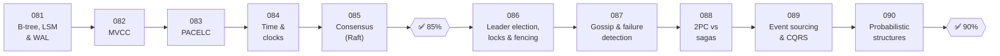

# 🔬 Phase 10: Deep Internals

> **Lessons 081–090 · 81% → 90% · 🅱️ Part B (advanced)**
> You've passed the 🏁 80% gate. This phase opens the hood: **how databases store data**, **how distributed nodes agree**, **how time works (and doesn't)**, and the clever **probabilistic structures** that make web-scale possible. It's great for senior/staff interviews and infrastructure work.

| # | Lesson | ⏱ | One-line idea |
|---|---|---|---|
| 081 | [B-trees, LSM trees & the WAL](081-btree-lsm-and-wal.md) | 10 min | Update in place vs append and merge, with a log to survive crashes |
| 082 | [MVCC](082-mvcc.md) | 9 min | Keep many versions so readers never block writers |
| 083 | [PACELC](083-pacelc.md) | 7 min | CAP's missing half: latency vs consistency when healthy |
| 084 | [Time & clocks](084-time-and-clocks.md) | 10 min | Physical clocks lie. Logical clocks capture order. |
| 085 | [Consensus with Raft](085-consensus-raft.md) | 11 min | How a group agrees on one log despite failures |
| ✅ | [Checkpoint 85%](checkpoint-85.md) | 15 min | |
| 086 | [Leader election, distributed locks & fencing](086-leader-election-and-locks.md) | 10 min | One leader at a time, and stale leaders can't do damage |
| 087 | [Gossip & failure detection](087-gossip-and-failure-detection.md) | 9 min | Rumours spread membership. Heartbeats suspect failures. |
| 088 | [2PC vs sagas](088-2pc-vs-sagas.md) | 10 min | Transactions across services: lock and commit, or undo steps |
| 089 | [Event sourcing & CQRS](089-event-sourcing-and-cqrs.md) | 10 min | Store the history, not just the state, and split reads from writes |
| 090 | [Probabilistic data structures](090-probabilistic-data-structures.md) | 10 min | Bloom filters, HyperLogLog, count-min, Merkle trees |
| ✅ | [Checkpoint 90%](checkpoint-90.md) | 15 min | 🎉 Level-up! |

📌 [Phase cheatsheet](CHEATSHEET.md) · 🎤 [Phase interview questions](INTERVIEW-QUESTIONS.md)

⬅️ Previous phase: [09 Core case studies](../09-core-case-studies/README.md) · ➡️ Next phase: [11 Data processing & advanced designs](../11-advanced-designs/README.md)
