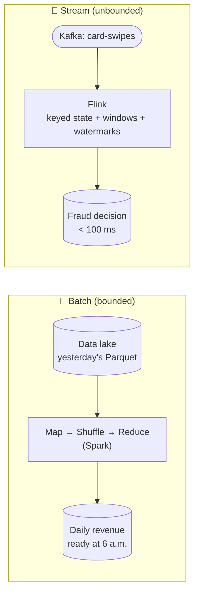

# 091 · Batch vs Stream Processing (MapReduce, Spark, Flink)

> ⏱ 10 min · 📈 91% · 🅱️ Part B (advanced) · Phase 11: Data Processing & Advanced Designs
>
> `██████████████████░░` 91% of the whole guide

---

## 📖 Story

Pantry is global now, and data pours in like a river that never stops: **orders, clicks, courier pings, card swipes**, 300,000 events a second from forty countries.

Two teams arrive at Maya's desk on the same morning, wanting opposite things.

**Finance:** *"We need exact revenue per country, per day, reconciled to the penny, every morning by 6 a.m."*

**Fraud:** *"A stolen card was used **14 times in 90 seconds** across three cities last night. We need to catch that pattern **within 100 milliseconds**, before the 2nd charge, not in tomorrow's report."*

One team wants a careful, complete count of the whole pile. The other wants a hand on the river's surface, feeling each drop as it passes.

I explained to Maya what I'll explain to you: data can be processed in **piles**, or in **streams**.

## 🎯 One-sentence idea

**Batch processing crunches a large, bounded pile of data on a schedule (cheap and simple, but hours old), while stream processing handles unbounded data continuously, event by event or in small windows (fresh in seconds, but you must manage time, ordering, and state carefully).**

## 🧸 Analogy

**Doing laundry**:

- 🧺 **Batch:** collect clothes all week and do **one big load on Sunday**. Efficient, but your favourite shirt stays dirty until Sunday.
- 🚿 **Stream:** wash each item **as soon as it's worn**. Always fresh, but the machine never stops, and you must decide what to do with **socks that turn up late**.

## 🖼️ Visual

*Diagram brief:* on the left, a static pile flowing through Map → Shuffle → Reduce into a morning report. On the right, a never-ending conveyor of events flowing through windowed, stateful operators with a watermark line sweeping across, emitting results every second.



```
MapReduce word count
Map:     "a b a" → (a,1)(b,1)(a,1)      "b c" → (b,1)(c,1)
Shuffle: a:[1,1]  b:[1,1]  c:[1]
Reduce:  a:2  b:2  c:1
```

## 🔬 How it works

- **Batch:** the input is **bounded** (files, a snapshot). **MapReduce** = **map** (record → key-value pairs) → **shuffle** (group by key across machines) → **reduce** (aggregate per key), and it's fault-tolerant by re-running failed tasks. **Spark** keeps the DAG of stages **in memory**, so it's far faster than Hadoop MapReduce, and adds SQL, DataFrames, and ML.
- **Batch trade-off:** simple reasoning, cheap (spot instances, scheduled), easy reprocessing, massive throughput. But **latency = the schedule**.
- **Stream:** the input is **unbounded** (a Kafka topic). Operators keep **keyed state** (counts, joins) in local stores, **checkpointed** for recovery. **Windows** are **tumbling** (fixed), **sliding** (overlapping), or **session** (gap-based).
- **Event time vs processing time:** events arrive **late and out of order**. **Watermarks** declare "events up to T have probably arrived", so windows can close. **Allowed lateness** and **side outputs** handle stragglers. **Exactly-once state** = Flink checkpoints + transactional or idempotent sinks (lesson 060).
- **Architectures:** **Lambda** (batch layer for accuracy + speed layer for freshness, merged at query time: two codebases 😩) vs **Kappa** (**stream only**, reprocess by **replaying the log**). **Lakehouses** (Iceberg/Delta) blur the line, with streaming ingest and batch and stream queries over the same tables.

## 🧩 Worked example

**Finance's metric, batch (Spark SQL, nightly):**

```sql
SELECT country, SUM(amount) AS revenue
FROM orders_parquet
WHERE dt = '2026-10-01'
GROUP BY country;
```

**The same metric live (Flink SQL, 1-minute tumbling windows on event time):**

```sql
SELECT country, TUMBLE_START(order_time, INTERVAL '1' MINUTE) AS window_start, SUM(amount)
FROM orders_stream      -- WATERMARK FOR order_time AS order_time - INTERVAL '10' SECOND
GROUP BY country, TUMBLE(order_time, INTERVAL '1' MINUTE);
```

**Fraud's pattern, keyed state per card:**

```
key = card_id → state: last 5 min of {time, city, amount}
on each swipe: count_90s > 5  OR  impossible_travel(last_city, city, Δt)  → DECLINE (≈ 40 ms)
```

**Late socks (watermarks):**

```
Window 12:00–12:01 closes when the watermark passes 12:01 (≈ 12:01:10 with a 10 s delay)
event_time 12:00:50 arriving 12:01:05 → counted ✅
event_time 12:00:50 arriving 12:03:00 → too late → side output → nightly batch corrects the total
```

## ⚖️ Trade-offs

| | Batch | Stream |
|---|---|---|
| Latency | Minutes–hours | Milliseconds–seconds |
| Complexity | 🟢 Lower | 🔴 Time, state, late data |
| Cost | 💲 Scheduled, spot | 💲💲 Always-on |
| Reprocessing | Re-run the job | Replay the log (needs retention) |
| Accuracy | Exact on complete data | Approximate until windows close |
| Use for | Reports, ML training, billing, backfills | Fraud, alerting, live dashboards |

## 🌍 Real world

- **Google's MapReduce paper (2004)** → Hadoop → **Spark**, the batch standard.
- **Apache Flink** runs real-time pipelines at Alibaba, Uber, and Netflix. **Kafka Streams** embeds streaming inside services.
- **Card networks** decide fraud in real time, and analyse chargebacks in batch.

## 📌 Cheat card

> - **Batch = Sunday laundry** (bounded, cheap, delayed). **Stream = wash as you go** (unbounded, fresh, complex).
> - **Map → shuffle → reduce.** Spark = in-memory DAGs.
> - Streams: **windows · event time + watermarks · checkpointed keyed state**.
> - **Lambda** (two layers) vs **Kappa** (stream + replay).
> - **Freshness worth paying for → stream. Otherwise → batch.**

## 🧪 Feynman check

Explain the laundry, and what to do with a sock that shows up after Sunday's load is already done.

⚠️ **Common confusion:** "Streaming makes batch obsolete." Batch remains **cheaper and simpler** for most analytics, ML training, billing, and backfills, and it's often the **source of truth** that corrects streaming's approximations. Stream where **freshness has real value**.

## ⚡ Quick recall

1. What are the three phases of MapReduce?
<details><summary>Reveal Answer</summary>

Map, shuffle (group by key), reduce.
</details>

2. What does a watermark do in stream processing?
<details><summary>Reveal Answer</summary>

It signals that events up to a given event time are believed complete, so windows can close despite out-of-order arrival.
</details>

3. Lambda vs Kappa architecture?
<details><summary>Reveal Answer</summary>

Lambda runs separate batch and streaming layers and merges them. Kappa uses streaming only, reprocessing by replaying the log.
</details>

## 🎤 Interview practice

**Q. "Design real-time card fraud detection, then make daily reports available hourly without losing accuracy."**
<details><summary>Model answer</summary>

- **Real-time fraud:**
  - Swipes → **Kafka**, keyed by `card_id` → a **Flink** job with **keyed state** and windowed features: swipes per minute, distinct merchants per hour, **impossible travel** (distance/Δt from the last swipe), amount vs the card's typical spend.
  - Score with **rules + an ML model** (features from an online feature store) → a decision within **< 100 ms**, inline with authorization, or flag it for async review.
  - **Exactly-once state** via checkpoints, and **idempotent decisions per transaction ID**.
  - **Batch side:** retrain models daily in Spark on labelled chargebacks, and backfill features.
  - **Degradation:** if the stream job lags, fall back to a simple rule-based decision so payments never block, and alert.
- **Hourly reports:**
  - **Incremental batch:** process only the new partitions each hour (Spark Structured Streaming / incremental jobs over Iceberg/Delta).
  - Or **streaming aggregation** into an OLAP store (ClickHouse/Druid/Pinot) for minute-fresh numbers.
  - Optimize the batch too: partition pruning, columnar formats, more parallelism.
  - **Accuracy:** a **nightly reconciliation** batch recomputes from the complete data (late events included), and **its output is the source of truth** that corrects the hourly numbers.
- **Likely follow-up:** "Why not Lambda?" → two codebases computing the same metric drift apart. Prefer Kappa with replay, plus a reconciliation job where exactness matters.
</details>

## 📖 Teaser

> 📖 *The rivers of data are tamed, and now Maya is asked to build something from first principles: a key-value store for shopping carts that must keep accepting writes even while a data centre burns.*

---

⬅️ [✅ Checkpoint 90%](../10-deep-internals/checkpoint-90.md) · 🗺️ [Phase map](README.md) · ➡️ [092 · Design a Key-Value Store](092-design-key-value-store.md)

✅ **Safe stopping point.** Tick lesson 091 in [PROGRESS.md](../../PROGRESS.md).
