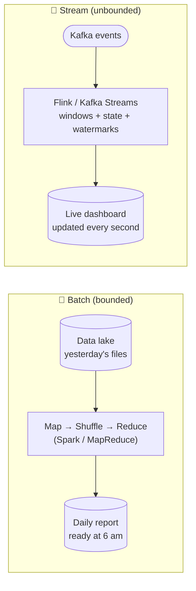

# 091 · Batch vs Stream Processing (MapReduce, Spark, Flink)

> ⏱ 10 min · 📈 91% · 🅱️ Part B (advanced) · Phase 11: Data Processing & Advanced Designs
>
> `██████████████████░░` 91% of the whole guide

---

## 🎯 One-sentence idea

**Batch processing crunches a large, bounded pile of data on a schedule (cheap, simple, but results are hours old). Stream processing handles unbounded data continuously, event by event or in small windows (fresh results in seconds, but it has to handle time, ordering, and state carefully).**

## 🧸 Analogy

**Doing laundry**:

- 🧺 **Batch:** collect clothes all week, then do **one big load on Sunday**. It's efficient, but your favourite shirt is dirty until Sunday.
- 🚿 **Stream:** wash each item **as soon as it's worn**. Always fresh, but you need the machine running constantly, and you must decide how to handle socks that arrive late (late events!).

## 🖼️ Visual



**MapReduce word count:**

```
Map:     "a b a" → (a,1) (b,1) (a,1)       "b c" → (b,1) (c,1)
Shuffle: group by key → a:[1,1]  b:[1,1]  c:[1]
Reduce:  sum → a:2  b:2  c:1
```

## 🔬 How it works

- **Batch processing:**
  - Input is **bounded** (files in S3/HDFS, a DB snapshot). A job reads it all, computes, and writes the output.
  - **MapReduce model:** **map** (transform each record into key-value pairs) → **shuffle** (group by key across machines) → **reduce** (aggregate per key). It's fault-tolerant by re-running failed tasks.
  - **Spark** keeps intermediate data in memory (a DAG of stages), so it's much faster than classic Hadoop MapReduce. It also offers SQL, DataFrames, and ML.
  - ✅ Simple reasoning, cheap (spot instances), easy reprocessing, high throughput. ❌ **Latency = the schedule** (hourly or daily).
- **Stream processing:**
  - Input is **unbounded** (a Kafka topic). Processing is continuous, with **state** (counts, joins) kept in local stores and checkpointed.
  - **Windows:** **tumbling** (fixed, non-overlapping: every minute), **sliding** (overlapping: the last 5 min every 10 s), **session** (grouped by activity gaps).
  - **Event time vs processing time:** events arrive **late or out of order**. **Watermarks** say "we believe all events up to time T have arrived", so a window can close. There's also allowed lateness and side outputs for very late events.
  - **Exactly-once state:** checkpoints (Flink's distributed snapshots) + transactional sinks or idempotent writes (lesson 060).
  - ✅ Low latency (ms to s), real-time alerts. ❌ Complexity (time, state, ordering), and it's harder to reprocess (replay from Kafka).
- **Architectures:**
  - **Lambda:** a batch layer (accurate) + a speed layer (fast, approximate), merged at query time. Two codebases. 😩
  - **Kappa:** **stream only**. Reprocess by replaying the log with new code. Simpler, and made popular by Kafka and Flink.
  - Modern **lakehouses** blur the line (streaming ingest into Iceberg/Delta tables, with batch and streaming queries on the same data).

## 🧩 Worked example

**The same metric, two ways: "revenue per country".**

Batch (Spark SQL, nightly):

```sql
SELECT country, SUM(amount) AS revenue
FROM orders_parquet
WHERE dt = '2026-10-01'
GROUP BY country;
```

Stream (Flink SQL, continuous 1-minute tumbling windows on event time):

```sql
SELECT country,
       TUMBLE_START(order_time, INTERVAL '1' MINUTE) AS window_start,
       SUM(amount) AS revenue
FROM orders_stream            -- Kafka source, WATERMARK FOR order_time AS order_time - INTERVAL '10' SECOND
GROUP BY country, TUMBLE(order_time, INTERVAL '1' MINUTE);
```

**Late events with watermarks:**

```
Window 12:00–12:01 closes when the watermark passes 12:01 (i.e., at ~12:01:10 with 10 s allowed delay)
An event with order_time 12:00:50 arriving at 12:01:05 → counted ✅
An event with order_time 12:00:50 arriving at 12:03:00 → too late → side output / update the result later
```

## ⚖️ Trade-offs

| | Batch | Stream |
|---|---|---|
| Latency | Minutes–hours | Milliseconds–seconds |
| Complexity | 🟢 Lower | 🔴 Higher (time, state, late data) |
| Cost | 💲 Cheap (spot, scheduled) | 💲💲 Always-on clusters |
| Reprocessing | Easy (re-run the job) | Replay from the log (needs retention) |
| Accuracy | Exact on complete data | Approximate until the windows close |
| Use for | Reports, ML training, backfills, billing | Fraud detection, alerting, live dashboards, recommendations |

## 🌍 Real world

- **Google MapReduce paper (2004)** → Hadoop → **Spark** (the batch standard).
- **Apache Flink** powers real-time processing at Alibaba, Uber, Netflix, and others. **Kafka Streams** is embedded in services.
- **Uber, LinkedIn** use Kappa-style architectures, and replay Kafka for reprocessing.
- **Fraud detection** at card networks runs in real time, and chargeback analytics runs in batch.

## 📌 Cheat card

> - **Batch = the Sunday laundry** (bounded, cheap, delayed). **Stream = wash as you go** (unbounded, fresh, complex).
> - MapReduce: **map → shuffle → reduce**. Spark = in-memory DAGs.
> - Streams: **windows (tumbling, sliding, session)**, **event time + watermarks**, **checkpointed state**.
> - **Lambda** (batch + speed layers) vs **Kappa** (stream only + replay).
> - Freshness need → stream. Everything else → batch is simpler.

## 🧪 Feynman check

Explain the laundry analogy, and what to do about a sock that shows up after you've already finished Sunday's load (a late event).

⚠️ **Common confusion:** "Streaming makes batch obsolete." Batch is still cheaper and simpler for most analytics, ML training, and backfills. Use streaming where **freshness has real value**.

## ⚡ Quick recall

1. What are the three phases of MapReduce?
<details><summary>Answer</summary>

Map, shuffle (group by key), reduce.
</details>

2. What does a watermark do in stream processing?
<details><summary>Answer</summary>

It signals that events up to a certain event time are believed complete, so windows can be closed and emitted despite out-of-order arrival.
</details>

3. Lambda vs Kappa architecture?
<details><summary>Answer</summary>

Lambda runs separate batch and streaming layers and merges them. Kappa uses only streaming, and reprocesses by replaying the log.
</details>

## 🎤 Interview practice

**Q1. "Design real-time fraud detection for card transactions."**
<details><summary>Model answer</summary>

- Transactions → **Kafka** → **Flink** job keyed by card/user.
- Stateful features in windows: transactions per minute, distinct merchants per hour, distance from the last location (impossible travel), amount vs the user's average.
- Score with rules + an ML model (features from an online feature store). Emit a decision in < 100 ms for authorization (or flag it for async review).
- **Batch side:** train models on historical labelled data (chargebacks) daily in Spark, and backfill features.
- Exactly-once state via checkpoints. Idempotent decisions per transaction ID.
- **Likely follow-up:** "What if the stream job lags?" → fall back to a simpler rule-based decision to avoid blocking payments, and alert.
</details>

**Q2. "Daily reports are too slow (ready at noon). The business wants them hourly. Options?"**
<details><summary>Model answer</summary>

- **Incremental batch:** process only new partitions every hour (micro-batch), with Spark Structured Streaming or scheduled incremental jobs over Iceberg/Delta tables.
- **Streaming aggregation** into an OLAP store (ClickHouse/Druid/Pinot) for near-real-time numbers.
- Optimize the batch itself: partition pruning, columnar formats, and more parallelism.
- Choose based on the cost vs freshness value.
- **Likely follow-up:** "How do you ensure hourly numbers match the daily truth?" → a nightly reconciliation batch job that corrects late data (it becomes the source of truth).
</details>

---

⬅️ [✅ Checkpoint 90%](../10-deep-internals/checkpoint-90.md) · 🗺️ [Phase map](README.md) · ➡️ [092 · Design a Key-Value Store](092-design-key-value-store.md)

✅ **Safe stopping point.** Tick lesson 091 in [PROGRESS.md](../../PROGRESS.md).
