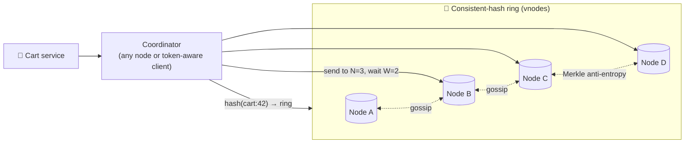

# 092 · Design a Distributed Key-Value Store (Dynamo-style)

> ⏱ 15 min · 📈 92% · 🅱️ Part B (advanced) · Phase 11: Data Processing & Advanced Designs
>
> `██████████████████░░` 92% of the whole guide
>
> 🧬 **Atoms used:** consistent hashing [051] · replication [046, 048] · quorums [054] · CAP/PACELC [052, 083] · vector clocks [084] · gossip & failure detection [087] · LSM + WAL [081] · Merkle trees [090] · hinted handoff [048]

---

## 📖 Story

Pantry's shopping carts carry a brutal requirement written in bold: **"A cart must ALWAYS accept the write."**

Every cart that fails to save is a dinner not ordered. During last quarter's AZ outage, the strongly consistent cart service refused writes on the minority side for nine minutes, and **14,000 carts** vanished into error messages.

Maya evaluates the off-the-shelf options, and none quite fits Pantry's scale, latency, and cost. So the challenge comes back to her, in a form that would have terrified her two years ago:

*Design your own distributed key-value store. From first principles.*

She stares at the blank whiteboard, and then she smiles. Consistent hashing. Quorums. Vector clocks. Gossip. LSM trees. Merkle trees. **She's already learned every piece.**

I told her everything from the last two chapters comes together right here. Let's build it with her.

## 🎯 One-sentence idea

**A Dynamo-style key-value store spreads keys across nodes with consistent hashing, replicates each key to N nodes, uses tunable R/W quorums, detects conflicts with version vectors, and heals itself with hinted handoff, read repair, and Merkle-tree anti-entropy: always writable, eventually consistent.**

## 🧸 Analogy

**Safety-deposit boxes across a city**:

- A **circular map** (the ring) decides each key's branch, and copies go to the **next 3 branches clockwise**.
- Store something once **2 of 3 branches confirm** (W=2). Read by asking **2 of 3** (R=2) and taking the **newest**.
- A branch is closed? A **neighbour keeps your item with a note**: "return to branch C" (hinted handoff).
- Branches **gossip** about who's open, and every night they **compare fingerprint trees** to fix mismatches (anti-entropy).

## 🖼️ Visual

*Diagram brief:* a client hits any coordinator node, which hashes the key onto a ring of vnodes, writes to three replicas, and waits for two ACKs. Dotted gossip lines link neighbours, and a Merkle comparison runs quietly between two replicas in the background.



## 🔬 How it works

- **Requirements:** `put/get/delete`, values ≤ ~1 MB, **always-writable (AP)**, single-digit-ms p99, petabyte scale, **per-request tunable consistency**, and automatic self-healing.
- **Placement + replication:** a **consistent-hash ring with vnodes** (lesson 051) → each key lives on a **preference list of N distinct, rack/AZ-aware nodes**. **Gossip + phi accrual** handles membership and failure detection (lesson 087). Each node stores data in an **LSM** (commit log + memtable + SSTables, lesson 081).
- **Write path:**
  1. The client sends `put(k, v, context)`, where the context carries the version it read.
  2. The coordinator **advances the vector clock** and sends to all N.
  3. Each replica appends to its **commit log + memtable**.
  4. After **W ACKs** → success. Down replicas are covered by **sloppy quorum + hinted handoff**.
- **Read path:**
  1. Query N, wait for **R**, and compare **version vectors**: a dominant version wins.
  2. **Concurrent** versions come back as **siblings** for the client to merge (or LWW/CRDT).
  3. Stale replicas are fixed by **read repair**.
- **Self-healing:** **hinted handoff** for temporary outages, **Merkle-tree anti-entropy** per key range for silent drift (lesson 090), and **tombstones** for deletes (so repair can't resurrect them), purged by compaction after a grace period.
- **Elasticity and tuning:** a new node claims vnodes and **streams ~1/N** of the data. Choose **R/W per request** (R + W > N for overlap, but sloppy quorums make it "usually fresh", **not linearizable**).

## 🧩 Worked example

| N = 3 | Behaviour |
|---|---|
| W=1, R=1 | Fastest, most available, eventual |
| W=2, R=2 | Balanced, overlapping quorums (Maya's cart default) |
| W=3, R=1 | Fast reads, and writes fail if any replica is down |
| W=1, R=3 | Fast writes, slow reads |

**A cart conflict with vector clocks:**

```
v1 [A:1]                       cart={lasagna}
Phone writes via A   → [A:2]          cart={lasagna, curry}
Laptop (read v1) via B → [A:1,B:1]    cart={lasagna, tiramisu}
[A:2] vs [A:1,B:1] → concurrent → siblings → merged {lasagna, curry, tiramisu} → [A:2,B:1]
```

**Capacity:**

```
200 TB × RF 3 = 600 TB → ~4 TB usable/node → 150 nodes (+ headroom → ~200)
1M ops/s ÷ 200 nodes ≈ 5k ops/s per node → comfortable for an LSM on NVMe
```

**Last quarter's AZ outage, replayed:** the AZ dies → its replicas go silent → writes reach W=2 using the surviving replicas + **hinted handoff** → **zero carts lost**. On recovery, hints replay and Merkle repair reconciles the rest.

## ⚖️ Trade-offs

| Decision | Maya's choice | Trade-off |
|---|---|---|
| CAP stance | AP (sloppy quorums) | Always writable, with conflicts and staleness |
| Conflict resolution | Vector clocks + client merge | Correct, but pushes complexity to clients (LWW is simpler, and lossy) |
| Coordinator | Token-aware smart client | Saves a hop, and needs ring awareness |
| Storage | LSM | Great writes, and compaction tuning |
| Consistency | Per request | Flexible, so developers must choose wisely |

## 🌍 Real world

- **Amazon's Dynamo paper (2007)** introduced this design. **Cassandra** (Dynamo-style distribution + a Bigtable-style model) and **Riak** followed it.
- **DynamoDB the service** differs: it uses **Paxos-based leader replication per partition**, not leaderless sloppy quorums.
- **ScyllaDB** reimplements Cassandra in C++ with a shard-per-core architecture.

## 📌 Cheat card

> - **Ring (vnodes) → N replicas → R/W quorums.**
> - **Vector clocks** detect conflicts. **Siblings/CRDT/LWW** resolve them.
> - Heal with **hinted handoff · read repair · Merkle anti-entropy**.
> - **Gossip** membership · **LSM** storage · **tombstones** for deletes.
> - AP "always writable". For strong consistency → **consensus per partition**.

## 🧪 Feynman check

Explain the safety-deposit branches: how an item finds its branch, why two of three must confirm, and how the branches fix mismatches overnight.

⚠️ **Common confusion:** "R + W > N makes Dynamo strongly consistent." **Sloppy quorums** (writes landing on stand-in nodes during failures) and **concurrent writes** break the overlap guarantee. It's "**usually** fresh," never linearizable.

## ⚡ Quick recall

1. What's hinted handoff?
<details><summary>Reveal Answer</summary>

When a replica is down, another node accepts its writes with a hint and forwards them once the replica recovers.
</details>

2. Why store deletes as tombstones?
<details><summary>Reveal Answer</summary>

So repair and anti-entropy don't resurrect deleted data from replicas that missed the delete.
</details>

3. How are conflicting versions detected?
<details><summary>Reveal Answer</summary>

With vector clocks: if neither version's vector dominates the other, they're concurrent (a conflict).
</details>

## 🎤 Interview practice

**Q. "Design a key-value store doing 1M ops/s that survives a full datacenter failure, then change it to provide strong consistency."**
<details><summary>Model answer</summary>

- **The AP design:**
  - A ring with vnodes, **RF = 3 per datacenter** across multiple DCs, with one replica per AZ inside each.
  - **`LOCAL_QUORUM`** reads and writes for low latency, with **async cross-DC replication**.
  - LSM storage, gossip membership with phi accrual, hinted handoff, read repair, and scheduled Merkle repair.
  - **Token-aware clients** skip the coordinator hop.
  - **Monitor:** per-node p99, pending compactions, the hints backlog, repair progress, and tombstone ratios.
  - **During a DC outage**, the surviving DC keeps serving (AP). On recovery, hints and repair resynchronize the returning DC.
- **Strong consistency:**
  - Replace leaderless sloppy quorums with **consensus per partition**: a **Raft/Paxos group per key range** (TiKV, CockroachDB, DynamoDB-style).
  - The range **leader serializes writes**, commits on a **majority**, and serves linearizable reads via **ReadIndex or leases**.
  - **The cost:** the minority side is **unavailable** (CP), latency depends on the leader, and leader placement and rebalancing need managing.
  - **Multi-key transactions:** a transaction layer on top (2PC across Raft groups with a timestamp oracle or HLC, Percolator/TiDB-style).
- **Likely follow-up:** "Carts on CP or AP?" → AP with mergeable sets (OR-Set CRDT), because availability is worth more than linearizability for a cart. Inventory and payments go CP.
</details>

## 📖 Teaser

> 📖 *Carts never drop now, and the search team wants something that feels like mind-reading: suggestions that appear after a single keystroke, in under 100 milliseconds, for millions of hungry people.*

---

⬅️ [091 · Batch vs Stream](091-batch-vs-stream-processing.md) · 🗺️ [Phase map](README.md) · ➡️ [093 · Design Search Autocomplete](093-design-autocomplete.md)

✅ **Safe stopping point.** Tick lesson 092 in [PROGRESS.md](../../PROGRESS.md).
