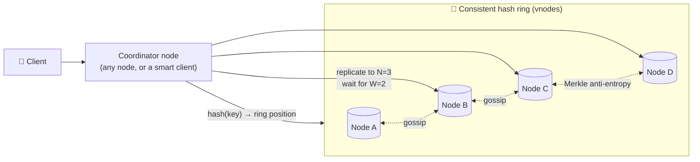

# 092 · Design a Distributed Key-Value Store (Dynamo-style)

> ⏱ 15 min · 📈 92% · 🅱️ Part B (advanced) · Phase 11: Data Processing & Advanced Designs
>
> `██████████████████░░` 92% of the whole guide
>
> 🧬 **Atoms used:** consistent hashing [051] · replication [046, 048] · quorums [054] · CAP/PACELC [052, 083] · vector clocks [084] · gossip & failure detection [087] · LSM + WAL [081] · Merkle trees [090] · hinted handoff [048]

---

## 📖 Story

Pantry's shopping carts had to *always* accept writes, even when a data centre failed, because a cart that can't be saved means lost sales. Nothing off the shelf quite fit, so Leo asked Maya to design one from first principles. I told her everything from the last two chapters comes together here. Let's build it with her.

## 🎯 One-sentence idea

**A Dynamo-style key-value store spreads keys across nodes with consistent hashing, replicates each key to N nodes, uses tunable quorums (R, W) for reads and writes, detects conflicts with version vectors, and heals itself with hinted handoff, read repair, and Merkle-tree anti-entropy. It's always writable, and eventually consistent.**

## 🧸 Analogy

A **chain of safety-deposit boxes across a city**:

- Each key's box location is decided by a **circular map** (the hash ring). Copies go to the **next 3 branches clockwise**.
- To store something, you need **2 of the 3 branches** to confirm (W=2). To read, you ask **2 of 3** (R=2), and take the **newest** copy.
- If a branch is closed, a **neighbouring branch holds your item with a note** ("return to branch C when it reopens"): hinted handoff.
- Branches **gossip** about who's open and closed, and every night they **compare fingerprint trees** of their boxes to fix any mismatches (anti-entropy).

## 🖼️ Visual



## 🔬 How it works

### 1️⃣ Requirements
- `put(key, value)`, `get(key)`, and `delete(key)`. Values up to ~1 MB.
- **Highly available writes** (AP: "always writable", like a shopping cart), **low latency** (single-digit ms p99), **horizontally scalable** to petabytes, **tunable consistency**, and automatic recovery from failures.

### 2️⃣ Core components (the deep dives)

| Problem | Technique |
|---|---|
| **Partitioning** | Consistent hashing with **virtual nodes** (lesson 051) |
| **Replication** | Each key on the next **N** distinct nodes (preference list), **rack/AZ-aware** |
| **Consistency** | Tunable **R/W quorums** (R + W > N for overlap), per request |
| **Versioning & conflicts** | **Vector clocks / version vectors**. Siblings returned to the client for merge, or LWW (lesson 048) |
| **Temporary failures** | **Sloppy quorum + hinted handoff** |
| **Permanent failures / drift** | **Anti-entropy with Merkle trees** per key range (lesson 090) |
| **Read-time fixes** | **Read repair**: update stale replicas seen during reads |
| **Membership & failure detection** | **Gossip** + phi accrual (lesson 087) |
| **Storage engine** | **LSM tree** (commit log + memtable + SSTables) (lesson 081) |

### 3️⃣ Write path
1. The client sends `put(k, v, context)` (the context carries the version it read).
2. The coordinator computes the preference list (N nodes), increments the vector clock, and sends to all N.
3. Each replica appends to its **commit log** + memtable, then acks.
4. After **W** acks → success to the client. Slow or down replicas get the write later (hinted handoff).

### 4️⃣ Read path
1. The coordinator asks the N replicas, and waits for **R** responses.
2. It compares versions: if one dominates, return it. If they're **concurrent**, return **siblings** (or resolve with LWW/CRDT).
3. It sends newer data to the stale replicas (**read repair**).

### 5️⃣ Adding or removing nodes
- The new node takes over **vnodes** and **streams** those ranges from their current owners. Only ~1/N of the data moves.
- Removal: its ranges are re-replicated from the remaining copies.

### 6️⃣ Deletes
- Written as **tombstones** (so a stale replica doesn't "resurrect" the key during repair), and purged after a grace period by compaction.

## 🧩 Worked example

**Configurations (N = 3):**

| Setting | Behaviour |
|---|---|
| W=1, R=1 | Fastest, highest availability, eventual consistency |
| W=2, R=2 | Balanced, with overlapping quorums (fresh reads, barring edge cases) |
| W=3, R=1 | Fast reads, and writes fail if any replica is down |
| W=1, R=3 | Fast writes, slow reads |

**Conflict via vector clocks (shopping cart):**

```
v1 [A:1]        cart={book}
Client X writes via A → [A:2]           cart={book, pen}
Client Y (read v1) writes via B → [A:1,B:1]  cart={book, mug}
[A:2] vs [A:1,B:1] → concurrent → siblings returned → the client merges: {book, pen, mug} → writes [A:2,B:1]
```

**Capacity sketch:**

```
Data 200 TB × RF 3 = 600 TB → at ~4 TB usable per node → 150 nodes (+ headroom → ~200)
1M ops/s ÷ 200 nodes = 5k ops/s per node (comfortable for an LSM on NVMe)
```

## ⚖️ Trade-offs

| Decision | Choice | Trade-off |
|---|---|---|
| CAP stance | AP (sloppy quorums) | Always writable, but conflicts and staleness |
| Conflict resolution | Vector clocks + client merge | Correct, but pushes complexity to the client (LWW is simpler but lossy) |
| Coordinator | Any node vs a smart client | A smart client saves a hop, and needs ring awareness |
| Storage | LSM | Great writes, and needs compaction tuning |
| Consistency level | Per request | Flexibility, but developers must choose wisely |

## 🌍 Real world

- **Amazon Dynamo paper (2007)** introduced this design. **Cassandra** (Dynamo-style distribution + a Bigtable-style data model) and **Riak** followed it closely.
- **DynamoDB** (the service) differs: it uses **Paxos-based leader replication per partition**, rather than Dynamo's leaderless sloppy quorums.
- **ScyllaDB** reimplements Cassandra in C++ for higher per-node performance.

## 📌 Cheat card

> - **Ring (vnodes) → N replicas → R/W quorums** → tunable consistency.
> - **Vector clocks** detect conflicts. **Siblings** or LWW resolve them.
> - Healing: **hinted handoff** (temporary), **read repair** (on read), **Merkle anti-entropy** (background).
> - **Gossip** for membership. **LSM** for storage. **Tombstones** for deletes.
> - It's the AP "always writable" design. For strong consistency, use a consensus-per-partition design instead.

## 🧪 Feynman check

Explain the safety-deposit branches analogy: how items find their branch, why you need 2 of 3 confirmations, and how branches fix mismatches overnight.

⚠️ **Common confusion:** "R + W > N makes Dynamo strongly consistent." With **sloppy quorums** (writes going to stand-in nodes during failures) and concurrent writes, overlap isn't guaranteed. It's "usually fresh," not linearizable.

## ⚡ Quick recall

1. What's hinted handoff?
<details><summary>Answer</summary>

When a replica is down, another node accepts its writes with a hint, and forwards them when the replica recovers.
</details>

2. Why store deletes as tombstones?
<details><summary>Answer</summary>

So repair and anti-entropy don't "resurrect" deleted data from replicas that missed the delete.
</details>

3. How are conflicting versions detected?
<details><summary>Answer</summary>

With vector clocks: if neither version's vector dominates the other, they're concurrent (a conflict).
</details>

## 🎤 Interview practice

**Q1. "Design a key-value store that supports 1M ops/s and survives a datacenter failure."**
<details><summary>Model answer</summary>

- Consistent hashing with vnodes, RF=3 with **one replica per AZ** (or per datacenter for DC failure: RF=3 per DC with multi-DC replication).
- `LOCAL_QUORUM` reads and writes for low latency, with async cross-DC replication.
- The LSM storage engine, gossip membership, hinted handoff, read repair, and Merkle anti-entropy.
- Clients are ring-aware (token-aware routing) to skip the extra coordinator hop.
- Monitoring: p99 per node, pending compactions, hints backlog, repair status.
- **Likely follow-up:** "What happens to writes during the DC outage?" → the local DC keeps serving (AP), and on recovery, hints and repair sync the lost DC.
</details>

**Q2. "How would you change the design to provide strong consistency?"**
<details><summary>Model answer</summary>

- Replace leaderless sloppy quorums with **consensus per partition** (Raft/Paxos group per key range, as in TiKV, CockroachDB, and DynamoDB).
- The leader serializes the writes for its range, which commit on a majority, and reads go through the leader (ReadIndex or leases).
- The cost: minority partitions become unavailable (CP), with leader-based latency and the need to rebalance leaders.
- **Likely follow-up:** "Multi-key transactions?" → add a transaction layer (2PC across Raft groups with a timestamp oracle or HLC, like Percolator or TiDB).
</details>

> 📖 *Next, customers want search suggestions to appear as they type.*

---

⬅️ [091 · Batch vs Stream](091-batch-vs-stream-processing.md) · 🗺️ [Phase map](README.md) · ➡️ [093 · Design Search Autocomplete](093-design-autocomplete.md)

✅ **Safe stopping point.** Tick lesson 092 in [PROGRESS.md](../../PROGRESS.md).
