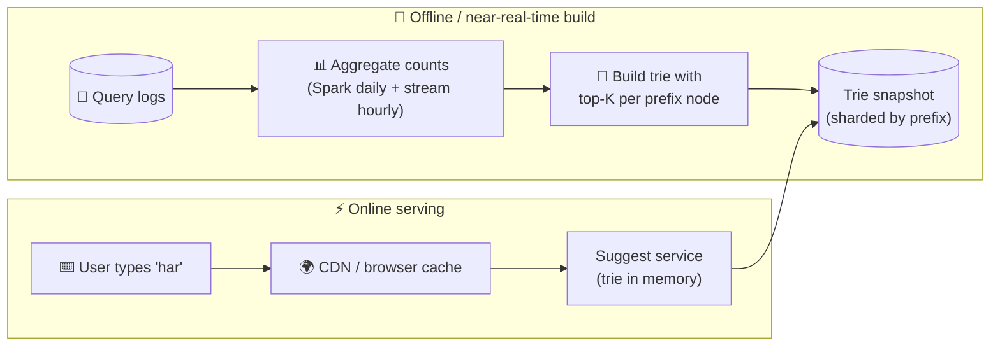

# 093 · Design Search Autocomplete (Typeahead)

> ⏱ 12 min · 📈 93% · 🅱️ Part B (advanced) · Phase 11: Data Processing & Advanced Designs
>
> `██████████████████░░` 93% of the whole guide
>
> 🧬 **Atoms used:** tries & inverted indexes [043] · caching & CDN [023, 027] · batch/stream aggregation [091] · top-K [099] · sharding [049] · latency budgets [003]

---

## 🎯 One-sentence idea

**Autocomplete returns the top few popular completions for a typed prefix within ~100 ms. The trick is precomputing the top-K suggestions for every prefix offline (from query logs) and serving them from memory and caches, instead of searching at request time.**

## 🧸 Analogy

A **librarian who has memorized the most popular book titles for every starting letter combination**:

- You say "**har**", and instantly: "Harry Potter, Harvard Business Review, Harper Lee…"
- The librarian doesn't search the shelves while you wait. **Every night** they review what people asked for and **update their memorized lists**.
- Very common prefixes ("h", "ha") are answered from a **sticky note on the desk** (cache/CDN).

## 🖼️ Visual



**A trie with cached top-K at each node:**

```
(root)
 └─ h  top3: [hello, harry potter, hotel]
     └─ a  top3: [harry potter, happy birthday, hat]
         └─ r  top3: [harry potter, harvard, harry styles]
             └─ r  top3: [harry potter, harry styles, harrison ford]
```

## 🔬 How it works

### 1️⃣ Requirements
- Return the **top 5–10 suggestions** for a prefix, ranked by popularity (plus freshness and personalization as stretch goals).
- **< 100 ms end to end** (users type fast). Very high QPS (every keystroke). Suggestions may be **slightly stale** (minutes to hours). Filter offensive terms.

### 2️⃣ Estimates
```
DAU 100M × 10 searches/day × ~6 keystrokes = 6B suggest requests/day → ~70k/s (peak ~200k/s)
Distinct queries worth indexing: ~100M · top-K per prefix node with K=10
```
**So this means:** it must be served from **memory + caches**. It's read-only at request time, and updates happen **offline**.

### 3️⃣ Data structure
- **Trie** (prefix tree): each node is a prefix. A naive lookup walks the subtree and sorts all completions, which is **too slow**.
- **Optimization:** store the **precomputed top-K completions at every node**. The lookup becomes O(prefix length) + O(1) to return K.
- **Memory:** limit the depth (e.g., prefixes up to 20–30 chars) and prune rare queries. Alternatives: sorted arrays with binary search, or **FST** (finite-state transducers, used by Lucene) for compact storage.

### 4️⃣ Building and updating
- **Batch (daily/weekly):** aggregate the query logs (count by query, with time decay) → build a new trie → **snapshot** → load it onto the servers (a blue-green swap).
- **Near-real-time trending:** a streaming job (lesson 091) detects surging queries ("earthquake") and merges them into a small "fresh" layer that's combined with the base results.
- **Filtering:** remove offensive, PII, and legally blocked terms at build time.

### 5️⃣ Serving
- **Shard** by prefix (e.g., by the first 1–2 characters, with care for skew, since "s" is huge) or **replicate** the whole trie if it fits in memory (it usually does after pruning: a few GB to tens of GB).
- **Caching:** short prefixes are extremely hot, so cache them at the **CDN/browser** (short TTL) and in-process.
- **Client tricks:** **debounce** (wait ~100–200 ms after the last keystroke), cancel in-flight requests, and fetch the top-K for a prefix and **filter locally** as the user types more characters.

### 6️⃣ Personalization (stretch)
- Blend global suggestions with the user's own recent searches (stored per user) and context (location, language) at request time, as a light re-ranking of ~50 candidates.

## 🧩 Worked example

**Building top-K per node (conceptual):**

```python
def build(queries_with_counts, K=10):
    root = Node()
    for q, count in queries_with_counts:            # e.g., ("harry potter", 9_500_000)
        node = root
        for ch in q[:MAX_DEPTH]:
            node = node.children.setdefault(ch, Node())
            node.candidates.push((count, q))         # keep a bounded min-heap of size K
    return root

def suggest(root, prefix):
    node = root
    for ch in prefix:
        node = node.children.get(ch)
        if not node: return []
    return node.top_k()                              # already sorted → O(K)
```

**Latency budget:**

```
Client debounce 150 ms (not counted as server time)
CDN hit for short prefixes: ~10–20 ms
Server miss: network 30 ms + trie lookup < 1 ms + serialization 1 ms → ~35 ms ✅
```

## ⚖️ Trade-offs

| Decision | Choice | Trade-off |
|---|---|---|
| Top-K computation | Precomputed per node | Fast reads, but big memory and staleness |
| Freshness | Daily rebuild + trending layer | Mostly stale-OK, with hot news still appearing |
| Storage | Full replication of a pruned trie | Simple and fast, bounded by RAM |
| Sharding | By prefix | Scales, but skewed prefixes need splitting |
| Client | Debounce + local filtering | Far fewer requests, and a slight delay |

## 🌍 Real world

- **Google, Amazon, and YouTube** suggest from query logs, with trending and personalization layers.
- **Elasticsearch completion suggester** uses FSTs in memory. **Algolia** focuses on instant typeahead with typo tolerance.
- **LinkedIn's typeahead** (Cleo) blends network-based personalization.

## 📌 Cheat card

> - **Precompute top-K per prefix** (a trie node cache), and never search at request time.
> - Build **offline from logs** (batch) + a **trending layer** (stream).
> - Serve from **memory**. **Cache short prefixes at the CDN/browser.**
> - Client: **debounce**, cancel stale requests, and filter locally.
> - Filter offensive and PII suggestions at build time.

## 🧪 Feynman check

Explain the librarian who memorizes the popular titles for each prefix, and why they update their lists every night instead of searching the shelves while you wait.

⚠️ **Common confusion:** "Use the main search engine for autocomplete." Full search is too slow and heavy per keystroke. Autocomplete is a **separate, precomputed, in-memory** index optimized for prefixes.

## ⚡ Quick recall

1. Why store top-K at each trie node?
<details><summary>Answer</summary>

So a lookup is just walking the prefix path and returning a precomputed list, avoiding a subtree traversal and sort at request time.
</details>

2. How do new trending queries appear quickly?
<details><summary>Answer</summary>

A streaming job detects surging queries and maintains a small fresh layer merged with the base (batch-built) suggestions.
</details>

3. Name two client-side optimizations.
<details><summary>Answer</summary>

Debouncing keystrokes, cancelling outdated requests, caching results, filtering locally from a shorter prefix's results (any two).
</details>

## 🎤 Interview practice

**Q1. "The trie doesn't fit on one machine. What do you do?"**
<details><summary>Model answer</summary>

- **Prune** first: drop low-frequency queries, cap the depth, and compress (FSTs, shared suffixes).
- If it's still too big: **shard by prefix range**, with a routing table mapping prefix ranges to shards (split hot ranges like "s" further), and replicate each shard.
- A small **routing layer** or smart client picks the shard from the first characters.
- **Likely follow-up:** "What about uneven load across shards?" → size the shards by traffic, not alphabet. Cache the hottest prefixes at the edge.
</details>

**Q2. "How would you personalize suggestions without blowing the latency budget?"**
<details><summary>Model answer</summary>

- Fetch the ~20–50 global candidates for the prefix (fast, precomputed) and the user's recent queries (a small per-user list in Redis) **in parallel**.
- Re-rank with a lightweight scoring function (recency, the user's history match, locale), within ~5 ms.
- Cache per-user results briefly. Fall back to global results if the personalization call is slow (a timeout of ~20 ms).
- **Likely follow-up:** "Privacy?" → don't suggest other users' personal queries. Only aggregate queries above a frequency threshold appear globally.
</details>

---

⬅️ [092 · Key-Value Store](092-design-key-value-store.md) · 🗺️ [Phase map](README.md) · ➡️ [094 · Design a Web Crawler](094-design-web-crawler.md)

✅ **Safe stopping point.** Tick lesson 093 in [PROGRESS.md](../../PROGRESS.md).
