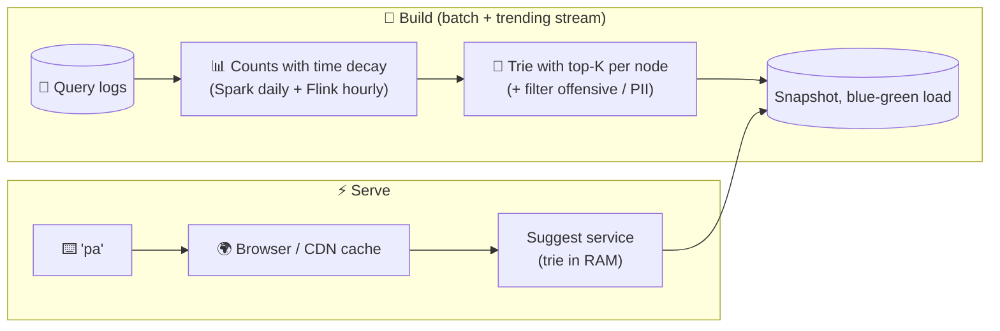

# 093 · Design Search Autocomplete (Typeahead)

> ⏱ 12 min · 📈 93% · 🅱️ Part B (advanced) · Phase 11: Data Processing & Advanced Designs
>
> `██████████████████░░` 93% of the whole guide
>
> 🧬 **Atoms used:** tries & inverted indexes [043] · caching & CDN [023, 027] · batch/stream aggregation [091] · top-K [099] · sharding [049] · latency budgets [003]

---

## 📖 Story

A hungry customer types **`p`**… then **`a`**…

They expect **"pad thai"** to bloom beneath the search bar **before their thumb reaches the third letter**. Anything slower than ~100 ms feels broken, like a waiter who stares blankly while you're halfway through ordering.

Maya's first prototype runs a **full search** on every keystroke. Each user types ~6 characters per search, and millions of users are typing at dinner time. That's **200,000 full-text searches per second** against a cluster built for 20,000. The search cluster's CPU graph shoots up like a flare at the first dinner rush.

I love this problem, because its solution is almost a magic trick: you do nearly **all** the work **before anyone types a single letter**. Let me show you.

## 🎯 One-sentence idea

**Autocomplete returns the top few popular completions for a typed prefix within ~100 ms, by precomputing the top-K suggestions for every prefix offline from query logs and serving them from memory and caches, never searching at request time.**

## 🧸 Analogy

A **librarian who has memorized the most popular titles for every opening few letters**:

- You say "**har**", and instantly: "Harry Potter, Harvard Review, Harper Lee…"
- They don't search the shelves while you wait. **Every night** they review the day's requests and **refresh their memorized lists**.
- The commonest openings ("h", "ha") are on a **sticky note on the desk** (cache/CDN).

## 🖼️ Visual

*Diagram brief:* a nightly build pipeline turns query logs into a trie where every node carries its own top-K list. Online, a keystroke goes to the browser cache or CDN first, and only rarely reaches an in-memory suggest server that returns a precomputed list in under a millisecond.



```
(root)
 └─ p  top3: [pizza, pad thai, pasta]
     └─ a  top3: [pad thai, pasta, paella]
         └─ d  top3: [pad thai, pad see ew, padron peppers]
```

## 🔬 How it works

- **Requirements:** the **top 5–10** suggestions by popularity (freshness and personalization as stretch goals), **< 100 ms end to end**, every keystroke, **slight staleness OK** (minutes to hours), offensive and PII terms filtered.
- **Estimates:** 100M DAU × 10 searches × ~6 keystrokes = **6B requests/day ≈ 70k/s (peak ~200k/s)**, over ~100M distinct worthwhile queries. **So:** serve from **memory + caches**, read-only at request time, with all updates **offline**.
- **The structure:** a **trie** whose **every node stores its precomputed top-K completions**, so a lookup = walk the prefix (O(len)) + return K in O(1). Bound the memory by **capping depth (~20–30 chars)**, **pruning rare queries**, or using compact **FSTs** (Lucene's choice).
- **Building:** **daily/weekly batch** aggregation of logs (counts with time decay) → build a new trie → **snapshot** → **blue-green** load. Plus a **streaming trending layer** that surfaces surging queries ("pumpkin spice") within minutes, merged with the base results. Filter at build time.
- **Serving:** **replicate** the pruned trie on every server (it usually fits: a few to tens of GB), or **shard by prefix** with traffic-sized ranges ("s" is huge). **Cache short prefixes at the CDN/browser.**
- **Client tricks:** **debounce** (~100–200 ms), **cancel stale requests**, and **filter locally**, so "pad" can be computed from the cached results of "pa" without asking the server.

## 🧩 Worked example

```python
def build(queries_with_counts, K=10):
    root = Node()
    for q, score in queries_with_counts:             # ("pad thai", 9_500_000)
        node = root
        for ch in q[:MAX_DEPTH]:
            node = node.children.setdefault(ch, Node())
            node.candidates.push((score, q))          # bounded min-heap of size K
    return root

def suggest(root, prefix):
    node = root
    for ch in prefix:
        node = node.children.get(ch)
        if not node: return []
    return node.top_k()                               # precomputed → O(K)
```

**Latency budget:**

```
Client debounce 150 ms (not server time)
Short prefix ("p", "pa") → CDN hit ~10–20 ms
Server miss → network ~30 ms + trie walk < 1 ms + serialize ~1 ms ≈ 35 ms ✅
```

**The dinner-rush flare, replayed:** CDN + browser caches absorb ~**80%** of keystrokes (short prefixes are shared by everyone). The suggest fleet serves the rest from RAM at **< 1 ms** per lookup. **Zero** load on the search cluster.

## ⚖️ Trade-offs

| Decision | Maya's choice | Trade-off |
|---|---|---|
| Top-K | Precomputed per node | Instant reads, but more memory and staleness |
| Freshness | Daily rebuild + trending layer | Stale-OK baseline, and hot topics still appear |
| Storage | Replicate a pruned trie | Simple and fast, bounded by RAM |
| Sharding | By traffic-sized prefix range | Scales, but hot prefixes need splitting |
| Client | Debounce + local filtering | Far fewer requests, a tiny delay |

## 🌍 Real world

- **Google, Amazon, and YouTube** suggest from query logs, with trending and personalization layers.
- The **Elasticsearch completion suggester** keeps FSTs in memory. **Algolia** specializes in instant, typo-tolerant typeahead.
- **LinkedIn's Cleo** blended network-based personalization into typeahead.

## 📌 Cheat card

> - **Precompute top-K per prefix.** Never search at request time.
> - Build **offline from logs** + a **streaming trending layer**.
> - **Serve from RAM. Cache short prefixes at the CDN/browser.**
> - Client: **debounce, cancel, filter locally**.
> - **Filter offensive and PII terms at build time.**

## 🧪 Feynman check

Explain the librarian with memorized lists, and why refreshing them nightly beats searching the shelves while the customer waits.

⚠️ **Common confusion:** "Just point autocomplete at the main search engine." Full-text search per keystroke is far too heavy. Autocomplete is a **separate, precomputed, in-memory prefix index**, built for exactly one question.

## ⚡ Quick recall

1. Why store top-K at each trie node?
<details><summary>Reveal Answer</summary>

So a lookup just walks the prefix path and returns a precomputed list, with no subtree traversal or sort at request time.
</details>

2. How do new trending queries show up quickly?
<details><summary>Reveal Answer</summary>

A streaming job detects surging queries and maintains a small fresh layer that's merged with the batch-built suggestions.
</details>

3. Name two client-side optimizations.
<details><summary>Reveal Answer</summary>

Any two of: debouncing, cancelling outdated requests, caching results, filtering locally from a shorter prefix's results.
</details>

## 🎤 Interview practice

**Q. "The trie no longer fits on one machine, and the product wants personalized suggestions without blowing the 100 ms budget. Handle both."**
<details><summary>Model answer</summary>

- **Too big for one machine:**
  - **Prune first:** drop low-frequency queries, cap the depth, and compress with **FSTs** / shared suffixes.
  - Still too big? **Shard by prefix range**, sized by **traffic** rather than alphabet ("s" and "p" split further), with a routing table (or smart client) mapping prefix → shard, and **replicas per shard**.
  - **Edge-cache** the hottest short prefixes so shard skew matters less.
- **Personalization within budget:**
  - In **parallel**: fetch ~20–50 global candidates for the prefix (precomputed, < 1 ms) **and** the user's recent queries (a small per-user list in Redis, ~1 ms).
  - **Re-rank** with a light scoring function (recency, matches with the user's history, locale, time of day) in ~2–5 ms.
  - **Timeout the personalization call at ~20 ms**, and fall back to global results on a miss.
  - Cache the per-user merged results briefly.
- **Privacy:** never surface **other users' personal queries**. Only aggregates above a k-anonymity-style frequency threshold become global suggestions, and per-user history stays per user.
- **Likely follow-up:** "How do you ship a new trie safely?" → build offline, validate (size, top-query sanity, blocked terms), and **blue-green swap** behind a version flag, with instant rollback.
</details>

## 📖 Teaser

> 📖 *Suggestions now appear like mind-reading, and Pantry wants to go further: discover every recipe published anywhere on the internet, politely, without getting lost in infinite loops.*

---

⬅️ [092 · Key-Value Store](092-design-key-value-store.md) · 🗺️ [Phase map](README.md) · ➡️ [094 · Design a Web Crawler](094-design-web-crawler.md)

✅ **Safe stopping point.** Tick lesson 093 in [PROGRESS.md](../../PROGRESS.md).
