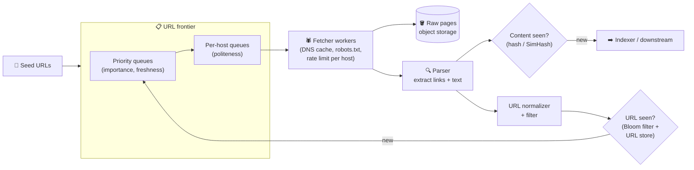

# 094 · Design a Web Crawler

> ⏱ 13 min · 📈 94% · 🅱️ Part B (advanced) · Phase 11: Data Processing & Advanced Designs
>
> `███████████████████░` 94% of the whole guide
>
> 🧬 **Atoms used:** queues & priorities [057] · Bloom filters [090] · DNS [011] · consistent hashing [051] · rate limiting (politeness) [024] · object storage [042] · dedup / hashing [080] · distributed workers [025]

---

## 🎯 One-sentence idea

**A web crawler repeatedly takes a URL from a prioritized frontier, politely fetches the page, extracts new links, skips URLs and content it has already seen, and stores the pages. At scale, the hard parts are politeness per website, deduplication across billions of URLs, and prioritization.**

## 🧸 Analogy

An army of **library scouts** mapping every book in the world:

- A **to-visit list** (the frontier), where important libraries go first (priority).
- Scouts visit a library, **photograph the pages** (download), and note every **reference to other libraries** (links) to add to the list.
- **Don't visit the same place twice** (a seen-URL check), and **don't store the same book twice** under different names (content dedup).
- **Be polite:** don't send 100 scouts to one small library at once. One scout at a time per library, with pauses (per-host rate limits and robots.txt).

## 🖼️ Visual



## 🔬 How it works

### 1️⃣ Requirements
- Crawl **billions of pages**, prioritize important and fresh pages, **re-crawl** changing pages periodically, obey **robots.txt** and politeness, avoid **duplicates** and **crawler traps**, and store the content for indexing. Scale horizontally, and be robust to failures and malformed pages.

### 2️⃣ Estimates
```
Target: 1B pages/month → ~400 pages/s (peak ~1,000/s)
Avg page 100 KB (HTML) → 100 TB/month raw (compressed ~25 TB)
Unique URLs discovered: ~10B → the seen-URL set: a Bloom filter at 1% FP ≈ 12 GB
```

### 3️⃣ URL frontier (the core deep dive)
- **Prioritization:** front queues by priority (PageRank-like importance, domain quality, change frequency).
- **Politeness:** back queues **per host**. Each host is assigned to **one worker** (a consistent hash of the hostname), which fetches with a delay (e.g., 1 request per few seconds per host, respecting `Crawl-delay`).
- Stored durably (partly on disk, since it's too large for memory), and distributed by host hash across frontier nodes.

### 4️⃣ Fetching
- **DNS resolution** is a bottleneck, so use a local **DNS cache** and async resolvers.
- **robots.txt** is fetched and cached per host, and the rules are honoured.
- Timeouts, max page size, redirects (with limits), and conditional GETs (`If-Modified-Since`, ETag) for re-crawls.

### 5️⃣ Deduplication
- **URL-level:** **normalize** (lowercase host, remove fragments, sort query params, strip tracking params), then check a **Bloom filter** (fast, in memory) + a persistent URL store.
- **Content-level:** an exact duplicate check via a **hash** (SHA-256 of the normalized content). **Near-duplicates** (mirrors, boilerplate differences) via **SimHash/MinHash**.

### 6️⃣ Traps and robustness
- **Crawler traps:** infinite calendars, session IDs in URLs, and endless parameter combinations. Limit the URL length and depth, cap the pages per host, and detect repeating patterns.
- Handle malformed HTML, huge files, and non-HTML content types (skip or route them to specialized processors).

### 7️⃣ Re-crawling
- Track each page's **change frequency** (the hash changed?) and schedule re-crawls adaptively: news homepages every few minutes, and static pages monthly.

## 🧩 Worked example

**URL normalization:**

```
https://Example.com:443/a/../b/?utm_source=x&id=7#top
→ https://example.com/b?id=7
```

**Politeness via host → worker assignment:**

```python
def worker_for(url):
    host = urlparse(url).hostname
    return ring.node_for(host)          # consistent hashing: the same host → the same worker

# the worker keeps per-host next_allowed_time
if now() < next_allowed[host]:
    requeue(url, at=next_allowed[host])
else:
    fetch(url); next_allowed[host] = now() + crawl_delay(host)   # e.g., 2 s
```

**Throughput sanity check:**

```
1,000 pages/s ÷ ~2 s delay per host → need ≥ 2,000 hosts being crawled concurrently
Each worker handles ~500 concurrent fetches (async I/O) → a handful of worker machines for fetching
Bottlenecks usually: DNS, bandwidth, parsing CPU, frontier I/O
```

## ⚖️ Trade-offs

| Decision | Choice | Trade-off |
|---|---|---|
| Seen-URL check | Bloom filter + a store | Tiny memory, and rare false positives skip a new URL |
| Politeness | Host-affine workers | Simple per-host limits, but big hosts are slower to crawl |
| Prioritization | Importance + freshness scores | Better coverage of what matters, and more compute |
| Near-dup detection | SimHash | Catches mirrors, and tuning thresholds is tricky |
| Storage | Compressed WARC files in object storage | Cheap and replayable, but it needs indexing downstream |

## 🌍 Real world

- **Googlebot** crawls at a massive scale with sophisticated scheduling, and each site's crawl rate adapts to server health.
- **Common Crawl** publishes billions of pages monthly as WARC files on S3.
- **Apache Nutch, Heritrix, StormCrawler** are open-source crawlers.

## 📌 Cheat card

> - Loop: **frontier → fetch → store → parse → dedupe → enqueue new URLs**.
> - **Politeness:** host-affine workers, per-host delays, robots.txt.
> - **Dedup:** URL normalization + **Bloom filter**. Content hash + **SimHash** for near-dups.
> - **Priority + adaptive re-crawl** by importance and change frequency.
> - Watch out for **traps**, **DNS bottlenecks**, and huge or malformed pages.

## 🧪 Feynman check

Explain the library scouts analogy, and why sending one scout at a time to each small library (politeness) matters.

⚠️ **Common confusion:** "Crawl as fast as possible." Hammering a site gets you **blocked** and can take small sites **down**. Politeness is a first-class requirement, not an afterthought.

## ⚡ Quick recall

1. How does the frontier enforce politeness?
<details><summary>Answer</summary>

With per-host queues assigned to specific workers (a hash of the hostname), each fetching from a host no faster than its allowed delay, while respecting robots.txt.
</details>

2. Why normalize URLs before the seen-check?
<details><summary>Answer</summary>

Many different URL strings point to the same page (case, fragments, tracking params, default ports). Normalizing avoids re-crawling duplicates.
</details>

3. What detects near-duplicate pages?
<details><summary>Answer</summary>

SimHash or MinHash fingerprints, which are similar for pages with mostly the same content.
</details>

## 🎤 Interview practice

**Q1. "How would you prioritize what to crawl next with limited resources?"**
<details><summary>Model answer</summary>

- Score URLs by **importance** (link-based authority, domain reputation, sitemaps), **freshness need** (historical change rate, news vs static), and **coverage** (new domains).
- Multiple priority front queues. The scheduler picks by weighted priority while preserving per-host politeness.
- Adaptive re-crawl: if a page changed on the last crawl, shorten its interval, and if not, lengthen it.
- **Likely follow-up:** "How do you discover new sites?" → seeds, sitemaps, links from crawled pages, and submitted URLs.
</details>

**Q2. "Your crawler is stuck crawling millions of URLs from one site. What happened?"**
<details><summary>Model answer</summary>

- A **crawler trap**: infinite URL spaces (calendars, faceted search, session IDs).
- Mitigate: per-host page budgets, URL depth and length limits, parameter normalization and whitelisting, detecting repetitive path patterns, near-duplicate content detection (the same content under many URLs → stop), and honouring robots.txt and canonical tags.
- **Likely follow-up:** "How do you keep it from starving other hosts?" → per-host quotas in the frontier, with round-robin across hosts.
</details>

---

⬅️ [093 · Autocomplete](093-design-autocomplete.md) · 🗺️ [Phase map](README.md) · ➡️ [095 · Design a Proximity Service](095-design-proximity-service.md)

✅ **Safe stopping point.** Tick lesson 094 in [PROGRESS.md](../../PROGRESS.md).
