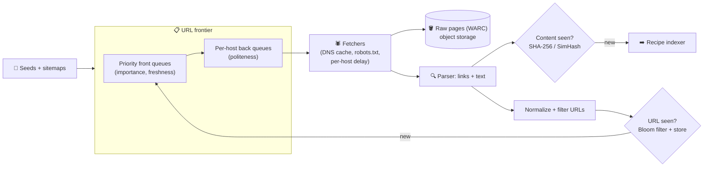

# 094 · Design a Web Crawler

> ⏱ 13 min · 📈 94% · 🅱️ Part B (advanced) · Phase 11: Data Processing & Advanced Designs
>
> `██████████████████░░` 94% of the whole guide
>
> 🧬 **Atoms used:** queues & priorities [057] · Bloom filters [090] · DNS [011] · consistent hashing [051] · rate limiting (politeness) [024] · object storage [042] · dedup / hashing [080] · distributed workers [025]

---

## 📖 Story

The new venture is called **Pantry Recipes**: a search engine for **every recipe on the internet**. That means visiting **billions of web pages**.

Maya's weekend prototype is twenty lines: fetch a page, grab its links, fetch those, repeat. By Sunday night it has:

- hammered one small food blog with **400 requests a second** until its hosting provider **blocked Pantry's entire IP range**,
- fallen into an **infinite calendar** on a cooking site (`/events?month=…`) and crawled **2 million** empty pages of "No events this month,"
- and downloaded the **same lasagna recipe 11,000 times** under different URLs with tracking parameters.

I warned Maya that crawlers are **easy to start and hard to do well**. I'll show you why, and how to build one that's polite, efficient, and impossible to trap.

## 🎯 One-sentence idea

**A web crawler repeatedly takes a URL from a prioritized frontier, politely fetches the page, extracts new links, skips URLs and content it has already seen, and stores the pages, and at scale the hard parts are per-site politeness, deduplication across billions of URLs, and prioritization.**

## 🧸 Analogy

An army of **library scouts** mapping every book in the world:

- A **to-visit list** with important libraries first (the frontier, by priority).
- Scouts **photograph pages** and note every **reference to other libraries**.
- **Never revisit a place** (the seen-URL check), and never file the same book twice under different names (content dedup).
- **Be polite:** **one scout at a time per library, with pauses** (per-host rate limits + robots.txt).

## 🖼️ Visual

*Diagram brief:* a loop. The frontier (priority queues feeding per-host queues) hands URLs to fetchers, which store raw pages and pass them to a parser. New links flow through a normalizer and a Bloom-filter gate back into the frontier, while page content flows through a duplicate detector to the indexer.



## 🔬 How it works

- **Requirements and estimates:** **1B pages/month ≈ 400/s** (peak ~1,000), ~100 KB/page → **~100 TB/month raw** (~25 TB compressed), and **~10B** discovered URLs → a seen-set Bloom filter at 1% FP ≈ **12 GB**. Prioritize important and fresh pages, re-crawl changing ones, obey robots.txt, and survive traps and malformed pages.
- **The frontier, the core deep dive:** **front queues by priority** (link authority, domain quality, change rate) feeding **back queues per host**. Each host is **pinned to one worker** by consistent hashing of the hostname, and that worker enforces a **per-host delay** (honouring `Crawl-delay`). The frontier is durable, mostly on disk, and sharded by host.
- **Fetching:** a local **DNS cache** + async resolvers (DNS is a classic bottleneck), **robots.txt** cached per host, timeouts, size caps, redirect limits, and **conditional GETs** (`If-Modified-Since`, ETag) on re-crawls.
- **Dedup at two levels:** **URL normalization** (lowercase host, drop fragments and tracking params, sort the query, honour `<link rel=canonical>`) → **Bloom filter** in RAM + a persistent URL store. **Content:** an exact **SHA-256** for identical pages and **SimHash/MinHash** for near-duplicates (mirrors, boilerplate changes).
- **Traps and re-crawling:** cap **URL length, depth, and pages per host**, detect repeating path patterns, and stop when many URLs yield the same content. **Re-crawl adaptively**: shorten the interval when the content hash changed, lengthen it when it didn't (news homepages every few minutes, archives monthly).

## 🧩 Worked example

**Normalization collapses 11,000 lasagnas into one:**

```
https://Blog.Example.com:443/recipes/../recipes/lasagna/?utm_source=pin&ref=share#comments
→ https://blog.example.com/recipes/lasagna
```

**Politeness, host-affine:**

```python
def worker_for(url):
    return ring.node_for(urlparse(url).hostname)      # same host → same worker, always

if now() < next_allowed[host]:
    requeue(url, at=next_allowed[host])
else:
    fetch(url)
    next_allowed[host] = now() + max(crawl_delay(host), 2.0)   # ≤ 1 req / 2 s per host
```

**Throughput check:**

```
1,000 pages/s ÷ 1 req per 2 s per host → ≥ 2,000 hosts crawled concurrently
~500 concurrent async fetches per worker → a handful of fetch machines
Real bottlenecks: DNS, bandwidth, parsing CPU, frontier I/O
```

**The weekend, replayed:** the food blog sees **0.5 req/s** instead of 400. The infinite calendar hits its **page budget of 5,000** and a near-duplicate detector ("No events this month" × N) and stops. The 11,000 lasagnas normalize to **one** URL, and SimHash catches the mirrors.

## ⚖️ Trade-offs

| Decision | Maya's choice | Trade-off |
|---|---|---|
| Seen-URL check | Bloom filter + a store | Tiny memory, and rare false positives skip a new URL |
| Politeness | Host-affine workers | Simple limits, but huge sites crawl slowly |
| Prioritization | Importance + freshness scores | Better coverage, more compute |
| Near-dups | SimHash | Catches mirrors, and thresholds need tuning |
| Storage | Compressed WARC in object storage | Cheap and replayable, indexed downstream |

## 🌍 Real world

- **Googlebot** adapts its crawl rate per site to server health and change frequency.
- **Common Crawl** publishes billions of pages monthly as WARC files on S3.
- **Apache Nutch, Heritrix, and StormCrawler** are open-source crawlers.

## 📌 Cheat card

> - **Frontier → fetch → store → parse → dedupe → enqueue.**
> - **Politeness:** host-affine workers, per-host delays, **robots.txt**.
> - **Dedup:** normalization + **Bloom filter**, content **SHA-256 + SimHash**.
> - **Prioritize + re-crawl adaptively.**
> - Defend against **traps, DNS bottlenecks, and giant or malformed pages**.

## 🧪 Feynman check

Explain the library scouts, and why sending one scout at a time to each small library matters as much as finding every library.

⚠️ **Common confusion:** "Crawl as fast as possible." Hammering a site gets you **blocked** and can **take small sites down**. Politeness is a **first-class requirement**, and it's also what keeps your crawler welcome on the internet.

## ⚡ Quick recall

1. How does the frontier enforce politeness?
<details><summary>Reveal Answer</summary>

Per-host queues pinned to specific workers (a hash of the hostname), each fetching no faster than the host's allowed delay and honouring robots.txt.
</details>

2. Why normalize URLs before the seen-check?
<details><summary>Reveal Answer</summary>

Many URL strings point to the same page (case, fragments, tracking params, default ports). Normalizing prevents re-crawling duplicates.
</details>

3. What detects near-duplicate pages?
<details><summary>Reveal Answer</summary>

SimHash or MinHash fingerprints, which stay similar for pages with mostly the same content.
</details>

## 🎤 Interview practice

**Q. "With limited resources, how do you decide what to crawl next, and how do you stop one site's infinite URL space from starving everything else?"**
<details><summary>Model answer</summary>

- **Prioritization:**
  - Score URLs by **importance** (link authority, domain reputation, sitemap hints), **freshness need** (historical change rate: news vs archive), and **coverage** (boost new domains).
  - Several **priority front queues**. The scheduler draws by weighted priority **while preserving per-host politeness** in the back queues.
  - **Adaptive re-crawl:** changed last time → shorten the interval. Unchanged → lengthen it. Use conditional GETs to save bandwidth.
  - **Discovery:** seeds, sitemaps, links from crawled pages, and submitted URLs.
- **Trap containment:**
  - **Per-host page budgets** and **round-robin across hosts** in the frontier, so no single host monopolizes the fetchers.
  - **URL depth and length limits**, **query-parameter normalization and allow-lists**, and detection of **repeating path segments** (`/a/b/a/b/…`).
  - **Near-duplicate content detection:** many URLs with near-identical SimHash → stop expanding that pattern.
  - Honour **robots.txt** and **canonical tags**.
- **Likely follow-up:** "Where's the frontier stored at 10B URLs?" → sharded by host across frontier nodes, with hot heads in memory and long tails on disk (RocksDB-style), all durable so restarts resume where they left off.
</details>

## 📖 Teaser

> 📖 *The crawler is polite and trap-proof, and the courier team now needs the opposite of a slow crawl: find the nearest available driver among a million moving dots, in under a hundred milliseconds.*

---

⬅️ [093 · Autocomplete](093-design-autocomplete.md) · 🗺️ [Phase map](README.md) · ➡️ [095 · Design a Proximity Service](095-design-proximity-service.md)

✅ **Safe stopping point.** Tick lesson 094 in [PROGRESS.md](../../PROGRESS.md).
