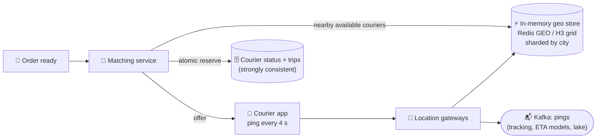

# 095 · Design a Proximity Service / Ride-Sharing (Yelp, Uber)

> ⏱ 14 min · 📈 95% · 🅱️ Part B (advanced) · Phase 11: Data Processing & Advanced Designs
>
> `███████████████████░` 95% of the whole guide
>
> 🧬 **Atoms used:** geo indexes [044] · Redis [033] · sharding [049] · WebSockets [016] · Kafka [059] · consistency for matching [036, 052] · caching [027]

---

## 📖 Story

Pantry launches its own courier fleet: **one million couriers** across five continents, each phone reporting its location every four seconds.

When a curry is ready in a Lisbon kitchen, Pantry must find **the nearest available courier**, from a million moving dots, within **a couple of seconds**. Maya's first query checks the distance from the kitchen to **every courier on Earth**: one million trigonometry calculations per dispatch, 1,700 dispatches per second. The database fans scream.

Worse, on Friday night **two kitchens grab the same courier** within the same 30 ms. He accepts one order, the other kitchen's food goes cold on the counter, and a customer waits 50 minutes.

I showed Maya how to **turn a map into a grid of labelled squares**. It's a trick that makes "what's near me?" almost free. Let me show you.

## 🎯 One-sentence idea

**Finding "what's near me" means turning 2-D coordinates into something indexable (geohash cells, quadtrees, or H3/S2 cells) and searching the user's cell plus its neighbours, while ride-sharing adds a firehose of fast-changing locations held in memory and a matching step that must never double-assign a driver.**

## 🧸 Analogy

A city map covered in a **grid of labelled squares**:

- Every courier and kitchen gets a **square label** (a geohash) like `eycs2`.
- To find things near you, check **your square + the 8 around it**, not the whole city.
- **Longer labels = smaller squares**, and squares sharing a prefix are **neighbours**.
- Couriers keep **walking**, so track them on a **whiteboard** (memory), not in a filing cabinet (disk).

## 🖼️ Visual

*Diagram brief:* a 3×3 grid of geohash cells with "you" in the centre, all nine shaded as the search area. Beside it, the live system: courier pings flow into an in-memory geo store sharded by city, a matching service queries it, atomically reserves one courier, and writes the trip to a strongly consistent DB.

```
Geohash precision ≈ cell size
4 chars ≈ 39 × 20 km   5 ≈ 4.9 × 4.9 km   6 ≈ 1.2 × 0.6 km   7 ≈ 153 × 153 m

┌────────┬────────┬────────┐
│eycs2kj │eycs2km │eycs2kq │
├────────┼────────┼────────┤
│eycs2kh │ eycs2kk│eycs2kn │  ← kitchen in eycs2kk: search all 9
├────────┼────────┼────────┤
│eycs2k5 │eycs2k7 │eycs2ke │
└────────┴────────┴────────┘
```



## 🔬 How it works

- **Requirements and estimates:** **Yelp-style** search (static places, read-heavy) vs **Uber-style** dispatch. **1M couriers / 4 s = 250k location writes/s**, ~**1.7k matches/s** at peak, and the state is ~**100 MB** (it fits in RAM, and is sharded for throughput). **A courier must never be double-assigned.**
- **Geo-indexing options:** **geohash** (interleave lat/lng bits → base32, prefix = proximity, works with any KV or B-tree), **quadtree** (splits dense areas into smaller cells, so it adapts to density), **H3/S2** (hierarchical cells on the sphere, where H3 hexagons have **equidistant neighbours**), and **R-tree/PostGIS** (rich queries, harder to shard at huge write rates).
- **Proximity reads:** compute the cell at a radius-appropriate precision, query **the cell + 8 neighbours** (edge effects!), **filter by exact haversine distance**, rank, and **widen** the search if there are too few results. Static businesses: a geohash column + index (or ES `geo_point`) + caching of popular areas.
- **Location writes:** ephemeral and huge, so keep them **in memory**, **sharded by city/region**, **overwriting the latest position** (idempotent: newest wins). **Never** write every ping to the OLTP DB. Stream them to **Kafka** for live tracking fan-out, ETA training, and the lake. Adapt the ping rate (idle vs on a trip).
- **Matching, the consistency-critical part:**
  1. Find nearby **available** candidates.
  2. Rank by **road-network ETA** (not straight-line distance), rating, and vehicle.
  3. **Atomically reserve** via a conditional update (`available → offered`) or a **single owner per region**.
  4. Offer with a **15 s timeout** → decline or timeout → **release** and try the next candidate. Accept → create the trip transactionally.

## 🧩 Worked example

```bash
GEOADD couriers:lisbon:available -9.1393 38.7223 courier:17
GEOSEARCH couriers:lisbon:available FROMLONLAT -9.1400 38.7210 BYRADIUS 2 km ASC COUNT 20 WITHDIST
# ~0.3 ms, vs scanning 1M couriers worldwide
```

**Atomic reservation, which ends the Friday double-grab:**

```sql
UPDATE couriers
SET status = 'offered', offer_order = :order_id, offer_expires = now() + interval '15 seconds'
WHERE courier_id = :c AND status = 'available';
-- 1 row → reserved ✅    0 rows → another kitchen won → try the next candidate
```

**The edge-cell trap:**

```
Kitchen at the edge of eycs2kk; the nearest courier is 60 m away in eycs2km
Query only eycs2kk → miss him. Query the cell + 8 neighbours → found ✅
```

**Dispatch, before vs after:** 1M distance calculations → **~20 candidates from one Redis shard**, ETA-ranked through the routing service in ~30 ms, then reserved in ~2 ms. **Dispatch p99: 4 s → 180 ms**, with **zero double assignments**.

## ⚖️ Trade-offs

| Decision | Maya's choice | Trade-off |
|---|---|---|
| Location store | In-memory, sharded by region | Fast and cheap, and ephemeral (fine) |
| Index | Geohash / H3 / quadtree | Simplicity vs uniform cells vs density adaptation |
| Ranking | Road-graph ETA | Accurate, more compute |
| Matching | Conditional reserve / single owner | A few ms, and no double booking |
| History | Kafka → lake | Analytics without OLTP load |

## 🌍 Real world

- **Uber** created **H3** for pricing zones and supply/demand, and runs in-memory geo services with ring sharding.
- **Yelp and Google Maps** serve "near me" from geospatial indexes (Elasticsearch, S2 cells).
- **Lyft and DoorDash** run similar location + dispatch architectures.

## 📌 Cheat card

> - **Geohash:** shared prefix = nearby. Search **the cell + 8 neighbours**, then filter by exact distance.
> - **Quadtree** adapts to density. **H3/S2** = uniform hierarchical cells.
> - **Moving objects → in memory, sharded by region, latest wins.**
> - **Matching = strongly consistent reserve.** Never double-assign.
> - Rank by **ETA**, not straight-line distance.

## 🧪 Feynman check

Explain the grid of labelled squares, why you check the 8 surrounding squares, and why moving couriers belong on a whiteboard rather than in a filing cabinet.

⚠️ **Common confusion:** "Store every location ping in the main database." That's **250k writes/s** of data that's obsolete four seconds later. Keep **current state in memory** and **history in a stream or lake**, and the database never notices the firehose.

## ⚡ Quick recall

1. Why search neighbouring geohash cells too?
<details><summary>Reveal Answer</summary>

Nearby points can fall in adjacent cells with different prefixes (edge effects), so you'd miss close results otherwise.
</details>

2. What's the advantage of a quadtree over fixed geohash cells?
<details><summary>Reveal Answer</summary>

It adapts cell size to density: small cells in dense cities, large cells in empty areas.
</details>

3. How do you prevent assigning one courier to two orders?
<details><summary>Reveal Answer</summary>

Reserve the courier atomically (a conditional status update or a single owner per region) before offering, and release on timeout or decline.
</details>

## 🎤 Interview practice

**Q. "Design Yelp's 'restaurants near me', then handle 250k courier location updates per second, including New Year's Eve in one city."**
<details><summary>Model answer</summary>

- **Restaurants near me:**
  - ~200M businesses with lat/lng + a **geohash** column (or an ES `geo_point`). The data changes rarely, so it's read-dominated.
  - Query the **cell + 8 neighbours** at a radius-appropriate precision → **haversine** filter → business filters (open now, rating, cuisine) → rank (distance, rating, relevance) → paginate.
  - **Cache** per (cell, filters) for popular areas, and use read replicas.
  - Map viewport queries → the cells covering the **bounding box** (or ES `geo_bounding_box` / an R-tree).
- **250k pings/s:**
  - Couriers stream via persistent connections or light HTTP to **stateless location gateways**.
  - Update an **in-memory geo store sharded by city/region** (Redis Cluster GEO or a custom H3 grid). **Overwrite, never append.**
  - Publish to **Kafka** for live trip tracking (customers subscribed to their courier), ETA models, and history.
  - **Adaptive ping rate:** slower when idle or stationary, faster on trips.
- **New Year's Eve hotspot:** split the city into **H3 sub-regions** across more shards, raise the replica counts for read-heavy matching, and pre-scale the gateways.
- **Likely follow-up:** "What if the geo shard dies?" → couriers re-report within 4 s, so the state **rebuilds itself from the next pings**. Replicas shorten the gap, and since the data is ephemeral, nothing permanent is lost.
</details>

## 📖 Teaser

> 📖 *Couriers find kitchens in milliseconds now, and Pantry steps into the most unforgiving domain of all: moving real money for millions of cooks across thirty countries, exactly once.*

---

⬅️ [094 · Web Crawler](094-design-web-crawler.md) · 🗺️ [Phase map](README.md) · ➡️ [✅ Checkpoint 95%](checkpoint-95.md)

✅ **Safe stopping point.** Tick lesson 095 in [PROGRESS.md](../../PROGRESS.md), then do the checkpoint!
