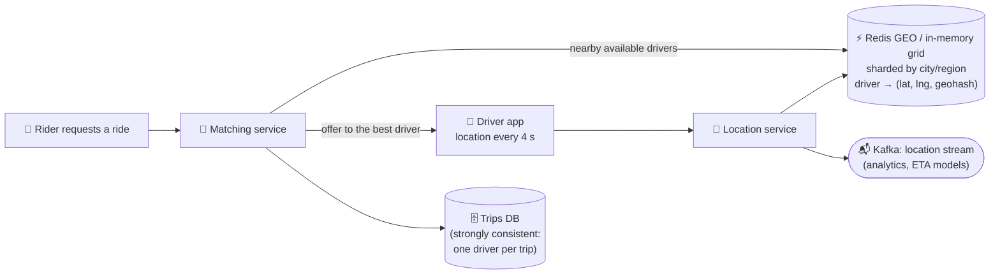

# 095 · Design a Proximity Service / Ride-Sharing (Yelp, Uber)

> ⏱ 14 min · 📈 95% · 🅱️ Part B (advanced) · Phase 11: Data Processing & Advanced Designs
>
> `███████████████████░` 95% of the whole guide
>
> 🧬 **Atoms used:** geo indexes [044] · Redis [033] · sharding [049] · WebSockets [016] · Kafka [059] · consistency for matching [036, 052] · caching [027]

---

## 📖 Story

Pantry launched its own courier fleet. When a meal was ready, the nearest available courier had to be found within seconds among a million moving dots, and never assigned twice. I showed Maya how to turn a map into a grid of labelled squares. It's a trick I'll show you now.

## 🎯 One-sentence idea

**Finding "what's near me" requires turning 2D coordinates into something indexable, like geohash cells, quadtrees, or hexagons (H3/S2). Then you search the user's cell plus its neighbours. Ride-sharing adds a stream of fast-changing driver locations kept in memory, and a matching step that must never double-assign a driver.**

## 🧸 Analogy

A city map covered in a **grid of numbered squares**:

- Every restaurant and every driver gets a **square label** (a geohash), like "9q8yy".
- To find things near you, look in **your square and the 8 squares around it**. No need to check the whole city.
- **Longer labels = smaller squares** (more precise). Squares with the same starting letters are **near each other**.
- Drivers are like **people walking around**: they keep reporting their new square every few seconds, so you track them on a **whiteboard** (memory), not in a filing cabinet (disk).

## 🖼️ Visual

```
Geohash precision (approx. cell size):
  4 chars ≈ 39 km × 20 km     5 chars ≈ 4.9 km × 4.9 km
  6 chars ≈ 1.2 km × 0.6 km   7 chars ≈ 153 m × 153 m

Search = your cell + 8 neighbours (labels illustrative):
┌───────┬───────┬───────┐
│9q8yyj │9q8yym │9q8yyq │
├───────┼───────┼───────┤
│9q8yyh │ 9q8yyk│9q8yyn │  ← you are in 9q8yyk
├───────┼───────┼───────┤
│9q8yy5 │9q8yy7 │9q8yye │
└───────┴───────┴───────┘
```



## 🔬 How it works

### 1️⃣ Requirements
- **Proximity (Yelp):** find businesses within radius r of a location, filter and rank them. The data changes rarely (businesses), and reads are heavy.
- **Ride-sharing (Uber):** drivers send locations every ~4 s. Riders request rides → match with a nearby available driver quickly (< a few seconds). **A driver must never be assigned to two trips.** Live trip tracking.

### 2️⃣ Estimates (ride-sharing)
```
1M active drivers × 1 update / 4 s = 250k location writes/s
Riders: 100k ride requests/min at peak → ~1.7k matches/s
Location state: 1M × ~100 B = 100 MB → fits in memory easily (sharded for throughput)
```

### 3️⃣ Geo-indexing options

| Index | How | 👍 | 👎 |
|---|---|---|---|
| **Geohash** | Interleave lat/lng bits → base32 string. A shared prefix means nearby. | Simple, and works with any KV/B-tree (prefix queries) | Edge effects (neighbours can have different prefixes, so query 9 cells), and uneven density |
| **Quadtree** | Recursively split cells with too many points into 4 | Adapts to density (dense cities get small cells) | An in-memory tree, and rebuilds or updates are more complex |
| **S2 (Google) / H3 (Uber hexagons)** | Hierarchical cells on a sphere | Uniform cells (H3 hexagons have equidistant neighbours), and good for aggregation | A library dependency |
| **R-tree / PostGIS** | Bounding-box tree | Rich spatial queries | Harder to shard at a massive write rate |

### 4️⃣ Proximity search (the read path)
1. Compute the user's geohash at a precision matching the radius (e.g., 6 chars for ~1 km).
2. Query **that cell + 8 neighbours** (a prefix lookup).
3. Filter by exact distance (haversine), apply the business filters, rank, and paginate.
4. Too few results? Widen the search (a shorter prefix / larger radius).
- For **static businesses:** precompute the geohash column + a B-tree index (or Elasticsearch `geo_point`), and cache the popular areas.

### 5️⃣ Driver locations (the write path)
- High write rate and **ephemeral** data, so keep it in **memory**: Redis GEO (`GEOADD`, `GEOSEARCH`) or a custom in-memory grid service, **sharded by city/region**.
- Overwrite the latest position (idempotent, and the latest one wins). Don't persist every ping to the OLTP DB. Stream the pings to **Kafka** for analytics and ETA model training.
- Driver status (available / on trip / offline) lives alongside the location.

### 6️⃣ Matching (the consistency-critical part)
1. Find candidate available drivers near the rider (the geo query).
2. Rank by **ETA** (road-network routing, not straight-line distance), rating, and vehicle type.
3. **Atomically reserve** the chosen driver: a conditional update (`status = available → offered`) in a strongly consistent store, or a single-owner matching service per region, so two riders can't grab the same driver.
4. Send the offer (push/WebSocket). Timeout or decline → release the driver, and try the next one.
5. Accept → create the trip (a DB transaction). Location updates now stream to the rider.

## 🧩 Worked example

**Redis GEO for nearby available drivers:**

```bash
GEOADD drivers:sf:available -122.4194 37.7749 driver:17
GEOSEARCH drivers:sf:available FROMLONLAT -122.4183 37.7750 BYRADIUS 2 km ASC COUNT 20 WITHDIST
```

**Atomic reservation (avoid double assignment):**

```sql
UPDATE drivers SET status = 'offered', trip_offer = :trip_id, offer_expires = now() + interval '15 seconds'
WHERE driver_id = :d AND status = 'available';
-- 1 row → reserved ✅   0 rows → someone else got them → try the next candidate
```

**Geohash neighbour pitfall:**

```
User at the edge of cell 9q8yyk; the nearest restaurant is 50 m away in cell 9q8yym
Querying only 9q8yyk would miss it → always include the 8 neighbours ✅
```

## ⚖️ Trade-offs

| Decision | Choice | Trade-off |
|---|---|---|
| Driver location store | In-memory (Redis/grid), sharded by region | Fast and cheap, and ephemeral (acceptable) |
| Index | Geohash (simple) / H3 (uniform) / quadtree (density-adaptive) | Simplicity vs accuracy vs complexity |
| Distance | ETA via the road graph | Accurate, and more compute than straight-line distance |
| Matching consistency | Strong (conditional update / single owner) | Slight latency, but no double booking |
| Location history | Kafka → data lake | Kept for analytics without burdening the OLTP DB |

## 🌍 Real world

- **Uber** built **H3** (hexagonal hierarchical index) for pricing zones and supply/demand, and uses in-memory geo services with a ring-sharded design.
- **Yelp and Google Maps** use geospatial indexes (Elasticsearch, S2 cells) for "near me" search.
- **Lyft** and **DoorDash** run similar location + dispatch architectures.

## 📌 Cheat card

> - **Geohash:** a shared prefix = nearby. Search **the cell + 8 neighbours**, then filter by exact distance.
> - **Quadtree** adapts to density. **H3/S2** give uniform hierarchical cells.
> - **Moving objects → in-memory, sharded by region**, with the latest position overwriting the old one.
> - **Matching must be strongly consistent** (a conditional reserve), so a driver is never double-assigned.
> - Rank by **ETA**, not straight-line distance.

## 🧪 Feynman check

Explain the city-grid analogy, why you check the 8 surrounding squares, and why moving drivers belong on a whiteboard rather than in a filing cabinet.

⚠️ **Common confusion:** "Store every location ping in the main database." 250k writes/s of data that's obsolete 4 seconds later is wasteful. Keep the **current state in memory**, and the **history in a stream or lake**.

## ⚡ Quick recall

1. Why search neighbouring geohash cells too?
<details><summary>Answer</summary>

Nearby points can fall into adjacent cells with different prefixes (edge effects), so you'd miss close results otherwise.
</details>

2. What's the advantage of a quadtree over fixed geohash cells?
<details><summary>Answer</summary>

It adapts cell size to density: small cells in dense cities, large cells in empty areas.
</details>

3. How do you prevent assigning one driver to two riders?
<details><summary>Answer</summary>

Reserve the driver atomically (a conditional status update or a single owner per driver/region) before offering, and release on timeout or decline.
</details>

## 🎤 Interview practice

**Q1. "Design Yelp's 'restaurants near me' search."**
<details><summary>Model answer</summary>

- Businesses (~200M) are stored with lat/lng + a **geohash** column (or an Elasticsearch `geo_point`). The data rarely changes, so reads dominate.
- Query: the geohash cell + neighbours at a radius-appropriate precision → filter by haversine distance + filters (open now, rating, category) → rank (distance, rating, relevance) → paginate.
- Cache the results per (cell, filters) for popular areas, and use read replicas.
- Reviews and photos go in separate services and storage.
- **Likely follow-up:** "How about 'within the visible map area'?" → a bounding-box query (the geohash cells covering the box, or an R-tree / ES geo_bounding_box).
</details>

**Q2. "Handle 250k driver location updates per second."**
<details><summary>Model answer</summary>

- The driver apps send updates via a persistent connection or lightweight HTTP to **location gateways** (stateless, horizontally scaled).
- Update the **in-memory geo store sharded by city/region** (Redis Cluster GEO or a custom grid service). Overwrite, never append.
- Publish the pings to **Kafka** for trip tracking fan-out (riders subscribed to their driver), ETA models, and the history lake.
- Reduce the update frequency when a driver is idle or stationary, and increase it during trips.
- **Likely follow-up:** "A city's shard is hot (New Year's Eve)?" → split the city into sub-regions (H3 cells) across more shards.
</details>

> 📖 *Next, Pantry starts moving real money for millions of cooks.*

---

⬅️ [094 · Web Crawler](094-design-web-crawler.md) · 🗺️ [Phase map](README.md) · ➡️ [✅ Checkpoint 95%](checkpoint-95.md)

✅ **Safe stopping point.** Tick lesson 095 in [PROGRESS.md](../../PROGRESS.md), then do the checkpoint!
