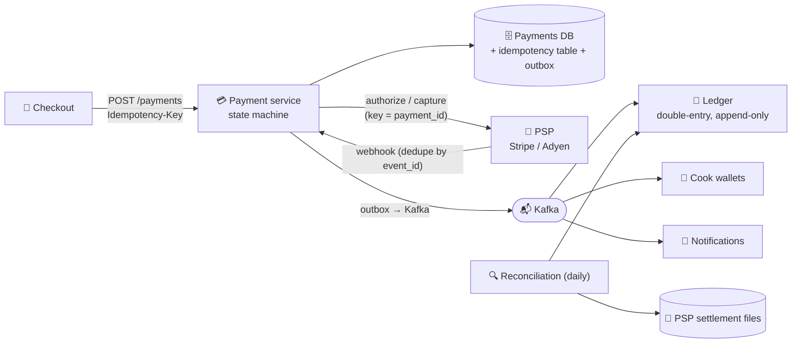

# 096 · Design a Payment System

> ⏱ 14 min · 📈 96% · 🅱️ Part B (advanced) · Phase 11: Data Processing & Advanced Designs
>
> `███████████████████░` 96% of the whole guide
>
> 🧬 **Atoms used:** ACID [035] · idempotency [055] · outbox [062] · sagas [088] · event sourcing/ledgers [089] · retries & timeouts [063] · strong consistency [053] · security/PCI [070] · batch reconciliation [091]

---

## 📖 Story

Pantry now moves **real money**: pay-ins from millions of customers, pay-outs to **millions of cooks** in **thirty countries**, refunds, fees, and currency conversions, all day long, every day.

The stakes are brutal and asymmetric. **One double-charge** ends up in a viral post with a screenshot of a bank statement. **One lost payout** is a cook who can't pay rent this month, and who will never trust Pantry again. A single bug multiplied across millions of transactions isn't an incident. It's a headline.

And every external system is unreliable: payment providers time out, webhooks arrive twice (or never), banks settle days later.

I've never been more careful than when designing payments. Every habit I taught Maya came from a mistake someone, somewhere, paid for. I'll share them all.

## 🎯 One-sentence idea

**A payment system moves money correctly and exactly once despite failing networks, using idempotency keys on every hop, a double-entry ledger as the source of truth, a state machine per payment, asynchronous integration with external processors, and reconciliation to catch anything that slips through.**

## 🧸 Analogy

A meticulous **accountant with a rubber stamp and a two-column ledger**:

- Every request carries a **unique reference number**. The same reference again? "**Already done, here's your receipt.**"
- Every movement is written in **two columns**: debit one account, credit another. **They must always balance.**
- **Nothing is erased.** Mistakes get **new correcting entries**.
- Each evening, the books are **compared line by line with the bank statement** (reconciliation).

## 🖼️ Visual

*Diagram brief:* checkout calls the payment service with an idempotency key. The service's state machine persists every transition, talks to the PSP with its own key, receives deduped webhooks, and emits events through an outbox to the ledger, wallets, and notifications. A nightly reconciler compares the ledger with the PSP settlement files.



## 🔬 How it works

- **Requirements:** pay-in via a **PSP**, pay-out to cooks, refunds, wallets, and history. **Correctness above everything** (no double charges, no lost money, a full audit trail), **strong consistency** for balances, and **fail safe rather than be wrong**. PCI-DSS. Modest throughput (thousands of TPS).
- **A state machine per payment:** `CREATED → AUTHORIZING → AUTHORIZED → CAPTURING → CAPTURED → (REFUNDING → REFUNDED)`, with `FAILED`/`VOIDED` branches. **Persist every transition before and after external calls.** A **timeout means unknown, not failed**: move to `PENDING_CONFIRMATION` and resolve it by **retrying with the same key**, **querying the PSP**, or **awaiting the webhook**. Never re-charge blindly.
- **Idempotency on every hop, the core deep dive:** client → service (`Idempotency-Key` per checkout attempt, lesson 055), service → PSP (**key = `payment_id`**), webhooks (at-least-once, so **dedupe by `event_id`**), and ledger postings (**`UNIQUE (txn_id, account, direction)`**).
- **The double-entry ledger:** every transaction is a set of **balanced entries** (Σ debits = Σ credits) across accounts (customer clearing, merchant payable, platform fees, PSP clearing). **Append-only and immutable**, with corrections as **reversing entries**, and balances derived or maintained in the same transaction.
- **Reliability and the safety net:** the **outbox** for state + events (lesson 062), **sagas** for multi-step flows (authorize → reserve order → capture, with void or refund as compensations, lesson 088), **breakers per PSP** with **failover to a secondary PSP** for *new* payments, and **daily reconciliation** of the ledger vs PSP settlements vs bank statements, with automated fixes and review queues.
- **Security:** **never store raw card numbers**. Use **PSP tokenization** (keeping you mostly out of PCI scope), plus encryption, least privilege, audit logs, and **fraud scoring before authorization**.

## 🧩 Worked example

**A £100 order with a £3 platform fee:**

| Account | Debit | Credit |
|---|---|---|
| PSP clearing (customer card) | £100 | |
| Cook payable | | £97 |
| Platform fee revenue | | £3 |
| **Totals** | **£100** | **£100** ✅ balanced |

**A timeout, handled safely:**

```
1. p_1 → AUTHORIZING (persisted)
2. PSP.authorize(key="p_1") → ⏱ timeout: UNKNOWN outcome
3. p_1 → PENDING_CONFIRMATION                     (never mint a new key!)
4. Retry with the SAME key "p_1" → the PSP returns the ORIGINAL result: authorized ✅
   (or webhook arrives / poll GET /payments/p_1)
5. p_1 → AUTHORIZED → outbox event → ledger posting (unique on p_1 + AUTH)
```

```sql
CREATE TABLE ledger_entries (
  entry_id     bigint PRIMARY KEY,
  txn_id       text   NOT NULL,                    -- groups balanced entries
  account_id   text   NOT NULL,
  direction    text   CHECK (direction IN ('debit','credit')),
  amount_minor bigint CHECK (amount_minor > 0),    -- integer minor units, never floats
  currency     char(3) NOT NULL,
  created_at   timestamptz DEFAULT now(),
  UNIQUE (txn_id, account_id, direction)            -- idempotent postings
);
-- invariant per txn_id: SUM(debits) = SUM(credits)
```

## ⚖️ Trade-offs

| Decision | Maya's choice | Why |
|---|---|---|
| Consistency | Strong, ACID relational | Money: correctness beats latency |
| PSP integration | Async + webhooks + polling fallback | PSPs are slow and flaky, and outcomes arrive late |
| Ledger | Append-only double-entry | Auditability, no lost updates |
| Retries | Same key only | No double charges |
| Safety net | Daily reconciliation | Catches what everything else missed |

## 🌍 Real world

- **Stripe** popularized idempotency keys and writes extensively about ledger design.
- **Uber, Airbnb, and Square** describe platforms built on **double-entry ledgers, idempotency, and reconciliation**.
- **Card networks** run **authorize → capture → settle** cycles, with settlement in batches days later.

## 📌 Cheat card

> - **Idempotency on every hop:** client → service → PSP → webhooks → ledger.
> - **Double-entry, append-only ledger.** Debits = credits. Fix with reversals.
> - **State machine.** Timeout → **PENDING**, then **same-key retry / query / webhook**.
> - **Outbox + sagas.** **Breakers + secondary PSP.**
> - **Reconcile daily. Tokenize cards. Integer minor units, never floats.**

## 🧪 Feynman check

Explain the accountant's reference numbers and two columns, and why a phone line cutting out mid-call (a timeout) must never lead to charging the customer a second time.

⚠️ **Common confusion:** "Retry on timeout." A timeout means **unknown**, not **failed**: the charge may have **succeeded**. Retry only with the **same idempotency key**, or confirm the status first. A new key on retry is how double charges are born.

## ⚡ Quick recall

1. What's the core invariant of double-entry accounting?
<details><summary>Reveal Answer</summary>

For every transaction, total debits equal total credits.
</details>

2. How should a payment timeout be handled?
<details><summary>Reveal Answer</summary>

As an unknown outcome: mark it pending, and retry with the same idempotency key or query the PSP / await the webhook to learn the real result.
</details>

3. What is reconciliation?
<details><summary>Reveal Answer</summary>

Comparing internal records (the ledger) with external ones (PSP settlements, bank statements) to detect and fix discrepancies.
</details>

## 🎤 Interview practice

**Q. "Design the weekly pay-out to 1M cooks, then scale the ledger to 50k transactions/s."**
<details><summary>Model answer</summary>

- **Weekly pay-outs:**
  1. At the cutoff, a batch job computes each cook's **payable balance from the ledger** (not a mutable counter).
  2. Create **payout instructions, idempotent by `(cook_id, period)`** with a unique constraint, so a re-run is a no-op.
  3. Queue them to the payout provider or bank rails with **rate limits**, **same-key retries**, and a **state machine per payout** (`CREATED → SENT → CONFIRMED / FAILED`).
  4. **Failures** (invalid bank details) → notify the cook and keep the funds in their wallet.
  5. On confirmation, post the **ledger entries** (cook payable → cash), and **reconcile** with the bank reports.
- **Ledger at 50k TPS:**
  - **Shard by account** so each account's entries and balance stay local. Cross-shard transfers go through a **saga via a clearing account**, or use a **distributed SQL** database (Spanner/CockroachDB).
  - **Hot accounts** (platform fees receive millions of credits): split them into **N sub-accounts** summed on read, or **post aggregated batches** every second, which removes row contention.
  - **Append-only inserts** (fast), with balances via **materialized aggregates + periodic snapshots**.
- **Guardrails:** invariant checks (Σ debits = Σ credits per `txn_id`) in CI and in production audits, plus alerting on any unbalanced transaction.
- **Likely follow-up:** "Multi-currency?" → store amounts in **integer minor units** with a currency code, post FX as explicit conversion entries through FX accounts, and never mix currencies inside one balanced set.
</details>

## 📖 Teaser

> 📖 *Money moves exactly once now, and next comes time itself: millions of payouts, reminders, and "your meal is ready" pings that must each fire at precisely the right moment, never twice and never forgotten.*

---

⬅️ [✅ Checkpoint 95%](checkpoint-95.md) · 🗺️ [Phase map](README.md) · ➡️ [097 · Design a Job Scheduler](097-design-job-scheduler.md)

✅ **Safe stopping point.** Tick lesson 096 in [PROGRESS.md](../../PROGRESS.md).
