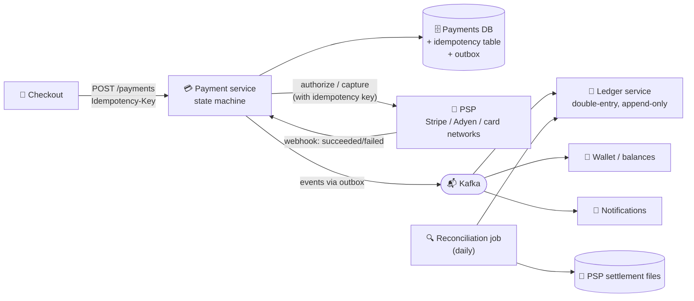

# 096 · Design a Payment System

> ⏱ 14 min · 📈 96% · 🅱️ Part B (advanced) · Phase 11: Data Processing & Advanced Designs
>
> `███████████████████░` 96% of the whole guide
>
> 🧬 **Atoms used:** ACID [035] · idempotency [055] · outbox [062] · sagas [088] · event sourcing/ledgers [089] · retries & timeouts [063] · strong consistency [053] · security/PCI [070] · batch reconciliation [091]

---

## 🎯 One-sentence idea

**A payment system moves money correctly, exactly once, even when networks fail. It does this with idempotency keys on every request, a double-entry ledger as the source of truth, a state machine for each payment, asynchronous integration with external processors, and daily reconciliation to catch anything that slipped through.**

## 🧸 Analogy

A careful **accountant with a rubber stamp and a two-column ledger**:

- Every request comes with a **unique reference number**. If the same reference shows up twice, the accountant says "**already done, here's the receipt**" (idempotency).
- Every money movement is written in **two columns**: debit one account, credit another. **They must always balance** (double-entry).
- Nothing is ever erased. Mistakes are fixed with **new correcting entries** (an append-only ledger).
- At the end of each day, the accountant **compares their books with the bank statement** line by line (reconciliation).

## 🖼️ Visual



## 🔬 How it works

### 1️⃣ Requirements
- **Functional:** pay-in (charge customers via a payment service provider, PSP), pay-out (pay sellers or drivers), refunds, wallet balances, and payment history.
- **Non-functional:** **correctness above everything**: never double-charge, never lose money, and full auditability. **Strong consistency** for balances. High availability (but it's better to fail safely than to be wrong). Security (PCI-DSS). Throughput is modest (thousands of TPS, not millions).

### 2️⃣ Payment state machine
```
CREATED → AUTHORIZING → AUTHORIZED → CAPTURING → CAPTURED → (REFUNDING → REFUNDED)
                ↘ FAILED        ↘ VOIDED          ↘ FAILED
```
Every transition is persisted **before and after** the external calls. Unknown outcomes (timeouts) go to `PENDING_CONFIRMATION` and are resolved by querying the PSP or waiting for its webhook, **never by blindly retrying a charge**.

### 3️⃣ Idempotency end to end (the core deep dive)
- The client → payment service call carries an **Idempotency-Key** (per checkout attempt). The server stores key → result (lesson 055).
- The payment service → PSP call passes **its own idempotency key** (e.g., payment_id), so PSP retries are safe too.
- Webhooks are delivered at-least-once, so dedupe by **event ID**.
- Ledger postings have a **unique (payment_id, entry_type)** constraint.

### 4️⃣ Double-entry ledger
- Each transaction = **balanced entries**: the sum of debits = the sum of credits.
- **Append-only, immutable**, with corrections as reversing entries. Balances are derived (or maintained transactionally with the entries).
- Accounts: customer, merchant, platform fees, PSP clearing, and so on.

### 5️⃣ Reliability patterns
- **Outbox** (lesson 062): payment state + event in one DB transaction → reliably published.
- **Sagas** (lesson 088) for multi-step flows (charge → reserve order → capture, with a void or refund as compensation).
- **Retries with backoff** only for safe operations. **Circuit breakers** per PSP, and **failover to a secondary PSP** for new payments.
- **Timeouts are ambiguous**: always reconcile the state with the PSP.

### 6️⃣ Reconciliation
- Daily (or continuous) comparison of the **internal ledger** vs the **PSP settlement reports** vs the **bank statements**.
- Mismatches → automated fixes or manual review queues. It's the final safety net, catching bugs, missed webhooks, and fraud.

### 7️⃣ Security & compliance
- **Never store raw card numbers**: use PSP **tokenization** (keeps you mostly out of PCI scope).
- Encryption, strict access control, audit logs, fraud scoring (rules + ML) before authorization.

## 🧩 Worked example

**A double-entry posting for a $100 purchase with a $3 platform fee:**

| Account | Debit | Credit |
|---|---|---|
| Customer (card via PSP clearing) | $100 | |
| Merchant payable | | $97 |
| Platform fee revenue | | $3 |
| **Totals** | **$100** | **$100** ✅ balanced |

**Handling a timeout safely:**

```
1. Payment p_1 state = AUTHORIZING (persisted)
2. Call PSP authorize(idempotency_key = "p_1") → ⏱ timeout (unknown outcome!)
3. State → PENDING_CONFIRMATION (don't retry with a new key!)
4. Retry the SAME call with the SAME key → the PSP returns the original result (authorized) ✅
   or wait for the webhook, or poll GET /payments/p_1 at the PSP
5. State → AUTHORIZED → outbox event → ledger posting (unique on p_1 + AUTH)
```

**The ledger table (sketch):**

```sql
CREATE TABLE ledger_entries (
  entry_id     bigint PRIMARY KEY,
  txn_id       text NOT NULL,           -- groups the balanced entries
  account_id   text NOT NULL,
  direction    text CHECK (direction IN ('debit','credit')),
  amount_cents bigint CHECK (amount_cents > 0),
  currency     char(3) NOT NULL,
  created_at   timestamptz DEFAULT now(),
  UNIQUE (txn_id, account_id, direction)            -- idempotent postings
);
-- invariant check per txn: SUM(debits) = SUM(credits)
```

## ⚖️ Trade-offs

| Decision | Choice | Why |
|---|---|---|
| Consistency | Strong (a relational DB with ACID) | Money. Correctness beats latency. |
| Integration with the PSP | Async + webhooks + polling fallback | PSPs are slow and flaky, and outcomes can be delayed |
| Ledger | Append-only double-entry | Auditability, and no lost updates |
| Retries | Same idempotency key, only with known-safe semantics | Avoid double charges |
| Safety net | Daily reconciliation | Catches what everything else missed |

## 🌍 Real world

- **Stripe** popularized idempotency keys and publishes a lot about ledger design and reliability.
- **Uber, Airbnb, Square** have written about their payment platforms: double-entry ledgers, idempotency, and reconciliation at the core.
- **Card networks** (Visa/Mastercard) use authorize → capture → settle cycles, and settlement happens later in batches.

## 📌 Cheat card

> - **Idempotency everywhere:** client → service → PSP → webhooks → ledger.
> - **Double-entry, append-only ledger.** Debits = credits. Fix with reversals.
> - **A payment state machine.** Timeouts → **PENDING**, then **query or reconcile**, never re-charge blindly.
> - **Outbox + saga** for reliable multi-step flows.
> - **Reconcile daily** against PSP and bank reports. **Tokenize cards** (PCI).

## 🧪 Feynman check

Explain the accountant with the reference numbers and two columns, and why a phone line cutting out mid-call (a timeout) must never lead to charging the customer again.

⚠️ **Common confusion:** "Retry on timeout." A timeout means **unknown**, not **failed**. The charge may have succeeded. Retry only with the **same idempotency key**, or confirm the status first.

## ⚡ Quick recall

1. What's the core invariant of double-entry accounting?
<details><summary>Answer</summary>

For every transaction, total debits equal total credits.
</details>

2. How should a payment timeout be handled?
<details><summary>Answer</summary>

Treat it as an unknown outcome: mark it pending, and retry with the same idempotency key or query the PSP / wait for the webhook to learn the real result.
</details>

3. What's reconciliation?
<details><summary>Answer</summary>

Comparing internal records (the ledger) with external records (PSP settlements, bank statements) to detect and fix discrepancies.
</details>

## 🎤 Interview practice

**Q1. "Design the pay-out system that pays 1M drivers weekly."**
<details><summary>Model answer</summary>

- Compute the earnings from the **ledger** (a batch job at the week's cutoff) → create **payout instructions** (idempotent by driver + period).
- Queue the payouts and send them to the payout provider or bank rails with **rate limits**, retries (with the same idempotency key), and a state machine per payout.
- Handle failures (invalid bank details → notify the driver, and hold the funds in the wallet).
- Post the ledger entries (driver payable → cash) on confirmation, and reconcile with the bank reports.
- **Likely follow-up:** "What if the job runs twice?" → the unique (driver_id, period) payout record makes a second run a no-op.
</details>

**Q2. "How do you scale the ledger to 50k transactions/s?"**
<details><summary>Model answer</summary>

- **Shard by account** (entries for one account stay together, and balances stay local). Transfers between shards use a saga with a clearing account, or a distributed SQL database with transactions (Spanner/CockroachDB).
- **Batch/aggregate hot accounts** (e.g., the platform fee account gets millions of credits) by using sub-accounts or periodic roll-ups to avoid contention.
- Keep append-only writes (fast inserts), and derive balances via materialized aggregates with snapshots.
- **Likely follow-up:** "Hot account contention?" → split the hot account into N sub-accounts and sum them, or post in batches every second.
</details>

---

⬅️ [✅ Checkpoint 95%](checkpoint-95.md) · 🗺️ [Phase map](README.md) · ➡️ [097 · Design a Job Scheduler](097-design-job-scheduler.md)

✅ **Safe stopping point.** Tick lesson 096 in [PROGRESS.md](../../PROGRESS.md).
